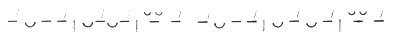

[Intangible Textual Heritage](../../index)  [Islam](../index.md) 
[Index](index)  [Previous](egt07)  [Next](egt09.md) 

------------------------------------------------------------------------

p. xxv

# V.--THE <u>H</u>ADÎQATU'L-HAQÎQAT.

The *Hadîqatu'l-Haqîqat*, or the "Enclosed Garden of the Truth",
commonly called the *<u>H</u>adîqa*, is a poem of about 11,500 lines;
each line consists of two hemistichs, each of ten or eleven syllables;
the bulk, therefore, is equal to about 23,000 lines of English
ten-syllabled verse. It is composed in the metre \#\#\# which may be
represented thus:

The two hemistichs of each verse rhyme; and the effect may therefore
roughly be compared to that of English rhymed couplets with the accent
falling on the first (instead of the second) syllable of the line, and,
occasionally, an additional short syllable introduced in the last foot.

The chapter,; of which the *<u>H</u>adîqa* consists treat, according to
a few lines of verse at the end of the table of contents in the Lucknow
edition, of the following subjects; the First, on the Praise of God, and
especially on His Unity; the Second, in praise of Mu<u>h</u>ammad; the
Third, on the Understanding; the Fourth, on Knowledge; the Fifth, on
Love, the Lover, and the Beloved; the Sixth, on Heedlessness;

p. xxvi

the Seventh, on Friends and Enemies, the Eighth, on the Revolution of
the Heavens; the Ninth, in praise of the Emperor <u>Sh</u>âhjahân; the
Tenth, on the characters or qualities of the whole work. This, however,
is not the actual arrangement of the work as presented in the volume
itself; the first five chapters are as already given, but the Sixth
concerns the Universal Soul; the Seventh is on Heedlessness; the Eighth
on the Stars; the Ninth on Friends and Enemies; the Tenth on many
matters, including the praise of the Emperor. Prof. Browne (Lit. Hist.
Persia, vol. ii., p. 318) gives still another order, apparently that of
an edition lithographed at Bombay in A.H. 1275 (A.D. 1859).

Sanâ'î's fame has always rested on his *<u>H</u>adîqa*; it is the best
known and in the East by far the most esteemed of his works; it is in
virtue of this work that he forms one of the great trio of

<u>S</u>ûfî teachers,--Sanâ'î, \`A

<u>tt</u>âr, Jalâlu'd-Dîn Rûmî. It will be of interest to compare some
of the estimates that have been formed of him and of the present work in
particular.

In time he was the first of the three, and perhaps the most cordial
acknowledgment of his merits conies from his successor Jalâlu'd-Dîn
Rûmî. He says:--

I left off boiling while still half cooked;  
Hear the full account from the Sage of <u>Gh</u>azna."

And again--

"\`A

<u>tt</u>âr was the Spirit, Sanâ'î the two eyes:  
We walk in the wake of Sanâ'î and \`A

<u>tt</u>âr."

\`Abdu'l-La<u>t</u>îf, in his preface called the
*Mirâtu'l-<u>H</u>adâ'iq*, enters into a somewhat lengthy comparison
between Sanâ'î and Rûmî, in which he is hard put to it to avoid giving
any preference to one or other. It is interesting to observe how he
endeavours to keep the scales even. He begins by adverting to the
greater length of the *Ma<u>th</u>nawî* as compared with the
*<u>H</u>adîqa*, and compares the *<u>H</u>adîqa* to an abridgement, the
*Ma<u>th</u>nawî* to a fully detailed account. Sanâ'î's work is the more
compressed; he expresses in two or three verses what the
*Ma<u>th</u>nawî* expresses in twenty or thirty, \`Abdu'l-La<u>t</u>îf
therefore, as it would seem reluctantly, and merely on the ground of his
greater prolixity, gives the palm for eloquence to Jalâlu'd-Dîn.

p. xxvii

There is the most perfect accord between Sanâ'î and Rûmî; tile substance
of their works, indeed, is in part identical. Shall it therefore be said
that Rûmî stole from Sanâ'î? He asks pardon from God for expressing the
thought; with regard to beggars in the spiritual world, who own a
stock-in-trade of trifles, bankrupts of the road of virtue and
accomplishments, this might be suspected; but to accuse the treasurers
of the stores of wisdom and knowledge, the able natures of the kingdom
of truth and allegory, of. plagiarism and borrowing is the height of
folly and unwisdom.

With regard to style, some suppose that the verse of the *<u>H</u>adîqa*
is more elevated and dignified than the elegantly ordered language of
the *Ma<u>th</u>nawî*. The *<u>H</u>adîqa* does indeed contain poetry of
which one verse is a knapsack of a hundred *dîwâns*; nor, on account of
its great height, can the hand of any intelligent being's ability reach
the pinnacles of its rampart; and the saying--

"I have spoken a saying which is a whole work;  
I have uttered a sentence which is a (complete) dîwân,"

is true of the *<u>H</u>adîqa*. But if the sense and style of the
Maulavî be considered, there is no room for discrimination and
distinction; and, since "*Thou shalt not make a distinction between any
of His prophets*," to distinguish between the positions of these two
masters, who may unquestionably be called prophets of religion, has
infidelity and error as its fruit. Who possesses the power of dividing
and discriminating between milk and sugar intermingled in one vessel?
\`Abdu'l-La<u>t</u>îf sums up thus "in fine, thus much one may say, that
in sobriety the Hakîm is pre-eminent, and in intoxication our lord the
Maulavî is superior; and that sobriety is in truth the essence of
intoxication, and this intoxication the essence of sobriety."

Prof. Browne, however, places the *<u>H</u>adîqa* on a far lower level
than the Eastern authors quoted above. He says [1](#fn_1.md):--"The poem is written in a halting and
unattractive metre, and is in my opinion one of the dullest books in
Persian, seldom rising to the level of Martin Tupper's *Proverbial
Philosophy*, filled with fatuous truisms and pointless anecdotes, and as
far inferior to the *Ma<u>th</u>nawî* of Jalâlu'd-Dîn Rûmî as is Robert
Montgomery's *Satan* to Milton's *Paradise Lost*."

p. xxviii

It is of course true that to us, at least, the interest of the
*<u>H</u>adîqa* is largely historical, as being one of the early Persian
text-books of the

<u>S</u>ûfî philosophy, and as having so largely influenced subsequent
writers, especially, as we have seen, the Maulavî Jalâlu'd-Dîn Rûmî. Yet
I cannot butt think that Prof. Browne's opinion, which is doubtless
shared by other scholars, as well as the neglect to which the
*<u>H</u>adîqa* has been exposed in the West, is due not to the demerits
of the original text so much as to the repellent and confused state into
which the text has fallen; and I would venture to hope that the present
attempt at a restoration of the form and meaning of a portion of the
work, imperfect in the highest degree as I cannot but acknowledge it to
be, may still be of some slight service to its author's reputation among
European Orientalists.

The first Chapter or Book of the *<u>H</u>adîqa*, which is here
presented, comprises a little more than one-sixth of the entire work.
The subjects of which it treats may be briefly resumed as follows:--

After an introductory section in praise of God the author speaks of the
impotence of reason for the attaining a knowledge of God; of God's
Unity, of God as First Cause and Creator and delivers more than one
attack against anthropomorphic conceptions of God (pp. 1-10). After
speaking of the first steps of the ascent towards God, for which worldly
wisdom is not a bad thing, with work and serenity (pp. 10-11), he
devotes the next portion of the book to God as Provider, to His care for
man through life, the uselessness of earthly possessions, and to God as
guide on the road, but self must first be abandoned (pp. 11-46). A fine
section on God's incomprehensibility to man might perhaps come more
fittingly at an earlier stage instead of here (pp. 16-18). After
overcoming self, God's special favour is granted to the traveller on the
path: but we see crookedly, and He alone knows what is best for us: He
has ordered all things well, and what seems evil is so only in
appearance (pp. 18-25).

The greater part of the book is really concerned with the life and
experiences of the

<u>S</u>ûfî, and especially with continually repeated injunctions as to
abandonment of the world and of self; to be dead to this world is to
live in the other. Pp. 25-30 are thus concerned with poverty in this
world, with loss of the, self, humility, man's insignificance and God's
omnipotence; pp. 30-34 with

p. xxix

the necessity of continual remembrance of God, of never living apart
from Him, and again of dying to the world; death to the world leads to
high position with God. There follows (pp. 34-41) a series of passages
on the duty of thanksgiving for God's mercies; His mercy however has its
counterpart in His anger, and examples of His wrath are given; then
returning again to the subject of His mercies, the author speaks of
God's omniscience, and His knowledge of the wants of His servants; we
must therefore trust in God for all the necessaries of life, they will
be given as long as life is destined to last. Two later pages (48-50),
which are similarly devoted to the subject of trust in God, should
probably come here. Pp. 41-48 deal with the

<u>S</u>ûfîs desire for God, and his zeal in pursuing the path; various
directions for the road are given, especially as rewards the abandonment
of the world and of self, and fixing the desires on God only; union with
God is the. goal. The abandonment of self is again the theme of pp.
50-51.

A portion of the book (pp. 51-56) is, curiously, here devoted to the
interpretation of dreams; after which the author treats of the
incompatibility of the two worlds, again of the abandonment of earth and
self, and of the attainment of the utmost degree of annihilation (pp.
56-58). There follows a passage on the treatment of schoolboys, a
comparison with the learner on the

<u>S</u>ûfî path, and an exhortation to strive in pursuing it (pp.
58-60). The next portion of the book (pp., 60-67) treats of charity and
gifts as a form of renunciation, of relinquishing riches for God's sake;
prosperity is injurious to the soul, and the world must be abandoned;
possessions and friends are useless, and each must trust to himself;
each will find his deserts hereafter, and receive the reward of what he
has worked for here.

Pp. 67-80 treat of prayer, the preparation for which consists in purity
of heart, humility, and dependence upon God. Prayer must come from the
heart; the believer must be entirely absorbed in his devotions. Prayer
must be humble; the believer must come in poverty and perplexity, and
only so can receive God's kindness. A number of addresses to God follow,
prayers for help, and humble supplications to God on the part of the
author. A few pages (80-92) treat of God's kindness in drawing men
towards himself, though His ways may appear harsh at first. The progress
of the

p. xxx

believer is described in a strain of hyperbole (pp. 82-83); and this
portion closes with a few sections (pp. 83-86) on God's majesty and
omnipotence somewhat after the manner of those in the earlier part of
the book.

In pp. 86-97 the author speaks of the Qur'ân, and its excellence and
sweetness. The letter however is not the essential: its true meaning is
not to be discovered by reason alone. The Qur'ân is often dishonoured,
especially by theologians, and by professional readers, who read it
carelessly and without understanding it. A short section (pp. 97-98) on
humility and self-effacement follows, and the book is brought to a close
by a description of the godlessness of the world before the advent of
Mu<u>h</u>ammad (pp. 98-100), which serves to introduce the subject of
the Second Chapter.

Though it must he admitted that the author is occasionally obscure,
sometimes dull, and not infrequently prosaic, some fine sections and a
larger number of short passages of great beauty are contained in this
chapter; I may perhaps be permitted especially to refer to the sections
"In His Magnification," pp. 16-18. and "On Poverty and Perplexity," p.
74; while as characteristic and on the whole favourable passages may be
mentioned "On His Omniscience, and His Knowledge of the Minds of Men,"
pp. 37-39; " On the Incompatibility of the Two Abodes," pp. 56-58; "On
intimate Friendship and Attachment," pp. 62-63; and certain of the
addresses to God contained in pp. 74-77.

------------------------------------------------------------------------

### Footnotes

[xxvii:1](egt08.htm#fr_1.md) A Literary History of
Persia, Vol. II., p. 319.

------------------------------------------------------------------------

[Next: VI.--Sanâ'î's Preface.](egt09.md)
