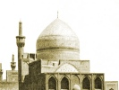

  
[Intangible Textual Heritage](../../index)  [Islam](../index.md) 
[Index](index)  [Previous](gsw04)  [Next](gsw06.md) 

------------------------------------------------------------------------

  
*The Glory of the Shia World*, by P. M. Sykes and Khan Bahadur Ahmad din
Khan, \[1910\], at Intangible Textual Heritage

------------------------------------------------------------------------

p. 1

 

### CHAPTER I

#### MY PARENTAGE AND BIRTH

From the Desert of Nothingness to the Bazaar of Being:  
A naked mortal has arrived in search of a shroud.

In the year of the separation 1276, [1](#fn_5.md) a poet and a historian, if not the first
poet of modern Iran, in the form of the narrator of the following
events, or, in other words, I, Nurullah Khan, emerged from the plain of
Nothingness into the atmosphere of Being. But before introducing myself
to the Possessors of Wisdom of the inhabited quarter of the world I
will, in the first place, narrate from what family I am sprung.

The poet says

Supposing your father was a learned man;  
What amount of his learning has descended to you?

Whether this verse applies to me or not I will leave to the decision of
the reader who

p. 2

reads this narrative to the end; but my present object is simply to show
that my father was somebody, and that I am not of those who have not
seen their fathers’ tablecloth spread. [1](#fn_6.md)

My paternal grandfather was *Haji* Abul Hasan Khan [2](#fn_7.md) who first discovered London [3](#fn_8.md) to us Persians. He it was, who was
instructed by Fath Ali Shah, may Allah forgive Him! to appear at the
Court of the English monarch, where he lost no opportunity of increasing
the fame of Persia. In short, thanks to my glorious ancestor, the
English believe that Persia is covered with rose gardens where, as
world-renowned Hafiz wrote,

The bulbul at dawn laments to the East wind:  
Of the havoc that the rose and its scent made.

\[paragraph continues\] Indeed, such
honours were paid to my ancestor of auspicious fortune, that I have been
informed that he was offered the Order of the Jarretière, [4](#fn_9.md) but declined it—at least he never appears to
have brought the insignia of the Order back with him to Iran.

Upon the death of my honoured ancestor,

p. 3

may Allah pardon him! my father and his brother found that they had only
inherited debts, as the deceased *Haji* had always been a lover of
generosity, and had spent everything he possessed, and had even incurred
debts during his famous embassy, in order that the name of Persia should
be exalted, which object can only be attained by spending money freely.
Truly has it been said, "Give money and beat the drum, mounted on the
moustachios of a monarch."

So However, generosity in every form is one of the greatest of virtues,
as a tradition from the Prophet, on Him be Peace! runs:

"A generous man will not be thrown into hell, although he be a
libertine; and a miser will not enter paradise, although he be a saint."

Nor was it long before the two orphans found that friendship is of
greater value than pearls of the Sea of Oman, as Fath Ali Khan, Nuri,
who was a distant relation of my grandfather and indebted to him for
having solved many political puzzles for his benefit, came to our aid.
Indeed, he no sooner heard of the sad event than he took both my father
and my uncle into the kind lap of his family and treated them as his own
sons. As Maulavi says with truth:

Whatever atoms of one stock exist  
In heaven or on the earth,  
They attract one another like straw and amber.

p. 4

Fath Ali Khan, Nuri, was, my father always declared, of so noble a
character, of such prepossessing appearance and of such manly bearing,
that the Shah-in-Shah occasionally condescended to term him
*Darya-i-Nur* [1](#fn_10.md) or "Sea of Light." By
such acts did the Kajar Shahs bind their subjects to them with chains of
kindness, which are stronger than steel. As the poet says:

My friend has put a cord round my neck, and takes me wherever he wills.

Upon the death of Fath Ali Khan, may Allah forgive him! his son, Mohamed
Ismail Khan, continued to show kindness to the two orphans, and when he
was appointed the Vizier of Kiumarz *Mirza*, [2](#fn_11.md) the Governor-General of Kerman and
Baluchistan, my father and uncle accompanied him to that distant
province.

Mohamed Ismail Khan was so capable that he soon became Governor-General
himself, and, in time, appointed my father, Mohamed Husein Khan, to the
Governorship of Mahun; and here, as I have already related, I came out
from the world of ease and pleasure into that of pain and pride.

p. 5

My mother, may Allah forgive her! was the daughter of a Kajar nobleman
whose father, after the capture of Kerman by *Aga* Mohamed

  [  
Click to enlarge](img/00500.jpg.md)  
MOHAMED ISMAIL KHAN, THE VAKIL-UL-MULK  

\[paragraph continues\] Shah, had been
given a property belonging to a rebel *Khan* and had settled down in the
province. She was very fond of me and saved me many a castigation at the
hands of my father for boyish freaks. Show every reverence to your
mothers,

p. 6

\[paragraph continues\] O my readers, for,
as the Prophet says, "Paradise is at the feet of the mothers."

Now, as I hope to act as an interpreter of the customs of Iran, I will
tell you what rules are observed when a woman is on the road to reach
her desire. These rules may appear to the ignorant strange; but he
should remember that they all are based on experience. As we say:

If the bat cannot see in the daylight,  
It is not the fault of the sun.

\[paragraph continues\] In the first
place, she shows an extraordinary craving to eat charcoal or Armenian
earth. [1](#fn_12.md) Of course, no exertion is
allowed, nor may a graveyard be crossed; indeed, it is against the
custom for her to enter the kitchen at night, for it is then haunted by
Jinns. If, however, a woman in this condition falls into cold water, the
eyes of her child will be big and lustrous. Again, should an eclipse of
the moon occur during this period, the woman must not look at it; also
if, by any mishap, her hands touch her body while the eclipse is on, a
black mark is sure to appear on the body of the child.

When seven months are passed, a feast is held on an auspicious day.
Three basins, containing flour, butter, and sugar respectively, are
prepared; on these the woman places her hands,

p. 7

and their contents are distributed, with nuts, to the poor. On this day
too the woman is placed facing Mecca, is anointed with rose-water, and
blessings are invoked.

After this auspicious ceremony has been concluded, the child's clothes
are commenced and, when the confinement is at hand, clods of earth are
procured, the opening chapter of the Koran is breathed on to them, and
they are then thrown into a well to ensure an easy delivery. A plant,
termed "Miriam's hand," [1](#fn_13.md) is also
thrown into a basin, together with an iron ring, and the patient drinks
this efficacious draught. Frequently, too, a woman is asked to forego a
portion of her dowry.

When the happy event has taken place, no glass may be brought into the
room from fear that its rays might make the child squint; indeed the
very word may not be mentioned. Moreover, no one wearing black clothes
is allowed to enter.

One very important secret I have kept to the last, and that is that
Persian children are finer and fairer than any others, because
pomegranate juice is freely imbibed by their mothers, and its wonderful
colour is reproduced in the rich blood of their offspring.

On the seventh night the joints of the child

p. 8

are smeared with antimony, and the "Yasin" chapter of the holy Koran is
specially written on a scroll with its ends joined. Every one sits in a
circle, and the child is passed three times through this scroll which we
term "the circle of Yasin." Thus early is an infant imbued with the
tenets of our holy religion. Indeed, our customs, of which I have given
examples only, are really wonderful in their completeness; and it is, in
part, thanks to them that we Iranis need fear no comparison with any
other race of people in the world.

My earliest recollections of Mahun relate to its wonderful shrine, and,
in my own mind, I think that perhaps its beauty affected my disposition,
and helped me to write verses which are considered by the experts of
this fine art to be as sweet as sugar and as pleasant as a nightingale.
The shrine, you must know, was built in honour of *Sayyid* [1](#fn_14.md) Nur-u-Din, Shah Namat Ullah, may Allah
enlighten his grave, and it is necessary that I should represent to you
who he was. *Sayyid* Nur-u-Din was a descendant of the holy *Imam*
Bakir, and was born at Aleppo. In his extreme youth he began a series of
travels, which would alone have made him famous. Indeed, His Holiness
not only visited the Shrine

p. 9

  [  
Click to enlarge](img/00900.jpg.md)  
THE MAHUN SHRINE.  
*H. R. Sykes, phot*.  

p. 10 p. 11

of the Commander of the Faithful at Najaf, and of the Prince of the
Martyrs, Husein, at Kerbela, but on foot he performed a pilgrimage to
the House of Allah at Mecca.

Some years later he travelled to Samarcand, at that time the capital of
Amir Timur, [1](#fn_15.md) who treated the Saint
with great distinction, welcoming him in these words:

May the sockets of my eyes be thy nest! Be gracious and dismount,
because the house is Thine.

Finally, the Saint condescended to choose Mahun as a place of rest, and,
although he honoured distant India by travelling thither to the Court of
Ahmad Shah, Bahmani, who prided himself on being the meanest of his
disciples, yet, for him, Mahun became his native place, and there he
lived many years benefiting the people with his manifold virtues.

Not that he was alone as, apart from his numerous disciples, from the
Seven Climates came envoys bearing the presents of mighty sovereigns who
thirsted for his prayers and wise advice. Indeed, from India alone, the
value of the gifts received by the Saint was so great, and the circle of
his disciples had become so extensive, that the jealousy of Shah Rukh,
son of Amir Timur, was excited; and, but for the prayers of

p. 12

the pious lady, Gauhar Shad *Aga*, sacrilegious hands would have taxed
the property of His Holiness; but, thanks be to Allah, this disgrace was
averted.

A short story about Shah Rukh may not be out of place here. He had
ordered an ancient mosque to be pulled down, and was superintending the
operation of demolition, when he heard a Darwesh, who was standing close
by, laugh loudly.

On inquiring the cause of this hilarity, the holy man replied:

The father used to demolish  
The dwellings of the people of Allah:  
And the son has not spared  
Even the house of Allah.

\[paragraph continues\] Such were the
descendants of the great Amir Timur; and the intercession of the lady
was due to the fear of the bad consequences which must follow such
insolence, for she knew very well that:

The rod of Allah makes no noise;  
But that if it once strikes,  
There is no remedy against it.

Shah Namat Ullah, may Allah keep his grave fragrant! was indeed a great
Sufi Saint; but, as it is possible that even some of the wise men of
Farangistan do not know exactly what the Sufi system is, I will give
some account of it, although orthodox Shias consider it heretical.

p. 13

Yet Allah knows how many thousands of them, although holding different
convictions, are drawn to it:

He said that I am like a mirror  
Polished by my friend. A Turk  
Or a Hindu will see in, it  
What he himself is.

\[paragraph continues\] Now a Sufi
believes that not only True Being but all Beauty and all Goodness belong
to Allah alone; as they say:

Allah was and there was  
Naught beside Him.

In short, Allah is Pure Being, and all else only exists in so far as the
Being of Allah is infused into it. Indeed the heavens and earth, with
all they contain, are a manifestation of Him. All pious Mussulmans pray
daily and say that there is no God but Allah; but the Sufi holds that
there is nothing but Allah. Higher than this no human brain can soar;
and, to illustrate the nobility of a Sufi's thoughts, I will quote a few
lines from Jami, who is considered to be a great exponent of the Sufi
system. He wrote:

                             Whatever heart  
Doth yield to Love, He charms it. In His love  
The heart hath life. Longing for Him, the soul  
Hath victory. That heart which seems to love  
The fair ones of this world, loves Him alone.  
Beware! Say not, "He is All-Beautiful,  
And we His lovers!" Thou art but the glass, p.
14  
And He the Face confronting it which casts  
Its image in the mirror. He alone  
Is manifest, and thou in truth art hid. [1](#fn_16.md)

As to the Saint's prophetic greatness, I will merely mention that, some
years ago, it was one of his prophecies which caused a revolt of the
Indians against the English in Hindustan. This potent prophecy ran as
follows:

Fire-worship for a hundred years,  
A century of Christ and tears;  
Then the true God shall come again,  
And every infidel be slain.

The path of Allah is concealed, and it is not possible to say why He
decreed that the English should have prevailed; but one thing I have
heard, which is that the Sikhs, who were very warlike, aided the English
because of a prophecy of their great *Guru*, Tig Bahadur.

This spiritual teacher was imprisoned by the Moghul Emperor Aurungzeb,
and was condemned to death for daring to gaze at the walls of the
women's apartments of that bigot.

When summoned to receive his doom, the *Guru*—by Allah, although a
Kafir, he was a brave man!—said, "O King, I looked not at the walls of
thy women's apartments; but beyond, across the great sea to a distant
land in the west,

p. 15

  [  
Click to enlarge](img/01500.jpg.md)  
HAZRAT ALI SLAYS MARHAB. From the collection of Major Sykes  

whence a white, fair-haired race will come to avenge me."

Perhaps Allah the All-Wise hindered the fulfilment of the prophecy of
Shah Namat Ullah, owing to the tyranny of Aurungzeb, which was wholly
without justification. Indeed, even to-day, in Iran this stony-hearted
sovereign is cursed by all Shias, for not only the Sikhs, but also pious
Shias and the Sufis, all suffered from his lack of inward light in
matters divine. Ignorant must he have been of the beautiful lines:

Come back, come back, whatever Thou mayest be,  
Whether Thou art an infidel, a fire-worshipper, or an idolater.  
This Threshold of Ours is not a Threshold of Despair.  
If Thou hast broken thy oath even a hundred times, come back.

I will now describe to you the shrine, which is entered by a fine
gateway, supported by two minarets. Traversing a court, built by
Mohamed, Shah of Persia, a second court leads up to the tomb, which is
surrounded by a covered gallery and surmounted by a blue dome.

Shah Abbas constructed the western gallery; but the Saint is buried
beneath the dome, and Shah Ahmad Bahmani honoured himself by
constructing this building. The doors are of exquisitely carved
sandal-wood, and open on to a lovely court with cypresses and flowers
planted round a vast double tank of limpid water.

p. 16

Here, every evening, the learned Custodian of the shrine loved to
receive visitors from every Mussulman land, and here, from my earliest
boyhood, I came to drink in the pearls of discourse, and to gaze on the
beauty of the tiles, the greenery, and the running water. At that time,
Allah knows, I understood not why the spot was so dear to me; but, in
later days, when I travelled, I always felt that there was some
perfection in Mahun which cannot be equalled elsewhere in Iran.

 

------------------------------------------------------------------------

### Footnotes

[1:1](gsw05.htm#fr_5.md) The Mohamedan era commences
from the day on which the Prophet fled from hostile Mecca to friendly
Medina. a.h. 1276 = 1859 a.d.

[2:1](gsw05.htm#fr_6.md) *i.e.* of low extraction.

[2:2](gsw05.htm#fr_7.md) This individual was the
original of Morier's ever famous "*Haji* Baba." *Haji* is the title of
honour given to those who have performed the pilgrimage to Mecca.

[2:3](gsw05.htm#fr_8.md) Persians invariably speak
of England by the name of its capital.

[2:4](gsw05.htm#fr_9.md) Under this name the Order
of the Garter is well known in Persia, and is held to be the highest in
the world.

[4:1](gsw05.htm#fr_10.md) The *Darya-i-Nur* is the
name of one of the most celebrated diamonds in the Persian regalia.
Persian monarchs are addicted to mild puns, in which connection
Nasir-u-Din Shah wrote that Ballater was well named, being *balatar* or
higher than Aberdeen.

[4:2](gsw05.htm#fr_11.md) *Mirza* after a name
signifies a prince; before a name it means a man who can read and write.

[6:1](gsw05.htm#fr_12.md) This habit of earth
eating is widely spread in Asia.

[7:1](gsw05.htm#fr_13.md) This plant is commonly
known as "The rose of Jericho."

[8:1](gsw05.htm#fr_14.md) A *Sayyid* is a
descendant of the Prophet by his daughter Fatima, who was married to
Ali.

[11:1](gsw05.htm#fr_15.md) *Sc*. Tamerlane.

[14:1](gsw05.htm#fr_16.md) I would take this
opportunity to acknowledge my deep indebtedness to the works of
Professor E. G. Browne.

------------------------------------------------------------------------

[Next: Chapter II. A Campaign In Baluchistan](gsw06.md)
