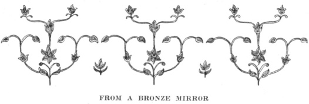
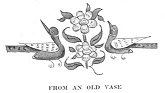

  
[Intangible Textual Heritage](../../index)  [Islam](../index) 
[Index](index)  [Previous](gsw07)  [Next](gsw09) 

------------------------------------------------------------------------

  
*The Glory of the Shia World*, by P. M. Sykes and Khan Bahadur Ahmad din
Khan, \[1910\], at Intangible Textual Heritage

------------------------------------------------------------------------

p. 50

 

### CHAPTER IV

#### AN AWFUL TRAGEDY

<table data-border="0">
<colgroup>
<col style="width: 100%" />
</colgroup>
<tbody>
<tr class="odd">
<td data-valign="top">
And Bahrain, that great Hunter—the wild Ass 
Stamps o’er his Head, but cannot break his Sleep. 
                                     Omar Khayyam.
</td>
</tr>
</tbody>
</table>

My father was renowned as a hunter even
in Iran, where hunting has been the chief pastime of its monarchs and
nobles from the days of Kei Khusru [1](#fn_28)
down to the present day. In this connection it is well known that
courtiers who exhibited special courage and skill in the chase were
always sure to attract the eye of favour of their monarch. I have heard
it stated that "hunting is a business for the idle"; but those who
really understand are aware that hundreds of secrets for the government
of kingdoms are hidden in this art.

After having ruled Mahun for many years, my father was very glad to be
appointed Governor of Sirjan. This district, apart from

p. 51

its great extent, is always entrusted to a most capable official, owing
to its situation on the borders of Fars, where the tribesmen are raiders
by nature and require watching by day and night.

Dividing Sirjan from Fars is a great salt swamp which is very dangerous,
except to those who know it well; but as it is also a favourite haunt of
the gazelle and of the wild ass, my father was perhaps more pleased at
that fact than at anything else, little knowing that Hafiz prophesied
truly in his case when he wrote:

This far-off desert is the stage,  
In which the armies of Salm and Tur disappeared.

I well recollect the journey to Saiidabad, the capital, over a high
range where we rode in every direction in search of partridges. Our
sowars spread out on each side of the track for a, *farsakh*, and, as
partridges only fly a short distance, they were shot in large numbers or
seized by falcons, of which His Excellency kept a large number. To see
the intrepidity with which the sowars galloped up and down steep
mountains and shot hares and even partridges at full speed would prove
to any one that the Persian sowar has no equal.

On the borders of Sirjan, many of the leading Khans met us, and at
Saiidabad the reception party included every one in the capital, from
the

p. 52

great landowners and merchants to the beggars and little children.

The house of the Governor was very large with a fine garden; but it was
in such a dilapidated condition that, at first, we lived in tents in the
garden while it was being prepared for our reception: indeed, I
recollect my father

  [  
Click to enlarge](img/05200.jpg)  
  

stating that he had to spend a large sum on repairing it.

A few weeks after our arrival it was decided to go on a shooting
expedition; and I was allowed to join the party on a well-trained horse.
As soon as we were clear of the town and had reached the open country,
our sowars spread out, two and two, leaving an interval of about five
hundred yards between each couple, until the

p. 53

whole plain was covered. In the centre my father, *Aga* Ali, his chief
gunbearer, and myself rode, and, on both sides of us, the line of sowars
was slightly thrown forward like a crescent moon.

We proceeded slowly in this manner for perhaps a *farsakh*, when
suddenly *Aga* Ali whose eyes were like those of a hawk, espied a herd
of seven gazelles which were grazing a long way ahead of us. When they,
in time, sighted us they threw up their heads and galloped off, while we
continued on exactly as before.

This went on for half a hour when, suddenly, the gazelles, which do not
like leaving their grazing ground, stopped, turned round, and galloped
between my father and Mohamed Mehdi Khan, who was on his left. At first
the two groups moved slowly on inclining inwards; but, when it was clear
that the gazelles had made up their minds and were flying like the wind,
both parties galloped to cut them off. So successful were they that the
gazelles passed within fifteen yards of my father who, with his number
ten gun, loaded with slugs, shot two of them.

Imitating him, by throwing my reins on to the neck of my horse, I also
shot a gazelle, which much pleased my father, who shouted, "Thanks be to
Allah! The lion's whelp will be like its

p. 54

sire." I was so elated at hearing this from my father, who scarcely ever
spoke to me, that my head turned round. *Aga* Ali, too, who had taught
me to throw down my reins and to always turn in the saddle when
shooting, a feat no European has ever learned, paid my father many
compliments, and was promised a gift of a hundred *tomans*. Such a Hatim
Tai [1](#fn_29) was my sire!

That night we camped near the swamp, and as sixteen gazelles had been
shot, every one was much elated, and, round the fires, the ramrods of
the rifles were covered with meat: indeed, Allah knows, I never tasted
such delicious meat as that of the gazelle roasted in this fashion.

Early next morning we started off to hunt the wild ass along the swamp,
and both my father and myself took our rifles instead of our number ten
guns. Now, you must know that the wild ass is easier to approach than
the gazelle, if the swamp is hard enough for a horse to gallop on it,
but yet soft enough for the hoofs of the wild ass, which are much
smaller, to break through.

We rode along as on the previous day, and, very soon after leaving camp,
*Aga* Ali was the first to sight a large herd of wild asses, who

p. 55

galloped off and then circled back to look at us, so curious are they.
This they did three times and then tried to break through; but they were
turned towards the swamp, and soon sank in so much that we were able to
ride up alongside

  [  
Click to enlarge](img/05500.jpg)  
THE “WHITE FORT”  
*H. R. Sykes, phot*.  

them and shoot them quite easily; in fact our rifles nearly touched them
as we fired.

That night again every one was very happy, as the flesh of the wild ass
is esteemed a great delicacy; but, in my opinion, nothing is more
delicate than the flesh of the gazelle.

On another occasion we set out hawking, and when riding along, we saw an
extraordinary white rock, shaped like an egg, rise out of

p. 56

the plain. My father asked Mohamed Mehdi Khan what it was, as he was
learned in these questions; and he replied that, on this rock, known as
"White Fort," were the ruins of a famous fortress, which was once the
capital

  [  
Click to enlarge](img/05600.jpg)  
THE STONE PULPIT OF THE “WHITE FORT”  
(Dated A.D. 1387)  
*H. R. Sykes, phot*.  

of the province of Kerman. He added that it was a great show place and
that there were many sand partridges there. Moved by the hope of
*shikar* my father said, "*Bismillah*, let us see this wonderful place."

We rode to the rock and found the whole plain covered with the ruins of
a mighty city. In one place was a beautiful pulpit of white

p. 57

stone; but everything else was in ruins. Riding up the steep white rock
we found the remains of palaces, and also visited a great cave on the
north side where the women, according to tradition, spent the heat of
the day.

Mohamed Mehdi Khan showed us every corner, and said that Amir Timur's
troops besieged the fort for three years, and then only captured it
because the garrison had no supplies left, so strong was this fort. He
added that, in memory of this siege, one of the hills, which he pointed
out, is termed "The Throne of Timur" to this day.

Two years were spent at Saiidabad in this fashion, hunting parties being
so frequent that at last the game was almost all killed. During this
period the robbers from Fars never raided into Sirjan from fear of my
father, and also because they were ruled by a stern Governor-General,
who, whenever he caught a brigand, "plastered" [1](#fn_30) him up as a terrible warning to his
fellows.

However, this stern ruler was dismissed, and his successor was so noted
for his kindness of disposition, that, even before he reached Shiraz,
the Lashanis prepared to raid Sirjan.

Owing to the fact that there had been no

p. 58

trouble for so many years, there was no watch kept, and we first
realised what was occurring by seeing villages burning in the hills to
the north of the capital just before sunset. As soon as this was noticed
my father's face became terrible, and he swore that he would cut off the
robbers and deal with them as the Governor-General of Fars had done.

Well do I recollect the excitement and confusion which first occurred;
but yet, within half-an-hour, the whole party of two hundred sowars was
ready to start. We moved at an amble, which pace is best for horses
going a long distance, and when dawn broke we were approaching the main
route across the morass. Upon reaching it, *Aga* Ali, who was famous for
tracking, pointed out that about sixty horsemen had passed eastwards
just a day before, but that there were no return tracks. However, he
also pointed out that, as the swamp was dry at this season of the year,
a second track across it to the north might well be used by the Lashanis
on their return.

This much disturbed my father, who had felt sure of cutting off the
raiders; and so he consulted for an hour while the horses were being
fed, and we all lay in ambush in a grove of tamarisks, hoping for the
return of the raiders who, however, never came.

p. 59

It was finally settled by His Excellency, that he would take eighty of
the best men and ride north so as to hold the second track; and I was
left with *Aga* Ali in charge of the main body.

For the remainder of that day and the next we watched all in vain, until
*Aga* Ali swore that the Lashanis had escaped, when, in the distance, we
sighted one of our sowars, who rode up to me like a whirlwind, crying

Dust on my head,  
The Master is dead.

\[paragraph continues\] He then fell off
his horse in a faint.

At last he was able to tell his mournful tale, which was that my father
and his party were approaching the northern track across the swamp, when
they saw the Lashanis already on it, driving away cattle, sheep, and
other plunder.

Furious at this, and throwing prudence to the winds, my father rode
straight across the morass to cut them off One by one his sowars were
left behind; but my father pressed on until, just as he was near the
track, his horse was engulfed in the bog.

He made every effort to escape; but, mad with fear, the brute seized him
with its teeth, tore him from the saddle, and threw him under its hoofs;
so that when, at last, two of the sowars came up, ready to help, there
was only one, arm

p. 60

of my father remaining above the ooze, and the mad horse's head was
sinking out of sight!

A thousand boats have gone down into this whirlpool:  
And not a plank from them has reached the shore.

\[paragraph continues\] Allah knows that I
shall never forget the misery

  [  
Click to enlarge](img/06000.jpg)  
A PERSIAN SALT SWAMP *H. R. Sykes, phot*.  

of that period, nor how my mother beat her head until she fell
senseless, lamenting:

As man in this land of thorns  
Reaps nothing but trouble and anxiety:  
Happy is he who leaves this world quickly,  
Or he who never enters it at all.

\[paragraph continues\] Time, however, is
the great teacher, and after a few days it was possible to look at the
matter

p. 61

more calmly, and to feel some comfort and even pride in the thought that
my father, a great hunter, when pursuing a nobler quarry than the wild
ass, had met the same fate as the great hunter King, of whom Omar
Khayyam wrote:

Bahram, who, all his life, was capturing wild asses (*Gur*):  
See how the grave (*Gur*) has captured Bahram. [1](#fn_31)

I have not hitherto referred to my uncle, *Mirza* Hasan Khan, who, by
the kindness of the Vakil-ul-Mulk, may Allah keep cool his grave, was
made a *Mustaufi* or Revenue Official in the Kerman province. Now my
uncle was married, but Allah had not blessed his tree of hope with
fruit; and perhaps it was on this account that he showed such kindness
to the orphan, whose lot is frequently a hard one, as *Shaykh* Sadi
writes:—

Protect thou the orphan whose father is dead;  
Brush the mud from his dress, ward all hurt from his head:  
Thou know’st not how hard his condition must be;  
When the root has been cut, is there life in the tree?  
O see that he weep not, for surely God's throne  
Doth quake at the orphan's most pitiful moan!

In short, my uncle was like an angel of benevolence to me, and, as soon
as the heartrending news reached Kerman, heedless of

p. 62

hunger and sleep, he rode down post to Saiidabad, and thereby ensured
that the revenue my father had to collect was duly paid in.

Moreover, he discharged all our debts and brought us to Kerman to his
own house, and placed us under the shadow of his kindness.

Do thou a kind act and throw it in the Tigris,  
And Allah will return it to thee in the desert.

Like our illustrious ancestor, *Haji* Abul Hasan Khan, my father had
always displayed liberality and generosity; and my uncle found that,
after paying up all we owed, nothing was left for me:

It is better that a man leave a good name behind:  
Than to bequeath a decorated house.

Fortunately, my mother had received as a dowry one-third of the village
of Sar Asiab, which sufficed for her wants, and I felt that I was quite
able to earn my living; but exactly, in what manner, I did not know, as
you cannot turn a knowledge of history and the capacity of a poet into a
shoe and a hat.

However, the day after our arrival at Kerman, my uncle spoke very kindly
to me, and said that he regarded me as his son, and had decided to make
me his assistant in the revenue department, and, on the following day, I
accompanied him to the Revenue Office of Kerman.

p. 63

This most important department, on which the whole Government depends,
was brought to the greatest perfection in Persia nearly a thousand years
ago, by that great man, the Nizam-ul-Mulk, Vizier of Malik Shah, whose
system is still in force to-day. Indeed, it is so perfect that no one
except a *Mustaufi* can fully understand it: and, as a result, the power
and wealth of revenue officials is very great. Indeed their power is, in
some respects, above that of the local Governors, for when these latter
came to Kerman to settle their revenue accounts, the *Mustaufi* in
charge of each district was able to make all sorts of claims, and, as he
had to give a certificate that the revenue had been paid in full, much
bargaining went on until a sum was agreed upon, and then only was the
certificate granted.

To resume, I found the office to consist of a large room with beautiful
carpets, where all the *Mustaufis* sat together, and apparently drank
tea, smoked, and did nothing else. However, in this I was mistaken, for
every now and then a youth whispered into the ear of one of them, who
thereupon gave a whispered reply. This, as I soon found out, meant that
a local Governor had made an offer to the *Mustaufi* through his
assistant, who had come to report.

Shortly after I had taken up my post, I was approached by the
confidential servant of the

p. 64

\[paragraph continues\] Governor of
Jiruft, who offered six hundred *tomans* for his certificate,
accompanied by many compliments to myself. This I reported to my uncle,
who remarked smilingly, "Lessen the compliments and increase the money,"
and said that I was to reply that one thousand *tomans* was the lowest
sum he would accept. For a week this bargaining went on and, at last,
eight hundred *tomans* were paid, and also a present of fifty *tomans*
to myself, about which I did not say anything to my uncle, as that was
my perquisite.

As I found that the revenue officials were all people of a noble
disposition, who evinced much respect for my uncle, I soon became very
happy at Kerman. Indeed, I found that I was able not only to master all
the intricacies of the revenue system of Persia, but also to continue to
study poetry, history, and geography. In short, I attained contentment,
and as *Shaykh* Sadi writes:

O soul! if thou acquirest contentment,  
Thou wilt exercise sway in the kingdom of repose.

 

 

 

 

 

------------------------------------------------------------------------

### Footnotes

[50:1](gsw08.htm#fr_28) Persians, quite
incorrectly, believe that Kei Khusru was Cyrus the Great. Actually he
belongs to Indo-Persian legend.

[54:1](gsw08.htm#fr_29) Hatim Tai is the example
in the East of a generous Arab chieftain. On one occasion having no
food, he slew his famous mare to satisfy the hunger of a guest.

[57:1](gsw08.htm#fr_30) Robbers are embedded in
plaster up to their shoulders. When it dries up, it contracts, and their
sufferings are terrible; but, if given food and water, they frequently
linger on for three or four days.

[61:1](gsw08.htm#fr_31) This is the literal
translation of FitzGerald's lines as given in the heading to this
chapter. There is a play on *Gur*, which signifies a wild ass and also
the grave. The monarch was known as Bahram Gur.

------------------------------------------------------------------------

[Next: Chapter V. My Betrothal And Marriage](gsw09)
