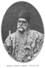
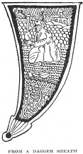

  
[Intangible Textual Heritage](../../index)  [Islam](../index) 
[Index](index)  [Previous](gsw10)  [Next](gsw12) 

------------------------------------------------------------------------

  
*The Glory of the Shia World*, by P. M. Sykes and Khan Bahadur Ahmad din
Khan, \[1910\], at Intangible Textual Heritage

------------------------------------------------------------------------

p. 102

 

### CHAPTER VII

#### THE DEATH OF *MIRZA* HASAN KHAN, *MUSTAUFI*

Many are the famous and many are the fortunate,  
Who have rent the garment of life,  
Who have drawn the head within the wall of the grave.  
                                                      Sadi.

IT was about three years after my marriage when my uncle addressed me
with much solemnity and said, "Oh my son, up to the age of forty years a
man develops; but after this he remains stationary, just as the sun when
it has reached the meridian seems to stop, and then to move more slowly
until it begins to set.

"From forty to fifty years a man feels that he is failing every year,
but after reaching this age he feels it every month until he is sixty,
when he feels it every week. Now I, my son, have passed seventy years,
and, as the poet writes:

"Hast thou won a throne higher than the Moon;  
 Hast thou the power and the wealth of Solomon!  
 When the fruit is ripe, it falls from the tree;  
 When Thou hast attained thy limit, it is time to depart."

p. 103

A few days after speaking these words, *Mirza* Hasan Khan fell ill with
fever, and so *Haji* Mohamed Khan, the Chief Physician of the quarter,
was summoned. At first he encouraged us by giving proofs of his
perception, as he said to my uncle that he knew that he had partaken of
fowl that day, which happened to be true; and Allah alone knows how he
was aware of this, unless indeed he saw its feathers lying outside the
kitchen.

The Chief Physician, after making the most minute inquiries, ordered
that all pickles and all white foods, such as milk, cheese, or curds,
should be given up; and he prescribed a broth of meat, vegetables, and
rice all boiled together.

He added that it was most important that the meat should be cut from the
neck of the sheep. Moreover, as the disease was pronounced to be of a
cold type, castor oil, which is a warm drug, was administered as a
purgative, followed by boiling water containing sugar.

It was expected that, on the seventh night, perspiration would set in;
but as the fever was still strong, the legs of the patient were
fumigated and mustard was rubbed in. Perspiration was again expected on
the ninth night; but as there was no abatement in the fever a family
council was held, and it was decided to call in

p. 104

\[paragraph continues\] *Mirza* Sadik
Khan, the Chief Physician of the Vakil-ul-Mulk.

This physician was famous throughout the province for having cured a man
who was at the point of death from a bone sticking in his throat, and
as, perhaps, some European doctor may read this story, I advise him to
note how this successor of Avicenna added lustre to the glories of
Persian science.

The patient was brought in on the verge of death, and when his condition
had been described, the learned physician stroked his long beard and
exclaimed, "By Allah! this case would be hopeless except for me, whose
perception is phenomenal. The cause of this man's state is a bone lodged
in the throat so firmly that no efforts avail to dislodge it. Therefore
either the man must quickly die or the bone must be dissolved, and by
what agency?

"Thanks be to Allah! I am a physician and a Kermani, and have observed
that wolves, who live on raw meat and bones, never suffer any calamity
such as that of the patient. Therefore it is clear to me that the breath
of a wolf dissolves bones, and that, if one breathes down the throat of
the patient, the bone will be dissolved."

Infinite are the marvels of Allah! for when a wolf, belonging to a
buffoon, was brought in and

p. 105

breathed on the patient, suddenly a fit of choking ensued, and the bone,
dissolved without doubt by the breath of the wolf, was loosened and
extracted.

Since that date the Vakil-ul-Mulk would consult no other physician, and
occasionally condescended to remark that his physician was fit to rank
with Plato.

However, the arrival of the Governor-General's doctor much displeased
*Haji* Mohamed Khan, and when *Mirza* Sadik Khan declared the disease to
be of a hot type and prescribed broth composed of the flesh of cocks
which are cold, as opposed to hens which are hot, in addition to a
draught of water-melon juice with melon seeds; and, finally, when he
entirely forbade the use of salt, there was a great quarrel, so much so
that my uncle bade them, in Allah's name, to leave him to die in peace,
and to allow him to follow the path of her who is forgiven, meaning
thereby his deceased wife.

He also quoted from the Koran, "Wheresoever ye be death will overtake
you, although ye be in lofty towers."

At this time Izrail, the Angel of Death, was, in truth, knocking at the
door; and that no one can stay his entrance, is shown by what happened
in the case of the Prophet, on Him be peace!

p. 106

It is recorded in the *Book of Calamity*, and runs as follows [1](#fn_43):—

*Izrail*.—Here is one of the least servants of Mohamed, the King of the
Faithful. Let some one be kind enough to come to the door, for I have a
message to deliver.

*Fatima* (at the door).—Who is that knocking at the door? And what can
have induced him so to do? Is his thunder-like voice going to strike my
soul dead?

*Izrail*.—Know thou, O daughter of the Prophet, that I am a stranger
come from a distant country to receive light from Mount Sinai of Arabia.
Be pleased to open the door and allow me to enter, for I have a knot to
be untied inside.

*The Prophet*.—Dost thou not know, Fatima, who is he that knocks at the
door?

*Fatima*.—No, father, I any unable to tell who that rough-spoken man is.
I can only say that his dreadful voice has made me quite restless.

*The Prophet*.—It is he who continually grieves the heart of men; he who
casts the dust of misery on the heads of poor widows. It is he, even the
snatcher of the souls of men, Jinns, beasts, and birds; he can command a
full view of the east and west at the same time.

*Fatima*.—Oh! what shall I do? The time of trouble has, after all,
arrived, the hour of affliction approacheth. Come in, O thou Snatcher of
Souls, and say what thou wishest to do, for thou art permitted by the
Prophet to enter.

*Izrail*.—Peace be unto thee, O Mighty Sovereign! Peace be unto thee, O
Sun of the World!

*The Prophet*.—On thee be both peace and honour! Thou art altogether
welcome. What may thy object or message be? Tell us.

p. 107

*Izrail*.—May I be offered unto thee, O thou King of Freedom and
Liberty! The Creator of the World has sent me to the earth to thee, to
know whether it be thy pleasure that I should transport thy soul from
thy body to a garden of roses and jasmines, or whether thou preferest
rather to live eternally on the earth. Thou mayest choose which thou
likest best.

*The Prophet*.—In the pleasure-garden of this life every beautiful rose
is attended with several piercing thorns, and the treasure of this world
has many venomous serpents accompanying it. Thus thou mayest take my
life if thou pleasest.

To return to the state of *Mirza* Hasan Khan, in despair a soothsayer
was now called in. This individual, after repeating some cabalistic
phrases, remarked that the patient had evidently been attacked by Jinns,
either from passing along a canal at night without repeating the name of
Allah, or else from putting his hand into hot ashes, which disturbs the
young Jinns.

Neither of these things had *Mirza* Hasan Khan done; but still we felt
that something might be effected by the soothsayer; and so, when he
proposed to summon the king of the Jinns in order to inquire, we agreed.

Thereupon he asked for a basin of water; and we were all instructed to
put money into it, in accordance with the love and regard we had for the
patient. When I threw in a gold piece the soothsayer, with extraordinary
gestures, chanted the following verse:

p. 108

I adjure you, by the names of Allah, those of you who live in buildings
and those who reside in deserts and uninhabited places, that you present
yourselves before me to listen to my order and to execute it. All of you
who are riding horses should appear, accompanied by your kings and
princes; and all who are present or who are absent should appear, so
that I may see you and speak to you in your own language, and obtain
replies from you to the inquiries made from you as regards the treatment
of this patient. Help, O Angels Rakyail, Jibrail, [1](#fn_44) Mekiail, Sarfiail, Ainail, Kamsail, in
producing these Jinns.

Suddenly the soothsayer foamed at the mouth to make us believe that
Shamhurash, the King of the Jinns, had entered him, and a dialogue
ensued, during the course of which *Mirza* Hasan Khan was accused of
various offences against the Jinns, such as sitting at night under a
green tree without repeating the name of Allah; throwing stones at the
heaps of house-sweepings, the usual place of rest at night of Jinns and
their children; throwing a bone, and thereby hurting the Jinns;
finishing his meals without leaving anything; or throwing a half-burnt
piece of wood without uttering Allah's name.

At length it was decided that a black cock should be sacrificed, and a
charm written with its blood and placed underneath the pillow of the
patient, who also was ordered to eat its liver raw; but, alas! my dear
uncle was dying,

p. 109

and, after mourners’ tears had been administered in vain, [1](#fn_45) he was gently laid with his face turned
towards Mecca, while the "Yasin" chapter of the Koran was recited.

After this the dying man was called upon

 
[  
Click to enlarge](img/10900.jpg)  
*MIRZA* HASAN KHAN, MUSTAUFI  

to make his will in the presence of witnesses; and he bequeathed
one-third of his property for services in connection with his funeral, a
pilgrimage by proxy to Mecca, and the reading of a special series of
prayers at the shrine of

p. 110

the *Imam* Riza. The other two-thirds of his property, consisting of a
house, a garden, and four parts of a village, were bequeathed to me. The
document was first sealed by the dying man, then by *Aga* Mohamed and
other witnesses.

When the will was drawn up and thus completed, my uncle's seal was
broken and placed at his right side; and his shroud was prepared,
covered with the various prayers written by forty-one different
individuals:

O Allah! we know certainly nothing but good about this person; but Thou
knowest his condition better.

This is a testimony in favour of the deceased. And, as one of our
deep-thinkers in utter humility and self-abasement wrote:—

We are ashamed to find on the Day of Judgment  
That Thy forgiveness was too great to allow us to commit any sin.

When the death agony was passed my uncle's eyes were closed, and, after
his limbs were stretched, the great toes of both feet were tied together
and a scarf was bound round the head under the chin. The corpse was next
placed on a bier, and after being carried round the court of the house,
was taken to the Washing Place, preceded by *Allah Mughari*, termed the
"Ministers of Death," whose duty it is, the moment a death has

p. 111

occurred, to ascend to the roof of the house and to chant in Persian:

Whosoever has come into this world is mortal;  
The one who alone remains alive and everlasting is Allah.

Moreover, they chant the names and attributes of Allah in Arabic,
whereby the fact of the decease is notified.

The corpse at the Washing Place was laid on a flat stone. The clothes
were first removed, and it was washed with pure water, with water and
soap, with water in which leaves of the lote tree had been mixed, and,
finally, with camphor water. It was then wrapped in the shroud, which
was fitted by tearing off suitable lengths, no thread or needle being
allowed to touch it.

Two green willow sticks were placed under the arms, on which were
traced, by the finger alone, the following words:

Certainly we know nothing but good of this person.

It is believed that so long as the sticks are left in the tomb, so long
the corpse remains untouched by time.

When the corpse had been duly prepared, it was replaced on the bier and
the funeral procession started for the cemetery. First came the
relations, then the dead man carried by relays of voluntary bearers, and
followed by a *mullah* on horseback, who recited the *Al* 

p. 112

\[paragraph continues\] *Rahman* chapter
of the Koran. Behind came numerous friends, and the procession was
lengthened by led horses, sent as a mark of respect to the late
Mustaufi; there was also a

  [  
Click to enlarge](img/11200.jpg)  
THE MULLAH.  
*Major P. I. Kennion, phot*.  

catafalque draped with black cloth, and numbers of people bearing
unlighted candlesticks. In short, before the sad procession reached the
cemetery at least a thousand people had joined it.

There the funeral prayer was recited by

p. 113

the *mullah*, and the bier was removed to the foot of the grave. Three
times was it lifted from the ground and three times was it replaced. At
the fourth time the corpse was gently lowered head-foremost into the
grave.

Earth from the tomb of the *Imam* Husein at Kerbela was lightly thrown
inside the shroud, the face of the corpse was uncovered and the right
cheek laid on the bare ground, with a little of the sacred earth under
it, the face itself being turned towards Mecca. The grave was first
covered with bricks sufficiently high to allow the dead man to sit up
and reply to the dread questions of Munkir and Nakir. Earth was then
piled up and the *mullah* recited:

O Allah! this person is Thy slave, son of Thy man-slave and
woman-slave.  
He is going to Thee and Thou art the best receiver of him.

Finally, water was sprinkled on the earth, and all present, opening
their hands, buried their fingers in the soil in such a manner as to
leave marks, reciting meanwhile the opening chapter of the Koran. As
long as the finger-marks remain there the corpse will not, we believe,
be subjected to any trouble. This concluded the burial ceremony.

But perhaps I ought to explain why these willow sticks are placed under
the arms of the dead man, as otherwise the custom might

p. 114

appear to be without meaning, whereas the contrary is the case.

When the burial is completed and the mourners have dispersed, the
*mullah* stays behind and, standing with his face turned towards Mecca,
he solemnly adjures the dead man thrice in the following words: "Hear
and understand! When the two angels visit thee and question thee, fear
not; but reply by the confession of faith. Hast thou understood?" He
then concludes, "May Allah keep thee firm in thy belief and guide thee!"

When the angels, Munkir and Nakir, visit the dead man, he raises himself
into a sitting position on the two willow props. Standing one on each
side, they straitly examine him, and, if the replies be satisfactory,
they depart; but, if not, the corpse is beaten into dust by terrible
fiery maces, and then again restored to its original shape.

If the deceased be a true Shia, whose replies have been found
satisfactory, his spirit is taken to the "Abode of Peace" near Najaf to
await the Day of Judgment; otherwise his soul is taken to the
Sabra-i-Barahut, near Babylon, where it undergoes penance, and is
purified against the same awful day.

The three following days were days of mourning. On the first day
forty-one men were

p. 115

engaged to recite short prayers for the dead, to strengthen him in
facing Munkir and Nakir; these are called the "Prayers of Alarm."

On the second day the grave was visited by relations and friends, and as
the latter arrived they recited *fatihas*, or the opening chapter of the
Koran, and *ikhlas*, or the last chapter but one of the Koran.

They then said, "May Allah give you patience and forgive the deceased,
and may He make his position in heaven exalted!" After this they sat
down with us and repeated *fatihas* and *ikhlas*, placing their hands on
the grave.

Then we all stood in a circle, and the Reciter recited a prayer for the
forgiveness of all the prophets and saints, and, last of all, for the
forgiveness of the dead man.

We finally formed two rows, and thanked our numerous friends as they
departed, saying, "Forgive the trouble," "You have taken infinite
trouble." To this the reply was made, "May Allah show you his kindness,
grant you patience, and reward you for your goodness!"

During the three days of mourning all our friends came to offer
condolences. When they entered the house they sat down and softly
recited a *fatiha*.

*Sarsalamati*, they then said, "May your life be safe!" Rose water was
poured on the

p. 116

palms of their right hands, with which they sprinkled their faces; and,
after drinking coffee, they picked up a portion of the Koran and read,
or listened to the professional reciters, who recited chapters in a
high-pitched tone. Finally, after partaking of tea and the water pipe,
they withdrew to make room for fresh arrivals.

On the third day, the leading *mujtahid*, *Aga* Mohamed, came to bring
the mourning to an end. He entered, observing the same ceremonial as the
other visitors; and, after partaking of tea and a water pipe, he asked
the relations of the dead man to fasten up the openings of their shirts
which had been torn open as a sign of mourning, and to take off the
shawl which the mourners, removing it from their waists, had wound round
their necks. The Korans were then collected and a Sacred Recitation was
held, at the termination of which all retired and the special part of
the mourning came to an end.

Again, on the fourth morning, people assembled at our house, and
listened to the Koran being recited. We were then taken to the cemetery,
and after saying a, *fatiha*, I was escorted back to the *Mustaufi's*
office, where I was welcomed, no longer as a mere assistant, but as the
successor to the deceased *Mirza* Hasan Khan.

In order to show befitting respect for my late

p. 117

uncle, reciters remained for seven days reading the Koran over the
grave. On the seventh day lamps and candles were placed on it; and had
the deceased been prematurely cut off there would have been a larger
number.

The ladies of the family lamented for the first three days with their
friends, the same ceremonial being observed as in the assembly of the
men; and, on the seventh day, they held a recitation on the grave and
then retired. On Friday evenings, on the fortieth day, and again at the
end of the year, similar ceremonies were performed. This was, of course,
in addition to the festival of the *Id-i-Barat*. On this day, in honour
of the birth of the twelfth *Imam*, all the souls of the dead receive a
*barat* or bill of freedom for three days; and services are held, and
food and sweetmeats distributed to the poor at the graves, which are
adorned with flowers.

And thus, O my readers in Europe, respect us for the manner in which we
reverence the dead, for whom we wear black clothes for forty days,
during which period it is not permitted to use henna or to shave the
head. Moreover, mourners do not attend any marriage ceremonies or
parties of pleasure until the oldest member of the family takes them to
the bath, where they have their hair cut and dyed and their beards
trimmed.

Meanwhile a slab of stone had been ordered,

p. 118

bearing an inscription giving the name, family, and age of the late
*Mirza* Hasan Khan, together with the date of his decease. Verses from
the Koran and the names of the twelve *Imams* were also inscribed on it,
and when we all visited the grave on the fortieth day, the slab was
inspected and then erected over the grave.

Now I have finished this very sad chapter, and, as the poet writes:

Whosoever is born must depart from this world,  
As annihilation must overtake every one.

 

 

 

 

 

------------------------------------------------------------------------

### Footnotes

[106:1](gsw11.htm#fr_43) The translation is
taken from Sir L. Pelly's *The Miracle Play of Hasan and Husein*, p. 83.

[108:1](gsw11.htm#fr_44) The Arabic form of
Gabriel.

[109:1](gsw11.htm#fr_45) Mourners’ tears are
collected during the "Passion Play" described in chapter xii., and are
considered to be a sovereign remedy for all diseases. The clean
handkerchief, in which the tears are gathered, is dried and placed in
the shroud of the dead man.

------------------------------------------------------------------------

[Next: Chapter VIII. My First *Mamuriat*](gsw12)
