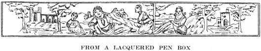

  
[Intangible Textual Heritage](../../index)  [Islam](../index) 
[Index](index)  [Previous](gsw19) 

------------------------------------------------------------------------

  
*The Glory of the Shia World*, by P. M. Sykes and Khan Bahadur Ahmad din
Khan, \[1910\], at Intangible Textual Heritage

------------------------------------------------------------------------

p. 278

  [  
Click to enlarge](img/27800.jpg)  
THE SEAL OF THE *IMAM* RIZA  

The inscription on the seal runs as follows:—

<table data-border="0">
<colgroup>
<col style="width: 100%" />
</colgroup>
<tbody>
<tr class="odd">
<td data-valign="top">
Glory be to Allah 
I, the Vice-regent of Allah, 
Sultan Abul Hasan Ali, 
Son of Musa-ar-Riza.

O Conqueror of the enemies! 
O Chief of the friends 
O Source of Wonders! 
O Ali the Chosen!
</td>
</tr>
</tbody>
</table>

p. 279

 

### EPILOGUE

*I was meditating how to write the date of this work  
    In hidden but complete verse,  
When Hatif (the Good Angel) put out his head and sang*,  
    "*This book of travel has been speedily completed*." [1](#fn_70)

p. 280

 

 

 

Printed by R. & R. CLARK, LIMITED, Edinburgh.

 

 

 

------------------------------------------------------------------------

### Footnotes

[279:1](gsw20.htm#fr_72) *No Persian work can be
concluded without its date being shown in a verse, each letter of which
possesses a numerical value. In the present instance, the number is A.H.
1331; but by a poetical conceit, the H in Hatif is "put out" or
deducted, making A.H. 1326 (1908) which is the year in which the book
was completed. The Persian text runs as follows:* 

  [  
Click to enlarge](img/27901.jpg)  
Persian Epigram  

 
