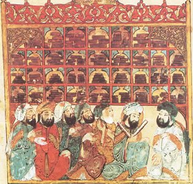

  
[Intangible Textual Heritage](../../index)  [Islam](../index) 

------------------------------------------------------------------------

[Buy this Book at
Amazon.com](https://www.amazon.com/exec/obidos/ASIN/0766136078/internetsacredte)

------------------------------------------------------------------------

<table width="75%">
<colgroup>
<col style="width: 50%" />
<col style="width: 50%" />
</colgroup>
<tbody>
<tr class="odd">
<td width="50%" data-valign="TOP"></td>
<td width="50%" data-valign="CENTER"><h1 id="history-of-philosophy-in-islam" data-align="CENTER">History of Philosophy in Islam</h1>
<h2 id="by-t.-j.-de-boer" data-align="CENTER">by T. J. De Boer</h2>
<h4 id="section" data-align="CENTER">[1903]</h4></td>
</tr>
</tbody>
</table>

------------------------------------------------------------------------

[Contents](#contents)    [Start Reading](hpi00)

------------------------------------------------------------------------

|                                                                                                                           |
|---------------------------------------------------------------------------------------------------------------------------|
|  |

*Islam in the first four centuries, ... was inclined to take into its
possession not only the outward advantages of the world, but also the
intellectual acquisitions of Mankind.* ([p. 71](hpi11.htm#page_71)).

This is a well-written and authoritative review of the history of
Islamic philosophy during the middle ages. Medieval Islamic civilization
at its height was a center of learning, and its philosophers were no
exception. Islamic philosophers grappled with issues such as free-will,
causality and the nature of reality. Some of these figures are still
well-known, such as Ibn Sina (Avicenna), Ibn Roshd (Averroes), the Sufi
Gazali, and Kindi.

These thinkers drew on many sources, including Indian philosophy (such
as the [Upanishads](../../hin/upan/index)) and the ancient Greek
philosophers, particularly [Aristotle](../../cla/ari/index), whose works
were considered the highest authority. In turn, Aristotelianism was
picked up by by the Catholic Church and virtually enshrined as doctrine,
particularly in the realm of natural science. This endured until the
experimental method was used to test Aristotle in the renaissance, and
his dominance was overthrown.

------------------------------------------------------------------------

[Title Page](hpi00)  
[Translator's Prefatory Note](hpi01)  
[Preface](hpi02)  
[Contents](hpi03)  
[Corrigenda](hpi04)  

### Introduction

[1. The Theatre](hpi05)  
[2. Oriental Wisdom](hpi06)  
[3. Greek Science](hpi07)  

### II. Philosophy and Arab Knowledge

[1. Grammatical Science](hpi08)  
[2. Ethical Teaching](hpi09)  
[3. Doctrinal Systems](hpi10)  
[4. Literature and History](hpi11)  

### III. The Pythagorean Philosophy

[1. Natural Philosophy](hpi12)  
[2. The Faithful Brethren of Basra](hpi13)  

### IV. The Neo-Platonic Aristotelians of the East

[1. Kindi](hpi14)  
[2. Farabi](hpi15)  
[3. Ibn Maskawaih](hpi16)  
[4. Ibn Sina](hpi17)  
[5. Ibn al-Haitham](hpi18)  

### V. The Outcome of Philosophy in the East

[1. Gazali](hpi19)  
[2. The Epitomists](hpi20)  

### VI. Philosophy in the West

[1. Beginnings](hpi21)  
[2. Ibn Baddja](hpi22)  
[3. Ibn Tofail](hpi23)  
[4. Ibn Roshd](hpi24)  

### VII. Conclusion

[1. Ibn Khaldun](hpi25)  
[2. The Arabs and Scholasticism](hpi26)  

 

[Index of Personal Names](hpi27)  
