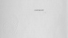

  
[Intangible Textual Heritage](../../index)  [Islam](../index.md) 
[Index](index)  [Next](iq01.md) 

------------------------------------------------------------------------

[Buy this Book at
Amazon.com](https://www.amazon.com/exec/obidos/ASIN/1417977868/internetsacredte.md)

------------------------------------------------------------------------

  
*The Secrets of the Self*, by Muhammad Iqbal, tr. by Reynold A.
Nicholson, \[1920\], at Intangible Textual Heritage

------------------------------------------------------------------------

# THE SECRETS OF THE SELF

## (ASRÁR-I KHUDÍ)

 

MACMILLAN AND CO., Limited  
LONDON • BOMBAY • CALCUTTA • MADRAS  
MELBOURNE

THE MACMILLAN COMPANY

NEW YORK • BOSTON • CHICAGO  
DALLAS • SAN FRANCISCO

THE MACMILLAN CO. OF CANADA, Ltd.  
TORONTO

  [  
Click to enlarge](img/title.jpg.md)  
Title Page  

#### THE

# SECRETS OF THE SELF

### (ASRÁR-I KHUDÍ)

##### A PHILOSOPHICAL POEM

###### BY

## SHEIKH MUHAMMAD IQBAL

###### OF LAHORE

###### TRANSLATED FROM THE ORIGINAL PERSIAN WITH INTRODUCTION AND NOTES BY

### REYNOLD A. NICHOLSON, Litt.D., LL.D.

###### LECTURER ON PERSIAN IN THE UNIVERSITY OF CAMBRIDGE

#### MACMILLAN AND CO., LIMITED ST. MARTIN'S STREET, LONDON

#### \[1920\]

 
[  
Click to enlarge](img/verso.jpg.md)  
Verso  

Scanned, proofed and formatted at Intangible Textual Heritage, January
2008, by John Bruno Hare. This text is in the public domain in the
United States because it was published prior to 1923.

------------------------------------------------------------------------

[Next: Contents](iq01.md)
