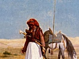

  
[Intangible Textual Heritage](../../index)  [Islam](../index) 
[Index](index)  [Previous](iq00)  [Next](iq02) 

------------------------------------------------------------------------

[Buy this Book at
Amazon.com](https://www.amazon.com/exec/obidos/ASIN/1417977868/internetsacredte)

------------------------------------------------------------------------

  
*The Secrets of the Self*, by Muhammad Iqbal, tr. by Reynold A.
Nicholson, \[1920\], at Intangible Textual Heritage

------------------------------------------------------------------------

### CONTENTS

|         |                                                                                                                                                                                                                             |                          |
|---------|-----------------------------------------------------------------------------------------------------------------------------------------------------------------------------------------------------------------------------|--------------------------|
|         |                                                                                                                                                                                                                             | PAGE                     |
|         | Introduction                                                                                                                                                                                                                | [vii](iq02.htm#page_vii) |
|         | Prologue                                                                                                                                                                                                                    | [1](iq03.htm#page_1)     |
| I.      | Showing that the system of the universe originates in the Self, and that the continuation of the life of all individuals depends on strengthening the Self                                                                  | [16](iq04.htm#page_16)   |
| II\.    | Showing that the life of the Self comes from forming desires and bringing them to birth                                                                                                                                     | [23](iq04.htm#page_23)   |
| III\.   | Showing that the Self is strengthened by Love                                                                                                                                                                               | [28](iq06.htm#page_28)   |
| IV\.    | Showing that the Self is weakened by asking                                                                                                                                                                                 | [38](iq07.htm#page_38)   |
| V.      | Showing that when the Self is strengthened by Love it gains dominion over the outward and inward forces of the universe                                                                                                     | [43](iq08.htm#page_43)   |
| VI\.    | A tale of which the moral is that negation of the Self is a doctrine invented by the subject races of mankind in order that by this means they may sap and weaken the character of their rulers                             | [48](iq09.htm#page_48)   |
| VII\.   | To the effect that Plato, whose thought has deeply influenced the mysticism and literature of Islam, followed the sheep's                                                                                                   |                          |
|         | p. vi                                                                                                                                                                                             |                          |
|         |                                                                                                                                                                                                                             | PAGE                     |
|         | doctrine, and that we must be on our guard against his theories                                                                                                                                                             | [56](iq10.htm#page_56)   |
| VIII\.  | Concerning the true nature of poetry and the reform of Islamic literature                                                                                                                                                   | [60](iq11.htm#page_60)   |
| IX\.    | Showing that the education of the Self has three stages: Obedience, Self- control, and Divine Vicegerency                                                                                                                   | [72](iq12.htm#page_72)   |
| X.      | Setting forth the inner meanings of the names of Ali                                                                                                                                                                        | [85](iq13.htm#page_85)   |
| XI\.    | Story of a young man of Merv who came to the saint Ali Hujwírí—God have mercy on him!—and complained that he was oppressed by his enemies                                                                                   | [95](iq14.htm#page_95)   |
| XII\.   | Story of the bird that was faint with thirst                                                                                                                                                                                | [100](iq15.htm#page_100) |
| XIII\.  | Story of the diamond and the coal                                                                                                                                                                                           | [104](iq16.htm#page_104) |
| XIV\.   | Story of the Sheikh and the Brahmin, followed by a conversation between Ganges and Himalaya to the effect that the continuation of social life depends on firm attachment to the characteristic traditions of the community | [108](iq17.htm#page_108) |
| XV\.    | Showing that the purpose of the Moslem's life is to exalt the Word of Allah, and that the *Jihád* (war against unbelievers), if it be prompted by land-hunger, is unlawful in the religion of Islam                         | [116](iq18.htm#page_116) |
| XVI\.   | Precepts written for the Moslems of India by Mír Naját Nakshband, who is generally known as Bábá Sahrá’í                                                                                                                    | [122](iq19.htm#page_122) |
| XVII\.  | Time is a sword                                                                                                                                                                                                             | [134](iq20.htm#page_134) |
| XVIII\. | An invocation                                                                                                                                                                                                               | [141](iq21.htm#page_141) |

------------------------------------------------------------------------

[Next: Introduction](iq02)
