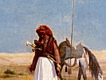

  
[Intangible Textual Heritage](../../index)  [Islam](../index.md) 
[Index](index)  [Previous](iq07)  [Next](iq09.md) 

------------------------------------------------------------------------

[Buy this Book at
Amazon.com](https://www.amazon.com/exec/obidos/ASIN/1417977868/internetsacredte.md)

------------------------------------------------------------------------

  
*The Secrets of the Self*, by Muhammad Iqbal, tr. by Reynold A.
Nicholson, \[1920\], at Intangible Textual Heritage

------------------------------------------------------------------------

p. 43

### V

*Showing that when the Self is strengthened by Love it gains dominion
over the outward and inward forces of the universe*.

When the Self is made strong by Love  
Its power rules the whole world.  
The Heavenly Sage who adorned the sky with stars 485  
Plucked these buds from the bough of the Self.  
Its hand becomes God's hand,  
The moon is split by its fingers.  
It is the arbitrator in all the quarrels of the world,  
Its command is obeyed by Darius and Jamshíd. 490

p. 44

I will tell thee a story of Bú Ali, [1](#fn_51.md)  
Whose name is renowned in India,  
Him who sang of the ancient rose-garden  
And discoursed to us about the lovely rose:  
495 The air of his fluttering skirt  
Made a Paradise of this fire-born country.  
His young disciple went one day to the bazaar—  
The wine of Bú Ali's discourse had turned his head.  
The governor of the city was coming along on horseback,  
500 His servant and staff-bearer rode
beside him.  
The forerunner shouted, "O senseless one,  
Do not get in the way of the governor's escort!"

p. 45

But the dervish walked on with drooping head,  
Sunk in the sea of his own thoughts.  
The staff-bearer, drunken with pride, 505  
Broke his staff on the head of the dervish,  
Who stepped painfully out of the governor's way,  
Sad and sorry, with a heavy heart.  
He came to Bú Ali and complained  
And released the tears from his eyes. 510  
Like lightning that falls on mountains,  
The Sheikh poured forth a fiery torrent of speech.  
He let loose from his soul a strange fire,  
He gave an order to his secretary:  
Take thy pen and write a letter 515  
From a dervish to a sultan!  
Say, 'Thy governor has broken my servant's head;  
He has cast burning coals on his own life.

p. 46

Arrest this wicked governor,  
520 Or else I will bestow thy kingdom on
another.'"  
The letter of the saint who had access to God  
Caused the monarch to tremble in every limb.  
His body was filled with aches,  
He grew as pale as the evening sun.  
525 He sought out a handcuff for the
governor  
And entreated Bú Ali to pardon this offence.  
Khusrau, the sweet-voiced eloquent poet, [1](#fn_52.md)  
Whose harmonies flow from the creative mind  
And whose genius hath the soft brilliance of moonlight,  
530 Was chosen to be the king's
ambassador.

p. 47

When he entered Bú Ali's presence and played his lute,  
His song melted the fakir's soul like glass.  
One strain of poesy bought the grace  
Of a majesty that was firm as a mountain.  
Do not wound the hearts of dervishes, 535  
Do not throw thyself into burning fire!

------------------------------------------------------------------------

### Footnotes

[44:1](iq08.htm#fr_51.md) Sheikh Sharafu’ddín of
Pánípat, who is better known as Bú Ali Qalandar, was a great saint. He
died about a.d. 1325.

[46:1](iq08.htm#fr_52.md) Amír Khusrau of Delhi,
the most celebrated of the Persian poets of India.

------------------------------------------------------------------------

[Next: VI. Negation of the Self](iq09.md)
