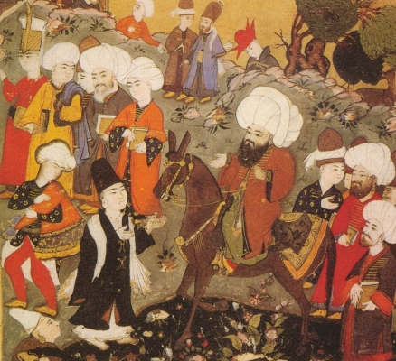

  
[Intangible Textual Heritage](../../index)  [Islam](../index.md) 

------------------------------------------------------------------------

[Buy this Book at
Amazon.com](https://www.amazon.com/exec/obidos/ASIN/B002CVTTRU/internetsacredte.md)

------------------------------------------------------------------------

<table width="75%">
<colgroup>
<col style="width: 50%" />
<col style="width: 50%" />
</colgroup>
<tbody>
<tr class="odd">
<td width="50%" data-valign="TOP"> 
Rumi meeting Shams-i Tabrizi for the First Time [Persian Manuscript] (Public Domain Image)</td>
<td width="50%" data-valign="CENTER"><h2 id="the-mesnevi-and-the-acts-of-the-adepts" data-align="CENTER">The Mesnevi and the Acts of the Adepts</h2>
<h3 id="tr.-by-james-w.-redhouse" data-align="CENTER">tr. by James W. Redhouse</h3>
<h4 id="section" data-align="CENTER">[1881]</h4></td>
</tr>
</tbody>
</table>

------------------------------------------------------------------------

[Contents](#contents)    [Start Reading](mes00.md)    [Page
Index](pageidx)    [Text \[Zipped\]](mes.txt.gz.md)

------------------------------------------------------------------------

|                                                                                                                           |
|---------------------------------------------------------------------------------------------------------------------------|
|  |

In spite of the fact that the Persian Sufi master Rumi has achieved huge
name reconition, his works took a long time to be translated into
English. This was one of the first English translations of a major
portion of Rumi's Masnavi, his largest work. The complete Masnavi is
said to comprise 25,700 couplets. This translation is of the first book
(of six) of the Masnavi; this was as far as Redhouse apparently got with
his translation. Later, in 1898, E.H. Whinfield released an abridged
translation of the first six books, also available at this site
([here](../masnavi/index).md). The first complete translation of the
Masnavi was by R.A. Nicholson, published in London by Luzac and Co. from
1925-40. A.J. Arberry also published several ground-breaking
translations of Rumi in the mid-20th century.

The Acts of the Adepts, which forms the first part of this book, is also
notable. This is an abridged translation of the Menaqibu 'l Arifin, by
the historian Eflaki. This is a remarkable collection of legendary
stories about the early Sufis.

Both of these texts appear for the first time on the Internet at
Intangible Textual Heritage.

------------------------------------------------------------------------

 [Title Page](mes00.md)  
[Contents](mes01.md)  
[Translator's Preface](mes02.md)  

### The Acts of the Adepts

[Title Page](mes03.md)  
[Chapter I](mes04.md)  
[Chapter II](mes05.md)  
[Chapter III](mes06.md)  
[Chapter IV](mes07.md)  
[Chapter V](mes08.md)  
[Chapter VI](mes09.md)  
[Chapter VII](mes10.md)  
[Chapter VIII](mes11.md)  
[Chapter IX](mes12.md)  

### The Book of the Mesnevī

[Title Page](mes13.md)  
[Preface](mes14.md)  
[Proem: The Reed Flute](mes15.md)  
[I. The Prince and the Handmaid](mes16.md)  
[II. The Oilman and the Parrot](mes17.md)  
[III. The Jewish King, Persecutor of the Christians](mes18.md)  
[IV. Another Jewish King, Persecutor of Christians](mes19.md)  
[V. The Lion and the Beasts](mes20.md)  
[VI. The Greater (Spiritual) Warfare](mes21.md)  
[VII. The Merchant and the Parrot](mes22.md)  
[VIII. The Harper](mes23.md)  
[IX. The Poor Scenite Arab and his Wife](mes24.md)  
[X. Patience and Perseverance Under a Teacher](mes25.md)  
[XI. The Lion's Hunt, in Company](mes26.md)  
[XII. Joseph and the Mirror](mes27.md)  
[XIII. The Prophet's First Amanuensis](mes28.md)  
[XIV. The Chinese and Roman Artists](mes29.md)  
[XV. Zeyd's Inspiration](mes30.md)  
[XVI. ‘Alī's Forbearance](mes31.md)  
[XVII. Conclusion](mes32.md)  
