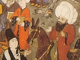

  
[Intangible Textual Heritage](../../index)  [Islam](../index.md) 
[Index](index)  [Previous](mes09)  [Next](mes11.md) 

------------------------------------------------------------------------

[Buy this Book at
Amazon.com](https://www.amazon.com/exec/obidos/ASIN/B002CVTTRU/internetsacredte.md)

------------------------------------------------------------------------

  
*The Mesnavi and The Acts of the Adepts*, by Jelal-'d-din Rumi and
Shemsu-'d-Din Ahmed, tr. by James W. Redhouse, \[1881\], at Intangible
Textual Heritage

------------------------------------------------------------------------

p. 122

#### CHAPTER VII.

*The Sultan of them who attain to the Truth, in whom are manifested the
mysteries of Positive Knowledge, Bahā’u-’l-Haqqiwa-’d-Dīn,* [1](#fn_32.md) *El Veled*.

#### 1.

While Sultan Veled was yet a child, his
father, Jelālu-’d-Dīn, was once discoursing on the miracle of the rod of
Moses, which swallowed up the rods and other engines of Pharaoh's
magicians, related to have been in such quantities as to form seventy
camel-loads, and yet that staff became no thicker or longer than before.

Turning to Sultan Veled, his father asked how this could be, and to what
it could be likened for the sake of illustration.

The child at once replied: "In a very dark night, if a lighted taper be
brought into a large room or hall, it instantly devours all the
darkness, and yet remains a little taper."

Jelāl jumped up from his seat, ran to his son, took the child to his
bosom, kissed him with effusion, and then said: "May God bless thee, my
child! Verily, thou hast strung a pearl of the very first water on the
string of illustration."

#### 2.

Sultan Veled's elder brother, ‘Alā’u-’d-Dīn, was killed in the tumult
for which the police authorities of Qonya put to death the Sheykh
Shemsu-’d-Dīn of Tebrīz. Sultan Veled ruled the dervish community, in
room of his father

p. 123

\[paragraph continues\] (after the death
of Husāmu-’d-Dīn), for many years (from a.h. 683 to 712, being twenty-nine lunar
years). He composed three volumes of poetry in couplets, like the
Mesnevī (hence styled *Mesneviyāt*, Mesnevian Poems), and a volume
(*Dīwān*) of odes in the Arabian style, arranged in the alphabetical
order of their rhymes.

#### 3.

It is related that when Husāmu-’d-Dīn was in his last illness, Sultan
Veled came to visit him. Finding the sickness was unto death, he began
to wail and lament, asking what would become of himself after the
removal of so dear a friend and so able a director.

Husām collected himself, and, leaning on Sultan Veled, sat up. He then
addressed the latter thus: "Be of good cheer, and let not thy heart be
dismayed through my departure in the body. In another form, I will ever
be near thee still. Thou shalt never be in need of counsel from another.
In all difficulties and troubles that may beset thee, I will always be
present, and in the visions of the night will I solve every doubt, and
direct thee in each matter, whether it relate to the spirit and
religion, or whether it pertain to the flesh and mundane affairs.
Whenever thou shalt receive counsel in this manner, know of a surety
that it is I who suggest it to thee—it will be none other than I myself.
I will show myself to thee in thy visions; and I will be thy counsel and
thy guide."

Sultan Veled was the first who narrated his dreams in his poems. Seek
them there; there shalt thou find them consigned.

#### 4.

One day a great man asked Sultan Veled whether God ever speaks to His
servant—man.

This inquirer had frequently had the idea to send an offering to Sultan
Veled; but had hesitated between a gift of money and one of Indian
muslins.

p. 124

Sultan Veled answered his inquiry thus: "God does certainly speak to His
servants. And as to the method by which He addresses then, I will relate
to thee an anecdote."

"There was in Balkh a preacher, who was also one of God's most precious
saints. He had many disciples, who loved him dearly. I heard him once
say, during one of his discourses: 'Long hath God spoken to you in
words; but you will not hearken to Him. This conduct is strangely
improper on the part of obsequious servants. In God's name, therefore, I
warn you that you ought to hearken to God's words, and yield obedience
to His commands.'

"Just then, a dervish in the congregation stood up, and begged that some
one would bestow on him a handkerchief.

"A merchant, who was seated in a corner of the mosque, thrice conceived
the resolve to give the dervish a handkerchief; but thrice he failed to
carry that design into effect.

"That merchant now rose, and, addressing the preacher, said: 'Sir, how
does God speak to His servants? Pray explain this, that the method may
be known unto us.'

"The preacher answered: 'For one handkerchief, God does not speak more
than three times!'

"The merchant was petrified. He cried aloud, and cast himself at the
feet of the preacher. What he had thrice resolved to do, and had not
performed, he now carried out, giving a handkerchief to the dervish, and
professing himself a disciple to the preacher."

"Now," added Sultan Veled, "I say unto thee, O grandee, do thou also
hearken unto the words of God. Give the Indian handkerchiefs, and
distribute 'also the money. When thou shalt have hearkened to the words
of God, He will listen also to that which thou mayest say unto Him. All
thou mayest ask of Him, God will give thee; and whatsoever thou seekest
of Him, thou shalt find."

p. 125

Forthwith that grandee became a sincere convert and disciple. Similar
miraculous works of Sultan Veled are beyond all count.

#### 5.

Sultan Veled died on Saturday, the tenth day of Rejeb, a.h. 712 (11th November, a.d. 1312). He had as many as a dozen children
by his wife Fātima, daughter of the Sheykh Salāhu-’d-Dīn Ferīdūn, the
Goldbeater; but they all died in infancy, immediately after birth, or
ere they were six months old. At length, on a Monday, the eighth day of
the month of Zū-’l-Qa‘da, a.h. 670 (6th
May, a.d. 1272), his son and successor,
Chelebī Emīr ‘Ārif, was born.

Soon after his birth, or when only a few months old, the Emīr ‘Ārif, at
the invitation of his grandfather, Jelālu-’d-Dīn, and in the hearing of
a numerous circle of assembled friends, thrice pronounced, audibly and
distinctly, God's great name. His grandfather prophesied thence that he
would be a very great saint, and would sit in the seat of his own
successorship, after his father Sultan Veled. The Emīr ‘Ārif lived about
fifty years, surviving his father, however, but the short term of eight
or nine summers.

------------------------------------------------------------------------

### Footnotes

[122:1](mes10.htm#fr_33.md) The Beauty of the Truth
and of the Religion (of Islām).

------------------------------------------------------------------------

[Next: Chapter VIII](mes11.md)
