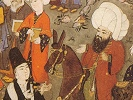

  
[Intangible Textual Heritage](../../index)  [Islam](../index) 
[Index](index)  [Previous](mes21)  [Next](mes23) 

------------------------------------------------------------------------

[Buy this Book at
Amazon.com](https://www.amazon.com/exec/obidos/ASIN/B002CVTTRU/internetsacredte)

------------------------------------------------------------------------

  
*The Mesnavi and The Acts of the Adepts*, by Jelal-'d-din Rumi and
Shemsu-'d-Din Ahmed, tr. by James W. Redhouse, \[1881\], at Intangible
Textual Heritage

------------------------------------------------------------------------

p. 114

### VII.

 

A merchant there was, who a parrot did
own;  
Confined in a cage, wisest bird in the town.  
This merchant to journeying made up his mind  
To fair Hindūstān, there some rich wares to find.  
From generous motives, to each of his slaves,  
To male, and to female, some gift to bring craves.  
He made them all tell him what best they would like;  
And promised to bring it, most gentlemanlike.  
He said to the parrot: "Poll! Poll! With the rest,  
5 From Hind I must
bring thee what thou mayst like best."

The parrot replied: "Sure, thou’lt see parrots there,  
To them pray impart how it is that I fare.  
Inform them, a parrot who loves them all well,  
By thee's kept confined, close shut up in a cell.  
He sends you his love, and his very best wish;  
Desiring from you wise advice, parrotish.  
He fears he may pine, through longing to see  
His dear absent friends,—die in foreign countree.  
He asks if it is altogether thing fit,  
10 That he should
be caged, while you on the trees sit.  
If this is the way in which true friends should act;  
Leave him in his cage, while you forests affect.  
He wishes you'd call to your mind your lost friend,  
When drinking your bumpers, ere fieldward you wend. [1](#fn_202)

p. 115

’Tis sweet to be thought of by far-away dame,  
One's sweetheart, whose love's set one's heart in a flame.  
While you are disporting with those you love best,  
He's eating his heart out; grief gives him no rest.  
One bumper you'll drink for the love of poor Poll, [1](#fn_203)  
If only you wish him your love to extol. 15  
Or, thinking of him who's in slavery kept,  
Your bowl's whole contents dash to earth, as though wept.  
O where is the promise, and where is the oath,  
Th’ engagements sworn to him by sugarsome tooth? [2](#fn_204)  
If absence of his came from truancy's pranks,  
You've set your forgetfulness ’gainst his sin's ranks.  
The ills you inflict out of spite and disdain  
Are sweet to your lover, he does not complain.  
Your petulance prized is beyond fairy gifts;  
Your vengeance most dear is; his hope it uplifts. 20  
No soul can imagine what pleasure is felt,  
Or grace seen, in all the fell blows you have dealt.  
Your wrath is thus sweet; how much more so your grace!  
If mourning so grieve, what from feast would take place?  
He weeps; but he hopes you'll believe not his tears;  
And, out of affection, not lessen his fears.  
He loves your great kindness, your anger as well.  
He equally dotes on those opposites fell.  
The thorn escape should he, and visit the rose,  
He'd warble as nightingale, moved by love's throes. 25  
Most wondrous this bird's strangest use of his bill;  
With thorns, as with roseleaves, he would his mouth fill.  
Not nightingale this; fiery dragon it is;  
All wrongs seem to him, through his love, purest bliss.  
He loveth a rose, and himself is a rose.  
He loveth himself; and seeks love for its woes."

p. 116

Just so is the soul. Its tale, just parrot's tale.  
O where is the One to whom all souls make wail?  
Where is the man, feeble, who's yet innocent?  
30 His heart,
Solomon and his whole armament.  
When he, with tears bitter, is heard to complain,  
The seven vaults of heaven re-echo the strain.  
In anguish he groans; God, in mercy, him hears.  
His cry is: "O Lord!" And God wipes off his tears.  
Abasement in him, is by God highly prized.  
His blasphemies, o’er other men's faith are raised. [1](#fn_205)  
Each instant, in soul, he ascends to heaven's gate;  
His mitre's with crowns capped, of infinite state. [2](#fn_206)  
His frame's here on earth; his pure soul with the Lord  
35 In heaven's
highest sphere, above man's thought or word.  
A heaven such as this thou contemplatest not;  
Thou every moment imaginest—what?  
With him "*where*" and "*nowhere*" are quite equal felt.  
To angels the "*four rivers*" seem a mere belt. [3](#fn_207)

Break off we this theme. Let's discuss other things.  
Cease trifling. "’Tis God who knows best" sense's rings. [4](#fn_208)  
Let's seek to inquire how it fares with our friends,—  
The merchant, his parrot. Who is’t understands?

The former had promised, at latter's request,  
40 To give to the
birds of far Hind his bequest.  
So when he had reached that land, greatly renowned  
In wooded retreat, flock of parrots he found.  
He stopped his beast, cried out, at top of his voice,  
That message his Polly had made, as his choice.

p. 117

One bird of the flock, he saw, then took to quake,  
Fell prone to the earth; no more breath seemed to take.  
The merchant regret felt for what he had done,  
Exclaiming: "Alas! The poor bird I've slain, lone!  
That creature was surely related to Poll;  
Two bodies; one soul; just as is magic doll. 45  
Why did I deliver that fatal message?  
I've killed a collateral of Poll's lineage!"

The tongue, by itself, acts just like flint and steel.  
A word from it, fire-like, we scathing can feel.  
Strike not, then, so rashly, fire's sparks from thy tongue,  
In message or talk, feeble hearers among.  
The night is pitch dark; strewn around, cotton beds.  
Amongst beds of cotton, ’tis, sparks one most dreads.  
He sins who, unmindful of dire consequence,  
Lets fall spoken spark,—fires a whole world, immense. 50  
One rash word may set an assembly ablaze.  
Molehills into mountains, and higher, it can raise.

In basis, our souls would appear Jesus-like.  
To kill, to resuscitate, words are godlike.  
If lifted could be from our souls the dark veil,  
Each word of each soul would with miracles trail.

Dost wish to speak always to men with sweet words?  
Have patience. Impatience must not fret the cords.  
’Tis patience beloved is by all men of sense.  
Impatience a fault is, of children, intense. 55  
Who patience exhibits shall mount to heaven's dome.  
Impatience who showeth, tastes wrath that's to come.

A saint is not hurt, whate’er else may betide, [1](#fn_209)  
To swallow fell poison should he once decide.

p. 118

He's whole, and he's sound; strict diet's his rule.  
Poor students are healthy in fever's dread school.  
The Prophet has cautioned: "Brave though you may be,  
Commit not mad rashness, howe’er the foe flee."

Within thee's a Nimrod. Approach not the fire.  
60 Approach it
thou must? To be Abr’am aspire.  
A swimmer thou art not;—nor seaman by trade;  
From headstrongness strive not the deep sea to wade.  
From fire Abr’am brought forth a fresh-plucked red rose.  
A diver, from sea-bottom, pearls' store can choose.  
A saint handles earth, turns it straightway to gold.  
A sinner, by touch, to earth turns this;—behold.  
A just man's accepted of God, the Most High.  
His deeds are the works of God's hand, still. Eigh! Eigh!  
Th’ imperfect one's hand is aye Satan's foul limb;  
65 Responsible
rests he, howe’er he may climb. [1](#fn_210)  
To him wisdom's self's but a mere misguidance.  
Th’ imperfect man's science is crass ignorance.  
Whatever as cause acts, as cause counted is;  
A perfect man's blasphemy's pure faith, my quiz. [2](#fn_211)  
Rash combatant, fight’st thou on foot ’gainst horseman!  
Thy point thou’lt not carry;—as sure as thou’rt man.

So, Egypt's magicians, in old Pharaoh's days,  
Contended ’gainst Moses; and rashly, always.  
At length they owned Moses superior was;  
70 Men honour,
revere him, who most of power has.  
They said to him, then: "Command ’s thine! See! Purely!  
'Thy rod cast down' first. [3](#fn_212) This
thy wish is; surely."  
He answered: "Nay, nay! First cast ye down your wands.  
Produce to our sight the tricks ye’ve in your hands."  
The honour thus paid was a slur on their faith,  
Removing contention from out of their path.

p. 119

When they had perceived what was thus due to him,  
They error acknowledged, though somewhat too dim.

The "perfect man "'s free both to eat and to speak. [1](#fn_213)  
If thou art " imperfect," eat, speak not, in freak. 75  
Thou art but an ear. He's a tongue;—not like thee.  
To ear was addressed God's word: "Silent be." [2](#fn_214)

A newly-born infant, still sucking the breast,  
Is speechless some while. He's all ear, at the best.  
His lips to keep closed he has, for a set time;  
To speak till he learns,—words to frame and to chime.  
If ear he lend not, he'll not learn common sense;  
Becomes laughingstock;—folly shows, most immense.  
If hearing he have not, deaf being at root,  
He mute must remain; no tongue has he, to boot. 80  
Since, then, we must listen, before we can speak,  
Lend ear to thy teachers, to guide thee who seek.  
A room should be entered, as rule, through its door.  
Effects ever seek where thou seest their cause’ spoor.  
The speech that has need to be heard by no ear,  
The voice is of God; it's to us ever near.  
Inventor is He. From no one has He learnt.  
Of all, He's the stay; not a prop does He want.  
All others require, as in speech, so in deed,  
From others, instruction; they all patterns need. 85

If thou art not negligent,—hear’st what's been said,  
Adopt dervish frock; go and weep in homestead.  
Himself Adam saved from all blame by his tears.  
So tears run wherever repentance appears.  
To weep, Adam came down to this nether world;  
To sigh, moan, and groan; far from sweet Eden hurled,

p. 120

From paradise shut out, from heaven driven down,  
Like schoolboy in fool's-cap, his great sin to drown.

If thou’rt seed of Adam;—if from his loins sprung;  
90 Like him, do
thou seek for God's pardon, whilst young.  
With burnings of heart, and with moisture of eyes,  
As sun and as rain, do thou sorrow's fruit raise.  
Of all the rich solace, what knowest thou of tears?  
Thou beggest still for bread, like a blind man, with leers.  
Thy stomach make void of foul greed's lust for bread.  
Thy heart thou’lt find filled with deep love for Godhead.  
Thy infant soul wean from the gross milk of greed,  
Then teach it to join, next, in angel's pure creed.  
So long thou remainest in darkness and thrall,  
95 A bantling of
Satan thou art, out at call.

The morsel that brings a pure light to the soul  
Is earned by endeavour; not begged with a bowl.  
Should oil, upon trimming, extinguish a lamp,  
Not oil may we name it; ’tis water; ’tis damp.  
The honestly-earned morsel, wisdom imparts;  
Gives softness to souls, and a warmness to hearts.  
If thou be aware that from thy morsel spring  
Heartburnings and hate, know it's not a blest thing.  
Hast wheat ever sown, and reaped barley instead?  
100 Hast known
colt of ass from a mare in birth bred?  
A morsel, when eaten, ’s a seed; its fruit, thought.  
A morsel, when swallowed, ’s a sea pearls has brought.  
From good, honest morsels come, taken in mouth,  
Good works, and firm strivings to shun the soul's drought.  
Reflections, though true, we'll now bring to an end.  
To merchant and parrot's tale ear we will lend.

Our merchant his trading had quickly despatched,  
Then homeward he turned; with joy housedoor unlatched.

p. 121

To ev’ry male slave a rare present he brought;  
For each of his handmaids some gift he had bought. 105  
The parrot him questioned: "What news bringest thou me?  
And whom hast thou seen? What's been said? Tell. Let's see."  
The merchant him answered: "I'm sorry for that.  
I'd rather my hand eat, than tell it thee;—flat.  
In thoughtlessness, folly, ah! why did I prate  
About thy fool's message, until ’twas too late?"

The parrot then asked: "What's this fuss all about?  
What's caused tribulation? Let's hear it right out."  
The merchant now said: "I told all thy sad grief  
To flock of green parrots;—so like thee, their chief. 110  
Of them, one, affected with thy tale of woe,  
Heart-broken, a gasp gave, expired, and fell low.  
I conscience-struck was for the words I had said.  
But what is the use? A word breathed can't be stayed."

A spoken word's arrow swift shot from a bow,  
It can't be recalled, whate’er we may do.  
An arrow once shot off will never come back.  
At source, inundation alone can have check.  
An outlet once found, there's no stoppage for it.  
A world is then ruined, through lack of quick wit. 115  
Act, consequence little dreamt of may produce.  
The progeny's far ’yond our power to reduce.

The work of one Maker ’s this universe all.  
Our acts' consequences to our accounts fall.  
Jack shoots off an arrow;—directs it to Jill.  
The arrow poor Jill hits;—straightway does her kill.  
If only it wound her, for great length of time  
It tortures. Pain's God's work; wherever the clime.

p. 122

Should Jack, at that moment, expire from his fright,  
120 To plague her
Jill's wound would not cease, day or night.  
If from the effect of great pain, then, she die,  
Remote cause is Jack, still, of her misery.  
Account he must render for those pangs of hers.  
Although they're God's acts, man to man them refers.  
And so propagation, seed-sowing, and all;  
Effects of them operate. God's sole, the call.

A saint acquires powers, most astounding, from God. [1](#fn_215)  
The flying bolt he can avert with a nod.  
The door can be shut between cause, consequence,  
125 On saint's
reclamation, by God's prescience.  
He makes said unsaid, from beginning to end.  
Hence, neither does skewer burn, roast to coal trend. [2](#fn_216)  
From every mind that has knowledge of fact,  
Remembrance effaced is, though brains may be racked.  
Of this, dost thou proof require, most worthy friend,  
The text read: "What verse We annul, or We mend." [3](#fn_217)  
Again: "They my warning made you to forget." [4](#fn_218)  
By these is oblivion's great power ’fore us set.

To make us remember, forget, they power have.  
130 They've
hearts subjugated o’er creation's wave.  
Whene’er dull forgetfulness blinds eye of man,  
No act can he do, howe’er wide his scan.  
Dost dare, thou, great saints to make laughingstock? [5](#fn_219)  
To words of the Prophet give heed, silly block.  
Earth's lords have dominion o’er bodies of clay.  
Enlightened saints rule hold o’er hearts;—their own sway.  
All acts are fruits, doubtless, of experience.  
Man, then, is but pupil. All's, else, mere pretence. [6](#fn_220)

p. 123

I'll close now this subject; much more I might say;  
Prevented I am by the rules I obey. 135

Remembrance, forgetfulness, both are of God.  
Support and aid, too, must depend on His nod.  
Of thoughts, God, men's good and bad souls voids, each night,  
By millions. Since this has seemed good in His sight.  
By day, their hearts fill with their thoughts all, again,  
Those oystershells He fills with rich pearls amain.  
He knows all the thoughts that here trouble our frames.  
’Tis He that gives guidance to souls in their games.

Thy talent, thy judgment, unto thee are given,  
That means thou may’st have to redeem thy fallen leaven. 140  
The goldsmith's rich art's not by weaver possessed,  
By jocund vein here, there another's distressed.  
Though mind's frame and talents endowments are, all,  
They seem to a foe mere machines for his thrall.  
When sleep is departed, thoughts, talents return,  
One's foe so comes back, has of war one more turn.  
With dawn, all our thoughts, all our talents, awake,  
As erst, good or bad; ere repose we could take.  
So carrier pigeons, wherever they've been,  
Return to their homes, quit the woodlands all green. 145  
We see, thus, that all things revert to their source.  
Parts ever must go shares in whole's intercourse.

So soon as our bird heard that parrot's sad state,  
A shudder he gave, fainted, grew stiff as slate.  
The merchant, on seeing this, seized with dismay,  
Himself dashed to earth; wished he'd been far away.  
His clothes rent in sorrow; his beard he plucked out;  
And moaned, in distress wildly sobbing, throughout:

"My parrot, why, dearest, thus broken of heart?  
Dead art thou, now, really? So fain to depart? 150

p. 124

Poor pet! Darling bird! With thee, hours I could talk.  
My sweetheart! My second self! Loved was thy walk.  
Alas for poor Polly! Where's now his sly chat?  
Alas, my companion! How shall I bear that?  
Had Solomon seen a green parrot like mine,  
What pleasure had he felt in other birds' line?  
Dear prattler, in whose words I took such delight!  
And then, thus to leave me, with naught in my sight!  
Thy tongue to me dearer than gold's wealth untold;  
155 At sound of
thy sweet voice my joy was tenfold."

O tongue! Thou’rt a fire, and also a cornstack! [1](#fn_221)  
My patience, the cornstack! Hark! How its flames crack!  
My soul doth, in secret, of thee complain sore;  
But whate’er thou wishest, it does evermore.  
O tongue: Thou’rt a treasure, beyond all earth's price!  
And yet thou’rt a plague, that's not always too nice!  
A whistle art thou, birds decoying afield.  
A solace to love's wayward, fitful, spoilt child.  
To men thou’rt all darkness, and blasphemy's bale;  
160 To saints,
guide, companion too, through this dark vale.  
Thou’rt pitiless! Pity on me take, awhile.  
Thy bow thou hast strung, on poor me to work guile.  
Thou hast taken my bird; thou hast flustered my soul.  
So cruel why be? Why delight take so foul?  
An answer pray give; or else, deal out justice;  
Or hope let me have to taste joy's chalice.  
My dawn! Thou dispellest my deep’ning darkness.  
My light! Day with thee is all sunshine brightness.  
Alas! That swift bird, boldly soaring, of mine,  
165 My lowest
fall plumbed, traced my lineage divine.  
The ignorant, wooers of trouble are, all.  
"I swear," down to "misery" read, thou poor thrall. [2](#fn_222)

p. 125

From misery free made me thy countenance.  
From spume, so the clear stream of thy assistance.  
Regret is a nursing of phantoms by day.  
Neglect, stern realities drives not away.  
A zeal for the truth is in God, there's no doubt.  
The heart, with God's will, is constrained to burst out.  
He's zeal, Who is "other," far, than all things else, [1](#fn_223)  
Beyond all praise, laud, blessing, thanks, in heart's pulse. 170  
Alas! my hot tears have become briny lake,  
An offering worthy my lost idol's sake.  
My parrot! My wise bird! My starling art thou!  
Interpreter, reader of thoughts, secrets, thou.  
All daily events, results, just or unjust,  
By Him ordained were, as I know, from the first.  
The Parrot, inspired, who by voice of man spoke,  
Existed ere dawn of existence first broke.  
That Parrot is plainly within thyself felt;  
Around thee His motto is ev’rywhere spelt. 175  
Art joyful? From Him, know, all joys here do spring.  
Art wronged? Thou submittest. Thou’rt under His wing.  
O thou, who for body dost injure thy soul,  
Thy proud flesh to pamper, dost wrong to thy whole.  
I, too, am in flames. Who, then, seeks burning brand,  
The trash to consume of conceit from the land?  
That which is once burnt cannot blaze out again.  
Select flaming brand, living fire choose, amain.  
Alas! Lackaday! What has thus come to me?  
My full moon in clouds why thus hidden to be? 180  
I scarcely can breathe; with deep sorrow heart burns;  
Male-lion-like, grief all kind condolence spurns.  
He who in his senses has thus become drunk,  
How fierce would he rage, if in cups he were sunk.

p. 126

A lion in heat, he, despising all bounds;  
No forest would hold him, nor dense jungle-grounds.

Of rhymes do I dream? ’Tis my love orders me [1](#fn_224)  
Of love still to dream;—swain devoted to be:  
"Thyself make thou happy. Rhymes leave, now, alone.  
185 The rhyme I
seek, thou art. I love thee, my own.  
What's rhyme, that thou turnest thy thoughts thitherward?  
Mere bramble on wall, hedging round our vineyard.  
I care not for words, for asseverations;  
My time if I pass in these sweet delusions.  
Suggestion there is, one, kept secret from men.  
To thee I'll impart. Thou keep’st secrets, like pen.  
Suggestion occult, Abeam knew not one jot.  
One secret, that Gabriel as yet conceives not.  
One mystery, to Jesus that never was known,  
190 In jealousy
God spake to me all alone." [2](#fn_225)

What do we with tongue? We affirm; we deny.  
I'm no affirmation; denial am I.  
In impersonality, person I find.  
In ungenerosity, goodness of mind.  
Earth's potentates slaves are of their own slaves’ will.  
All mortals, mere corpses of dead corpses, still.  
Kings, subject are here to their own subjects’ whim.  
Man's drunk with those intoxicated of him.  
The hunter of birds them entraps in his toils,  
195 Himself is
then pounced on, despite of his foils.  
A beauty makes prey of the men soft of heart.  
Sweethearts fall the victims of false lover's dart.  
If lover thou see, know, a sweetheart he's, too,  
’Tis but a relation. Each one's one of two.  
If thirst seeks for water in this wide domain,  
The water, on its side, the thirst courts again.

p. 127

Should any one love thee, do thou silent be.  
Thy ear claims he then, thou attentive should’st be.  
The torrent bank up that threats dire overflow;  
Or ravage ’twill make of the lands down below. 200  
What care I if cities in ruins should fall,  
In ruins we treasures find dear to us all.  
Man merged in God, most entirely is drowned  
As wave of a sea, soul but goes a set round.  
Is bottom of that sea preferred more, or top?  
Is God's shaft desired more, or shield, it to stop?  
By doubts and by fears thou’lt piecemeal be torn, heart.  
If thou well distinguish from joy, sorrow's smart.  
Desir’st thou to taste, then, true happiness, joy?  
’Tis not thine to choose. Beauty ever's most coy. 205  
Each spangle of beauty's star outshines the moon.  
To wreck a whole world's naught to beauty's full moon.  
What is it we're good for? To sacrifice self.  
Then hasten, my good friend, to offer thyself.  
A lover's whole life is but self-sacrifice;  
He wins not a heart, save his own heart's the price.  
A heart I once courted with soft blandishment;  
With pretexts was put off, most magniloquent.  
I said my heart brimful was quite with her love;  
Said she: "Hold thy tongue, now; that theme let's not move." 210  
What have you been doing, you two eyes of mine?  
Why saw you that cruel one? Left me to pine?  
Presumptuous man! Didst thou hold her so cheap,  
Because, by her kindness, made easy thy sleep?  
What's easily got in this world, ’s easy spent.  
A child will give jewels at cake's allurement.  
With love I'm o’erwhelm’d, now, of such a sad sort,  
That ancients and moderns to it are all sport.

I've made short my story; details are not given.  
’Twould otherwise scorch heart and tongue's whole joint leaven. 215

p. 128

When I may say "lip," I mean "margin of sea;"  
When "No!" you may take its true sense "Yes!" to be.  
My sourness of looks by much sweetness is caused.  
By words’ multitude, silence strict I've imposed.  
My sweetness I'll hide, in this world, in the next.  
As veil, austere features I've firmly annexed.  
My secrets to shield from the ken of all ears,  
One out of a hundred, alone, here appears.

The world is right jealous, for reason that best:  
220 God first
jealous was, long before all the rest. [1](#fn_226)  
He's soul. The two worlds His august body form. [2](#fn_227)  
The body, through soul must receive good or harm.  
Whoso in his worship turns truly to God,  
Foul shame ’twould be for him to bow to faith's rod.  
Whoever's a keeper of wardrobe to king,  
Brings loss to his sovereign by petty trading.  
With potentate, whoso, by grade, council holds,  
If placed as a guard at a gate, roundly scolds.  
Admitted to honour by kissing of hands,  
225 To stoop,
kiss the foot, degradation now stands.  
To kiss foot of sovereign's a great honour, sure.  
Compared with hands-kissing, ignominy pure.  
A king would be jealous of servant so base  
His foot who should kiss, when his hand was the place.  
God's jealousy wheat is on full threshing-floor;  
Man's jealousy, chaff blown away out of door.  
Know: Jealousy rise doth take, still, in our God;  
Man's jealousy budded from that noble rod.

p. 129

Let's quit that deep subject; take up plaint and wail,  
Against the great hardship of love's chastening flail. [1](#fn_228) 230  
I cry, for that He loves to hear all my cries.  
My moans, lamentations, are what He enjoys.  
How should I cease wailing at His fell caprice?  
I'm not of His darlings, nor in His service.  
How should I not be, in my soul, black as night?  
Deprived of His look, sweetness, warmth, and mild light.  
All his disagreements are pleasant to me.  
My life I'd give up, sacrifice I would be.  
I love all my anguish; I dote on my pain,  
So long as it pleases my heart's treasured swain. 235  
My sorrow's my eyes' choicest collyrium;  
My tears are as pearls from deep-sea tedium.  
Tears poured forth by lovers at His adored feet,  
Are pearls; though we're used them as tears to misgreet.  
My soul's Soul's the tyrant of whom I complain.  
Complaint I make not. I describe but my pain.  
My heart but pretends it has been too much hurt;  
Excuse is this merely. I smile at such blurt.

Do justice now, God, of all justice the fount!  
Thou sittest in justice’ seat; threshold I count. 240  
From chief seat to threshold! How far raised above!  
Where stand "*we*" and "*I*" in the sight of our love? [2](#fn_229)  
O Thou who art free, quite from "*I*" and from "*we*,"  
Thou heart's-joy of all men and women that be;  
Where men and where women join, One art Thou, Sole!  
Where units appear, Thou’rt the sum of the whole!  
This "*I*" and this "*we*" Thou’st ordained for Thy state;  
That psalms, hymns, and lauds may still rise to Thy gate.

p. 130

When "I" and when "we" shall unite both in One,  
245 Absorbed
they'll be in Thy essence alone.  
Existencies, potencies, all rise from Thee.  
Denial and potency, Thou’rt from these free.  
Can eye now behold Thee as truly Thou art?  
Can heart Thy love picture, and smiles, e’en in part?

The heart that's a slave to a love or a smile  
Can never be worthy to see Thee awhile.  
Engrossed he that's now with pleasure and pain,  
Can he, by these accidents, live o’er again?  
Green pastures of love, in their infinitude,  
250 More fruits
yield than care, and than beatitude.  
Love's far above these evanescent two states;  
Without spring and autumn, its verdant estates.

Pay beauty's high toll, Beauty, on Thy sweet face;  
Set forth lover's torments with all due preface.  
That archness of look of my coquettish Swain  
Anew has my heart fired with love's brand of pain.  
I gave Him permission to pour out my blood.  
I spoke of permission. He fled me for good.  
Why fleest thus, always, the groans of complaint?  
255 Why pourest
Thou suffering's floods on the faint?  
O Thou, whom each morn, as it dawns in the East,  
Has found, like the sun, full prepared for a feast,  
What cause have I furnished for all this sad pain,  
O Thou, whose lips sweeter than sugar remain?  
Thou ever new life givest to this old world;  
The prayer hear of one whom from life Thou hast hurled!  
For heaven's sake, quit talking of spring's roses red,  
And think of the nightingale banished their bed.  
My eagerness grows not from joy, or from grief;  
260 My senses
cajoled will not be by whim's thief.  
My state is just one very often not seen;  
Contest not; truth's ever victorious been.

p. 131

Think not my state that of all these common men;  
Be not benefactor, to tyrannise then.  
If kindness and tyranny, joy, grief, are new;  
All new things must die. God inherits. [1](#fn_230) That's true.  
’Tis dawn. O of dawn Thou who art the sole cause!  
Excuse for me make to Husāmu-’d-Dīn's laws. [2](#fn_231)  
Excuses for angels and souls Thou canst see;  
Thou art the soul's life; coral's shine is from Thee. [3](#fn_232) 265  
From Thy light have sprung men and brightness of dawn. [4](#fn_233)  
We're all aided by Thee, Thou cup of wine drawn.  
Why does Thy gift keep me in constant suspense;—  
Thy spiritual wine, that still charms ev’ry sense.  
A beggar from me's wine in fermentation!  
Spheres lessons take from me in revolution  
With me wine gets drunk; I get not drunk with it.  
From me body grows; I spring thence not one bit.  
We're bees, all of us; and our bodies, the wax;  
With it we build cells to conceal our dark tracks. 270

These considerations would grow longer still.  
We'll turn to our merchant. We left him so ill.  
He thus, lamentations, sad groans, sadder moans,  
Shot forth, with sighs, burning;—grieved hearts’ crater-stones.  
Complaints, contradictions, petitions, like words,  
Now literal, then keen metaphors, sharp as swords.  
The drowning, ’tis known to each one who breath draws,  
To save threatened life, will, though vain, grasp at straws;  
In hopes that some aid to his rescue will come,  
He struggles, he flounders, he thinks of his home. 275  
His sweetheart takes pleasure his struggles to see;  
An effort's more noble than despondency.

p. 132

A bridegroom is, surely, not quite free from cares.  
His moans we expect not. Pain's not what he fears.  
The reason this, why the Lord's blest scripture says:  
"Each day He's engaged in some one of His ways." [1](#fn_234)  
Therefore thou, my dear son, thyself still exert  
Until thy last breath. Seek not toil to avert.  
Then, at the last moment, the time may have come,  
280 When favour
’ll be shown thee for all thou hast done.  
How much, and how long, strives the soul of each man,  
The king's at the window;—hear, see all, he can.

Our merchant the parrot cast out from his cage.  
The parrot flew up; on a tree took high stage.  
The bird that was thought dead, now swift flew away.  
His course like the sun's from the morn to midday.

The merchant sore marvelled at his flying bird;  
Could not understand it; thought: "What has occurred?"  
Then cried, looking upwards: "Come, pretty Poll mine!  
285 Relate all
about this freak strangest of thine.  
What was that bird's game, there, of whom then thou spokest?  
What trick was ’t he played? Grief in me thou awokest."

The parrot him answered: "He taught me the trick.  
He came and said: 'Free thyself now. Up! Be quick!'  
No sooner had sounded thy voice in his ears,  
He, as was agreed on, fell dead, it appears.  
As much as to say, here, to me in my cage:  
Thou death counterfeit; so thou savest thy old age.'"

Become thou but grain; thou’lt be pecked up by birds.  
290 A flower make
thyself; all the children go thirds.  
Thy grain hidest thou? Thou’rt naught else but brick-trap.  
Thy flower shuttest up? Thou’rt a weed on house-top.

p. 133

His beauty whoever may offer for sale,  
Invites many troubles his heart to assail.  
Hopes, fears, wraths, and jealousies strike him at once;  
As rain on his head pours in winter;—the nonce.  
All sorts of opponents, by jealousy moved;  
With them, even friends joy to see him so proved.  
Whoever may put off to sow seed in spring,  
Ignores the true value of time's swiftest wing. 295  
Let each one take refuge in mercy of God,  
Who grace manifold on our souls has bestowed.  
Then shalt thou find shelter, when shelter thou needest.  
Fire's, water's protection thou’lt have, as thou heedest.  
It was not the sea alone Noah, Moses, saved.  
Nor sea alone was it, their foes that ingraved.  
It was not the fire that stood Abeam in stead,  
Till God conquered Nimrod by gnat in his head.  
It was not the mountain that called John to it, 300  
And drove back pursuers with huge rocks that hit.  
It cried: "Hither, John; refuge come take with me.  
Thy. life I will save from foe's sharp sword. Come; see."

"Adieu, master dear; I'm now off to my home.  
May'st thou, too, be free, when the judgment shall come.  
Good-bye, my kind master; compassion thou’st shown.  
From tyranny's chains, now, through thee, have I flown."  
He gave to our merchant some words of advice.  
Then flew away, shouting: "Good-bye! Very nice!"  
The merchant a " Safe journey " augured to him.  
Then thought: "Useful lesson I've learned, and trim. 305  
His doings may serve as a pattern for me.  
I'll imitate him. Better teacher can't be.  
My soul is not, sure, inferior to his.  
See how souls should act, to gain heavenly bliss."

The body's a cage and a thorn to the soul.  
Hence, seldom are. body and soul wholly whole.

p. 134

The body says: "I'll follow where thou mayest lead."  
The soul answers: "Nay! Thy desire's all I heed."  
The body then argues: "There's none like to thee,  
310 Thou’rt
perfect, kind, beautiful, good as needs be."  
The soul now demurs: "This and next worlds are thine.  
All hearts to the feast hasten, where thou’rt to shine."  
The body then says: "’Tis a time for delight."  
And soul responds quick: "Season, sure, to bedight."

When body sees crowds, throngs, profess love for it,  
Control of self loses, in teeth takes the bit,  
It does not reflect how the thousands and more,  
Itself like, has sin brought to ruin's grim shore.  
The bait of gross flattery is always found sweet.  
315 Therewith be
not caught. Lurid fire's ’neath its greet.  
Its sweetness is present; its flame's not forecast;  
Its smoke of destruction will burst forth at last.  
Say not: "I'll ne’er listen to flatterer's tale;  
They're sordid, its motives;—like 'sprat to catch whale.'"  
A lampoon should thy panegyrist indite  
Against thee in public, thy rest's disturbed quite.  
Thou knowest it was spoken in sheer angry spleen,  
When he in some wish unsuccessful had been.  
The barb of it rankles, still, in thy heart's core,  
320 The price
paid for flattery, ’tis, makes thee feel sore.  
Long, long shalt thou feel the deep wound it inflicts.  
It stimulates pride; all the soul it infects.  
Man shows not how sweet flattery is to his soul.  
The instant he's lampooned, he's lost self-control.

Thus, pill or draught taken to combat disease,  
A long time, indeed, you're thence robbed of all ease.  
And if you eat sweetmeats, their tastes are soon lost.  
Nor one, nor the other, is worth half the cost.  
Duration they have not; effects they produce.  
325 By
contraries, contraries all we deduce.

p. 135

As hidden effect of a diet of sweets,  
By long incubation, boils break out, or gleets.

The flesh, with praise pampered, a Pharaoh becomes.  
The flesh, mortified, due submission assumes.  
A servant to all be; princely power be forgot.  
Submit to cuffs, ball-like; like bat, batter not.  
So soon, otherwise, as thee fortune forsakes,  
Thy flatterers will turn. ’Tis greed only, them makes.  
The throngs of gross flatterers, who sang loud thy praise.  
'Will shake their heads, shout out: "Poor de’il! What a craze!" 330  
On seeing thee, then, as thou wanderest about,  
They cry: "Cursed hobgoblin! From grave he's come out!"

Like beardless, vain boy they've addressed as "My Lord,"  
To work on his vanity, fair fame defraud,  
In vice when he's nurtured, his beard thickly grown,  
E’en Satan would blush a pact with hint to own.  
’Tis men Satan seeks out, to work them mischief.  
Thee he'll never seek; worse than him, thou, a thief.  
So long as thou’rt man, Satan follows thy track.  
He tempts thee to drain manhood's lees, still, and wrack. 335  
When thou’rt become devil, just like to himself,  
He flees thee in fright; leaves thee quite to thyself.  
All they who before refuge took in thy power,  
With horror fly from thee, in this thy fallen hour.  
Our words are mere lies, all tergiversations. [1](#fn_235)  
Without the divine grace, they're sheer delusions.  
Without grace of God, holy aid from His saints,  
Best "record" of man must be blots and complaints. [2](#fn_236)  
O God! Thy grace, sole, ’tis sustains us as men,  
Another to name with Thee suits not a pen. 340

p. 136

To servants, sound judgment Thou’st kindly vouchsafed.  
This gift made the means, we've from error escaped.

One drop from the sea of Thy knowledge, does us  
With omniscience, surely, make confluous.  
That drop have I gathered up in my soul's trust.  
Do Thou save it, Lord, from lust's soil and sin's gust.  
Sin's soil, oh! permit not that drop to absorb!  
Those gusts forbid Thou more to lessen its orb!  
True, Thou art All-Powerful, and Thy gracious will  
345 Could force
them to yield it back, grace to fulfil.  
A drop, lost in air, dispersed in the soil,  
Is still, through Thy providence, safe from despoil.  
Become it, or others, a nonentity,  
Thy beck can them summon to new entity.  
How many diverse still combine to form one.  
Thou givest the word, they part, each to its zone.  
Each moment, from naught fresh creations still come,  
In flocks. and in crowds. ’Tis Thou makest them a home.

Each night, in profound sleep our consciousness sinks;  
350 Becomes
non-existent;—waves on seashore's brinks.  
When morning afresh dawns, they wake up anew,  
Like fish in the sea, plashing drops, falling dew.

In autumn, the leaves see. They quit, then, the trees;  
Like scattered battalions, they fly with the breeze.  
The rook, in robes sable, as mourner acts, chief;  
In wood and field croaks for his much-deplored leaf.  
Command from Thee goes forth;—Thou, true Forest-King;  
Nonentity gives back each late stolen thing.  
O Death? Thou restorest, now, the whole prey of thine;  
355 The leaves,
flowers, and fruits, in their due season shine.

Consider, my friend, in thyself; now, awhile,  
The spring and the autumn thou in thee seest smile.

p. 137

Look thou that thy heart be green, yield its good fruits  
Of righteousness, purity,—heaven's best recruits.  
Through garlands of verdure thy rough branches hid;  
With bloom in profusion, hills, plains, all tumid.

These words of mine come from the Spirit supreme,  
To call to mind heaven's everlasting grand scheme.  
Thou smellest a perfume of flowers. Flowers are not yet;  
Thou dreamest fermentation, though wine is not set. 360  
That odour will draw thee to where the flowers grow, [1](#fn_237)  
The joys of sweet paradise, "where rivers flow." [2](#fn_238)  
Of hope it perfume is that leads our souls on;  
As hope led forth Jacob in quest of his son. [3](#fn_239)  
Bad tidings and fearful cost Jacob his sight.  
Reunion, in hope, to him brought back the light.  
If thou’rt not a Joseph, a Jacob be yet.  
As he did, weep, mourn; joy, like him, thou shalt get.  
If thou art not Shīrīn, thou may’st Ferhād be; [4](#fn_240)  
And if not Laylà dear, Majnūn's ravings see. [5](#fn_241) 365  
Accept the advice of old Gazna's sage, wise. [6](#fn_242)  
To thee, ever, new life from old life may rise:  
"To give one's self airs, requires, first, a fair face;  
If beauty thou hast not, run not thou that race."  
An ugly face ugly is, all the world round.  
A blind eye's affliction, where’er it be found.  
In presence of Joseph, no coquetries use. [7](#fn_243)  
But humble thyself; soft entreaties infuse.

p. 138

The parrot had death simulated, as prayer.  
370 Do thou to
pride die; thou mayest so live for e’er.  
From Jesus a breath may, then, blow upon thee;  
Transform thee to what he was, what thou mayest be.  
A stone will not blossom because it is spring.  
As earth make thyself; flowers around thee may cling.  
For years thou a stone ’st been; lay this well to heart.  
373 Try patience
a short time; ’twill give a fresh start.

------------------------------------------------------------------------

### Footnotes

[m114:1](mes22.htm#fr_203) Literally, "your
morning cup," drunk at dawn ere leaving a house.

[m115:1](mes22.htm#fr_204) Asiatics drink "to
the love" of a friend; not "to his health."

[m115:2](mes22.htm#fr_205) The parrot is known
by the title "Sugar-eating."

[m116:1](mes22.htm#fr_206) A shade of an
explanation to this very hazardous saying of the Sūfī Gnostics is found
in Qur’ān xvi. 108 "Whoever denieth God after he hath believed, except
him who shall be compelled against his will, and whose heart continueth
steadfast in the faith, shall be severely chastised."

[m116:2](mes22.htm#fr_207) The dervish orders
call their peculiar cap a "mitre" or "crown" (*tāj*).

[m116:3](mes22.htm#fr_208) The "four rivers" of
Paradise, of water, milk, wine, and honey. Qur’ān xlvii. 16.

[m116:4](mes22.htm#fr_209) Qur’ān iii. 31; and
numerous other places.

[m117:1](mes22.htm#fr_210) This section
purports to have been suggested by the following couplet from ‘Attar:—

"O heedless child of lust, weep thou tears of blood.  
 If a saint eat poison, honey-like ’tis food."

\[paragraph continues\] The original
expression for "saint," here, is: "a man of heart."

[m118:1](mes22.htm#fr_211) Canonical
"responsibility" falls on all of sane mind and adult age.

[m118:2](mes22.htm#fr_212) See note to dist.
No. 33 of the present poem.

[m118:3](mes22.htm#fr_213) Qur’ān vii. 112, &c.

[m119:1](mes22.htm#fr_214) By a "*perfect man*"
a saint is intended; as by "imperfect," hero and before, an ordinary
mortal is depicted.

[m119:2](mes22.htm#fr_215) Qur’ān vii. 203;
xlvi. 28. By "ear" and "tongue" a learner and a teacher are symbolised.

[m122:1](mes22.htm#fr_216) A hazardous
assertion. See Anecdotes, Chap. iii., Nos. 2, 5, 7, &c.

[m122:2](mes22.htm#fr_217) A proverbial
expression, like: "All's well that ends well."

[m122:3](mes22.htm#fr_218) Qur’ān ii. 100.

[m122:4](mes22.htm#fr_219) Qur’ān xxiii. 112.

[m122:5](mes22.htm#fr_220) Also Qur’ān xxiii.
112.

[m122:6](mes22.htm#fr_221) The "*pupil*" of the
eye; in Persian called "*the manikin;*" in Arabic, "*the man*." These
both allude to the small image of ourselves seen reflected in the pupil.

[m124:1](mes22.htm#fr_222) This rhapsody is
mystical, like the Song of Solomon. A "tongue" is a teacher, informant;
a prophet; and, apparently, even God himself.

[m124:2](mes22.htm#fr_223) Qur’ān xc. 1-4.

[m125:1](mes22.htm#fr_224) "Other," as opposed
to self; also opposed to "we two" in the case of lovers; it is a term
much used in Eastern poetry and philosophy.

[m126:1](mes22.htm#fr_225) The poet's
"*beloved*" appears, here, to be God.

[m126:2](mes22.htm#fr_226) Allusion appears to
be made to Qur’ān xxi. 107.

[m128:1](mes22.htm#fr_227) This section is
stated to be a gloss upon the following apostolic tradition: "Verily,
Sa‘d is really jealous; but I am more jealous than he, and God than I.
Out of His jealousy hath He made all excesses sinful; whether of outer
or of the inner man." This Sa‘d, son of ‘Ubūda, was a disciple of
Muhammed, and the most munificent man in Madīna. He embraced the faith
before the Hijra. See An-Nawāwī, p. 274, l. 5.

[m128:2](mes22.htm#fr_228) The "two worlds,"
spiritual and material, future and present.

[m129:1](mes22.htm#fr_229) The poet's "love,"
is still God. This section purports to be an excursus on the following
distich of the poet Sanā’ī, who died a.h.
576 (a.d. 1180):—

"Why leavest thou thy guild, its rules or faith or sin?  
 Why quittest thou thy mistress, be she plump or thin?"

[m129:2](mes22.htm#fr_230) Reflections on God's
unity, and the plurality of created being.

[m131:1](mes22.htm#fr_231) Qur’ān xix. 41, &c.

[m131:2](mes22.htm#fr_232) Anecdotes, Chap. vi.

[m131:3](mes22.htm#fr_233) "Life" and "coral,"
in Persian "An" and "merjān."

[m131:4](mes22.htm#fr_234) Men from moral, dawn
from material light.

[m132:1](mes22.htm#fr_235) Qur’ān lv. 29.

[m135:1](mes22.htm#fr_236) This section
purports to be a dissertation on the dictum: "What God wills, is."

[m135:2](mes22.htm#fr_237) Man's "record" is
the register of his thoughts, words, and deeds, kept by angels, to be
produced in the last judgment.

[m137:1](mes22.htm#fr_238) The same word in
Persian, *bū*, signifies "odour" and "hope." The thing hoped for becomes
a distant, odoriferous flower.

[m137:2](mes22.htm#fr_239) Qur’ān ii. 23, and
forty places in all.

[m137:3](mes22.htm#fr_240) Jacob is said to
have wept himself blind on losing Joseph; the smell of his son's coat,
when refound, later, restored him.

[m137:4](mes22.htm#fr_241) Ferhād was Shīrīn's
lover. (See Tale 6, distich 107, note).

[m137:5](mes22.htm#fr_242) Majnūn, in story,
went mad for love of Laylà.

[m137:6](mes22.htm#fr_243) The "Sage of Gazna"
is the poet Sanā‘ī, already mentioned in the notes to the present tale,
distich 230.

[m137:7](mes22.htm#fr_244) Joseph is held to
have been most superlatively beautiful.

------------------------------------------------------------------------

[Next: VIII. The Harper](mes23)
