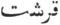

  
[Intangible Textual Heritage](../../index)  [Islam](../index.md) 
[Index](index)  [Previous](mes29)  [Next](mes31.md) 

------------------------------------------------------------------------

[Buy this Book at
Amazon.com](https://www.amazon.com/exec/obidos/ASIN/B002CVTTRU/internetsacredte.md)

------------------------------------------------------------------------

  
*The Mesnavi and The Acts of the Adepts*, by Jelal-'d-din Rumi and
Shemsu-'d-Din Ahmed, tr. by James W. Redhouse, \[1881\], at Intangible
Textual Heritage

------------------------------------------------------------------------

p. 254

### XV.

 

THE Prophet asked one morn of Zeyd, in tender tone, [1](#fn_375.md)  
"How art thou, dear disciple, faithful to the bone?"  
"I'm pious;—a believer," Zeyd replied; and he  
Inquired again: "What proof of faith resides in thee?"  
He said: "Whole days I've burnt with parching fever's thirst;  
By night I've watched; with love's sweet pangs my heart's nigh burst.  
Thus have I traversed days’ and nights’ enduring space,  
As point of spear through shield makes way in war's embrace.  
For, in love's view, the church of faith one body is;  
5 Ten million
years, one instant, are alike, when His.  
The past eternity and future join in one;  
Though reason cannot compass how the marvel's done."

The Prophet then: "Bring forth some souvenir from thence,  
Shall satisfy all men of judgment and of sense."  
Said Zeyd: "As men behold the sky above their heads,  
So I survey the heavens, and all their flowery meads.  
Eight paradises, [2](#fn_376.md) seven deep
hells, [3](#fn_377.md) are in my view,  
As patent as the idol to its silly crew.

p. 255

Apart, and one by one, I can discern all men,  
As wheat and barley well are known to miller's ken. 10  
I see who's heavenward bound, who takes the other road;  
As men distinguish fish from snake in walks abroad."

’Tis thus that saints, within the bounds of present life,  
See who'll be blessed, who cursed, when tried in judgment's strife;  
Before each soul contracts the sins will cause its shame;  
While yet in mother's womb,—while yet without a name.  
The wretch is he conceived for wretchedness’ sad thirst.  
Each soul is marked for future bliss or woe, at first. [1](#fn_378.md)  
The body, as a mother, bears within a soul.  
Death's but the throes that launch the spirit to its goal. 15  
Departed souls are all agog at each fresh birth,  
To see what class the new-born enters in its mirth.  
The blacks presume ’twill prove to be of their dark gang;  
The pale-faced Romans hope they'll profit by the pang.  
But when the little stranger shows itself at last,  
No room remains for doubt; the question's judged and cast.  
The new-born black is borne in triumph by its kind;  
The rosy-cheeked fair bantling's claimed by Roman mind.  
Until its birth the child's a riddle to all men.  
Who knows an unborn infant ’s rare sage in this glen. 20  
Unless, mayhap, he see with light divine's blest aid;  
For this can penetrate through densest shell e’er made.  
The life-conveying fluid's colourless and clear;  
But living men their various shades of colour bear.  
The soul sustains complexions in our mortal frames,  
Until our halves material find rest from their games.  
But turn we now away to other subjects, high;  
For fear events should leave us to regret and sigh.

p. 256

"When settling-day 'brings forth the colour of each face,' [1](#fn_379.md)  
25 Mankind are
separated sharply, race from race.  
Within the womb nor Turk, nor Hindū, yet is seen; [2](#fn_380.md)  
So soon as born, all, high and low, know what to ween.  
As in the day of judgment all men all will know,  
So now to me each man and woman forms a show.  
Say: Shall I all declare; or shall I hold my peace?"  
To this the Prophet in reply made motion: "Cease."  
"Ha! Prophet of the Lord! I'll tell that secret, all!  
To men I will declare the deeds of that dread hall!  
Permit me to tear off the veil that hides it now;  
30 My heart shall
light the world as sun in midday glow.  
I will eclipse that lamp, by giving out more light.  
I will set plainly forth the thorn and fig-tree right.  
Th’ events of judgment day I'll lay before all men.  
I'll separate the gold from spurious coin, as then.  
They of the left hand shall be maimed to public view, [3](#fn_381.md)  
And all shall then the fruits of misbelief eschew.  
I will expose the seven pits of wrath divine, [4](#fn_382.md)  
By aid of light from truth's great luminary's shine.  
I'll rend away the rags that veil the wicked's shame.  
35 I'll sound the
trump, that all may hear the Prophet's name.  
Hell, heaven, the gulf between, I'll set before men's eyes,  
That misbelievers may be warned of error's dyes.  
The fountain of 'Kawthar' shall throw its highest jet; [5](#fn_383.md)  
Its rush shall greet their ears, its spray their faces wet.  
They who will flock around it, burning with fierce thirst,  
I'll make apparent unto all, from last to first.  
Their shoulders jostle ’gainst my shoulders in the crowd;  
Their shrieks are sounding in my ears, as thunder loud.

p. 257

While heaven's citizens, rejoicing with delight,  
Hug one another lovingly, to glad my sight. 40  
They visit one another's thrones, high rapture's seats;  
They kiss each other fondly; each all others greets.  
My ears grow deaf through listening to those cries of grief,  
And sorrow's anguish from the lips where sin sat chief.  
These are slight indications; much more could I say;  
1 pause; the Prophet's wearied; cease from speech I may."

Thus spake the Prophet's servant, in delirious guise.  
The Prophet shook his collar,—sign of deep surprise.  
Then spake: "Rein in thy steed! He risks to run away  
Reflected Truth declares: 'God blushes not.' [1](#fn_384.md) Heyday! 45  
The mirror's fallen out from its protecting case!  
A mirror and a balance never truth debase!  
A mirror and a balance never facts conceal,  
Although some one be hurt by what they do reveal!  
The mirror and the balance tests are of my rule;  
Though for a thousand years thou serve it's strict formule.  
Hide not the truth from thought of deep respect for me.  
Show forth the whole, in full. Deficiency mayn't be.  
What is’t that tells thee: 'Play not, joke not with the truth?'  [2](#fn_385.md)  
The mirror, balance, God,—who smites falsehood with truth! 50  
Sure, God hath raised me up for that one sole intent,  
That through me truth be preached unto its full extent.  
Were this not so, what value's in me, valued friend?  
Did I become instructor, only good to mend?  
But shut thy mirror tight within its felten sack,  
If Sion's miracle's repeated in thy track."

Said Zeyd: "Can man e’er grasp beneath his feeble arm  
The sun of truth, eternal luminary, warm?

p. 258

’Twould burst his grasp asunder; all his wiles were vain,  
55 Though madness
he should add to reason in his brain!"

Replied the Prophet: "On thy eye thy finger place;  
The world is straight deprived of all the sun's bright face!  
A finger-tip suffices to blot out the moon;  
A symbol, this, of God's great sin-effacing boon.  
A point can cover up a whole world with its shade;  
The sun can be eclipsed by what's a mere monade.  
Shut close thy lips. Consider now the mighty sea.  
By God's command the ocean man's meek slave must be. [1](#fn_386.md)  
Ev’n as the fountains Selsabīl and Zenjabīl [2](#fn_387.md)  
60 Are given for
use of angels, Michael, Isrāfīl [3](#fn_388.md)  
The rivers four of paradise are at our beck;  
Not by our merit, but by God's constraining check.  
Where’er we will, they flow, obedient to our call;  
Like magical effect, magician's docile thrall.  
So also are our eyes, those founts of sentient beams,  
Subservient to our will, whichever way it streams.  
As we direct, they look; see what's like adder's sting;  
Or notice facts that to our minds their warnings bring.  
If so we will, they scrutinise objectiveness;  
65 As we desire,
they lend themselves to study dress.  
By our direction, universals are their bound;  
If so we wish, they prisoners are in partials’ ground.  
Each of the senses five acts thus but as a spout,  
To bring unto the mind that which it cares about.  
Whichever way the heart directs them forth to stroll,  
They turn, and glean a harvest for its pleasure sole.  
The hands and feet are servants to the heart's request,  
As Moses’ rod obedient was to his behest.  
At heart's desire, the feet begin the nimble dance,  
70 Or seek
advantage, or avoid some sore mischance.

p. 259

The heart commands, the hands to calculations fall;  
Should it prefer, they write a book or treatise small.  
A hand there is, ’twould seem, within these hands of ours;  
A hidden hand, that moves the body's wondrous powers.  
If that incites, this wages battle with the foe;  
Should that induce, this aids a friend to stand tiptoe.  
It pushes; straightway spoon's plunged into soup;  
It wills; a ponderous club forthwith attacks some group.  
What is it that the heart says to them all by turns?  
Most wonderful accord! Most marvellous alterns! 75  
The ancient seal of Solomon the heart has found!  
With that alone it guides the senses o’er their ground.  
Externally, five senses serve its high command;  
Internally, five faculties obey its hand.  
Ten senses, thus, seven organs, wait upon its wants;  
Besides a host of minor servants, confidants.  
As Solomon thou sittest, O heart! Thou reignest supreme!  
On fairy and on demon, set thy seal, thy scheme.  
In this thy realm be upright; practise thou no fraud;  
No demon, then, shall rob thee of thy seal, thy gaud. [1](#fn_389.md) 80  
The world shall learn thy name, shall practise all thy rites;  
Time and eternity remain thy perquisites.  
But should a demon carry off thy seal, perchance,  
Thy reign is o’er; thy fortune loses all advance.  
Thenceforward vain regret shall canker in thy breast,  
Until the day thou’rt called to thy account at last.  
Unless thy heart renounce all selfish use of wit,  
By mirror and by balance canst thou be held quit?"

Luqmān the sage, in presence of his noble lord, [2](#fn_390.md)  
Among the slaves and servants was a mere byword. 85

p. 260

The lord one day commanded; straight some slaves were sent  
To gather fruit from orchard for his throat's content.  
With them did Luqmān go, as parasite to feast,  
Brimful of wisdom, black as night, a negro beast.  
Their labour o’er, the slaves lay down to rest awhile;  
The fruit they tasted, tasted still, consumed the pile.  
Returning home, on Luqmān the whole blame they laid;  
His lord was angered mightily at what they said.  
Luqmān inquired the cause of this estrangement keen.  
90 The lord gave
vent in loud abuse to his roused spleen.  
Said Luqmān: "Lord, I swear by God's most holy name,  
Dishonest servant ne’er can hope for aught but blame.  
Make proof of us. ’Tis easy. Lord thou art of all.  
Command. We'll drink our fill of water hot as gall.  
Then make us run about within the meadow's bound.  
On horseback thou, on foot we, ’ll all trudge quickly round.  
Thou soon shalt witness sights to show 'the milk who spilt.'  
Hearts’ secrets’ Great Revealer will disclose the guilt."

Their lord so ordered. Scalding water soon was sought.  
95 Each had to
drink his fill, as hot as could be brought.  
Then all were made to run as fast as they could tear,  
All up and down the meadow, as their legs could bear.  
Now lo! What happens? Sickness on them, each, soon falls;  
To vomit they're constrained, with starting of eyeballs.  
The stolen fruit contained within their stomach's sack,  
The water's stimulus compelled them to give back.

p. 261

When Luqmān's turn was come to cast up his accounts,  
Clear water was the only issue from his founts.  
Luqmān's philosophy this trial could evolve;  
God's wisdom far abstruser riddles will resolve. 100  
"The day when our hearts’ secrets shall be all revealed,"  
Man's secret foe in ambush shall not lie concealed.  
Hell's victims, then, shall taste of scalding water's pang;  
And all veils be torn off from sins they overhang.  
Hell-fire's decreed to be the lot of misbelief;  
Since fire the ordeal is by which stones come to grief.

How often have we spoken to those hearts of stone,  
In softest accents of advice! They would hear none!  
To foulest ulcer, sharpest remedy's applied.  
The teeth of dogs alone are fit for ass's hide. 105  
"Filth to the filthy" is philosophy right sound.  
"Birds of a feather flock together" goes its round.  
What mates soever for thyself thou choose at last,  
Their habits and their qualities acquire thou fast.  
Wouldst glory have? To glory must thou raise pretence.  
Wouldst it reject? Think well; and take thy road from thence.  
Wouldst find a way out of this dismal dungeon vile?  
Submit to God; bow down in worship with a smile.  
Again we'll turn. Again we'll hear what Zeyd may say;  
What road he'll follow, on his steed, in reason's way. 110  
When reason sets itself t’ expose the faults of men,  
It pulls aside the veils that hide them from our ken.  
God sometimes wills that actions should concealed remain,  
Drives reason's drum away, forbids its noisy strain.

Loose not thy tongue alone; it bridle; hidden's best.  
Let each be happy in his own opinion's zest.  
God wills that they who might despair to win His grace,  
Shall persevere, not slacken, in their worship's pace

p. 262

That they may seek a hopeful one, and him ensue;—  
115 In his
society may follow worship's clue.  
God wishes that His peace should light upon us all;  
That His salvation should embrace good, bad, great, small.  
That princes and that captives all should turn their face,  
In hope and fear, up heavenward, looking for His grace.

That hope and fear are nourished by a curtain's shade.  
’Tis through uncertainty that hope and fear invade.  
But tear away that veil; where then are hope and fear?  
’Tis veiledness lends interest to landscapes drear.  
Upon a river's bank a youth, who chanced to spy  
120 A fisherman
at work, guessed: "Solomon, surely! [1](#fn_391.md)  
If he it be, why here, in secret and alone?  
If not, whence come those features, fit to grace a throne?"  
So he remained in doubt, ’twixt two opinions tossed,  
Till Solomon recovered all the power he'd lost.

The foul usurping demon fled the royal state;  
The king's avenging sword pursued and sealed his fate.  
The signet-ring of power once more on royal hand,  
The demons and the fairies flocked to his command.  
Mankind came crowding to his court, by levee swelled;  
125 Among them
came the youth who'd that opinion held.  
He saw the signet-ring. This sufficed. Doubt was past.  
No room was left for surmise. All was clear at last.

Opinion may be formed of what's behind a veil.  
Conjecture lends its aid where knowledge ‘gins to fail.  
Conjecture's potent when the subject's hid from view.  
Let it be visible; no surmise can we brew.  
Although the sky of light is not without its rain,  
The earth of darkness, too, produces plants and grain.

p. 263

I love that text: "They who believe what is not seen." [1](#fn_392.md)  
Thence have I closed my eyes, the body's windows keen. 130  
But should I cleave the firmament with my swift glance,  
Could I exclaim: "Perceivest thou a flaw, perchance?" [2](#fn_393.md)  
To scrutinise what's hid behind the darkness’ screen,  
Each man his method chooses; guesses what's between.  
A certain space of time confusion reigns supreme.  
The robbers hang the magistrates by their own scheme,  
Until at length a Chief, blessed with a genius rare,  
Springs up to serve his servants; all their troubles share. [3](#fn_394.md)

To render secret service is a thing beloved.  
To hide a service rendered adds to what's approved. 135  
What's he, commends his king with lies before his face,  
And in his absence needs lament his lack of grace?

The warden of a castle on the marches laid,  
Far from his sovereign, distant from much-needed aid,  
Defends his post with valour from beleaguering foe,  
Disdains to be bought over, scorns the tempter's moe.  
His station's on a frontier, no eye sees him act;  
To duty true, he honestly fulfils his pact.  
Then in his monarch's presence honours due he gains,  
Above the brave men fighting in the royal trains. 140  
More merit's in a little secret service given,  
Than in much more performed when by an eye it's driven.

Man's faith and piety on earth are prized of God.  
But after death professed, less value have than clod.  
The absent and the hidden being thus the best,  
The silent mouth and sealed lip surpass the rest.  
Then boast not, brother; whatsoever thou hast done,  
God knows thy merits; will requite them every one.

p. 264

The sun requires no other witness but his face.  
145 Man has a
greater. God's his witness. Vast the grace!  
If I proclaim it not, how many are prepared  
To witness to each fact! God, angels, men, full wared.  
"God will bear witness, angels, and all they who've known," [1](#fn_395.md)  
That: "Lord there is no other, save th’ Eternal One." [2](#fn_396.md)  
When God himself our witness is, who'll angels need,  
That they should share, participate, in His sole deed?  
Unless it be that, as the fervent, blazing sun,  
Pours forth such beams no mortal eye can look upon.  
Just like the bat, man cannot bear full light of day;  
150 So, in
despair, he seeks the darkness, shuns noon's ray.

Thus, like us, know, the angels are a loving crew,  
Who bask in beams of heaven's Sun, beyond our view.  
They say: "Our light we have received from a sun;  
As substitutes we shine upon the weak, outrun."  
As new-born moon, or five days old, or at the full,  
Each angel has his rank, degree, place, wonderful.  
His glorious wings in pairs, two, three, and even, four; [3](#fn_397.md)  
So that his beams are doubled, trebled, fourfold, more.  
Just like the grades that mark the various human minds,  
155 Do
differences vast exist in angels’ kinds.  
Thus every man's companion-angel's like himself,  
Or good, or bad, or high, or low, as china, delf.  
When weak-eyed mortals cannot look upon the sun,  
They have to seek for taper's aid, ere they may run.  
The Prophet hath declared: "Stars, my disciples are;  
They're lights to them who seek; though devils they may scare."  
If every man had strength, and faculty of sight,  
To look straight at the sun, trust him alone for light,

p. 265

What need were for the stars, or lamps, of feeble ray,  
To help them on their path, in quest of source of day? 160

The moon declares to man, as do the clouds, the shade,  
"I, too, ’d been human, but for revelation made. [1](#fn_398.md)  
Like you, I had been darksome, as within, without.  
But revelation gave me sunlight, shade to rout.  
Compared with the sun, I'm darksome as a cloud;  
Compared with men's dark bosoms, I may well be proud.  
I shed a feeble light, that men may bear my beams,  
He cannot look upon the sun's too ardent streams.  
I've mixed with honey vinegar; made oxymel;  
A remedy to bring to man's diseases fell." 165

Art rid of thy disease, my friend? Then set aside  
The vinegar. Rejoice thy soul with honey's tide.  
When freed from lusts, the heart of man in full health shines.  
God said: "The Merciful on heaven's high throne reclines." [2](#fn_399.md)  
God rules the heart direct, free from all means to aid,  
So soon as it is purged from dross that low it laid.  
We'll now go back to Zeyd, and proffer him advice;  
We'll warn him not to risk dishonour, paltering's price.

Thou shalt not Zeyd now find; he's surely run away,  
He's clean absconded by the door; had naught to say. 170  
Had’st thou been Zeyd, like him thou’dst lost been in a maze;  
As stars die out when sunlight sets the skies ablaze.  
E’en as no track points out where was galaxy's place;  
Thou’lt find no signs of Zeyd, no footstep, sign, or trace.

Our senses falter, all our reasoning is lost,  
In splendour of the wisdom of th’ All-Ruling Ghost.

p. 266

Men's senses, and their reasons, must be shut within,  
"In waves when all before us to appear begin." [1](#fn_400.md)  
When night returns, the sky again a court appears,  
175 The hidden
stars shine forth, and mark the rolling years.  
The senseless dead unto, will God their wits restore;  
In circles, like attendants, Him they'll stand before.  
They'll foot the dance, they'll spread their hands, they'll shout His
praise;  
They'll sing their song: "Thou, Lord, us from the dead didst raise."  
Their mortal skins and bones they'll shake off in the earth;  
On angel-wings they'll ride, and whirlwind-dust call forth.  
Their course they'll take from nullity to entity,  
In judgment day, ungrateful, grateful laity.

Why turn away thy head, pretend not to have seen?  
180 Hast thou
not, first, in nullity, a truant been?  
In nullity, so firm thou settedst down thy foot,  
And ask’dst: "Who shall remove me when I've taken root?"  
Dost thou not see the wondrous works of God's high will?  
How He it is who "leads thee by thy forelock" still? [2](#fn_401.md)  
He draws thee into states, conditions, turns of weal,  
That never entered in thy mind to seek with zeal.

Nonentity obedient is to His command.  
Of demon, and of Solomon, He rules the hand.  
A demon can contrive "the trays of fishpond size." [3](#fn_402.md)  
185 He dares not
make refusal these to organise.  
Contemplate now thyself in agony of fear;  
And know, nonentity, too, quakes His wrath to hear.  
Thou stretchest forth thy hand to seize preferment's place;  
From fear of thee, some soul itself must quick efface.  
All else but love of God, the Truest and the Best,  
Though sweet to thought, is but a snare to break thy rest.

p. 267

What's all thy effort worth? Thou hast to die at last;  
Put out thy hand and grasp the cup of life right fast.

Men fix their eyes on what is dust and ashes, death;  
Refuse belief in what is life and healthful breath. 190  
Exert thyself. Reduce thy doubts from ten to nine.  
Employ the night. Thou sleepest. Night's not so supine.  
Employ the night to seek the everlasting day,  
Increase in knowledge. Wisdom ’tis shall light thy way.  
Though night be dark, and darkness be of woe the doom,  
Much good is in it. Fount of Life's in land of gloom. [1](#fn_403.md)

How can a mortal hope to raise his head from sleep,  
When seeds of slothfulness are all he cares to reap?  
The dead man's sleep's the body-snatcher's open door.  
Householders slumber, robbers rifle every floor. 195  
Thou knowest not who are thy foes around thee placed.  
The imps of hell are enemies to man high graced.

The fire's the foe of water and of water's brood;  
As water's foe to fire, and drowns it in a flood.  
To water, and its cousins all, the fire swears death;  
To fire shall water never quarter give, or breath.  
’Tis water puts the fire out; and the reason's plain;  
The fire has mission to destroy the water's strain.

And then, the fire's the heat of passion's baneful lusts.  
And lust, the root of frailty, sin, misdeeds, mistrusts. 200  
Material, outer fire, ’s by water soon put out;  
The fire of lust may carry man to hell, no doubt.  
No water can avail to quench the flames of lust;  
For lust is hell-born. Torments end not; last they must.

p. 268

Religion's light, alone, can quench lust's fiercest flame,—  
The light that can put out the Syntheist's wicked game. [1](#fn_404.md)  
What can extinguish fire of sin, save light of God?  
My master, see that Abr’am's light be ne’er downtrod;  
That from the fire of lust, by inner Nimrod fanned, [2](#fn_405.md)  
205 Thy body may
escape; not be, as firewood, banned.  
The lust of man's desires cannot be driven forth;  
But may resisted be, reduced to what it's worth.  
So long as thou shalt fuel pile upon that flame,  
Canst thou expect the fire will die away and tame?  
So soon as fuel is withheld, a fire goes out;  
Through piety is lust brought down, and put to rout.  
Shall that sweet face e’er blacken through sin's dismal smoke,  
That's brightened by such sheen as virtue must invoke?

A conflagration raged in days of great ’Umer,  
210 Stones were
devoured therein, as firewood in the air. [3](#fn_406.md)  
The buildings it consumed, and left whole households waste;  
The nests and nestlings were destroyed;—last trump's foretaste.  
One half Medīna fell a prey to ruthless flame,  
Whereat th’ aqueous element might well feel shame.  
Whole cisterns were exhausted in the combat wild;  
And vinegar was added. Hope was thus beguiled.  
The fire grew fiercer under stimulus of strife;  
Extension gave it wings, success infused new life.

The people now came flocking to the Caliph's gate,  
215 In marvel,
that, through water, fire would not abate.

p. 269

He told them that the fire burnt by divine command;  
That all those flames arose from their too frugal hand:  
"What use are water, vinegar? Distribute bread;  
Eschew cold avarice, if by me you'll be led."  
They answered: "Wide our doors stand open every day,  
We've ever lavish been; almsgiving is our play."

‘Umer replied: "In form and custom, bread you've given.  
But not from love of God. You're hands to dole were driven.  
'T was pride and ostentation led to your display;  
Not charity, not pity, sense of duty, say. 220  
Your riches are your seed. Cast not such seed to waste.  
Place not a sword in robber's hand with senseless haste.  
Distinction make ’twilit friend and foe to truth divine;  
Seek out God's saints, and leave them not to starve, to pine.  
You've spent your stuff upon your cherished kindred sole,  
And fancied stupidly you'd followed God's law whole." 223

------------------------------------------------------------------------

### Footnotes

[m254:1](mes30.htm#fr_376.md) Zeyd, son of Hāritha
and father of Usāma, the freedman and adopted son of Muhammed, one of
his most devoted disciples.

[m254:2](mes30.htm#fr_377.md) For the eight
paradises, see Tale xiv. dist. 74, p. [253](mes29.htm#page_m253.md).

[m254:3](mes30.htm#fr_378.md) The seven hells
are:—1. Jahannam; 2. Latzā; 3. Hutama; 4. Sa‘īr; 5. Jahīm; 6. Hāwiya; 7.
Saqar. All these names for Hell occur in the Qur’ān.

[m255:1](mes30.htm#fr_379.md) This is
predestination indeed. But does not our "vessels of wrath" come to about
the same thing, at least in some opinions?

[m256:1](mes30.htm#fr_380.md) Qur’ān iii. 102.

[m256:2](mes30.htm#fr_381.md) "Turk and Hindū" is
synonymous with "*fair and dark*."

[m256:3](mes30.htm#fr_382.md) "They of the left
hand," Qur’ān lix. 8; xc. 18.

[m256:4](mes30.htm#fr_383.md) " The seven pits of
hell" are named respectively: Jahannam, Latzā, Hutama, Sa‘īr, Jahīm,
Hāwiya, and Saqar, as above mentioned, p. [254](#page_m254.md), note
[3](#fn_377.md).

[m256:5](mes30.htm#fr_384.md) "Al-Kawthar," Qur’ān
cviii. 1, is variously explained, but probably means: *the great
multitude*, scil., *of mankind;* not "a fountain."

[m257:1](mes30.htm#fr_385.md) Qur’ān ii. 24.

[m257:2](mes30.htm#fr_386.md) Qur’ān ii. 231; and,
indirectly, in many texts.

[m258:1](mes30.htm#fr_387.md) Qur’ān xvi. 4; xl.
23.

[m258:2](mes30.htm#fr_388.md) Qur’ān lxxvi. 17,
18.

[m258:3](mes30.htm#fr_389.md) Michael is mentioned
in Qur’ān ii. 92; Gabriel is also there mentioned, and in two other
places; but no other angels by name.

[m259:1](mes30.htm#fr_390.md) Solomon was robbed
of his seal by a genie, and temporarily deprived of his kingdom.

[m259:2](mes30.htm#fr_391.md) Qur’ān xxxi. 12.
*Lokman*, the commonly received orthography, is doubly erroneous; the
first vowel of the name is *u*, the Italian *u*, the French *ou*, the
*oo* of our words p. 260 *foot*, *good*,
*wood;* not of *coot*, *moot*, *root*. Our *q* is, historically, the
only true representative of the Phenician letter that equally gave rise
to the Hebrew ‏ק‎, to the old Greek Q, to the Latin Q, and to the Arabic
ق as may be seen by comparing the letters in the last element of the
Arabian numeral alphabet, 
, with the Hebrew *Koph*, *Resh*, *Schin*, *Tau;*
with the Greek Q = 90, Ρ = 100, Σ = 200, Τ = 300; and with the Latin Q,
R, S, T. The proof is still more conclusive by comparing, in order, the
whole alphabets, as to positions, names, shapes, values in sound, and
numeral values.

[m262:1](mes30.htm#fr_392.md) Solomon, when
deprived of his kingdom, became a fisherman.

[m263:1](mes30.htm#fr_393.md) Qur’ān ii. 2. Our:
"*Credo, quia impossibile*."

[m263:2](mes30.htm#fr_394.md) Qur’ān lxvii. 3.

[m263:3](mes30.htm#fr_395.md) Muhammed is reported
to have said: "The prince of a people is their servant." This may be
compared with Matt. xi. 26 and 27.

[m264:1](mes30.htm#fr_396.md) Qur’ān iii. 16.

[m264:2](mes30.htm#fr_397.md) Qur’ān ii. 256.

[m264:3](mes30.htm#fr_398.md) Qur’ān xxxv. 4.

[m265:1](mes30.htm#fr_399.md) Qur’ān xxi. 108.

[m265:2](mes30.htm#fr_400.md) Qur’ān xx. 4.

[m266:1](mes30.htm#fr_401.md) Qur’ān xxxvi. 53.

[m266:2](mes30.htm#fr_402.md) Qur’ān xi. 59.

[m266:3](mes30.htm#fr_403.md) Qur’ān xxxiv. 12.

[m267:1](mes30.htm#fr_404.md) See the Translator's
"Turkish Poetry" (p. 32 or 45), 1879; published by Trübner & Co.,
Ludgate fill, London, e.c.

[m268:1](mes30.htm#fr_405.md) Qur’ān ix. 32; lxi.
8. The expression " polytheist," generally used by translators to render
the meaning of the Arabic "*mushrik*," is not correct; to attribute one
"partner" to God is as much "*shirk*" as to attribute many. See note in
[p. 36](mes06.htm#page_36.md), Tale iii.

[m268:2](mes30.htm#fr_406.md) Qur’ān xxi. 68, 69,
alludes to this.

[m268:3](mes30.htm#fr_407.md) Qur’ān ii. 22; lxvi.
6.

------------------------------------------------------------------------

[Next: XVI. ‘Alī's Forbearance](mes31.md)
