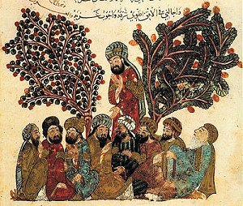

  
[Intangible Textual Heritage](../../index)  [Islam](../index.md) 

------------------------------------------------------------------------

<table width="75%">
<colgroup>
<col style="width: 50%" />
<col style="width: 50%" />
</colgroup>
<tbody>
<tr class="odd">
<td width="50%" data-valign="TOP"></td>
<td width="50%" data-valign="CENTER"><h1 id="the-maqámát-of-badí-al-zamán-al-hamadhání" data-align="CENTER">The Maqámát 
of Badí‘ al-Zamán 
al-Hamadhání</h1>
<h3 id="translated-by-w.j.-prendergast" data-align="CENTER">translated by W.J. Prendergast</h3>
<h4 id="section" data-align="CENTER">[1915]</h4></td>
</tr>
</tbody>
</table>

------------------------------------------------------------------------

[Contents](#contents)    [Start Reading](mhm00.md)

------------------------------------------------------------------------

A Maqama (plural, Maqamat) is an Arabic rhymed prose literary form, with
short poetic passages. *Maqama* is from a root which means 'he stood,'
and in this case it means to stand in a literary discussion in order to
orate.

The two classical exponents of the Maqama were Hamadhani (967-1007), the
composer of this work, and the later and better-known Hariri
(1054-1122). Hamadhani was born in Hamadhan, the ancient Ecbatana, in
what is now Iran (to the southwest of Tehran) and spent his life as a
wandering scholar. The Maqamat of Hamadhani and Hariri have a similar
structure. They both consist of a series of unrelated episodes involving
a wandering narrator, and a trickster protagonist. In the Maqamat of
Hamadhani, the narrator is an alter ego of Hamadhani, a wandering
scholar named Isa ibn Hisham. In each tale, he encounters a mysterious
rogue named Abul-Fath al-Iskanderi.

Iskanderi wanders the earth, surviving on his wits and a silver tongue,
running scams, always one step ahead of an angry mob. Each story is a
small capsule description of a sometimes absurd predicament that the
characters find themselves in. Nonetheless the stories are often used as
framing for discourses on serious topics such as predestination, the
vanity of human life, and the inevitability of death and judgement. The
work brings to mind Jack Kerouac's [On the
Road](https://www.amazon.com/exec/obidos/ASIN/0140283293/internetsacredte.md),
with its tales of Dharma bums wandering through a rich and morally
ambiguous land, and the interaction between the Sal Paradise/Dean
Moriarty characters.

The Maqamat presents a vivid street-level view of the medieval Islamic
countries at the height of their power and culture. We meet merchants,
clerics, peasants, sultans, scholars, and, literally, an entire [catalog
of swindlers](mhm38.md). We get to visit fabled cities of Iraq, Iran,
Arabia, Yemen, and other middle eastern locations. Some of these will be
familiar from the headlines: Mosul, Basra, Samara, and Baghdad, (which
Hamadhani calls 'The City of Peace').

Production notes: This translation is very rare, and to my knowledge has
never been reprinted. Because the text is rich with allusions that would
be difficult to grasp without the footnotes, I included all of the
apparatus. Due to the limits of current scanning technology, I had to
omit text in the Arabic alphabet, with a few exceptions. The omitted
passages and words in the Arabic alphabet are indicated by the ellipsis
character in green (…). This text uses Unicode extensively, so if you
have trouble viewing it, please refer to the [Unicode
page](../../unicode.md).

------------------------------------------------------------------------

 [Title Page](mhm00.md)  
[Preface](mhm01.md)  
[Errata](mhm02.md)  
[Contents](mhm03.md)  

### Introduction

[I. Life of the Author](mhm04.md)  
[II. Rhymed Prose](mhm05.md)  
[III. The Word Maqáma](mhm06.md)  
[IV. Origin And Character of the Maqamat](mhm07.md)  
[V. Hamadhání and Ḥarírí Compared](mhm08.md)  

### The Maqámát

[I. The Maqáma of Poesie](mhm09.md)  
[II. The Maqáma of the Date](mhm10.md)  
[III. The Maqáma of Balkh](mhm11.md)  
[IV. The Maqáma of Sijistán](mhm12.md)  
[V. The Maqáma of Kúfa](mhm13.md)  
[VI. The Maqáma of the Lion](mhm14.md)  
[VII. The Maqáma of Ghailan](mhm15.md)  
[VIII. The Maqama of Adharbayján](mhm16.md)  
[IX. The Maqáma of Jurjan](mhm17.md)  
[X. The Maqámá of Isfahan](mhm18.md)  
[XI. The Maqáma of Ahwaz](mhm19.md)  
[XII. The Maqáma of Baghdad](mhm20.md)  
[XIII. The Maqáma of Basra](mhm21.md)  
[XIV. The Maqáma of Al-Fazára](mhm22.md)  
[XV. The Maqáma of Jáḥiz](mhm23.md)  
[XVI. The Maqáma of the Blind](mhm24.md)  
[XVII. The Maqáma of Bukhára](mhm25.md)  
[XVIII. The Maqama of Qazwín](mhm26.md)  
[XIX. The Maqama of Sásán](mhm27.md)  
[XX. The Maqama of the Ape](mhm28.md)  
[XXI. The Maqama of Moṣul](mhm29.md)  
[XXII. The Maqáma of the Maḍirah](mhm30.md)  
[XXIII. The Maqama of the Amulet](mhm31.md)  
[XXIV. The Maqama of the Asylum](mhm32.md)  
[XXV. The Maqáma of the Famine](mhm33.md)  
[XXVI. The Maqáma of the Exhortation](mhm34.md)  
[XXVII. The Maqáma of Al-Aswad](mhm35.md)  
[XXVIII. The Maqama of ‘Iráq](mhm36.md)  
[XXIX. The Maqáma of Ḥamdán](mhm37.md)  
[XXX. The Maqama of Ruṣáfa](mhm38.md)  
[XXXI. The Maqáma of the Spindle](mhm39.md)  
[XXXII. The Maqáma of Shiráz](mhm40.md)  
[XXXIII. The Maqáma of Ḥulwán](mhm41.md)  
[XXXIV. The Maqáma of Fresh Butter](mhm42.md)  
[XXXV. The Maqama of Iblís](mhm43.md)  
[XXXVI. The Maqáma of Armenia](mhm44.md)  
[XXXVII. The Maqama of the Nájim](mhm45.md)  
[XXXVIII. The Maqáma of Khalaf](mhm46.md)  
[XXXIX. The Maqáma of Nishapur](mhm47.md)  
[XL. The Maqáma of Knowledge](mhm48.md)  
[XLI. The Maqama of Advice](mhm49.md)  
[XLII. The Maqáma of Ṣaimara](mhm50.md)  
[XLIII. The Maqáma of the Dinar](mhm51.md)  
[XLIV. The Maqáma of Poetry](mhm52.md)  
[XLV. The Maqáma of Kings](mhm53.md)  
[XLVI. The Maqama of the Yellow](mhm54.md)  
[XLVII. The Maqama of Sariah](mhm55.md)  
[XLVIII. Maqama of Tamín](mhm56.md)  
[XLIX. The Maqáma of Wine](mhm57.md)  
[L. The Maqáma of the Quest](mhm58.md)  
[LI. The Maqáma of Bishr](mhm59.md)  
