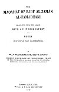
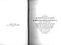
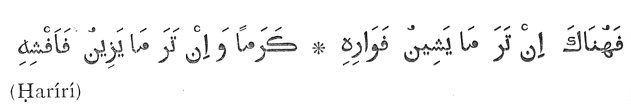

  
[Intangible Textual Heritage](../../index)  [Islam](../index.md) 
[Index](index)  [Next](mhm01.md) 

------------------------------------------------------------------------

The Maqámát of Badí‘ al-Zamán al-Hamadhání, tr. W.J. Prendergast
\[1915\] at Intangible Textual Heritage

------------------------------------------------------------------------

p. i

p. ii

THE MAQÁMÁT OF BADÍ‘ AL-ZAMÁN AL-HAMADHÁNÍ

p. iii

# THE MAQÁMÁT OF BADÍ‘ AL-ZAMÁN AL-HAMADHÁNÍ

###### TRANSLATED FROM THE ARABIC

### WITH AN INTRODUCTION

###### AND

### NOTES

##### HISTORICAL AND GRAMMATICAL

###### BY

## W. J. PRENDERGAST, BḶITT. (OXON.)

###### DEGREE OF HONOUR ARABIC AND PERSIAN; MṚ.AṢ.; FELLOW OF THE UNIVERSITY OF MADRAS; DIRECTOR OF ORIENTAL LANGUAGES, NIZAM COLLEGE, HYDERABAD, DECCAN

#### LONDON: LUZAC & Co.

#### MADRAS: S. P. C. K. DEPOSITORY

#### \[1915\]

Scanned at Intangible Textual Heritage, June 2006. Proofed and formatted
by John Bruno Hare. This text is in the public domain in the United
States because it was published prior to January 1st, 1923. These files
may be used for any non-commercial purpose provided this notice of
attribution is left intact in all copies.

[  
Click to enlarge](img/title.jpg.md)  
Title Page  

[  
Click to enlarge](img/verso.jpg.md)  
Verso  

p. iv

PRINTED AT THE  
S.P.C.K. PRESS, VEPERY, MADRAS  
1915

p. v

TO

HIS HIGHNESS

ASAF JAH MUZAFFAR-UL-MÚLK WAL MUMÁLIK,

NIZÁM-ÚL-MÚLK, NIZÁM-ÚD-DAULA NAWAB MIR

**SIR OSMAN ALI KHAN, BAHADUR, FATEḤ JUNG, G.C.S.I.**,

NIZAM OF HYDERABAD

THE TRANSLATOR DEDICATES WITH PROFOUND  
RESPECT AND DEEP GRATITUDE THIS WORK  
WHICH OWES ITS INCEPTION AND COMPLETION  
TO THE GENEROUS ENCOURAGEMENT  
AND GRACIOUS APPRECIATION OF  
ORIENTAL STUDIES ALWAYS  
SHOWN BY HIS HIGHNESS  
AND HIS HIGHNESS’  
GOVERNMENT

p. vi

 

------------------------------------------------------------------------

[Next: Preface](mhm01.md)
