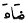
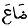

  
[Intangible Textual Heritage](../../index)  [Islam](../index) 
[Index](index)  [Previous](mhm35)  [Next](mhm37) 

------------------------------------------------------------------------

The Maqámát of Badí‘ al-Zamán al-Hamadhání, tr. W.J. Prendergast
\[1915\] at Intangible Textual Heritage

------------------------------------------------------------------------

### XXVIII. THE MAQAMA OF ‘IRAQ [2](#fn_670)

‘ÍSÁ IBN HISHÁM related to us and said: I travelled about the world till
I reached ‘Iráq. I had turned over the pages of the *díwáns* of the
poets until I thought to myself I had not left in my quiver a victorious
shaft. And I alighted at Baghdad. [3](#fn_671)
Now, while I was on the river bank, there suddenly appeared before me a
youth in worn-out garments begging from the people who disappointed him.
Now his eloquence astonished me, so I arose, went to him and asked him
of his origin and home. So he said: 'I am of ‘Abs [4](#fn_672) origin, and Alexandria is my home.' I
said: 'What is this language and whence this eloquence?' He replied:
'From knowledge whose refractoriness I have subdued and into whose seas
I have plunged.' I asked: 'With which of the sciences art thou adorned?'
He said: 'I have an arrow in every quiver. Which of them dost thou like
best?' I replied: 'Poetry.' He said: 'Have the Arabs uttered a verse
which cannot be paraphrased? Have they composed a eulogy whose subject
is unknown? Have they a verse unseemly in original intent but is made
proper by punctuation? What

p. 114

verse is it whose tears cease not to flow? What verse is it whose fall
is heavy? What verse is it the last foot of whose first half verse
wounds, and the final foot of whose second half heals? What verse is it
whose intimidation is formidable and whose subject is insignificant?
What verse is more sandy than the desert? What verse is like the mouth
of the person with pearly teeth and a serrated saw? What verse is it
whose beginning pleases and whose end displeases thee? What verse is it
whose interior slaps thee and whose exterior deceives thee? What verse
is it whose hearer is not sure until the whole of it is mentioned? What
verse is it that cannot be touched? What verse is it whose transposition
is easy? What verse is longer than its fellow, as though it were not of
its kind? What verse is rendered contemptible by a letter and
established by the omission thereof?' Said ‘Ísá ibn Hishám: 'By Heavens!
I did not venture to reply to him [1](#fn_673)
and I was not guided to a right answer other than 'I know not.'

He said: 'And what thou knowest not is yet more.' So I said: 'How is it
that with this excellence thou consentest to this base livelihood?' He
recited:--

'A plague on this age for an age, [2](#fn_674)  
Marvellous are the courses of its affairs.  
It is inimical to every man of culture,  
As though culture were guilty of an impropriety with its mother.'

Then I caused my eye to move over him and I looked again at his face and
lo! it was Abú’l-Fatḥ al-Iskanderí. I said: God prosper thee! and raise
thee up when thou fallest! [3](#fn_675) If thou
dost think fit to oblige me with a commentary on what thou hast sent
down, [4](#fn_676) and with a full explanation
of what thou hast epitomized, thou wilt do so.' He said: 'This is the

p. 115

explanation: As for the verse that cannot be paraphrased [1](#fn_677) there are many. An example of it is the
verse of al-A‘ashá  [2](#fn_678):--

'All our dirhems are good, [3](#fn_679)  
Delay us not therefore by testing them.'

As for the eulogy, whose subject is unknown, there are many. An example
of it is the saying of Al-Hudhallí:--

'I knew not who threw his cloak over him [4](#fn_680)  
Except that he was verily of illustrious and pure stock.'

But as for the verse which is unseemly in its original intent  [5](#fn_681), but is made proper by punctuation, it
is the verse of Abú Núwás  [6](#fn_682):--

'And we passed the night, [7](#fn_683) God
regarding us as the vilest company,  
Trailing the skirts of wickedness, and no boast.'

But as for the verse whose tears cease not to flow, it is the verse of
Dhú al-Rumma

'What aileth thine eye [8](#fn_684) that water
poureth therefrom  
As if it were kidneys split and running?'

For it comprehendeth either water, or an eye, or pouring, or urine, or a
cloud, or the bottom of a provision bag, or a split, or a torrent.

p. 116

But as for the verse whose fall is heavy. It is like the verse of Ibn
al-Rúmí [1](#fn_685):--

'When he gives [2](#fn_686) he makes not his
gift an obligation,  
And he says to my soul, O soul respite me:'

But as for the verse the last foot of whose first half verse wounds, and
the final foot of IN hose second half heals. It is like the verse of the
poet:--

'I advanced [3](#fn_687) with a glittering
mashrafí [4](#fn_688) sword;  
As one who shakes hands and approaches to greet.'

But as for the verse whose intimidation is formidable, but whose subject
is insignificant. An example of it is the verse of ‘Amr ibn
Kulthúm [5](#fn_689):--

'As though our swords, ours and theirs, [6](#fn_690)  
Were wooden blades in the hands of the players.'

But as for the verse which is more sandy [7](#fn_691) than the desert. It is like the verse of
Dhu al-Rumma

'Venturing upon [8](#fn_692) the vehement heat
of the pebbles, striking them with his foot.

p. 117

When the noonday sun revolves [1](#fn_693) as
though perplexed in its course.'

But as for the verse which is like the mouth of the person with pearly
teeth [2](#fn_694) or a serrated saw. It is
like the verse of al-A‘ashá:--

'I went betimes to the wine-shop [3](#fn_695)
while there followed me,  
A man, brisk, active, quickish, agile, rapid.'

But as for the verse whose beginning pleases but whose end displeases
thee. It is like the verse of Imr al-Qais:--

'Attacking, fleeing, advancing, retiring, simultaneously,  
Like a mass of rock hurled from a height [4](#fn_696) by the torrent.'

As for the verse whose interior slaps thee, and whose exterior deceives
thee. It is like the verse of the poet

'I reproached her, [5](#fn_697) she cried and
said, O youth,  
May the Lord of the empyrean deliver thee from my reproach.'

But as for the verse whose hearer is not sure until the whole of it is
mentioned. It is like the verse of Ṭarafa

'My companions, stopping their camels near me, [6](#fn_698)  
Saying, do not die of grief, but endure patiently.'

For the hearer imagines thou art reciting the verse of Imr al-Qais.

But as for the verse that cannot be touched. It is like the verse of
Al-Khubzuruzzí [7](#fn_699):--

p. 118

'The cloud of separation [1](#fn_700) has
cleared away from the moon of love,  
And the light of peace has risen from the darkness of reproach.'

And also like the verse of Abd Núwás:--

'The saffron-scented breeze [2](#fn_701) in a
watery garment,  
A stature of light upon etherial parchment.'

But as for the verse whose transposition is easy. It is like the verse
of Ḥassán [3](#fn_702):--

'Of fair countenances, [4](#fn_703) their
pedigrees are noble,  
Haughty, of the most noble extraction.'

But as for the verse which is longer than its fellow as though it were
not of its kind. It is like the folly of Al-Mutanabbí [5](#fn_704):--

'Enjoy, [6](#fn_705) live on, be exalted, be a
chief, be generous, be a leader, command, forbid, be manly, speak, be
asked, be angry, shoot, hit, protect, raid, take captive, terrify, stop,
give the blood-wit, govern, divert, obtain.'

But as for the verse which is rendered contemptible by a letter and
established by the omission thereof. It is like the verse of Abú
Núwás:--

p. 119

'My verse is lost upon your door [1](#fn_706)  
As pearls are lost on Khaliṣa. [2](#fn_707)

Or, like the verse of another:

'Verily the sentence which thou perceivest to be praise, [3](#fn_708)  
Was a sentence that  ![\[shone upon him /
was lost upon him\]](img/11900.jpg)  
That is to say when "lost" is read it is satire, but when "shone" is
recited, it is praise.'

Said ‘Ísá ibn Hishám: 'By Heavens! I was astonished at his discourse and
I gave him what would assist him against his changed condition. Then we
separated.'

------------------------------------------------------------------------

### Footnotes

[113:2](mhm36.htm#fr_670) *‘Iráq:* the name
applied since the Arab conquest in the seventh century to designate that
portion of the valley of the Tigris and the Euphrates known in older
literature as Babylonia. With the advent of the Arabs ‘Iráq entered on a
new period of prosperity, several important new cities were founded
Kúfa, Baṣra and Baghdad which became under the ‘Abbásid Khalífas not
only the capital of ‘Iráq, but, for a time, the metropolis of the world.
*Encyclopaedia Britannica*, xiv, 740; Yaqút, iii, 628.

[113:3](mhm36.htm#fr_671) *I alighted at
Baghdad:* Literally, Baghdad caused me to alight.

[113:4](mhm36.htm#fr_672) *‘Abs:* ‘Abs the name
of the tribe to which the poet ‘Antara belonged. This is the first time
the improvisor mentions his tribe.

[114:1](mhm36.htm#fr_673) *I did not venture to
rely to him:* Literally, I shuffled not a gaming arrow. An allusion to
the well-known game of meisar (…) forbidden by Islám. See Qur’án, v. 92.

[114:2](mhm36.htm#fr_674) *A plague on this for
an age:* Metre, *munsereḥ*.

[114:3](mhm36.htm#fr_675) *When thou fallest:*
Literally, thy falling.

[114:4](mhm36.htm#fr_676) *What thou hast sent
down:* That is what thou hast revealed like, as it were, the Qur’án
which is also called *Tanzíl* (…), the downsending.

[115:1](mhm36.htm#fr_677) *The verse that
cannot be paraphrased:* The point is that there is no way wherein the
first three words can be twisted so as to alter the metre e.g.:

…

See p. 225 of the text.

[115:2](mhm36.htm#fr_678) *Al-A‘ashá:* The
'sweet singer of the Arabs' (…) was a contemporary of Muḥammad (ob. A.H.
6 or 7). A life of this poet will be found in De Sacy, *Chrestomathie
Arabe*, ii, 471. See also *Aghání*, viii, pp. 74-84.

[115:3](mhm36.htm#fr_679) *All our dirhems are
good:* Metre, *mutaqárib*.

[115:4](mhm36.htm#fr_680) *I know not who threw
his cloak over him:* Metre, *tawíl*.

Abú Khirásh al-Hudhallí, the author of the elegy from which this line is
quoted, flourished during the Khalífate of ‘Umar ibn al-Khaṭṭáb.
*Ḥamása*, (edited by Freytag) pp. 365-6.

[115:5](mhm36.htm#fr_681) *The verse which is
unseemly in its original intent:* That is, if we take the verse to the
end of the sentence, as far as 'wickedness' it is unseemly, but it is
rendered seemly by the additional words, 'and no boast'.

[115:6](mhm36.htm#fr_682) *Abú Núwás:* born at
Ahwaz A.H. 145 and died at Baghdad A.H. 195, the well-known witty and
talented but profligate court poet of Harún al-Rashíd. Ibn Khallikan, i,
p. 391.

[115:7](mhm36.htm#fr_683) *And we passed tine
night:* Metre, *tawíl*.

[115:8](mhm36.htm#fr_684) *What aileth thine
eye:* Metre, [*basít*](errata.htm#7).

[116:1](mhm36.htm#fr_685) *Abú’l Ḥasan ‘Ali
ibis al-Rúmí* was born at Baghdad A.H. 221. This celebrated poet's
verses are admirable for their beauty of expression and originality of
thought. He was poisoned in A.H. 283, or 284 at Baghdad at the instance
of al-Qasim ibn ‘Ubeidalláh The Wazír of al-M‘utaḍid (A.H. 279-89). Ibn
Khallikan, ii, 297.

[116:2](mhm36.htm#fr_686) … *When he gives:*
The point as to weight is the repetition of the word *mann* (…) which
means 'he bestowed', and a certain weight which is generally considered
as equal to two pounds troy. Metre, *tawíl*.

[116:3](mhm36.htm#fr_687) *I advanced with a
glittering mashrafi sword:* Metre, *wáfir*.

[116:4](mhm36.htm#fr_688) Mashrafi: Belonging
to Mushárif the name of a collection of Arab villages near the
cultivated part of ‘Iráq. It is said that … was a blacksmith who made
swords (Lane). I think the word should be vocalized … See *Yaqút*, iv,
538.

[116:5](mhm36.htm#fr_689) *‘Amr ibn Kúlthúm:*
The author of one of the Mu‘allaqát (No. 6 in Lyall's edition).

[116:6](mhm36.htm#fr_690) *As though our
swords, ours and theirs:* Metre, *wáfir*.

[116:7](mhm36.htm#fr_691) *More sandy than the
desert:* The point here is the play on the word … literally sand, and
technically 'poetry lacking beauty and containing words which arc not
pleasing to the ear.' (Freytag's *Arabische Verskunst*, p. 530.) Note
the collection of *ḍáḍs* (ﺽ), the most difficult letter to pronounce in
the whole alphabet, in the first half verse.

[116:8](mhm36.htm#fr_692) … *venturing upon:*
Metre, *basít*. Literally, riding barebacked. In this verse the poet
refers to the insect called *Jundak*, a species of locust.

[117:1](mhm36.htm#fr_693) *Revolves:* The sun
does not seem to be inclining towards the horizon.

[117:2](mhm36.htm#fr_694) *Like the mouth of
the person with pearly teeth:* I have given preference to the meaning
derived from …, It glistened, e.g. … the front teeth glistened, to that
adopted by 'the commentator, namely, 'the teeth of the oppressed', which
does not yield a satisfactory sense. The point lies in the repetition of
the letter six times with its implied primary meaning, a tooth.

[117:3](mhm36.htm#fr_695) *I went betimes to
the wine-shop:* Metre, *basit*. Ibn Qutaiba criticises the poet for
introducing in this verse four synonyms for the word *active*. Sh‘ir wa
Shu‘ará, p. 12.

[117:4](mhm36.htm#fr_696) … *Like a mass of
rock hurled from a height:* The criticism is that the second half of the
verse does not suggest a horse under control ready 'to attack, retreat,
advance, or retire.'

[117:5](mhm36.htm#fr_697) *I reproached her:*
Metre, *kámil*.

[117:6](mhm36.htm#fr_698) *My companions
stopping their camels near me:* Metre, *tawíl*.

[117:7](mhm36.htm#fr_699) *Naṣr al-Khubzuruzzi*
(d. A.H. 317) the rice-bread baker was a native of Baṣra. This poet
could neither read nor write. He baked rice-bread in a shop p. 118 situated at the Mirbad of Baṣra and he used
to recite there to crowds of enthusiastic admirers, verses of his own,
all of them amatory. Ibn Khallikan, iii, 530; Yatíma, ii, 132.

[118:1](mhm36.htm#fr_700) *The cloud of
separation:* Metre, *tawíl*.

[118:2](mhm36.htm#fr_701) *The saffron scented
breeze:* Metre, *tawíl*.

[118:3](mhm36.htm#fr_702) *Ḥassán:* (ibn
Thábit) d. A.H. 54 was one of the poets that espoused the cause of
Muḥammad. He belonged to a family of poets and is said to have lived to
the great age of 120 years. His *Diwán* has been published by the
Trustees of the Gibb Memorial. Ibn Khallikan, iv, 259.

[118:4](mhm36.htm#fr_703) *Of fair
countenances:* Metre, *kámil*.

[118:5](mhm36.htm#fr_704) *Like the folly of
Mutanabbí:* Twenty-three imperatives in two lines! See diwan of
Mutanabbí, ed. by Dieterici, p. 495, and for an example of another
collection of fourteen imperatives, p. 493.

*Mutanabbi:* (A.H. 303-354). The well-known court poet of Saif Al Daula
is generally admitted to be the greatest of all Islámic poets. As the
poets of the Mu‘allaqát illustrated the spirit of the sons of the
desert, so does Mutanabbí represent the sentiments of the Muslim Arabs.
See *Yatíma*, i, 78; Browne, *Lit. Hist. of Persia*, i, 369; Nicholson,
*Lit. Hist. of the Arabs*, p. 304; Ibn Khallikan, i,102.

[118:6](mhm36.htm#fr_705) *Enjoy, live on,
etc.:* Metre, *ṭawíl*.

[119:1](mhm36.htm#fr_706) *My verse is lost
upon your door:* Metre,. *mutaqárib*.

[119:2](mhm36.htm#fr_707) *Khaliṣa:* An
extremely ill-favoured damsel of whom Harlan al-Rashid was passionately
fond. To compensate for her natural defects the Khalífa furnished her
with rich apparel and costly jewels. Abú Núwás became aware of this and
wrote these lines over her door. The damsel complained to Harún and Abú
Núwás was summoned to the presence of the Khalífa to explain his
presumptuous conduct. On his way to the audience-chamber he passed the
door over which the offending lines were written and erased the lower
curve of the *‘ain* so that only the upper one (ﺀ) the sign for *hamza*,
remained, so that the word read 
 shone, instead 
 was lost. (*Núfḥat al-Yemen*. Story 13.)

[119:3](mhm36.htm#fr_708) *Verily the
sentence:* Metre, *basít*. The letter *‘ain* is manipulated in a similar
manner in this line. See note 2 on Kháliṣá.

------------------------------------------------------------------------

[Next: XXIX. The Maqáma of Ḥamdán](mhm37)
