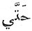

  
[Intangible Textual Heritage](../../index)  [Islam](../index.md) 
[Index](index)  [Previous](mhm50)  [Next](mhm52.md) 

------------------------------------------------------------------------

The Maqámát of Badí‘ al-Zamán al-Hamadhání, tr. W.J. Prendergast
\[1915\] at Intangible Textual Heritage

------------------------------------------------------------------------

### XLIII. THE MAQAMA OF THE DINAR

‘ÍSÁ IBN HISHÁM related to us and said: I happened to have made a vow to
give a dinar in charity to the greatest mendicant in Baghdad. I enquired
for him and I was directed to Abú’l Fatḥ al-Iskanderí. So I went to him
to bestow it upon him, and I found him amongst some companions who had
gathered in a circle around him. So I said: 'O sons of Sásán, which of
you knows his stock-in-trade best and is the sharpest in his art so that
I may give him this dinar?' Said al-Iskanderí: 'I am.' Another of the
company said: 'Nay, but I am.' Then they wrangled and disputed till I
said: 'Let each of you revile his fellow, then whoever gains the mastery
carries off the booty, and whoever overcomes takes the spoil.' [2](#fn_980.md) So al-Iskanderí said: 'O cold of the old
woman! [3](#fn_981.md) O sultriness of
Tammuz! [4](#fn_982.md) O

p. 165

filth of the goglet! [1](#fn_983.md) O non-current
dirhem! O conversation of the singers! [2](#fn_984.md) O unfortunate year! O unlucky star! O
oppression of the nightmare! [3](#fn_985.md) O
sick headache! O Ummú Ḥubein! [4](#fn_986.md) O
ophthalmia! O morning of separation! O estrangement of friends! O hour
of death! O scene of the martyrdom of al-Ḥusain! O burden of debt! O
mark of infamy! O ill-starred messenger! O banished for his meanness! O
porridge of garlic! O desert of the Zaqqum! [5](#fn_987.md) O refuser to lend the things of the
house! O year of the bubonic plague! O rebellious slave! O damnatory
clause! O oft-repeated speech! O worse than 
 (till) in various constructions! O worm of the privy!
O furred garment in the summer-quarters! O coughing of the host, when
the bread is broken! O belch of the intoxicated! O fetid breath of the
hawks! O peg of the tent! [6](#fn_988.md) O
prop [7](#fn_989.md) of the pot! O non-recurring
Wednesday! [8](#fn_990.md) O avarice of the
vanquished at dice! O grumbling of the tongue! O *lotium spadonis!* O
eating of the blind! O intercession of the naked! [9](#fn_991.md) O Saturday of the children! [10](#fn_992.md) O letter of condolence! [11](#fn_993.md) O pool of impurities! O

p. 166

stinginess of the man of Ahwaz! [1](#fn_994.md) O
garrulousness of the man of Rayy! [2](#fn_995.md)
By Heavens! if thou wert to place one of thy feet on Arwand [3](#fn_996.md) and the other on Demawand, [4](#fn_997.md) take in thy hand the rainbow and card
the clouds in the garments of the angels, thou wouldst only be a
wool-carder!'

Then said the other: 'O trainer of monkeys! O felt of the Jews! O fetid
breath of the lions! O non-entity in existence! O dog in strife! O
monkey on the carpet! O pumpkin with pulse! [5](#fn_998.md) O less than nothing! O fumes of
naphtha! [6](#fn_999.md) O stench of the armpit! O
decline of power! O halo of death! O viler than one to whom clings the
disgrace of divorce and refuses to return the marriage dowry! O mud of
the road! O water taken in the state of fasting! [7](#fn_1000.md) O shaker of the bone! [8](#fn_1001.md) O accelerator of digestion! O tartar
of the teeth! O filth of the ears! O tougher than the rope of cocoanut
fibre! O less than a *fals!* [9](#fn_1002.md) O
more traitorous than a tear! O more rebellious than a needle! O
direction of the boot! O landing-place of the palms! O the word 'would
that'! O leaking of the house! O such and

p. 167

such! [1](#fn_1003.md) By Heavens! wert thou to
place thy *seant* on the stars and extend thy feet to the limits of the
world, take Sirius as a boot and the Pleiades as a raiment, and wert to
make the sky a loom, weave the air into a coat, make its woof with the
Flying Vulture and weave it with the revolving sphere, thou wouldest be
but a weaver!' [2](#fn_1004.md)

Said ‘Ísá ibn Hishám: 'By Heavens! I did not know which of the two I
should prefer, for nought proceeded 'from them save marvellous language,
wonderful aptness, and intense enmity. So I left the dinar before them
undivided and I know not what Time did with them.'

------------------------------------------------------------------------

### Footnotes

[164:2](mhm51.htm#fr_980.md) … *Whoever overcomes
takes the spoil:* Freytag, *Arab Proverbs*, i, 677, Cf. Hebrew ‏בָן‎
spoil.

[164:3](mhm51.htm#fr_981.md) *Cold of the old
woman:* That is, the four last days of February and three first days of
March, thus called because they are the latter part (…) of winter.

[164:4](mhm51.htm#fr_982.md) *Tammuz:* The Syrian
month sacred in ancient times to the god of that name, corresponding to
July. This god is mentioned in Ezekiel, viii, 14.

[165:1](mhm51.htm#fr_983.md) … *Al-Kúz:* A
water-bottle, a goglet, arabicized from the Persian ….

[165:2](mhm51.htm#fr_984.md) *Conversation of the
singers:* Obviously it is the singing of the singers and not their
conversation that people want to hear.

[165:3](mhm51.htm#fr_985.md) … *Oppression of the
nightmare:* Some think this is not an Arabic word and that the proper
word is … (Lane, p. 2588). I see no difficulty, however, in evolving
this meaning from the root … he pressed or squeezed.

[165:4](mhm51.htm#fr_986.md) *Ummu Ḥubein:* A
species of stinking lizard.

[165:5](mhm51.htm#fr_987.md) *Zaqqum:* A certain
kind of tree having small leaves, evil-smelling and bitter, found in
Tehameh, also the name of the infernal tree whose fruit is the food of
the people of hell. See Baiḍáwí, ii, 172.

[165:6](mhm51.htm#fr_988.md) *O peg of the tent:*
Cf. more dishevelled than a tent peg. Freytag, *Arab Proverbs*, i, 706.

[165:7](mhm51.htm#fr_989.md) … *Prop:* Literally,
the handle of the upper millstone,

[165:8](mhm51.htm#fr_990.md) … *Non-recurring
Wednesday:* The unlucky Wednesdays of the month, to which this is an
allusion, are those which have the number four, e.g. the fourth or the
fourteenth of the month; the fourteenth or twenty-fourth, or the fourth
before the end of the month. Mas‘údí, *Les Prairies D’or*, iii, 422.
Freytag, *Arab Proverbs*, i, 276 and Meidaní (Bulak edition), i, 139,
when it comes at the end of the month.

[165:9](mhm51.htm#fr_991.md) *O intercession of
the naked:* That is, one who is so utterly destitute that he needs to
ask for himself, not for others. For the opposite sentiment, see
*Aghání*, viii, 182.

[165:10](mhm51.htm#fr_992.md) *O Saturday of the
children:* Succeeding the holiday on Friday, Cf. English school slang,
Black Monday.

[165:11](mhm51.htm#fr_993.md) *O letter of
condolence!* Because it is supposed to be a very difficult thing p. 166 to write if the deceased is not a near
relative, or because it is a painful thing for one who is bereaved to
read.

[166:1](mhm51.htm#fr_994.md) *Stinginess of the
man of Ahwaz:* The people of Ahwaz were notorious for their avarice,
stupidity and the vileness of their inclinations. Yaqút, i, 411, 12.

[166:2](mhm51.htm#fr_995.md) *Garrulousness of the
man of Rayy:* The word … also means meddlesomeness, or immoderation of
any kind, but I have not been able to find any evidence that the people
of Rayy were notorious for any of these things.

[166:3](mhm51.htm#fr_996.md) *Arwand:* or Elwand,
the Orontes of the ancients, at the foot of which lies the town of
Hamadhán.

[166:4](mhm51.htm#fr_997.md) *Demawand:* A
mountain north of Teheran. His feet would thus be more than two hundred
miles apart!

[166:5](mhm51.htm#fr_998.md) … *Pulse:* Arabicized
from the Persian … Sanskrit másha, peas.

[166:6](mhm51.htm#fr_999.md) *O fumes of
naphtha!:* Apparently a genuine Arabic word from …. It (water) welled or
issued forth, and … what oozes or exudes from a mountain as though it
were sweat from the sides of the rock. (Lane's Lexicon art. … p. 2759)
Cf. Greek ναφθα which is probably a loan word from Arabic.

[166:7](mhm51.htm#fr_1000.md) … *In a state of
fasting:* Anything eaten or drunk in a state of fasting. The text is
wrongly vocalized, for … read ….

[166:8](mhm51.htm#fr_1001.md) *Shaker of the
bone:* That is, ague.

[166:9](mhm51.htm#fr_1002.md) … *A fals:* A small
copper coin, the forty-eighth part of a dirhem, i.e. about half a
farthing. A loan word from Aramaic.

[167:1](mhm51.htm#fr_1003.md) *O such and such:*
Or 'so and so', referring to something too gross to mention. Cf.
*Ḥarírí*, p. 235, line 3., and see Wright's Grammar, i, 268.

[167:2](mhm51.htm#fr_1004.md) … *A weaver:* The
vocation of the weaver appears to have been regarded by the Arabs as a
degrading one. Cf. Letters, p. 273, 'Verily shaving is learnt on the
heads of the weavers ', also Yaqút, *Geographical Dictionary*, iv, 1036.
Cf. Ḥarírí, p. 31, on the subject of the dinar, and p. 628 for an
example of similar mutual abuse; also see Horace, *Satires*, Book I,
Satire 7.

This maqáma contains no poetry.

------------------------------------------------------------------------

[Next: XLIV. The Maqáma of Poetry](mhm52.md)
