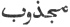
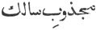
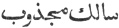
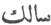
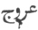
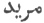
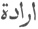

  
[Intangible Textual Heritage](../../index)  [Islam](../index) 
[Index](index)  [Previous](omy08)  [Next](omy10) 

------------------------------------------------------------------------

[Buy this Book at
Amazon.com](https://www.amazon.com/exec/obidos/ASIN/0766144569/internetsacredte)

------------------------------------------------------------------------

[Buy this Book on
Kindle](https://www.amazon.com/exec/obidos/ASIN/B002JTWO8Q/internetsacredte)

------------------------------------------------------------------------

  
*Oriental Mysticism*, by E.H. Palmer, \[1867\], at Intangible Textual
Heritage

------------------------------------------------------------------------

p. 19

### CHAPTER V.

#### CONCERNING ATTRACTION AND DEVOTION.

THE Sufis hold that there are three aids necessary to conduct the
Traveller on his path.

1\. Attraction; 2. Devotion; 3. Elevation.

Attraction is the act of God, who draws man Attraction. towards Himself. Man sets his face
towards this world, and is entangled in the love of wealth and dignity,
until the grace of God steps in and turns his heart towards God. The
tendency proceeding from God is called Attraction; that which proceeds
from man is called Inclination, Desire and Love. As the inclination
increases, its name changes, and Inclination
defined. it causes the Traveller to renounce everything else
becoming a Kiblah, to set his face towards God; when it has become his
Kiblah, and made him forget everything but God, it is developed into
Love.

Most men when they have attained this stage are content to pass their
lives therein, and leave the world without making further progress. Such
a person the Sufis call Attracted (
)

Others, however, proceed from this to self-examination, and pass the
rest of their lives in devotion. They are then called Devoutly Attracted
( ). If devotion be first
practised, and the attraction of God then step in, such a person is
called an Attracted Devotee (
). If he practise and complete devotion, but is not

p. 20

influenced by the attraction of God, he is called a Devotee ( ).

Sheikh Sheháb-uddín [1](#fn_6), in his work
entitled *’Awárif al Ma’árif*, says that an elder or teacher should be
selected from the second class alone; for although many may be estimable
and righteous, it is but few who are fit for such offices, or for the
education of disciples [2](#fn_7).

Devotion.Devotion is the prosecution of
the journey, and that in two ways, to God and in God. The first, the
Sufis say, has a limit; the second is boundless; the journey to God is
completed when the Traveller has attained to the knowledge of God; and
then commences the journey in God, which has for its object the
knowledge of the Nature and Attributes of God; a task which they confess
is not to be accomplished in so short a space as the lifetime of man.

The knowledge wisest men have shared  
  Of Thy great power and Thee  
Is less, when with Thyself compared,  
  Than one drop in a sea.

The Unitarians maintain that the journey to God is completed when the
Traveller has acknowledged that there is no existence save that of God;
the journey in God they explain to be a subsequent inquiry into the
mysteries of nature.

p. 21

The term Elevation or ascent (
) is almost Elevation or
Ascent. synonymous with Progress, and will be explained in that
part of the work which treats of the study of Man.

------------------------------------------------------------------------

### Footnotes

[20:1](omy09.htm#fr_6) Shiháb-ud-dín Abu Hafs
Omar bin Mohammed bin Abdallah, Soharawerdí, died A.D. 1106. See *Hajji
Khalfa*, Vol. IV. p. 275.

[20:2](omy09.htm#fr_7)   *muríd* is properly one who
possesses the Inclination 
 before mentioned.

------------------------------------------------------------------------

[Next: Chapter VI. Concerning Counsel](omy10)
