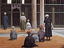

  
[Intangible Textual Heritage](../../index)  [Islam](../index) 
[Index](index)  [Previous](omy11)  [Next](omy13) 

------------------------------------------------------------------------

[Buy this Book at
Amazon.com](https://www.amazon.com/exec/obidos/ASIN/0766144569/internetsacredte)

------------------------------------------------------------------------

[Buy this Book on
Kindle](https://www.amazon.com/exec/obidos/ASIN/B002JTWO8Q/internetsacredte)

------------------------------------------------------------------------

  
*Oriental Mysticism*, by E.H. Palmer, \[1867\], at Intangible Textual
Heritage

------------------------------------------------------------------------

### CHAPTER II.

### CONCERNING THE ATTRIBUTES OF GOD.

SHEIKH Sadr-ud-dín Rúmí [1](#fn_10) affirms that
the Attributes The Distinction between Names and
Attributes investigated. and Names of God are convertible terms;
but Sheikh Sa’ad-ud-dín Hamawí [2](#fn_11)
maintains that the Corán and Hadís contain no synonymous words whatever,
and that it is incompatible with the character of a Sage to make use of
two or more expressions to convey a single meaning. According to him
Attributes are intrinsic and Names descriptive; the former relating to
the Nature, the latter to the Aspect of

p. 28

the being described. Works again relate to the Individuality. This is
the opinion generally received among the Súfís. Sheikh Sadr-ud-dín, on
the other hand, maintains that the Attributes of God are from one point
themselves the Nature of God, and are contrary to it from another. They
are themselves the Nature of God in this way, that where there is no
existence save His Nature, His Attributes must of necessity be His
Nature also. They are contrary to it in this way, that as things
understood are necessarily various, the names used to express them must
be various too, and must imply distinctions of meaning and idea. But all
distinction and divisibility is contrary to the Nature of God.

Classification of the Attributes.The names
applied to God, of Living, Eternal, Author or Disposer, and Omnipotent,
imply His Eternal and Abiding Nature; actual names according to the
Mohammedan theory having existed prior to their meanings [1](#fn_12). Such expressions therefore are the names
of the actual names, and are called Positive Attributes. These names are
called the four pillars of Divinity. Such names however as The Exalter
and Debaser, The Giver of Life and Death, refer to attendant powers, and
are called Relative Attributes. Lastly, such names as The Blameless, The
Holy One, The Independent One, relate to the absence of imperfection,
and are hence called Negative

p. 29

\[paragraph continues\] Attributes. All
the other names of God may be referred to one or other of these three
classes, except the name *Allah* itself [1](#fn_13), which comprises all Allah. The name the attributes of His Eternal
and Abiding Nature, for all the other names can be used to qualify it.
The name Merciful, occurring in the initiatory formula, "In the name of
God the Merciful, the Compassionate," is held in the next greatest
reverence, although referring to the outward attributes of God only. The
Corán says, "Say, Pray unto God (*Allah*), or pray unto the Merciful One
(*Ar Rahmán*). By whichsoever of the two names ye invoke Him it is
equal, for to Him belong the best of names." (Cor. cap. 17, v. 110.) All
these names collectively or individually indicate One and the same God.

------------------------------------------------------------------------

### Footnotes

[27:1](omy12.htm#fr_10) Also called El Kúnawi.
Vide *Hajji Khalfa*, ed. Flügel, Vol. I. p. 350, &c.

[27:2](omy12.htm#fr_11) Vide *Hajji Khalfa*,
Vol. III. pp. 78, 582.

[28:1](omy12.htm#fr_12) It must be borne in mind
that one of the principal dogmas of Islám is that the Corán was
preexistent to all created things, and by implication also the Arabic
language in which it is written, and to which the names above mentioned
belong.

[29:1](omy12.htm#fr_13) The name *Allah* is
abbreviated from *Al-Iláh*, "the God" *par excellence*.

------------------------------------------------------------------------

[Next: Chapter III. Concerning the Works of God, Physically
Considered](omy13)
