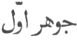
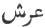

  
[Intangible Textual Heritage](../../index)  [Islam](../index) 
[Index](index)  [Previous](omy13)  [Next](omy15) 

------------------------------------------------------------------------

[Buy this Book at
Amazon.com](https://www.amazon.com/exec/obidos/ASIN/0766144569/internetsacredte)

------------------------------------------------------------------------

[Buy this Book on
Kindle](https://www.amazon.com/exec/obidos/ASIN/B002JTWO8Q/internetsacredte)

------------------------------------------------------------------------

  
*Oriental Mysticism*, by E.H. Palmer, \[1867\], at Intangible Textual
Heritage

------------------------------------------------------------------------

### CHAPTER IV.

#### CONCERNING THE WORKS OF GOD, METAPHYSICALLY CONSIDERED.

THE first thing that God created was the Primal The Primal Element. Element ( ), that is to say, the primal
element of the entire Universe. This according to the Corán He created
of Himself without any medium whatever, and in infinitely less space of
time than the twinkling of an eye. "And it was not the business of an
hour, but even as the twinkling of an eye, or quicker still." (Cor. cap.
16, v. 79.) [1](#fn_17) This Primal Element is
designated by various other names, such as the Primal Intelligence, the
Constructive Spirit, the Pen, the Mightiest Spirit, the Spirit of
Mohammed (or the Laudable Spirit), and the like. It is so excellent

p. 34

and subtle, that God alone knows its worth. It is the perfection of
wisdom and propinquity to God, is ever yearning after Him, and ever
present with Him; nor is there anything save this Primal Element that
can directly approach Him, or become the direct recipient of His bounty.

The Primal Element is God's world, and the Universe is the world of the
Primal Element. By this alone the Voice of God is heard, but its voice
is heard throughout the whole Universe, conveying the behests of the
Most High [1](#fn_18).

"The Pen."It is the Pen of God which at
His command wrote down the Simple Natures, and in the twinkling of an
eye they started into being, the Intelligences, Souls, Elements and
Natures, the Heavens and the Stars [2](#fn_19).
These then took up the task, and obeyed the second mandate by writing
down the compound bodies, and straightway the Mineral, Vegetable and
Animal Kingdoms sprung into existence.

This is the explanation of the words which begin the 68th Chapter of the
Corán: "N, by the Pen, and what they write." The mystic letter
represents the World of Power, the Inkstand [3](#fn_20) of God; the Pen is the Primal Element, and
"what they write" refers to the Simple Natures. These are the scribes of
God, and the words they write are the compound

p. 35

bodies of nature. They are writing even now, and will write on for ever;
for "were the sea ink it would not suffice for the words of my
Lord [1](#fn_21)." (Cor. cap. 18, v. 109.)

There are nine heavenly spheres, each higher than The Spheres. the preceding; the highest of all
is called the Heaven of Heavens, or the Throne of God ( ). Each of these spheres
possesses a Soul and an Intelligence, higher and more subtle in
proportion to their order. The Intelligence of the Heaven of Heavens is
called the Primal Intelligence, the Souls and Intelligences which occupy
the other eight are identical with the Cherubim and Spirits of the
religious account.

In point of time they precede the simple NaturesOrder Creation of above referred to, being
eternal, while the latter are casual; in point of mental excellence,
however, they rank after them. Their precedence over the Simple Natures
is as the precedence of the Sun's Orb over its rays. The next in order
of creation are the Threefold Offspring, *i.e.* the Mineral, Vegetable,
and Animal Kingdoms. Both the metaphysical and the physical account
agree concerning these last, that they are casual; but their account of
what are called the Parents [2](#fn_22) differs.

p. 36

Intelligence the beginning and the
end.Because man was the final object of creation, and because
when he has attained Intelligence he is complete, and because there is
nothing beyond Intelligence, and Primal Intelligence was also the
beginning of all things, *ergo*, Intelligence is the beginning and the
end, and the circle is complete. This is proved as follows; a circle is
traced by ascent and descent: descent is the attribute of the Simple
Nature, and ascent the attribute of Compound Bodies; descent resides in
Parents, ascent in Offspring; but both the Parents and the Offspring
originated with Primal Intelligence, therefore Intelligence is both the
beginning and the end, it refers alike to origin and return, to birth
and dissolution, it refers to the Night of Power [1](#fn_23), and to the Day of Resurrection. Again,
descent, the remoter it is from the origin, the coarser it becomes, and
ascent, the remoter it is from the origin, the more refined it becomes;
now the Primal Intelligence caused the descent of the lower world, and
the ascent of the higher; therefore the former is much coarser than the
latter; but they are still one and the same nature. But their nature
originated from the Nature of God, therefore the true conclusion is that
the Nature of God first was, and first returned, but was still the same
Nature of God. "From Him was the origin, and to Him is the return" (cf.
Cor. capp. 10, v. 4, &c.).

p. 37

Some say that the originator of the Intelligences Degrees of Intellgences in the higher world of
the lower world constitutes a tenth world, and call it the Intelligence
of the Lunar Sphere, the Active Intelligence, or the Bestower of Form.
Most philosophers, however, agree that there are ten Intelligences of
the higher world, all active and originators of the Intelligences and
souls of the lower world. The difference in the Intelligence of mankind
is occasion degrees of Intelligence among
mankind from this cause; Intelligences and Souls constitute the
higher world, and the fixed stars and planets are their administrators
in the lower world; through their influence, therefore, the differences
observable in mankind are in, proportion to the differences existing
between the various Souls and Intelligences of the higher world, and the
differences existing between the fixed stars and the planets themselves.
Now the various qualities of the last are innumerable; astrologers have
discovered some of the properties of the seven planets, but no one can
give any clue to those of the fixed stars.

Many of the differences of temperament observable Other Influences. among mankind are owing also
to the influence of the seasons; accident of birth, health, fortune,
longevity and the like again, are all considered as due to the influence
of the Higher World; the method and means by which this influence is
exerted is too mysterious and incomprehensible to be discussed.

In chapter 62, v. 7, of the Corán we find the The
treasuries of the Universe. words, "To God belong the treasuries
of the Heaven and the Earth;" these are then of two kinds, heavenly

p. 38

and earthly. To the first class belong the heavens and the stars, every
one of which is a treasury; to the second class of these treasuries
belong earth, air, fire, and water; every plant and every animal, nay,
every embryo, is a treasury in itself. "Verily there is nothing of which
the treasury is not with Us." (Cor. cap. 15, v. 21). The treasuries of
Heaven and Earth are countless; they may be called the Hosts of the
Lord, as the Corán has it, "Verily to God belong the Hosts of the
Heavens and the Earth." (Cor. cap. 48, v. 4.)

------------------------------------------------------------------------

### Footnotes

[33:1](omy14.htm#fr_17) This passage is
differently interpreted by the Arab commentators, and is made to refer
to "the business of the last hour;" see Sale's translation.

[34:1](omy14.htm#fr_18) Cf. Psalm xix. vv. 1-3.

[34:2](omy14.htm#fr_19) The first two and the
Heavens are denominated the Comptrollers: "and the Comptrollers for
command." (Cor. cap. 79, V. 5.)

[34:3](omy14.htm#fr_20) The letter N stands for
the word *nún*, which is not only the Arabic name of the letter, but
also signifies an inkhorn. Cf. AL BEIDHAWI'S commentary.

[35:1](omy14.htm#fr_21) This idea of the Primal
Element appears to have originated partly from a refinement on the
ordinary interpretation of the text; "When He willeth aught He but
sayeth to it, 'Be, and it is so'," where an undue significance is given
to the pronoun *it*.

[35:2](omy14.htm#fr_22) By these are meant the
"seven climes," or "zones," (into which, according to the Mohammedan
cosmography, the earth is divided), p. 36 and
the four elements. They are called *‘Abá i haftána*, "the sevenfold
sires," and *Ummát i Chahárgána*, "the fourfold mothers."

[36:1](omy14.htm#fr_23) The night on which the
command *Kun* went forth, it is equivalent to the Chaos of the Mosaic
cosmogony.

------------------------------------------------------------------------

[Next: Chapter V. Of the Four Universal Sources](omy15)
