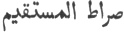

  
[Intangible Textual Heritage](../../index)  [Islam](../index) 
[Index](index)  [Previous](omy17)  [Next](omy19) 

------------------------------------------------------------------------

[Buy this Book at
Amazon.com](https://www.amazon.com/exec/obidos/ASIN/0766144569/internetsacredte)

------------------------------------------------------------------------

[Buy this Book on
Kindle](https://www.amazon.com/exec/obidos/ASIN/B002JTWO8Q/internetsacredte)

------------------------------------------------------------------------

  
*Oriental Mysticism*, by E.H. Palmer, \[1867\], at Intangible Textual
Heritage

------------------------------------------------------------------------

p. 50

# PART V.

#### THE STUDY OF MAN.

### CHAPTER I.

#### GROUNDS FOR THE DISCUSSION.

"Know thyself."LIKE the ancient sages the
Oriental Philosophers hold the maxim " Know thyself," to be one of vital
importance to the Traveller on the Road of Life. A considerable portion
therefore of their speculative treatises is invariably devoted to the
study of mankind.

ReligiousMuch difference of opinion exists
as to the point of view from which man is to be discussed; the religious
teachers asserting that since God created him from nothing he may be
considered as an actual being whose characteristics are capable of
diagnosis and definition.

and Metaphysical view of the question. The
metaphysicians, on the other hand, say that it is impossible for that
which is not, to be, or for that which is, not to be; they allow,
however, that that which is may assume various forms and manifest itself
in different ways, and prefer considering man as a particular
manifestation of the one Universal

p. 51

existence of God. Both however agree in the propriety of the discussion,
though upon different grounds.

Man constitutes the Lesser World, and everything Man, a world in himself. that is not man is
included in the Greater World; and since every thing in the Greater
World has its counterpart in the Lesser, the study of this is a duty
incumbent upon all who aspire to spiritual knowledge. To know oneself is
the "right way" ( ), for
guidance in which Mohammed besought God in his prayer, "Guide us into
the right way [1](#fn_29)." Self-knowledge is
the shortest road to the knowledge of God. When Ali asked Mohammed "What
am I to do that I may not waste my time?" the Prophet answered, "Learn
to know thyself."

------------------------------------------------------------------------

### Footnotes

[51:1](omy18.htm#fr_29) Corán, opening chapter,
v. 5.

------------------------------------------------------------------------

[Next: Chapter II. Of the Origin and Animal Development of Man](omy19)
