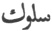
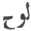
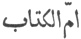
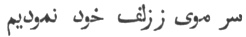

  
[Intangible Textual Heritage](../../index)  [Islam](../index.md) 
[Index](index)  [Previous](omy22)  [Next](omy24.md) 

------------------------------------------------------------------------

[Buy this Book at
Amazon.com](https://www.amazon.com/exec/obidos/ASIN/0766144569/internetsacredte.md)

------------------------------------------------------------------------

[Buy this Book on
Kindle](https://www.amazon.com/exec/obidos/ASIN/B002JTWO8Q/internetsacredte.md)

------------------------------------------------------------------------

  
*Oriental Mysticism*, by E.H. Palmer, \[1867\], at Intangible Textual
Heritage

------------------------------------------------------------------------

p. 68 p. 69

# APPENDIX.

### GLOSSARY

#### OF TECHNICAL AND ALLEGORICAL EXPRESSIONS IN USE AMONG THE SÚFÍ POETS.

(A. *Arabic*. P. *Persian*.)

For technical reasons, the Arabic script for each entry in the following
list has been omitted--JBH.

P. *abrú*. The eyebrow. The miracles of Moses.

A. *ijtimá’*. Collection. Man's sole desire being concentrated in a
longing after God.

A. *asfár*. Journeys. There are four journeys undertaken by the Súfí
Traveller, 1. The journey to God. See Part I. Chapter I. 2. The journey
to God whilst journeying in God. 3. The upward progress and actual
meeting with the Deity. 4. The journey to God whilst journeying from God
for the recovery of sinners.

A. *islám*. Islamism. Resignation. Submission to the decrees of God.

A. *alast*. "Art thou not?" The words uttered by the voice of God, "Art
thou not My creature?" See nidá.

A. *anáníyat*. Egotism.

p. 70

P. *angusht*. Finger. God's all-comprehending power.

A. *ímán*. Faith. Finding God.

P. *á’ïna*. Mirror. The human heart. Mirrors in the East were of metal,
hence the frequent occurrence of such expressions as "polish thy
mirror," meaning "purify thy heart."

P. *báda*. New wine. Divine love.

P. *bázú*. Arm. God's Will.

A. *bátil*. False. All that is not God.

P. *bámdád*. Morning. The last stage of the journey.

P. *but*. Idol. God as the object of contemplation.

P. *but parast*. Idol-worshipper. A contemplative devotee.

A. *baitu ’l harám*. The Holy of Holies. In Sufi poetry it represents
the Perfect Man.

A. *baitu ’l mucaddas*. The House of Holiness. Ordinarily used to
designate the Temple at Jerusalem, but in Sufiistic language, a heart
unpolluted by earthly love.

p. 71

P. *pákbází*. Purity. Inclination towards holiness without expecting
reward or promotion, but rather seeking after God for His own sake.

P. *peder*. Father. God's purpose of revelation.

P. *peshání*. Forehead. The path of inquiry into the mysteries of a
future state. See hablu ’l matín.

A. *tajallí*. Appearance. Every mystery that is revealed to the heart.

P. *tarsá*. Pagan. The revelation of God's majesty. See jemál.

P. *tarsá-bachcha*. A young Pagan. The Germ of the state called Hál,
q.v.

A. *tasawwuf*. Sufiism. The purification (tasfíyeh) of the heart from
earthly mists. See áïna.

A. *tafrikah*. Distraction. Pondering upon God's general disposition and
arrangement in the universe.

P. *tauhíd*. Unity. The Nature of God.

P. *ján*. Soul. Darling. The manifestations of the Beloved (God).

P. *jánán*. Darling of darlings. A constant mistress. God, the
concentration of stability.

p. 72

A. *jáhil*. Ignorant. Worldly.

A. *jazbah*. Attraction. The nearer approach of man to his Maker,
through His Grace.

A. *jar’*. A draught. The mysteries of the various stages of the
journey, or, according to some, everything that is hidden from the
disciple's understanding during his prosecution of the journey ( ).

A. *jalál*. Majesty. That which veils God from human sight.

A. *jamál*. Beauty. Manifestation of the Majesty of the Beloved One
(God).

A. *jam’*. Collection. The unity of God.

A. *jam ’u ’l jam’*. In Arabic grammar the plural of a plural. The high
position of the Perfect Man.

P. *cháh i zanakh*. A dimple in the chin. The secret mystery of
beholding God.

P. *chashm*. The eye. The beauty of Joseph.

A. *hajj*. Pilgrimage. The prosecution of the journey by devotion alone.
See Part I. Chapter IV.

p. 73

A. *hál*. State. Ecstasy. The beatific state induced by continued
contemplation of God. This is considered to be a divine gift, and a sure
prognostication of speedily arriving at The Truth.

A. *hablu ’l matín*. The strong rope. Acknowledging the Unity of God.

A. *husn*. Beauty. The concentration of perfection in One Nature.

A. *hikmat*. Wisdom. Metaphysics. Comprehension of the mysteries of
Nature.

A. *Hacc*. The Truth. God.

A. *hakíkat*. Truth. Determination of the Nature of God.

A. *kakíkatu ’l haká-ik*. Truth of Truths. The Nature of God as
comprising all truth.

P. *khál i siyáh*. A black mole (considered a great beauty in the East).
The future state.

P. *kharábát*. Tavern. The stage in which the Traveller is immersed in
the Divine mysteries.

A. *khirkah*. The patched and ragged garment of a religious recluse.
Comeliness and soundness of principle.

p. 74

A.P. *khatt i sabz*. Verdure. Down just appearing upon the cheek. The
state of limbo, *barzakh* (cf. Sale's Corán, chap. XXIII. note u).

A. *khalá-ik*. Tempers. Peoples. God's attribute of Power.

P. *kham i zulf*. A twisting curl. Joy of the heart at knowing God [1](#fn_32.md).

P. *kh’áhar*. Sister. Revelation.

A. *dákhil u khárij*. Entrance and exit. Drunkenness and Intoxication,
see mastí.

P. *dast*. Hand. God's attribute of Power.

A. *dakíkah*. Tittle. Probation.

A. *dunyá*. The world. Anything that hinders man from seeking after God.

A. *dair*. Monastery. The world of Humanity.

p. 75

A. *dín*. Religion. Belief arising from the stage called *tafrikah*,
q.v.

P. *dahán*. Mouth. An attribute of God as speaking with man.

P. *rukhsár*. The cheek. Cosmos.

P. *rindí*. Profligacy. Thinking no more of human conventionalities.

P. *rúza*. Fasting. The stage called *wasl* (q.v.), in which the
Traveller abandons the world.

P. *rúy*. Face. The manifestation of the Deity as comprehending all
things. Also The Mirror in which the Godhead is reflected. See Part II.
Chap. 5.

A. *záhid*. A Recluse.

P. *zulf*. Tresses. The mystery of the Godhead.

A. *zunnár*. The sacred Cord worn by the Magi. The Brahminical Thread. A
mistress’ ringlet; hence allegorically by the Sufis, the yearning after
the appearance of the Beloved One (God).

P. *zanakh*. The chin. The point at which one beholds God.

A. *zuhd*. Abstinence. Forsaking the outer world and giving oneself up
entirely to contemplation.

p. 76

A. *sá ’id*. Arm. God's attribute of Might.

A. *sákí*. Cupbearer. The appearance of Divine Love which calls for
thankfulness.

P. *sukhan*. Speech. The warnings of God.

A. *safr*. A journey. Turning the attention towards God.

A. *sawád u’l wajhi fi ’d dárain*. Blackening the face (*i.e.* disgrace)
in both worlds. Complete self-denial implying the state of him who
performs the last of the "four journeys" described under asfar.

P. *sháhid*. Mistress. The appearance of The Truth (God).

P. *shabángáh*. A Night lodging. The last stage on the Journey.

A. *sharáb*. Drink, Wine. The domination of Divine Love over the heart.

A.P. *sharáb khána*. Wine shop. The invisible world.

A. *sham’*. Candle. The Divine Light kindling the torch of the
Traveller. See *candíl*.

P. *shor*. Disturbance. Noise. Intercourse between God and man.

A. *shuhúd*. Gaze. The unobstructed vision of the Godhead.

p. 77

A. *sabá*. The Zephyr. The breathings of the Spirit.

A. *tá’at*. Obedience. Righteousness. The Knowledge of God.

A. *’árif*. Knowing. One gifted by God with a thorough knowledge of His
Nature, Works and Attributes.

A. *’áshik*. Lover. Man.

A. *á’lam i jubrút*. The World of Powers. The names and attributes of
God. The visible, invisible and future worlds.

A. *’ishrat*. Pleasure. Joy in the Lord.

A. *ghár*. A hollow. Jealousy. Turning the heart towards God.

A. *ghammáz*. One who throws side glances. The turning of the heart
towards God.

A. *firághat*. Rest. Devotion to things of this world.

A. *firák*. Separation. Not recognizing the unity of God.

A. *faná*. Vanishing. The total annihilation of self in the
contemplation of God.

A. *faná e tamám*. Complete disappearance. Total annihilation and
absorption of self in the contemplation of God. Death.

p. 78

A. *cátil*. Slayer. The first manifestation of desire on the part of man
and of attraction on the part of God.

A. *catíl*. Slain (as by the arrows of a mistress’ glance). Acceptable
to God.

A. *cadh*. Goblet. Time.

A. *calb*. Heart. The intermediate state between the illumination of the
reason and the soul by the Divine Light.

A. *candíl*. Torch or Candle. The heart of the Traveller kindled by
Divine Love.

A. *káfir*. Unbeliever. One who has reached the stage called *tafrikah*,
q.v.

A. *kibr*. Haughtiness. The grandeur of God.

A. *kitáb i mubín*. The perspicuous book. In the Corán it signifies the
contents of the eternal tablet on which that revelation was inscribed
and which is also called 
. With the Sufis it stands for the heart of the
Perfect Man.

A. *ka’ba*. The Temple at Mecca, to which the Mohammedans turn their
faces in prayer. The state called *wasl*, q.v.

A. *kufr*. Unbelief. The darkness of the stations on the road.

P. *kinár*. Embrace. Discovery of the mysteries of the Godhead.

p. 79

P. *gúsh*. Ear. Capacity for receiving the words of God by pursuing
knowledge. Sometimes it means knowledge itself, exoteric and esoteric.

P. *gísú*. Ringlet. Details of the mysteries of divinity.

A. *láhút*. Divinity. Life permeating all things.

A. *lubb*. Pith. Intelligence sanctified and purified from doubts and
suspicions.

P. *lab lab*. Brimful. Drinking in the Light of God and having the gaze
riveted upon Him,

P.A. *lab i lá’l*. A ruby lip. The unheard but understood words of
God [1](#fn_33.md). Conscience.

A. *mádar*. Mother. The tablets on which the Corán is said to have been
inscribed from all eternity; called by the Arabs   *ummu ’l Kitáb*, "The Mother
of The Book."

A. *misál*. Fiction. The stage in which the Traveller arrives at a
Comprehension of the unity of God.

A. *makkmúrí*. Drunkenness. Returning from the stage called *wusúl* (see
*wasl*), by way of cessation.

p. 80

A. *murákibeh*. Observation. Rejecting conventionalities, and
penetrating deeply into the truths of Religion.

P. *marg*. Death. Eternal life. "Mors janua vitae."

A. *mazíd*. Increase. The state of man.

A. *mastí*. Intoxication. Escaping from the domination of Love.

A. *mutrib*. Musician. The *pir* or elder who expounds the laws of God
to his disciples.

A. *ma’shúk*. The beloved one. God.

P. *Mughán*. Magians. Christian monks, confounded with fire-worshippers
by the Mohammedans. See tarsá.

P. *mugh-bachcha*. Young Magian. See tarsá bachcha.

A. *mughní*. Independent. Confessing the unity of God.

A. *mulhid*. Heretic. Pedant. Being learned in Theology.

A. *muwáfik*. Complaisant. See *mulhid*.

P. *miyán*. Middle. Waist. The state of the Traveller when nothing
remains to veil from him the Glories of God.

P. *mai khána*. Tavern. The dominion of Divine Love.

p. 81

P. *maikedeh*. Wine-house. That stage of the journey in which
inclination is developed into love by the effect of prayer (see Part I.
Chap. V.).

A. *náhút*. The channel through which *láhút* flows, q.v.

A. *nabúwat*. Prophecy. Knowing and proclaiming the truths of Godhead.

A. *nidá*. Voice. The voice of God calling in the heart and constituting
Attraction. See *jazba*.

A. *wajd*. Ecstasy. See *hál*.

A. *wasl*. Meeting. The unity of God; also the mean between the external
and the internal. Seeing God face to face.

A. *wakt*. Time. Fixing the thoughts upon mortality.

A. *wiláyat*. Saintship. Perseverance in the contemplation of God. See
*faná;* see also Part III. Chapter I.

A. *welí*. Saint. One who has given himself up entirely to
contemplation. See faná.

A. *hawá*. Desire. A yearning after the future life kindled by God in
the heart man.

(Greek). *hayúla*. Ἡ ὕλη. Materials. First principles.

------------------------------------------------------------------------

### Footnotes

[74:1](omy23.htm#fr_32.md) Tholuck in his SUFISMUS
(Berolini, MDCCCXXI), p. 105, explains this as follows: "*Cincinnorum
circuli*, Sic divina dicunt mysteria, nemini præter Deum ipsum nota."
This, however, is the interpretation of *zulf* (tresses), not *khan i
zulf*. The verse quoted above, in page [41](omy15.htm#page_41.md),

"One glimpse I gave them of my glorious face,"

affords a good illustration of this. The words of the original being

 

"I showed them a hair's point of my *tresses* (*zulf*)."

[79:1](omy23.htm#fr_33.md) Cf. the answer of the
Delphic oracle to Crœsus, Herod. I. 47. 4:

καὶ κωφοῦ συνίημι, καὶ οὐ φωνεῦντος ἀκούω.

------------------------------------------------------------------------

[Next: Index](omy24.md)
