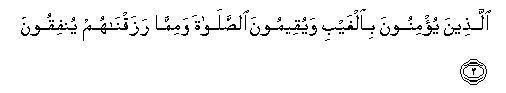
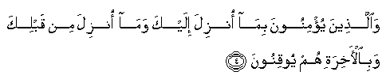
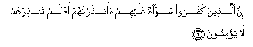
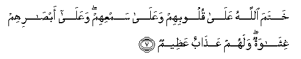

  
[Intangible Textual Heritage](../../index)  [Islam](../index.md) 
[Index](index.md)   
[Hypertext Qur'an](../htq/index)  [Unicode](../uq/002.htm#002_001.md) 
[Palmer](../sbe06/002)  [Pickthall](../pick/002.htm#002_001.md)  [Yusuf Ali
English](../yaq/yaq002)  [Rodwell](../qr/002.md)   
  
[Sūra II.: Baqara, or the Heifer. Index](002.md)  
  [Previous](00101)  [Next](00202.md) 

------------------------------------------------------------------------

  
*The Holy Quran*, tr. by Yusuf Ali, \[1934\], at Intangible Textual
Heritage

------------------------------------------------------------------------

# Sūra II.: Baqara, or the Heifer.

### Section 1

1. Alif-l<u>a</u>m-meem

1\. A. L. M.

------------------------------------------------------------------------

2. <u>Tha</u>lika alkit<u>a</u>bu l<u>a</u> rayba feehi hudan
lilmuttaqeen**a**

2\. This is the Book;  
In it is guidance sure, without doubt,  
To those who fear God;

------------------------------------------------------------------------

3. Alla<u>th</u>eena yu/minoona bi**a**lghaybi wayuqeemoona
a**l**<u>ss</u>al<u>a</u>ta wamimm<u>a</u> razaqn<u>a</u>hum
yunfiqoon**a**

3\. Who believe in the Unseen,  
Are steadfast in prayer,  
And spend out of what We  
Have provided for them;

------------------------------------------------------------------------

4. Wa**a**lla<u>th</u>eena yu/minoona bim<u>a</u> onzila ilayka
wam<u>a</u> onzila min qablika wabi**a**l-<u>a</u>khirati hum
yooqinoon**a**

4\. And who believe in the Revelation  
Sent to thee,  
And sent before thy time,  
And (in their hearts)  
Have the assurance of the Hereafter.

------------------------------------------------------------------------

5. Ol<u>a</u>-ika AAal<u>a</u> hudan min rabbihim waol<u>a</u>-ika humu
almufli<u>h</u>oon**a**

5\. They are on (true) guidance,  
From their Lord, and it is  
These who will prosper.

------------------------------------------------------------------------

6. Inna alla<u>th</u>eena kafaroo saw<u>a</u>on AAalayhim
aan<u>th</u>artahum am lam tun<u>th</u>irhum l<u>a</u> yu/minoon**a**

6\. As to those who reject Faith,  
It is the same to them  
Whether thou warn them  
Or do not warn them;  
They will not believe.

------------------------------------------------------------------------

7. Khatama All<u>a</u>hu AAal<u>a</u> quloobihim waAAal<u>a</u>
samAAihim waAAal<u>a</u> ab<u>sa</u>rihim ghish<u>a</u>watun walahum
AAa<u>tha</u>bun AAa*<u>th</u>*eem**un**

7\. God hath set a seal  
On their hearts and on their hearing,  
And on their eyes is a veil;  
Great is the penalty they (incur).

------------------------------------------------------------------------

[Next: Section 2 (8-20)](00202.md)

