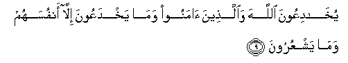
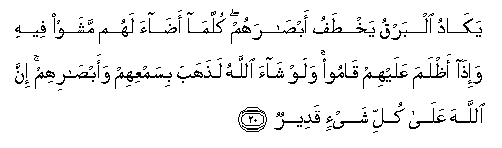

  
[Intangible Textual Heritage](../../index)  [Islam](../index) 
[Index](index)   
[Hypertext Qur'an](../htq/index)  [Unicode](../uq/002.htm#002_008) 
[Palmer](../sbe06/002)  [Pickthall](../pick/002.htm#002_008)  [Yusuf Ali
English](../yaq/yaq002)  [Rodwell](../qr/002)   
  
[Sūra II.: Baqara, or the Heifer. Index](002)  
  [Previous](00201)  [Next](00203) 

------------------------------------------------------------------------

  
*The Holy Quran*, tr. by Yusuf Ali, \[1934\], at Intangible Textual
Heritage

------------------------------------------------------------------------

# Sūra II.: Baqara, or the Heifer.

### Section 2

------------------------------------------------------------------------

8. Wamina a**l**nn<u>a</u>si man yaqoolu <u>a</u>mann<u>a</u>
biAll<u>a</u>hi wabi**a**lyawmi al-<u>a</u>khiri wam<u>a</u> hum
bimu/mineen**a**

8\. Of the people there are some who say:  
"We believe in God and the Last Day;"  
But they do not (really) believe.

------------------------------------------------------------------------

9. Yukh<u>a</u>diAAoona All<u>a</u>ha wa**a**lla<u>th</u>eena
<u>a</u>manoo wam<u>a</u> yakhdaAAoona ill<u>a</u> anfusahum wam<u>a</u>
yashAAuroon**a**

9\. Fain would they deceive  
God and those who believe,  
But they only deceive themselves,  
And realize (it) not!

------------------------------------------------------------------------

10. Fee quloobihim mara<u>d</u>un faz<u>a</u>dahumu All<u>a</u>hu
mara<u>d</u>an walahum AAa<u>tha</u>bun aleemun bim<u>a</u> k<u>a</u>noo
yak<u>th</u>iboon**a**

10\. In their hearts is a disease;  
And God has increased their disease:  
And grievous is the penalty they (incur),  
Because they are false (to themselves).

------------------------------------------------------------------------

11. Wa-i<u>tha</u> qeela lahum l<u>a</u> tufsidoo fee al-ar<u>d</u>i
q<u>a</u>loo innam<u>a</u> na<u>h</u>nu mu<u>s</u>li<u>h</u>oon**a**

11\. When it is said to them:  
"Make not mischief on the earth,"  
They say: "Why, we only  
Want to make peace!"

------------------------------------------------------------------------

12. Al<u>a</u> innahum humu almufsidoona wal<u>a</u>kin l<u>a</u>
yashAAuroon**a**

12\. Of a surety, they are the ones  
Who make mischief,  
But they realize (it) not.

------------------------------------------------------------------------

13. Wa-i<u>tha</u> qeela lahum <u>a</u>minoo kam<u>a</u> <u>a</u>mana
a**l**nn<u>a</u>su q<u>a</u>loo anu/minu kam<u>a</u> <u>a</u>mana
a**l**ssufah<u>a</u>o al<u>a</u> innahum humu a**l**ssufah<u>a</u>o
wal<u>a</u>kin l<u>a</u> yaAAlamoon**a**

13\. When it is said to them:  
"Believe as the others believe:"  
They say: "Shall we believe  
As the fools believe?"  
Nay, of a surety they are the fools,  
But they do not know."

------------------------------------------------------------------------

14. Wa-i<u>tha</u> laqoo alla<u>th</u>eena <u>a</u>manoo q<u>a</u>loo
<u>a</u>mann<u>a</u> wa-i<u>tha</u> khalaw il<u>a</u>
shay<u>at</u>eenihim q<u>a</u>loo inn<u>a</u> maAAakum innam<u>a</u>
na<u>h</u>nu mustahzi-oon**a**

14\. When they meet those who believe,  
They say: "We believe;"  
But when they are alone  
With their evil ones,  
They say: "We are really with you:  
We (were) only jesting."

------------------------------------------------------------------------

15. All<u>a</u>hu yastahzi-o bihim wayamudduhum fee
<u>t</u>ughy<u>a</u>nihim yaAAmahoon**a**

15\. God will throw back  
Their mockery on them,  
And give them rope in their trespasses;  
So they will wander like blind ones  
(To and fro).

------------------------------------------------------------------------

16. Ol<u>a</u>-ika alla<u>th</u>eena ishtarawoo
a**l**<u>dd</u>al<u>a</u>lata bi**a**lhud<u>a</u> fam<u>a</u>
rabi<u>h</u>at tij<u>a</u>ratuhum wam<u>a</u> k<u>a</u>noo
muhtadeen**a**

16\. These are they who have bartered  
Guidance for error:  
But their traffic is profitless,  
And they have lost true direction,

------------------------------------------------------------------------

17. Mathaluhum kamathali alla<u>th</u>ee istawqada n<u>a</u>ran
falamm<u>a</u> a<u>da</u>at m<u>a</u> <u>h</u>awlahu <u>th</u>ahaba
All<u>a</u>hu binoorihim watarakahum fee *<u>th</u>*ulum<u>a</u>tin
l<u>a</u> yub<u>s</u>iroon**a**

17\. Their similitude is that of a man  
Who kindled a fire;  
When it lighted all around him,  
God took away their light  
And left them in utter darkness.  
So they could not see.

------------------------------------------------------------------------

18. <u>S</u>ummun bukmun AAumyun fahum l<u>a</u> yarjiAAoon**a**

18\. Deaf, dumb, and blind,  
They will not return (to the path).

------------------------------------------------------------------------

19. Aw ka<u>s</u>ayyibin mina a**l**ssam<u>a</u>-i feehi
*<u>th</u>*ulum<u>a</u>tun waraAAdun wabarqun yajAAaloona
a<u>sa</u>biAAahum fee <u>atha</u>nihim mina
a**l**<u>ss</u>aw<u>a</u>AAiqi <u>h</u>a<u>th</u>ara almawti
wa**A**ll<u>a</u>hu mu<u>h</u>ee<u>t</u>un bi**a**lk<u>a</u>fireen**a**

19\. Or (another similitude)  
Is that of a rain-laden cloud  
From the sky: in it are zones  
Of darkness, and thunder and lightning:  
They press their fingers in their ears  
To keep out the stunning thunder-clap,  
The while they are in terror of death.  
But God is ever round  
The rejecters of Faith!

------------------------------------------------------------------------

20. Yak<u>a</u>du albarqu yakh<u>t</u>afu ab<u>sa</u>rahum
kullam<u>a</u> a<u>da</u>a lahum mashaw feehi wa-i<u>tha</u>
a*<u>th</u>*lama AAalayhim q<u>a</u>moo walaw sh<u>a</u>a All<u>a</u>hu
la<u>th</u>ahaba bisamAAihim waab<u>sa</u>rihim inna All<u>a</u>ha
AAal<u>a</u> kulli shay-in qadeer**un**

20\. The lightning all but snatches away  
Their sight; every time the light  
(Helps) them, they walk therein,  
And when the darkness grows on them,  
They stand still.  
And if God willed, He could take away  
Their faculty of hearing and seeing;  
For God hath power over all things

------------------------------------------------------------------------

[Next: Section 3 (21-29)](00203)

