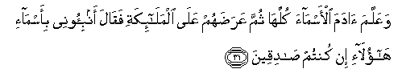
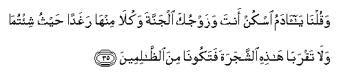
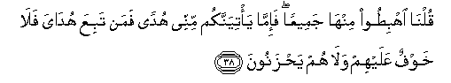

  
[Intangible Textual Heritage](../../index)  [Islam](../index.md) 
[Index](index.md)   
[Hypertext Qur'an](../htq/index)  [Unicode](../uq/002.htm#002_030.md) 
[Palmer](../sbe06/002)  [Pickthall](../pick/002.htm#002_030.md)  [Yusuf Ali
English](../yaq/yaq002)  [Rodwell](../qr/002.md)   
  
[Sūra II.: Baqara, or the Heifer. Index](002.md)  
  [Previous](00203)  [Next](00205.md) 

------------------------------------------------------------------------

  
*The Holy Quran*, tr. by Yusuf Ali, \[1934\], at Intangible Textual
Heritage

------------------------------------------------------------------------

# Sūra II.: Baqara, or the Heifer.

### Section 4

------------------------------------------------------------------------

30. Wa-i<u>th</u> q<u>a</u>la rabbuka lilmal<u>a</u>-ikati innee
j<u>a</u>AAilun fee al-ar<u>d</u>i khaleefatan q<u>a</u>loo atajAAalu
feeh<u>a</u> man yufsidu feeh<u>a</u> wayasfiku a**l**ddim<u>a</u>a
wana<u>h</u>nu nusabbi<u>h</u>u bi<u>h</u>amdika wanuqaddisu laka
q<u>a</u>la innee aAAlamu m<u>a</u> l<u>a</u> taAAlamoon**a**

30\. Behold, thy Lord said to the angels: "I will create  
A vicegerent on earth." They said:  
"Wilt Thou place therein one who will make  
Mischief therein and shed blood?—  
Whilst we do celebrate Thy praises  
And glorify Thy holy (name)?"  
He said: "I know what ye know not."

------------------------------------------------------------------------

31. WaAAallama <u>a</u>dama al-asm<u>a</u>a kullah<u>a</u> thumma
AAara<u>d</u>ahum AAal<u>a</u> almal<u>a</u>-ikati faq<u>a</u>la
anbi-oonee bi-asm<u>a</u>-i h<u>a</u>ol<u>a</u>-i in kuntum
<u>sa</u>diqeen**a**

31\. And He taught Adam the nature  
Of all things; then He placed them  
Before the angels, and said: "Tell Me  
The nature of these if ye are right."

------------------------------------------------------------------------

32. Q<u>a</u>loo sub<u>ha</u>naka l<u>a</u> AAilma lan<u>a</u>
ill<u>a</u> m<u>a</u> AAallamtan<u>a</u> innaka anta alAAaleemu
al<u>h</u>akeem**u**

32\. They said: "Glory to Thee: of knowledge  
We have none, save what Thou  
Hast taught us: in truth it is Thou  
Who art perfect in knowledge and wisdom."

------------------------------------------------------------------------

33. Q<u>a</u>la y<u>a</u> <u>a</u>damu anbi/hum bi-asm<u>a</u>-ihim
falamm<u>a</u> anbaahum bi-asm<u>a</u>-ihim q<u>a</u>la alam aqul lakum
innee aAAlamu ghayba a**l**ssam<u>a</u>w<u>a</u>ti wa**a**l-ar<u>d</u>i
waaAAlamu m<u>a</u> tubdoona wam<u>a</u> kuntum taktumoon**a**

33\. He said: "O Adam! tell them  
Their natures." When he had told them,  
God said: "Did I not tell you  
That I know the secrets of heaven  
And earth, and I know what ye reveal  
And what ye conceal?"

------------------------------------------------------------------------

34. Wa-i<u>th</u> quln<u>a</u> lilmal<u>a</u>-ikati osjudoo
li-<u>a</u>dama fasajadoo ill<u>a</u> ibleesa ab<u>a</u> wa**i**stakbara
wak<u>a</u>na mina alk<u>a</u>fireen**a**

34\. And behold, We said to the angels:  
"Bow down to Adam: "and they bowed down:  
Not so Iblīs: he refused and was haughty:  
He was of those who reject Faith.

------------------------------------------------------------------------

35. Waquln<u>a</u> y<u>a</u> <u>a</u>damu oskun anta wazawjuka aljannata
wakul<u>a</u> minh<u>a</u> raghadan <u>h</u>aythu shi/tum<u>a</u>
wal<u>a</u> taqrab<u>a</u> h<u>ath</u>ihi a**l**shshajarata
fatakoon<u>a</u> mina a**l***<u>thth</u>*<u>a</u>limeen**a**

35\. We said: "O Adam! dwell thou  
And thy wife in the Garden;  
And eat of the bountiful things therein  
As (where and when) ye will; but approach not this tree,  
Or ye run into harm and transgression."

------------------------------------------------------------------------

36. Faazallahum<u>a</u> a**l**shshay<u>ta</u>nu AAanh<u>a</u>
faakhrajahum<u>a</u> mimm<u>a</u> k<u>a</u>n<u>a</u> feehi
waquln<u>a</u> ihbi<u>t</u>oo baAA<u>d</u>ukum libaAA<u>d</u>in
AAaduwwun walakum fee al-ar<u>d</u>i mustaqarrun wamat<u>a</u>AAun
il<u>a</u> <u>h</u>een**in**

36\. Then did Satan make them slip  
From the (Garden), and get them out  
Of the state (of felicity) in which  
They had been. We said:  
"Get ye down, all (ye people),  
With enmity between yourselves.  
On earth will be your dwelling-place  
And your means of livelihood—  
For a time."

------------------------------------------------------------------------

37. Fatalaqq<u>a</u> <u>a</u>damu min rabbihi kalim<u>a</u>tin
fat<u>a</u>ba AAalayhi innahu huwa a**l**ttaww<u>a</u>bu
a**l**rra<u>h</u>eem**u**

37\. Then learnt Adam from his Lord  
Words of inspiration, and his Lord  
Turned towards him; for He  
Is Oft-Returning, Most Merciful.

------------------------------------------------------------------------

38. Quln<u>a</u> ihbi<u>t</u>oo minh<u>a</u> jameeAAan fa-imm<u>a</u>
ya/tiyannakum minnee hudan faman tabiAAa hud<u>a</u>ya fal<u>a</u>
khawfun AAalayhim wal<u>a</u> hum ya<u>h</u>zanoon**a**

38\. We said: "Get ye down all from here;  
And if, as is sure, there comes to you  
Guidance from Me, whosoever  
Follows My guidance, on them  
Shall be no fear, nor shall they grieve.

------------------------------------------------------------------------

39. Wa**a**lla<u>th</u>eena kafaroo waka<u>thth</u>aboo
bi-<u>a</u>y<u>a</u>tin<u>a</u> ol<u>a</u>-ika a<u>s</u>-<u>ha</u>bu
a**l**nn<u>a</u>ri hum feeh<u>a</u> kh<u>a</u>lidoon**a**

39\. "But those who reject Faith  
And belie Our Signs,  
They shall be Companions of the Fire;  
They shall abide therein."

------------------------------------------------------------------------

[Next: Section 5 (40-46)](00205.md)

