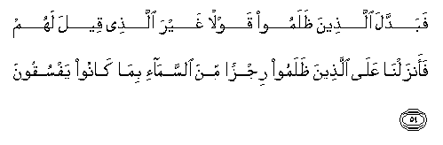

  
[Intangible Textual Heritage](../../index)  [Islam](../index.md) 
[Index](index.md)   
[Hypertext Qur'an](../htq/index)  [Unicode](../uq/002.htm#002_047.md) 
[Palmer](../sbe06/002)  [Pickthall](../pick/002.htm#002_047.md)  [Yusuf Ali
English](../yaq/yaq002)  [Rodwell](../qr/002.md)   
  
[Sūra II.: Baqara, or the Heifer. Index](002.md)  
  [Previous](00205)  [Next](00207.md) 

------------------------------------------------------------------------

  
*The Holy Quran*, tr. by Yusuf Ali, \[1934\], at Intangible Textual
Heritage

------------------------------------------------------------------------

# Sūra II.: Baqara, or the Heifer.

### Section 6

------------------------------------------------------------------------

47. Y<u>a</u> banee isr<u>a</u>-eela o<u>th</u>kuroo niAAmatiya allatee
anAAamtu AAalaykum waannee fa<u>dd</u>altukum AAal<u>a</u>
alAA<u>a</u>lameen**a**

47\. O Children of Israel! call to mind  
The (special) favour which I bestowed  
Upon you, and that I preferred you  
To all others (for My Message).

------------------------------------------------------------------------

48. Wa**i**ttaqoo yawman l<u>a</u> tajzee nafsun AAan nafsin shay-an
wal<u>a</u> yuqbalu minh<u>a</u> shaf<u>a</u>AAatun wal<u>a</u>
yu/kha<u>th</u>u minh<u>a</u> AAadlun wal<u>a</u> hum
yun<u>s</u>aroon**a**

48\. Then guard yourselves against a day  
When one soul shall not avail another  
Nor shall intercession be accepted for her,  
Nor shall compensation be taken from her,  
Nor shall anyone be helped (from outside).

------------------------------------------------------------------------

49. Wa-i<u>th</u> najjayn<u>a</u>kum min <u>a</u>li firAAawna
yasoomoonakum soo-a alAAa<u>tha</u>bi yu<u>th</u>abbi<u>h</u>oona
abn<u>a</u>akum wayasta<u>h</u>yoona nis<u>a</u>akum wafee
<u>tha</u>likum bal<u>a</u>on min rabbikum AAa*<u>th</u>*eem**un**

49\. And remember, We delivered you  
From the people of Pharaoh: they set you  
Hard tasks and punishments, slaughtered  
Your sons and let your women-folk live;  
Therein was a tremendous trial from your Lord.

------------------------------------------------------------------------

50. Wa-i<u>th</u> faraqn<u>a</u> bikumu alba<u>h</u>ra
faanjayn<u>a</u>kum waaghraqn<u>a</u> <u>a</u>la firAAawna waantum
tan*<u>th</u>*uroon**a**

50\. And remember We divided  
The Sea for you and saved you  
And drowned Pharaoh's people  
Within your very sight.

------------------------------------------------------------------------

51. Wa-i<u>th</u> w<u>a</u>AAadn<u>a</u> moos<u>a</u> arbaAAeena
laylatan thumma ittakha<u>th</u>tumu alAAijla min baAAdihi waantum
*<u>th</u>*<u>a</u>limoon**a**

51\. And remember We appointed  
Forty nights for Moses,  
And in his absence ye took  
The calf (for worship),  
And ye did grievous wrong.

------------------------------------------------------------------------

52. Thumma AAafawn<u>a</u> AAankum min baAAdi <u>tha</u>lika laAAallakum
tashkuroon**a**

52\. Even then We did forgive you;  
There was a chance for you  
To be grateful.

------------------------------------------------------------------------

53. Wa-i<u>th</u> <u>a</u>tayn<u>a</u> moos<u>a</u> alkit<u>a</u>ba
wa**a**lfurq<u>a</u>na laAAallakum tahtadoon**a**

53\. And remember We gave  
Moses the Scripture and the Criterion  
(Between right and wrong): there was  
A chance for you to be guided aright.

------------------------------------------------------------------------

54. Wa-i<u>th</u> q<u>a</u>la moos<u>a</u> liqawmihi y<u>a</u> qawmi
innakum *<u>th</u>*alamtum anfusakum bi**i**ttikh<u>ath</u>ikumu
alAAijla fatooboo il<u>a</u> b<u>a</u>ri-ikum fa**o**qtuloo anfusakum
<u>tha</u>likum khayrun lakum AAinda b<u>a</u>ri-ikum fat<u>a</u>ba
AAalaykum innahu huwa a**l**ttaww<u>a</u>bu a**l**rra<u>h</u>eem**u**

54\. And remember Moses said  
To his people: "O my people!  
Ye have indeed wronged  
Yourselves by your worship of the calf:  
So turn (in repentance) to your Maker,  
And slay yourselves (the wrong-doers);  
That will be better for you  
In the sight of your Maker."  
Then He turned towards you (in forgiveness):  
For He is Oft-Returning, Most Merciful.

------------------------------------------------------------------------

55. Wa-i<u>th</u> qultum y<u>a</u> moos<u>a</u> lan nu/mina laka
<u>h</u>att<u>a</u> nar<u>a</u> All<u>a</u>ha jahratan
faakha<u>th</u>atkumu a**l**<u>ssa</u>AAiqatu waantum
tan*<u>th</u>*uroon**a**

55\. And remember ye said: "O Moses!  
We shall never believe in thee  
Until we see God manifestly,"  
But ye were dazed  
With thunder and lightning  
Even as ye looked on.

------------------------------------------------------------------------

56. Thumma baAAathn<u>a</u>kum min baAAdi mawtikum laAAallakum
tashkuroon**a**

56\. Then We raised you up  
After your death:  
Ye had the chance  
To be grateful.

------------------------------------------------------------------------

57. Wa*<u>th</u>*allaln<u>a</u> AAalaykumu algham<u>a</u>ma
waanzaln<u>a</u> AAalaykumu almanna wa**al**ssalw<u>a</u> kuloo min
<u>t</u>ayyib<u>a</u>ti m<u>a</u> razaqn<u>a</u>kum wam<u>a</u>
*<u>th</u>*alamoon<u>a</u> wal<u>a</u>kin k<u>a</u>noo anfusahum
ya*<u>th</u>*limoon**a**

57\. And We gave you the shade of clouds  
And sent down to you  
Manna and quails, saying:  
"Eat of the good things  
We have provided fcr you:"  
(But they rebelled);  
To Us they did no harm,  
But they harmed their own souls.

------------------------------------------------------------------------

58. Wa-i<u>th</u> quln<u>a</u> odkhuloo h<u>ath</u>ihi alqaryata fakuloo
minh<u>a</u> <u>h</u>aythu shi/tum raghadan wa**o**dkhuloo alb<u>a</u>ba
sujjadan waqooloo <u>h</u>i<u>tt</u>atun naghfir lakum
kha<u>ta</u>y<u>a</u>kum wasanazeedu almu<u>h</u>sineen**a**

58\. And remember We said:  
"Enter this town, and eat  
Of the plenty therein  
As ye wish; but enter  
The gate with humility,  
In posture and in words,  
And We shall forgive you your faults  
And increase (the portion of)  
Those who do good."

------------------------------------------------------------------------

59. Fabaddala alla<u>th</u>eena *<u>th</u>*alamoo qawlan ghayra
alla<u>th</u>ee qeela lahum faanzaln<u>a</u> AAal<u>a</u>
alla<u>th</u>eena *<u>th</u>*alamoo rijzan mina a**l**ssam<u>a</u>-i
bim<u>a</u> k<u>a</u>noo yafsuqoon**a**

59\. But the transgressors  
Changed the word from that  
Which had been given them;  
So We sent on the transgt essors  
A plague from heaven,  
For that they infringed  
(Our command) repeatedly.

------------------------------------------------------------------------

[Next: Section 7 (60-61)](00207.md)

