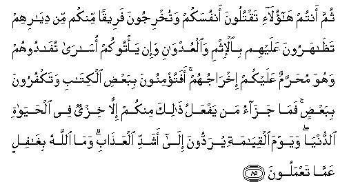

  
[Intangible Textual Heritage](../../index)  [Islam](../index.md) 
[Index](index.md)   
[Hypertext Qur'an](../htq/index)  [Unicode](../uq/002.htm#002_083.md) 
[Palmer](../sbe06/002)  [Pickthall](../pick/002.htm#002_083.md)  [Yusuf Ali
English](../yaq/yaq002)  [Rodwell](../qr/002.md)   
  
[Sūra II.: Baqara, or the Heifer. Index](002.md)  
  [Previous](00209)  [Next](00211.md) 

------------------------------------------------------------------------

  
*The Holy Quran*, tr. by Yusuf Ali, \[1934\], at Intangible Textual
Heritage

------------------------------------------------------------------------

# Sūra II.: Baqara, or the Heifer.

### Section 10

------------------------------------------------------------------------

83. Wa-i<u>th</u> akha<u>th</u>n<u>a</u> meeth<u>a</u>qa banee
isr<u>a</u>-eela l<u>a</u> taAAbudoona ill<u>a</u> All<u>a</u>ha
wabi**a**lw<u>a</u>lidayni i<u>h</u>s<u>a</u>nan wa<u>th</u>ee
alqurb<u>a</u> wa**a**lyat<u>a</u>m<u>a</u> wa**a**lmas<u>a</u>keeni
waqooloo li**l**nn<u>a</u>si <u>h</u>usnan waaqeemoo
a**l**<u>ss</u>al<u>a</u>ta wa<u>a</u>too a**l**zzak<u>a</u>ta thumma
tawallaytum ill<u>a</u> qaleelan minkum waantum muAAri<u>d</u>oon**a**

83\. And remember We took  
A Covenant from the Children  
Of Israel (to this effect):  
Worship none but God;  
Treat with kindness  
Your parents and kindred,  
And orphans and those in need;  
Speak fair to the people;  
Be steadfast in prayer;  
And practise regular charity.  
Then did ye turn back,  
Except a few among you,  
And ye backslide (even now).

------------------------------------------------------------------------

84. Wa-i<u>th</u> akha<u>th</u>n<u>a</u> meeth<u>a</u>qakum l<u>a</u>
tasfikoona dim<u>a</u>akum wal<u>a</u> tukhrijoona anfusakum min
diy<u>a</u>rikum thumma aqrartum waantum tashhadoon**a**

84\. And remember We took  
Your Covenant (to this effect):  
Shed no blood amongst you,  
Nor turn out your own people  
From your homes: and this  
Ye solemnly ratified,  
And to this ye can bear witness.

------------------------------------------------------------------------

85. Thumma antum h<u>a</u>ol<u>a</u>-i taqtuloona anfusakum
watukhrijoona fareeqan minkum min diy<u>a</u>rihim
ta*<u>th</u>*<u>a</u>haroona AAalayhim bi**a**l-ithmi
wa**a**lAAudw<u>a</u>ni wa-in ya/tookum os<u>a</u>r<u>a</u>
tuf<u>a</u>doohum wahuwa mu<u>h</u>arramun AAalaykum ikhr<u>a</u>juhum
afatu/minoona bibaAA<u>d</u>i alkit<u>a</u>bi watakfuroona
bibaAA<u>d</u>in fam<u>a</u> jaz<u>a</u>o man yafAAalu <u>tha</u>lika
minkum ill<u>a</u> khizyun fee al<u>h</u>ay<u>a</u>ti
a**l**dduny<u>a</u> wayawma alqiy<u>a</u>mati yuraddoona il<u>a</u>
ashaddi alAAa<u>tha</u>bi wam<u>a</u> All<u>a</u>hu bigh<u>a</u>filin
AAamm<u>a</u> taAAmaloon**a**

85\. After this it is ye, the same people,  
Who slay among yourselves,  
And banish a party of you  
From their homes; assist  
(Their enemies) against them,  
In guilt and rancour;  
And if they come to you  
As captives, ye ransom them,  
Though it was not lawful  
For you to banish them.  
Then is it only a part of the Book  
That ye believe in,  
And do ye reject the rest?  
But what is the reward for those  
Among you who behave like this  
But disgrace in this life?—  
And on the Day of Judgment  
They shall be consigned  
To the most grievous penalty.  
For God is not unmindful  
Of what ye do.

------------------------------------------------------------------------

86. Ol<u>a</u>-ika alla<u>th</u>eena ishtarawoo al<u>h</u>ay<u>a</u>ta
a**l**dduny<u>a</u> bi**a**l-<u>a</u>khirati fal<u>a</u> yukhaffafu
AAanhumu alAAa<u>tha</u>bu wal<u>a</u> hum yun<u>s</u>aroon**a**

86\. These are the people who buy  
The life of this world at the price  
Of the Hereafter: their penalty  
Shall not be lightened  
Nor shall they be helped.

------------------------------------------------------------------------

[Next: Section 11 (88-96)](00211.md)

