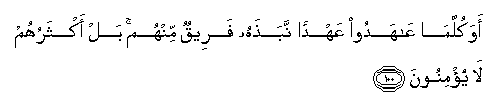

  
[Intangible Textual Heritage](../../index)  [Islam](../index) 
[Index](index)   
[Hypertext Qur'an](../htq/index)  [Unicode](../uq/002.htm#002_097) 
[Palmer](../sbe06/002)  [Pickthall](../pick/002.htm#002_097)  [Yusuf Ali
English](../yaq/yaq002)  [Rodwell](../qr/002)   
  
[Sūra II.: Baqara, or the Heifer. Index](002)  
  [Previous](00211)  [Next](00213) 

------------------------------------------------------------------------

  
*The Holy Quran*, tr. by Yusuf Ali, \[1934\], at Intangible Textual
Heritage

------------------------------------------------------------------------

# Sūra II.: Baqara, or the Heifer.

### Section 12

------------------------------------------------------------------------

97. Qul man k<u>a</u>na AAaduwwan lijibreela fa-innahu nazzalahu
AAal<u>a</u> qalbika bi-i<u>th</u>ni All<u>a</u>hi mu<u>s</u>addiqan
lim<u>a</u> bayna yadayhi wahudan wabushr<u>a</u> lilmu/mineen**a**

97\. Say: Whoever is an enemy  
To Gabriel—for he brings down  
The (revelation) to thy heart  
By God's will, a confirmation  
Of what went before,  
And guidance and glad tidings  
For those who believe,—

------------------------------------------------------------------------

98. Man k<u>a</u>na AAaduwwan lill<u>a</u>hi wamal<u>a</u>-ikatihi
warusulihi wajibreela wameek<u>a</u>la fa-inna All<u>a</u>ha AAaduwwun
lilk<u>a</u>fireen**a**

98\. Whoever is an enemy to God  
And His angels and apostles,  
To Gabriel and Michael,—  
Lo! God is an enemy to those  
Who reject Faith.

------------------------------------------------------------------------

99. Walaqad anzaln<u>a</u> ilayka <u>a</u>y<u>a</u>tin bayyin<u>a</u>tin
wam<u>a</u> yakfuru bih<u>a</u> ill<u>a</u> alf<u>a</u>siqoon**a**

99\. We have sent down to thee  
Manifest Signs (āyāt);  
And none reject them  
But those who are perverse.

------------------------------------------------------------------------

100. Awa kullam<u>a</u> AA<u>a</u>hadoo AAahdan naba<u>th</u>ahu
fareequn minhum bal aktharuhum l<u>a</u> yu/minoon**a**

100\. Is it not (the case) that  
Every time they make a Covenant,  
Some party among them  
Throw it aside?—Nay,  
Most of them are faithless.

------------------------------------------------------------------------

101. Walamm<u>a</u> j<u>a</u>ahum rasoolun min AAindi All<u>a</u>hi
mu<u>s</u>addiqun lim<u>a</u> maAAahum naba<u>th</u>a fareequn mina
alla<u>th</u>eena ootoo alkit<u>a</u>ba kit<u>a</u>ba All<u>a</u>hi
war<u>a</u>a *<u>th</u>*uhoorihim kaannahum l<u>a</u> yaAAlamoon**a**

101\. And when there came to them  
An Apostle from God,  
Confirming what was with them,  
A party of the People of the Book  
Threw away the Book of God  
Behind their backs,  
As if (it had been something)  
They did not know!

------------------------------------------------------------------------

102. Wa**i**ttabaAAoo m<u>a</u> tatloo a**l**shshay<u>at</u>eenu
AAal<u>a</u> mulki sulaym<u>a</u>na wam<u>a</u> kafara sulaym<u>a</u>nu
wal<u>a</u>kinna a**l**shshay<u>at</u>eena kafaroo yuAAallimoona
a**l**nn<u>a</u>sa a**l**ssi<u>h</u>ra wam<u>a</u> onzila AAal<u>a</u>
almalakayni bib<u>a</u>bila h<u>a</u>roota wam<u>a</u>roota wam<u>a</u>
yuAAallim<u>a</u>ni min a<u>h</u>adin <u>h</u>att<u>a</u> yaqool<u>a</u>
innam<u>a</u> na<u>h</u>nu fitnatun fal<u>a</u> takfur fayataAAallamoona
minhum<u>a</u> m<u>a</u> yufarriqoona bihi bayna almar-i wazawjihi
wam<u>a</u> hum bi<u>da</u>rreena bihi min a<u>h</u>adin ill<u>a</u>
bi-i<u>th</u>ni All<u>a</u>hi wayataAAallamoona m<u>a</u>
ya<u>d</u>urruhum wal<u>a</u> yanfaAAuhum walaqad AAalimoo lamani
ishtar<u>a</u>hu m<u>a</u> lahu fee al-<u>a</u>khirati min
khal<u>a</u>qin walabi/sa m<u>a</u> sharaw bihi anfusahum law
k<u>a</u>noo yaAAlamoon**a**

102\. They followed what the evil ones  
Gave out (falsely)  
Against the power  
Of Solomon: the blasphemers  
Were, not Solomon, but  
The evil ones, teaching men  
Magic, and such things  
As came down at Babylon  
To the angels Hārūt and Mārūt.  
But neither of these taught anyone  
(Such things) without saying:  
"We are only for trial;  
So do not blaspheme."  
They learned from them  
The means to sow discord  
Between man and wife.  
But they could not thus  
Harm anyone except  
By God's permission.  
And they learned what harmed them,  
Not what profited them.  
And they knew that the buyers  
Of (magic) would have  
No share in the happiness  
Of the Hereafter. And vile  
Was the price for which  
They did sell their souls,  
If they but knew!

------------------------------------------------------------------------

103. Walaw annahum <u>a</u>manoo wa**i**ttaqaw lamathoobatun min AAindi
All<u>a</u>hi khayrun law k<u>a</u>noo yaAAlamoon**a**

103\. If they had kept their Faith  
And guarded themselves from evil,  
Far better had been  
The reward from their Lord,  
If they but knew!

------------------------------------------------------------------------

[Next: Section 13 (104-112)](00213)

