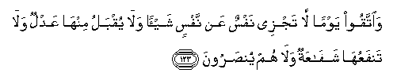
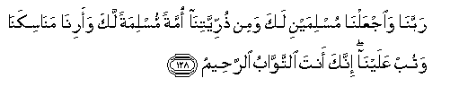

  
[Intangible Textual Heritage](../../index)  [Islam](../index.md) 
[Index](index.md)   
[Hypertext Qur'an](../htq/index)  [Unicode](../uq/002.htm#002_122.md) 
[Palmer](../sbe06/002)  [Pickthall](../pick/002.htm#002_122.md)  [Yusuf Ali
English](../yaq/yaq002)  [Rodwell](../qr/002.md)   
  
[Sūra II.: Baqara, or the Heifer. Index](002.md)  
  [Previous](00214)  [Next](00216.md) 

------------------------------------------------------------------------

  
*The Holy Quran*, tr. by Yusuf Ali, \[1934\], at Intangible Textual
Heritage

------------------------------------------------------------------------

# Sūra II.: Baqara, or the Heifer.

### Section 15

------------------------------------------------------------------------

122. Y<u>a</u> banee isr<u>a</u>-eela o<u>th</u>kuroo niAAmatiya allatee
anAAamtu AAalaykum waannee fa<u>dd</u>altukum AAal<u>a</u>
alAA<u>a</u>lameen**a**

122\. O Children of Israel! call to mind  
The special favour which I bestowed  
Upon you, and that I preferred you  
To all others (for My Message).

------------------------------------------------------------------------

123. Wa**i**ttaqoo yawman l<u>a</u> tajzee nafsun AAan nafsin shay-an
wal<u>a</u> yuqbalu minh<u>a</u> AAadlun wal<u>a</u> tanfaAAuh<u>a</u>
shaf<u>a</u>AAatun wal<u>a</u> hum yun<u>s</u>aroon**a**

123\. Then guard yourselves against a Day  
When one soul shall not avail another,  
Nor shall compensation be  
accepted from her  
Nor shall intercession profit her  
Nor shall anyone be helped (from outside).

------------------------------------------------------------------------

124. Wa-i<u>th</u>i ibtal<u>a</u> ibr<u>a</u>heema rabbuhu
bikalim<u>a</u>tin faatammahunna q<u>a</u>la innee j<u>a</u>AAiluka
li**l**nn<u>a</u>si im<u>a</u>man q<u>a</u>la wamin <u>th</u>urriyyatee
q<u>a</u>la l<u>a</u> yan<u>a</u>lu AAahdee
a**l***<u>thth</u>*<u>a</u>limeen**a**

124\. And remember that Abraham  
Was tried by his Lord  
With certain Commands,  
Which he fulfilled:  
He said: "I will make thee  
An Imām to the Nations."  
He pleaded: "And also  
(Imāms) from my offspring!"  
He answered: "But My Promise  
Is not within the reach  
Of evil-doers."

------------------------------------------------------------------------

125. Wa-i<u>th</u> jaAAaln<u>a</u> albayta math<u>a</u>batan
li**l**nn<u>a</u>si waamnan wa**i**ttakhi<u>th</u>oo min maq<u>a</u>mi
ibr<u>a</u>heema mu<u>s</u>allan waAAahidn<u>a</u> il<u>a</u>
ibr<u>a</u>heema wa-ism<u>a</u>AAeela an <u>t</u>ahhir<u>a</u> baytiya
li**l**<u>tta</u>-ifeena wa**a**lAA<u>a</u>kifeena wa**al**rrukkaAAi
a**l**ssujood**i**

125\. Remember We made the House  
A place of assembly for men  
And a place of safety;  
And take ye the Station  
Of Abraham as a place  
Of prayer; and We covenanted  
With Abraham and lsmā’īl,  
That they should sanctify  
My House for those who  
Compass it round, or use it  
As a retreat, or bow, or  
Prostrate themselves (therein  
In prayer).

------------------------------------------------------------------------

126. Wa-i<u>th</u> q<u>a</u>la ibr<u>a</u>heemu rabbi ijAAal
h<u>atha</u> baladan <u>a</u>minan wa**o**rzuq ahlahu mina
a**l**ththamar<u>a</u>ti man <u>a</u>mana minhum bi**A**ll<u>a</u>hi
wa**a**lyawmi al-<u>a</u>khiri q<u>a</u>la waman kafara faomattiAAuhu
qaleelan thumma a<u>dt</u>arruhu il<u>a</u> AAa<u>tha</u>bi
a**l**nn<u>a</u>ri wabi/sa alma<u>s</u>eer**u**

126\. And remember Abraham said:  
"My Lord, make this a City  
Of Peace, and feed its People  
With fruits,—such of them  
As believe in God and the Last Day."  
He said: "(Yea), and such as  
Reject Faith,—for a while  
Will I grant them their pleasure,  
But will soon drive them  
To the torment of Fire,—  
An evil destination (indeed)!"

------------------------------------------------------------------------

127. Wa-i<u>th</u> yarfaAAu ibr<u>a</u>heemu alqaw<u>a</u>AAida mina
albayti wa-ism<u>a</u>AAeelu rabban<u>a</u> taqabbal minn<u>a</u> innaka
anta a**l**ssameeAAu alAAaleem**u**

127\. And remember Abraham  
And Ismā’īl raised  
The foundations of the House  
(With this prayer): "Our Lord!  
Accept (this service) from us:  
For Thou art the All-Hearing,  
The All-Knowing.

------------------------------------------------------------------------

128. Rabban<u>a</u> wa**i**jAAaln<u>a</u> muslimayni laka wamin
<u>th</u>urriyyatin<u>a</u> ommatan muslimatan laka waarin<u>a</u>
man<u>a</u>sikan<u>a</u> watub AAalayn<u>a</u> innaka anta
a**l**ttaww<u>a</u>bu a**l**rra<u>h</u>eem**u**

128\. "Our Lord! make of us  
Muslims, bowing to Thy (Will),  
And of our progeny a people  
Muslim, bowing to Thy (Will);  
And show us our places for  
The celebration of (due) rites;  
And turn unto us (in Mercy);  
For Thou art the Oft-Returning,  
Most Merciful.

------------------------------------------------------------------------

129. Rabban<u>a</u> wa**i**bAAath feehim rasoolan minhum yatloo
AAalayhim <u>a</u>y<u>a</u>tika wayuAAallimuhumu alkit<u>a</u>ba
wa**a**l<u>h</u>ikmata wayuzakkeehim innaka anta alAAazeezu
al<u>h</u>akeem**u**

129\. "Our Lord! send amongst them  
An Apostle of their own,  
Who shall rehearse Thy Signs  
To them and instruct them  
In Scripture and Wisdom,  
And sanctify them:  
For Thou art the Exalted in Might,  
The Wise."

------------------------------------------------------------------------

[Next: Section 16 (130-141)](00216.md)

