

  
[Intangible Textual Heritage](../../index)  [Islam](../index.md) 
[Index](index.md)   
[Hypertext Qur'an](../htq/index)  [Unicode](../uq/002.htm#002_130.md) 
[Palmer](../sbe06/002)  [Pickthall](../pick/002.htm#002_130.md)  [Yusuf Ali
English](../yaq/yaq002)  [Rodwell](../qr/002.md)   
  
[Sūra II.: Baqara, or the Heifer. Index](002.md)  
  [Previous](00215)  [Next](00217.md) 

------------------------------------------------------------------------

  
*The Holy Quran*, tr. by Yusuf Ali, \[1934\], at Intangible Textual
Heritage

------------------------------------------------------------------------

# Sūra II.: Baqara, or the Heifer.

### Section 16

------------------------------------------------------------------------

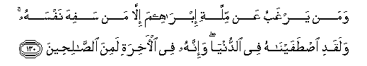

130. Waman yarghabu AAan millati ibr<u>a</u>heema ill<u>a</u> man safiha
nafsahu walaqadi i<u>st</u>afayn<u>a</u>hu fee a**l**dduny<u>a</u>
wa-innahu fee al-<u>a</u>khirati lamina
a**l**<u>ssa</u>li<u>h</u>een**a**

130\. And who turns away  
From the religion of Abraham  
But such as debase their souls  
With folly? Him We chose  
And rendered pure in this world:  
And he will be in the Hereafter  
In the ranks of the Righteous.

------------------------------------------------------------------------

131. I<u>th</u> q<u>a</u>la lahu rabbuhu aslim q<u>a</u>la aslamtu
lirabbi alAA<u>a</u>lameen**a**

131\. Behold! his Lord said  
To him: "Bow (thy will to Me):"  
He said: "I bow (my will)  
To the Lord and Cherisher  
Of the Universe."

------------------------------------------------------------------------

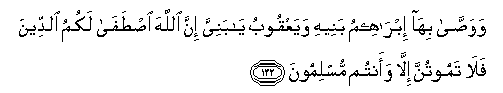

132. Wawa<u>ssa</u> bih<u>a</u> ibr<u>a</u>heemu baneehi wayaAAqoobu
y<u>a</u> baniyya inna All<u>a</u>ha i<u>st</u>af<u>a</u> lakumu
a**l**ddeena fal<u>a</u> tamootunna ill<u>a</u> waantum muslimoon**a**

132\. And this was the legacy  
That Abraham left to his sons,  
And so did Jacob;  
"Oh my sons! God hath chosen  
The Faith for you; then die not  
Except in the Faith of Islam."

------------------------------------------------------------------------

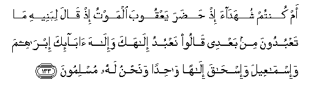

133. Am kuntum shuhad<u>a</u>a i<u>th</u> <u>h</u>a<u>d</u>ara yaAAqooba
almawtu i<u>th</u> q<u>a</u>la libaneehi m<u>a</u> taAAbudoona min
baAAdee q<u>a</u>loo naAAbudu il<u>a</u>haka wa-il<u>a</u>ha
<u>a</u>b<u>a</u>-ika ibr<u>a</u>heema wa-ism<u>a</u>AAeela
wa-is<u>ha</u>qa il<u>a</u>han w<u>ah</u>idan wana<u>h</u>nu lahu
muslimoon**a**

133\. Were ye witnesses  
When Death appeared before Jacob?  
Behold, he said to his sons:  
"What will ye worship after me?"  
They said: "We shall worship  
Thy God and the God of thy fathers,—  
Of Abraham, Ismā'īl, and Isaac,—  
The One (True) God:  
To Him we bow (in Islam)."

------------------------------------------------------------------------

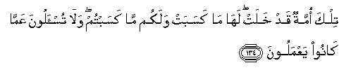

134. Tilka ommatun qad khalat lah<u>a</u> m<u>a</u> kasabat walakum
m<u>a</u> kasabtum wal<u>a</u> tus-aloona AAamm<u>a</u> k<u>a</u>no
yaAAmaloon**a**

134\. That was a People that hath  
Passed away. They shall reap  
The fruit of what they did,  
And ye of what ye do!  
Of their merits  
There is no question in your case!

------------------------------------------------------------------------

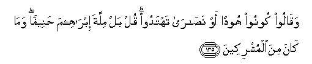

135. Waq<u>a</u>loo koonoo hoodan aw na<u>sa</u>r<u>a</u> tahtadoo qul
bal millata ibr<u>a</u>heema <u>h</u>aneefan wam<u>a</u> k<u>a</u>na
mina almushrikeen**a**

135\. They say: "Become Jews  
Or Christians if ye would be guided  
(To salvation)." Say thou:  
"Nay! (I would rather) the Religion  
Of Abraham the True,  
And he joined not gods with God."

------------------------------------------------------------------------

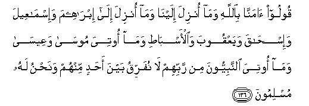

136. Qooloo <u>a</u>mann<u>a</u> bi**A**ll<u>a</u>hi wam<u>a</u> onzila
ilayn<u>a</u> wam<u>a</u> onzila il<u>a</u> ibr<u>a</u>heema
wa-ism<u>a</u>AAeela wa-is<u>ha</u>qa wayaAAqooba wa**a**l-asb<u>at</u>i
wam<u>a</u> ootiya moos<u>a</u> waAAees<u>a</u> wam<u>a</u> ootiya
a**l**nnabiyyoona min rabbihim l<u>a</u> nufarriqu bayna a<u>h</u>adin
minhum wana<u>h</u>nu lahu muslimoon**a**

136\. Say ye: "We believe  
In God, and the revelation  
Given to us, and to Abraham,  
Ismā'īl, Isaac, Jacob,  
And the Tribes, and that given  
To Moses and Jesus, and that given  
To (all) Prophets from their Lord:  
We make no difference  
Between one and another of them:  
And we bow to God (in Islam)."

------------------------------------------------------------------------

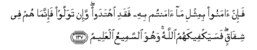

137. Fa-in <u>a</u>manoo bimithli m<u>a</u> <u>a</u>mantum bihi faqadi
ihtadaw wa-in tawallaw fa-innam<u>a</u> hum fee shiq<u>a</u>qin
fasayakfeekahumu All<u>a</u>hu wahuwa a**l**ssameeAAu alAAaleem**u**

137\. So if they believe  
As ye believe, they are indeed  
On the right path; but if  
They turn back, it is they  
Who are in schism; but God will  
Suffice thee as against them,  
And He is the All-Hearing,  
The All-Knowing.

------------------------------------------------------------------------

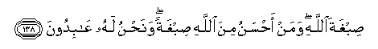

138. <u>S</u>ibghata All<u>a</u>hi waman a<u>h</u>sanu mina
All<u>a</u>hi <u>s</u>ibghatan wana<u>h</u>nu lahu AA<u>a</u>bidoon**a**

138\. (Our religion is)  
The Baptism of God:  
And who can baptize better  
Than God? And it is He  
Whom we worship.

------------------------------------------------------------------------

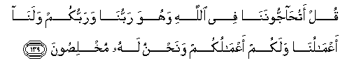

139. Qul atu<u>ha</u>jjoonan<u>a</u> fee All<u>a</u>hi wahuwa
rabbun<u>a</u> warabbukum walan<u>a</u> aAAm<u>a</u>lun<u>a</u> walakum
aAAm<u>a</u>lukum wana<u>h</u>nu lahu mukhli<u>s</u>oon**a**

139\. Say: Will ye dispute  
With us about God, seeing  
That He is our Lord  
And your Lord; that we  
Are responsible for our doings  
And ye for yours; and that  
We are sincere (in our faith) In him?

------------------------------------------------------------------------

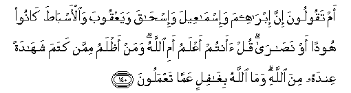

140. Am taqooloona inna ibr<u>a</u>heema wa-ism<u>a</u>AAeela
wa-is<u>ha</u>qa wayaAAqooba wa**a**l-asb<u>at</u>a k<u>a</u>noo hoodan
aw na<u>sa</u>r<u>a</u> qul aantum aAAlamu ami All<u>a</u>hu waman
a*<u>th</u>*lamu mimman katama shah<u>a</u>datan AAindahu mina
All<u>a</u>hi wam<u>a</u> All<u>a</u>hu bigh<u>a</u>filin AAamm<u>a</u>
taAAmaloon**a**

140\. Or do ye say that  
Abraham, Ismā'īl, Isaac,  
Jacob and the Tribes were  
Jews or Christians?  
Say: Do ye know better  
Than God? Ah! who  
Is more unjust than those  
Who conceal the testimony  
They have from God?  
But God is not unmindful  
Of what ye do!

------------------------------------------------------------------------

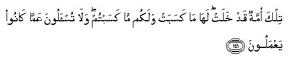

141. Tilka ommatun qad khalat lah<u>a</u> m<u>a</u> kasabat walakum
m<u>a</u> kasabtum wal<u>a</u> tus-aloona AAamm<u>a</u> k<u>a</u>noo
yaAAmaloon**a**

141\. That was a people that hath  
Passed away. They shall reap  
The fruit of what they did,  
And ye of what ye do!  
Of their merits  
There is no question in your case:

------------------------------------------------------------------------

[Next: Section 17 (142-147)](00217.md)

