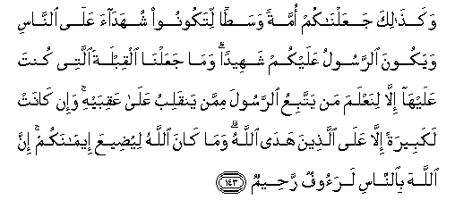
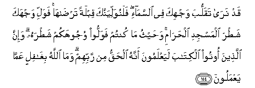
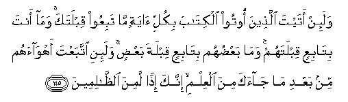

  
[Intangible Textual Heritage](../../index)  [Islam](../index) 
[Index](index)   
[Hypertext Qur'an](../htq/index)  [Unicode](../uq/002.htm#002_142) 
[Palmer](../sbe06/002)  [Pickthall](../pick/002.htm#002_142)  [Yusuf Ali
English](../yaq/yaq002)  [Rodwell](../qr/002)   
  
[Sūra II.: Baqara, or the Heifer. Index](002)  
  [Previous](00216)  [Next](00218) 

------------------------------------------------------------------------

  
*The Holy Quran*, tr. by Yusuf Ali, \[1934\], at Intangible Textual
Heritage

------------------------------------------------------------------------

# Sūra II.: Baqara, or the Heifer.

### Section 17

------------------------------------------------------------------------

142. Sayaqoolu a**l**ssufah<u>a</u>o mina a**l**nn<u>a</u>si m<u>a</u>
wall<u>a</u>hum AAan qiblatihimu allatee k<u>a</u>noo AAalayh<u>a</u>
qul lill<u>a</u>hi almashriqu wa**a**lmaghribu yahdee man yash<u>a</u>o
il<u>a</u> <u>s</u>ir<u>at</u>in mustaqeem**in**

142\. The Fools among the people  
Will say: "What hath turned  
Them from the Qibla to which  
They were used?" Say:  
To God belong both East and West:  
He guideth whom He will  
To a Way that is straight.

------------------------------------------------------------------------

143. Waka<u>tha</u>lika jaAAaln<u>a</u>kum ommatan wasa<u>t</u>an
litakoonoo shuhad<u>a</u>a AAal<u>a</u> a**l**nn<u>a</u>si wayakoona
a**l**rrasoolu AAalaykum shaheedan wam<u>a</u> jaAAaln<u>a</u> alqiblata
allatee kunta AAalayh<u>a</u> ill<u>a</u> linaAAlama man yattabiAAu
a**l**rrasoola mimman yanqalibu AAal<u>a</u> AAaqibayhi wa-in
k<u>a</u>nat lakabeeratan ill<u>a</u> AAal<u>a</u> alla<u>th</u>eena
had<u>a</u> All<u>a</u>hu wam<u>a</u> k<u>a</u>na All<u>a</u>hu
liyu<u>d</u>eeAAa eem<u>a</u>nakum inna All<u>a</u>ha
bi**al**nn<u>a</u>si laraoofun ra<u>h</u>eem**un**

143\. Thus have We made of you  
An Ummat justly balanced,  
That ye might be witnesses  
Over the nations,  
And the Apostle a witness  
Over yourselves;  
And We appointed the Qibla  
To which thou wast used,  
Only to test those who followed  
The Apostle from those  
Who would turn on their heels  
(From the Faith). Indeed it was  
(A change) momentous, except  
To those guided by God.  
And never would God  
Make your faith of no effect.  
For God is to all people  
Most surely full of kindness,  
Most Merciful.

------------------------------------------------------------------------

144. Qad nar<u>a</u> taqalluba wajhika fee a**l**ssam<u>a</u>-i
falanuwalliyannaka qiblatan tar<u>da</u>h<u>a</u> fawalli wajhaka
sha<u>t</u>ra almasjidi al<u>h</u>ar<u>a</u>mi wa<u>h</u>aythu m<u>a</u>
kuntum fawalloo wujoohakum sha<u>t</u>rahu wa-inna alla<u>th</u>eena
ootoo alkit<u>a</u>ba layaAAlamoona annahu al<u>h</u>aqqu min rabbihim
wam<u>a</u> All<u>a</u>hu bigh<u>a</u>filin AAamm<u>a</u>
yaAAmaloon**a**

144\. We see the turning  
Of thy face (for guidance)  
To the heavens: now  
Shall We turn thee  
To a Qibla that shall  
Please thee. Turn then  
Thy face in the direction  
Of the sacred Mosque:  
Wherever ye are, turn  
Your faces in that direction.  
The people of the Book  
Know well that that is  
The truth from their Lord.  
Nor is God unmindful  
Of what they do.

------------------------------------------------------------------------

145. Wala-in atayta alla<u>th</u>eena ootoo alkit<u>a</u>ba bikulli
<u>a</u>yatin m<u>a</u> tabiAAoo qiblataka wam<u>a</u> anta
bit<u>a</u>biAAin qiblatahum wam<u>a</u> baAA<u>d</u>uhum
bit<u>a</u>biAAin qiblata baAA<u>d</u>in wala-ini ittabaAAta
ahw<u>a</u>ahum min baAAdi m<u>a</u> j<u>a</u>aka mina alAAilmi innaka
i<u>th</u>an lamina a**l***<u>thth</u>*<u>a</u>limeen**a**

145\. Even if thou wert to bring  
To the people of the Book  
All the Signs (together),  
They would not follow  
Thy Qibla; nor art thou  
Going to follow their Qibla;  
Nor indeed will they follow  
Each other's Qibla. If thou  
After the knowledge hath reached thee,  
Wert to follow their (vain)  
Desires,—then wert thou  
Indeed (clearly) in the wrong.

------------------------------------------------------------------------

146. Alla<u>th</u>eena <u>a</u>tayn<u>a</u>humu alkit<u>a</u>ba
yaAArifoonahu kam<u>a</u> yaAArifoona abn<u>a</u>ahum wa-inna fareeqan
minhum layaktumoona al<u>h</u>aqqa wahum yaAAlamoon**a**

146\. The people of the Book  
Know this as they know  
Their own sons; but some  
Of them conceal the truth  
Which they themselves know.

------------------------------------------------------------------------

147. Al<u>h</u>aqqu min rabbika fal<u>a</u> takoonanna mina
almumtareen**a**

147\. The Truth is from thy Lord;  
So be not at all in doubt.

------------------------------------------------------------------------

[Next: Section 18 (148-152)](00218)

