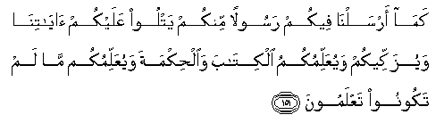

  
[Intangible Textual Heritage](../../index)  [Islam](../index) 
[Index](index)   
[Hypertext Qur'an](../htq/index)  [Unicode](../uq/002.htm#002_148) 
[Palmer](../sbe06/002)  [Pickthall](../pick/002.htm#002_148)  [Yusuf Ali
English](../yaq/yaq002)  [Rodwell](../qr/002)   
  
[Sūra II.: Baqara, or the Heifer. Index](002)  
  [Previous](00217)  [Next](00219) 

------------------------------------------------------------------------

  
*The Holy Quran*, tr. by Yusuf Ali, \[1934\], at Intangible Textual
Heritage

------------------------------------------------------------------------

# Sūra II.: Baqara, or the Heifer.

### Section 18

------------------------------------------------------------------------

148. Walikullin wijhatun huwa muwalleeh<u>a</u> fa**i**stabiqoo
alkhayr<u>a</u>ti aynam<u>a</u> takoonoo ya/ti bikumu All<u>a</u>hu
jameeAAan inna All<u>a</u>ha AAal<u>a</u> kulli shay-in qadeer**un**

148\. To each is a goal  
To which God turns him;  
Then strive together (as in a race)  
Towards all that is good.  
Wheresoever ye are,  
God will bring you  
Together, For God  
Hath power over all things.

------------------------------------------------------------------------

149. Wamin <u>h</u>aythu kharajta fawalli wajhaka sha<u>t</u>ra
almasjidi al<u>h</u>ar<u>a</u>mi wa-innahu lal<u>h</u>aqqu min rabbika
wam<u>a</u> All<u>a</u>hu bigh<u>a</u>filin AAamm<u>a</u>
taAAmaloon**a**

149\. From whencesoever  
Thou startest forth, turn  
Thy face in the direction  
Of the Sacred Mosque;  
That is indeed the truth  
From thy Lord. And God  
Is not unmindful  
Of what ye do.

------------------------------------------------------------------------

150. Wamin <u>h</u>aythu kharajta fawalli wajhaka sha<u>t</u>ra
almasjidi al<u>h</u>ar<u>a</u>mi wa<u>h</u>aythu m<u>a</u> kuntum
fawalloo wujoohakum sha<u>t</u>rahu li-all<u>a</u> yakoona
li**l**nn<u>a</u>si AAalaykum <u>h</u>ujjatun ill<u>a</u>
alla<u>th</u>eena *<u>th</u>*alamoo minhum fal<u>a</u> takhshawhum
wa**i**khshawnee wali-otimma niAAmatee AAalaykum walaAAallakum
tahtadoon**a**

150\. So from whencesoever  
Thou startest forth, turn  
Thy face in the direction  
Of the Sacred Mosque;  
And wheresoever ye are,  
Turn your face thither:  
That there be no ground  
Of dispute against you  
Among the people,  
Except those of them that are  
Bent on wickedness; so fear  
Them not, but fear Me;  
And that I may complete  
My favours on you, and ye  
May (consent to) be guided;

------------------------------------------------------------------------

151. Kam<u>a</u> arsaln<u>a</u> feekum rasoolan minkum yatloo AAalaykum
<u>a</u>y<u>a</u>tin<u>a</u> wayuzakkeekum wayuAAallimukumu
alkit<u>a</u>ba wa**a**l<u>h</u>ikmata wayuAAallimukum m<u>a</u> lam
takoonoo taAAlamoon**a**

151\. A similar (favour  
Have ye already received)  
In that We have sent  
Among you an Apostle  
Of your own, rehearsing to you  
Our Signs, and sanctifying  
You, and instructing you  
In Scripture and Wisdom,  
And in new Knowledge.

------------------------------------------------------------------------

152. Fa**o**<u>th</u>kuroonee a<u>th</u>kurkum wa**o**shkuroo lee
wal<u>a</u> takfuroon**i**

152\. Then do ye remember  
Me; I will remember  
You. Be grateful to Me,  
And reject not Faith.

------------------------------------------------------------------------

[Next: Section 19 (153-163)](00219)

