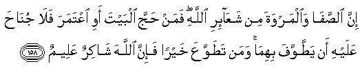

  
[Intangible Textual Heritage](../../index)  [Islam](../index.md) 
[Index](index.md)   
[Hypertext Qur'an](../htq/index)  [Unicode](../uq/002.htm#002_153.md) 
[Palmer](../sbe06/002)  [Pickthall](../pick/002.htm#002_153.md)  [Yusuf Ali
English](../yaq/yaq002)  [Rodwell](../qr/002.md)   
  
[Sūra II.: Baqara, or the Heifer. Index](002.md)  
  [Previous](00218)  [Next](00220.md) 

------------------------------------------------------------------------

  
*The Holy Quran*, tr. by Yusuf Ali, \[1934\], at Intangible Textual
Heritage

------------------------------------------------------------------------

# Sūra II.: Baqara, or the Heifer.

### Section 19

------------------------------------------------------------------------

153. Y<u>a</u> ayyuh<u>a</u> alla<u>th</u>eena <u>a</u>manoo istaAAeenoo
bi**al**<u>ss</u>abri wa**al**<u>ss</u>al<u>a</u>ti inna All<u>a</u>ha
maAAa a**l**<u>ssa</u>bireen**a**

153\. O ye who believe! seek help  
With patient Perseverance  
And Prayer: for God is with those  
Who patiently persevere.

------------------------------------------------------------------------

154. Wal<u>a</u> taqooloo liman yuqtalu fee sabeeli All<u>a</u>hi
amw<u>a</u>tun bal a<u>h</u>y<u>a</u>on wal<u>a</u>kin l<u>a</u>
tashAAuroon**a**

154\. And say not of those  
Who are slain in the way  
Of God: "They are dead."  
Nay, they are living,  
Though ye perceive (it) not.

------------------------------------------------------------------------

155. Walanabluwannakum bishay-in mina alkhawfi wa**a**ljooAAi
wanaq<u>s</u>in mina al-amw<u>a</u>li wa**a**l-anfusi
wa**al**ththamar<u>a</u>ti wabashshiri a**l**<u>ssa</u>bireen**a**

155\. Be sure we shall test you  
With something of fear  
And hunger, some loss  
In goods or lives or the fruits  
(Of your toil), but give  
Glad tidings to those  
Who patiently persevere,—

------------------------------------------------------------------------

156. Alla<u>th</u>eena i<u>tha</u> a<u>sa</u>bat-hum mu<u>s</u>eebatun
q<u>a</u>loo inn<u>a</u> lill<u>a</u>hi wa-inn<u>a</u> ilayhi
r<u>a</u>jiAAoon**a**

156\. Who say, when afflicted  
With calamity: "To God  
We belong, and to Him  
Is our return":—

------------------------------------------------------------------------

157. Ol<u>a</u>-ika AAalayhim <u>s</u>alaw<u>a</u>tun min rabbihim
wara<u>h</u>matun waol<u>a</u>-ika humu almuhtadoon**a**

157\. They are those on whom  
(Descend) blessings from God,  
And Mercy,  
And they are the ones  
That receive guidance.

------------------------------------------------------------------------

158. Inna a**l**<u>ss</u>af<u>a</u> wa**a**lmarwata min
shaAA<u>a</u>-iri All<u>a</u>hi faman <u>h</u>ajja albayta awi iAAtamara
fal<u>a</u> jun<u>ah</u>a AAalayhi an ya<u>tt</u>awwafa bihim<u>a</u>
waman ta<u>t</u>awwaAAa khayran fa-inna All<u>a</u>ha sh<u>a</u>kirun
AAaleem**un**

158\. Behold! Ṣafa and Marwa  
Are among the Symbols  
Of God. So if those who visit  
The House in the Season  
Or at other times,  
Should compass them round,  
It is no sin in them.  
And if any one obeyeth his own  
Impulse to Good,—  
Be sure that God  
Is He Who recogniseth  
And knoweth.

------------------------------------------------------------------------

159. Inna alla<u>th</u>eena yaktumoona m<u>a</u> anzaln<u>a</u> mina
albayyin<u>a</u>ti wa**a**lhud<u>a</u> min baAAdi m<u>a</u>
bayyann<u>a</u>hu li**l**nn<u>a</u>si fee alkit<u>a</u>bi ol<u>a</u>-ika
yalAAanuhumu All<u>a</u>hu wayalAAanuhumu all<u>a</u>AAinoon**a**

159\. Those who conceal  
The clear (Signs) We have  
Sent down, and the Guidance,  
After We have made it  
Clear for the People  
In the Book,—on them  
Shall be God's curse,  
And the curse of those  
Entitled to curse,—

------------------------------------------------------------------------

160. Ill<u>a</u> alla<u>th</u>eena t<u>a</u>boo waa<u>s</u>la<u>h</u>oo
wabayyanoo faol<u>a</u>-ika atoobu AAalayhim waan<u>a</u>
a**l**ttaww<u>a</u>bu a**l**rra<u>h</u>eem**u**

160\. Except those who repent  
And make amends  
And openly declare (the Truth):  
To them I turn;  
For I am Oft-returning,  
Most Merciful.

------------------------------------------------------------------------

161. Inna alla<u>th</u>eena kafaroo wam<u>a</u>too wahum kuff<u>a</u>run
ol<u>a</u>-ika AAalayhim laAAnatu All<u>a</u>hi
wa**a**lmal<u>a</u>-ikati wa**al**nn<u>a</u>si ajmaAAeen**a**

161\. Those who reject Faith,  
And die rejecting,—  
On them is God's curse,  
And the curse of angels,  
And of all mankind;

------------------------------------------------------------------------

162. Kh<u>a</u>lideena feeh<u>a</u> l<u>a</u> yukhaffafu AAanhumu
alAAa<u>tha</u>bu wal<u>a</u> hum yun*<u>th</u>*aroon**a**

162\. They will abide therein:  
Their penalty will not  
Be lightened, nor will  
Respite be their (lot).

------------------------------------------------------------------------

163. Wa-il<u>a</u>hukum il<u>a</u>hun w<u>ah</u>idun l<u>a</u>
il<u>a</u>ha ill<u>a</u> huwa a**l**rra<u>h</u>m<u>a</u>nu
a**l**rra<u>h</u>eem**u**

163\. And your God  
Is One God:  
There is no god  
But He,  
Most Gracious,  
Most Merciful.

------------------------------------------------------------------------

[Next: Section 20 (164-167)](00220.md)

