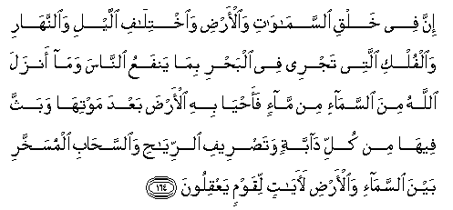
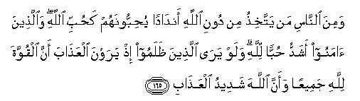
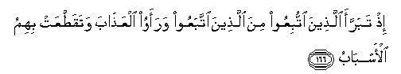
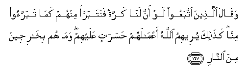

  
[Intangible Textual Heritage](../../index)  [Islam](../index) 
[Index](index)   
[Hypertext Qur'an](../htq/index)  [Unicode](../uq/002.htm#002_164) 
[Palmer](../sbe06/002)  [Pickthall](../pick/002.htm#002_164)  [Yusuf Ali
English](../yaq/yaq002)  [Rodwell](../qr/002)   
  
[Sūra II.: Baqara, or the Heifer. Index](002)  
  [Previous](00219)  [Next](00221) 

------------------------------------------------------------------------

  
*The Holy Quran*, tr. by Yusuf Ali, \[1934\], at Intangible Textual
Heritage

------------------------------------------------------------------------

# Sūra II.: Baqara, or the Heifer.

### Section 20

------------------------------------------------------------------------

164. Inna fee khalqi a**l**ssam<u>a</u>w<u>a</u>ti wa**a**l-ar<u>d</u>i
wa**i**khtil<u>a</u>fi allayli wa**al**nnah<u>a</u>ri wa**a**lfulki
allatee tajree fee alba<u>h</u>ri bim<u>a</u> yanfaAAu
a**l**nn<u>a</u>sa wam<u>a</u> anzala All<u>a</u>hu mina
a**l**ssam<u>a</u>-i min m<u>a</u>-in faa<u>h</u>y<u>a</u> bihi
al-ar<u>d</u>a baAAda mawtih<u>a</u> wabaththa feeh<u>a</u> min kulli
d<u>a</u>bbatin wata<u>s</u>reefi a**l**rriy<u>ah</u>i
wa**al**ssa<u>ha</u>bi almusakhkhari bayna a**l**ssam<u>a</u>-i
wa**a**l-ar<u>d</u>i la<u>a</u>y<u>a</u>tin liqawmin yaAAqiloon**a**

164\. Behold! In the creation  
Of the heavens and the earth;  
In the alternation  
Of the Night and the Day;  
In the sailing of the ships  
Through the Ocean  
For the profit of mankind;  
In the rain which God  
Sends down from the skies,  
And the life which He gives therewith  
To an earth that is dead;  
In the beasts of all kinds  
That He scatters  
Through the earth;  
In the change of the winds,  
And the clouds which they  
Trail like their slaves  
Between the sky and the earth;—  
(Here) indeed are Signs  
For a people that are wise.

------------------------------------------------------------------------

165. Wamina a**l**nn<u>a</u>si man yattakhi<u>th</u>u min dooni
All<u>a</u>hi and<u>a</u>dan yu<u>h</u>ibboonahum ka<u>h</u>ubbi
All<u>a</u>hi wa**a**lla<u>th</u>eena <u>a</u>manoo ashaddu
<u>h</u>ubban lill<u>a</u>hi walaw yar<u>a</u> alla<u>th</u>eena
*<u>th</u>*alamoo i<u>th</u> yarawna alAAa<u>tha</u>ba anna alquwwata
lill<u>a</u>hi jameeAAan waanna All<u>a</u>ha shadeedu
alAAa<u>tha</u>b**i**

165\. Yet there are men  
Who take (for worship)  
Others besides God,  
As equal (with God):  
They love them  
As they should love God.  
But those of Faith are  
Overflowing in their love  
For God. If only  
The unrighteous could see,  
Behold, they would see  
The Penalty: that to God  
Belongs all power, and God  
Will strongly enforce  
The Penalty.

------------------------------------------------------------------------

166. I<u>th</u> tabarraa alla<u>th</u>eena ittubiAAoo mina
alla<u>th</u>eena ittabaAAoo waraawoo alAAa<u>tha</u>ba
wataqa<u>tt</u>aAAat bihimu al-asb<u>a</u>b**u**

166\.

------------------------------------------------------------------------

167. Waq<u>a</u>la alla<u>th</u>eena ittabaAAoo law anna lan<u>a</u>
karratan fanatabarraa minhum kam<u>a</u> tabarraoo minn<u>a</u>
ka<u>tha</u>lika yureehimu All<u>a</u>hu aAAm<u>a</u>lahum
<u>h</u>asar<u>a</u>tin AAalayhim wam<u>a</u> hum bikh<u>a</u>rijeena
mina a**l**nn<u>a</u>r**i**

167\. And those who followed  
Would say: "If only  
We had one more chance,  
We would clear ourselves  
Of them, as they have  
Cleared themselves of us."  
Thus will God show them  
(The fruits of) their deeds  
As (nothing but) regrets.  
Nor will there be a way  
For them out of the Fire.

------------------------------------------------------------------------

[Next: Section 21 (168-176)](00221)

