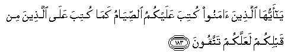
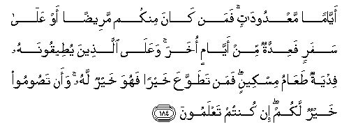
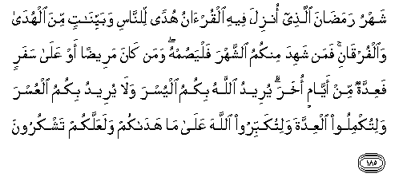
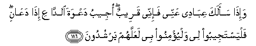
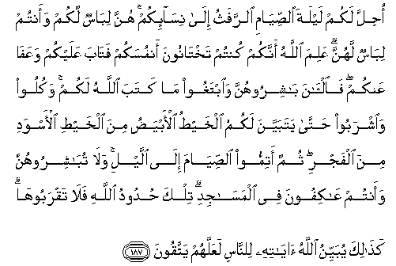

  
[Intangible Textual Heritage](../../index)  [Islam](../index.md) 
[Index](index.md)   
[Hypertext Qur'an](../htq/index)  [Unicode](../uq/002.htm#002_183.md) 
[Palmer](../sbe06/002)  [Pickthall](../pick/002.htm#002_183.md)  [Yusuf Ali
English](../yaq/yaq002)  [Rodwell](../qr/002.md)   
  
[Sūra II.: Baqara, or the Heifer. Index](002.md)  
  [Previous](00222)  [Next](00224.md) 

------------------------------------------------------------------------

  
*The Holy Quran*, tr. by Yusuf Ali, \[1934\], at Intangible Textual
Heritage

------------------------------------------------------------------------

# Sūra II.: Baqara, or the Heifer.

### Section 23

------------------------------------------------------------------------

183. Y<u>a</u> ayyuh<u>a</u> alla<u>th</u>eena <u>a</u>manoo kutiba
AAalaykumu a**l**<u>ss</u>iy<u>a</u>mu kam<u>a</u> kutiba AAal<u>a</u>
alla<u>th</u>eena min qablikum laAAallakum tattaqoon**a**

183\. O ye who believe!  
Fasting is prescribed to you  
As it was prescribed  
To those before you,  
That ye may (learn)  
Self-restraint,—

------------------------------------------------------------------------

184. Ayy<u>a</u>man maAAdood<u>a</u>tin faman k<u>a</u>na minkum
maree<u>d</u>an aw AAal<u>a</u> safarin faAAiddatun min ayy<u>a</u>min
okhara waAAal<u>a</u> alla<u>th</u>eena yu<u>t</u>eeqoonahu fidyatun
<u>t</u>aAA<u>a</u>mu miskeenin faman ta<u>t</u>awwaAAa khayran fahuwa
khayrun lahu waan ta<u>s</u>oomoo khayrun lakum in kuntum
taAAlamoon**a**

184\. (Fasting) for a fixed  
Number of days;  
But if any of you is ill,  
Or on a journey,  
The prescribed number  
(Should be made up)  
From days later.  
For those who can do it  
(With hardship), is a ransom,  
The feeding of one  
That is indigent.  
But he that will give  
More, of his own free will,—  
It is better for him.  
And it is better for you  
That ye fast,  
If ye only knew.

------------------------------------------------------------------------

185. Shahru rama<u>da</u>na alla<u>th</u>ee onzila feehi
alqur-<u>a</u>nu hudan li**l**nn<u>a</u>si wabayyin<u>a</u>tin mina
alhud<u>a</u> wa**a**lfurq<u>a</u>ni faman shahida minkumu
a**l**shshahra falya<u>s</u>umhu waman k<u>a</u>na maree<u>d</u>an aw
AAal<u>a</u> safarin faAAiddatun min ayy<u>a</u>min okhara yureedu
All<u>a</u>hu bikumu alyusra wal<u>a</u> yureedu bikumu alAAusra
walitukmiloo alAAiddata walitukabbiroo All<u>a</u>ha AAal<u>a</u>
m<u>a</u> had<u>a</u>kum walaAAallakum tashkuroon**a**

185\. Rama<u>dh</u>ān is the (month)  
In which was sent down  
The Qur-ān, as a guide  
To mankind, also clear (Signs)  
For guidance and judgment  
(Between right and wrong).  
So every one of you  
Who is present (at his home)  
During that month  
Should spend it in fasting,  
But if any one is ill,  
Or on a journey,  
The prescribed period  
(Should be made up)  
By days later.  
God intends every facility  
For you; He does not want  
To put you to difficulties.  
(He wants you) to complete  
The prescribed period,  
And to glorify Him  
In that He has guided you;  
And perchance ye shall be grateful.

------------------------------------------------------------------------

186. Wa-i<u>tha</u> saalaka AAib<u>a</u>dee AAannee fa-innee qareebun
ojeebu daAAwata a**l**dd<u>a</u>AAi i<u>tha</u> daAA<u>a</u>ni
falyastajeeboo lee walyu/minoo bee laAAallahum yarshudoon**a**

186\. When My servants  
Ask thee concerning Me,  
I am indeed  
Close (to them): I listen  
To the prayer of every  
Suppliant when he calleth on Me:  
Let them also, with a will,  
Listen to My call,  
And believe in Me:  
That they may walk  
In the right way.

------------------------------------------------------------------------

187. O<u>h</u>illa lakum laylata a**l**<u>ss</u>iy<u>a</u>mi
a**l**rrafathu il<u>a</u> nis<u>a</u>-ikum hunna lib<u>a</u>sun lakum
waantum lib<u>a</u>sun lahunna AAalima All<u>a</u>hu annakum kuntum
takht<u>a</u>noona anfusakum fat<u>a</u>ba AAalaykum waAAaf<u>a</u>
AAankum fa**a**l-<u>a</u>na b<u>a</u>shiroohunna wa**i**btaghoo
m<u>a</u> kataba All<u>a</u>hu lakum wakuloo wa**i**shraboo
<u>h</u>att<u>a</u> yatabayyana lakumu alkhay<u>t</u>u al-abya<u>d</u>u
mina alkhay<u>t</u>i al-aswadi mina alfajri thumma atimmoo
a**l**<u>ss</u>iy<u>a</u>ma il<u>a</u> allayli wal<u>a</u>
tub<u>a</u>shiroohunna waantum AA<u>a</u>kifoona fee almas<u>a</u>jidi
tilka <u>h</u>udoodu All<u>a</u>hi fal<u>a</u> taqrabooh<u>a</u>
ka<u>tha</u>lika yubayyinu All<u>a</u>hu <u>a</u>y<u>a</u>tihi
li**l**nn<u>a</u>si laAAallahum yattaqoon**a**

187\. Permitted to you,  
On the night of the fasts,  
Is the approach to your wives.  
They are your garments  
And ye are their garments.  
God knoweth what ye  
Used to do secretly among yourselves;  
But He turned to you  
And forgave you;  
So now associate with them,  
And seek what God  
Hath ordained for you,  
And eat and drink,  
Until the white thread  
Of dawn appear to you  
Distinct from its black thread;  
Then complete your fast  
Till the night appears;  
But do not associate  
With your wives  
While ye are in retreat  
In the mosques. Those are  
Limits (set by) God:  
Approach not nigh thereto.  
Thus doth God make clear  
His Signs to men: that  
They may learn self-restraint.

------------------------------------------------------------------------

188. Wal<u>a</u> ta/kuloo amw<u>a</u>lakum baynakum
bi**a**lb<u>at</u>ili watudloo bih<u>a</u> il<u>a</u>
al<u>h</u>ukk<u>a</u>mi lita/kuloo fareeqan min amw<u>a</u>li
a**l**nn<u>a</u>si bi**a**l-ithmi waantum taAAlamoon**a**

188\. And do not eat up  
Your property among yourselves  
For vanities, nor use it  
As bait for the judges,  
With intent that ye may  
Eat up wrongfully and knowingly  
A little of (other) people's property.

------------------------------------------------------------------------

[Next: Section 24 (189-196)](00224.md)

