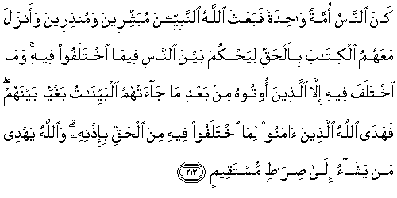
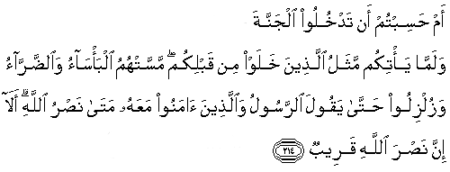
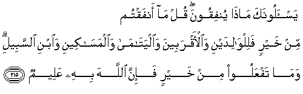

  
[Intangible Textual Heritage](../../index)  [Islam](../index) 
[Index](index)   
[Hypertext Qur'an](../htq/index)  [Unicode](../uq/002.htm#002_211) 
[Palmer](../sbe06/002)  [Pickthall](../pick/002.htm#002_211)  [Yusuf Ali
English](../yaq/yaq002)  [Rodwell](../qr/002)   
  
[Sūra II.: Baqara, or the Heifer. Index](002)  
  [Previous](00225)  [Next](00227) 

------------------------------------------------------------------------

  
*The Holy Quran*, tr. by Yusuf Ali, \[1934\], at Intangible Textual
Heritage

------------------------------------------------------------------------

# Sūra II.: Baqara, or the Heifer.

### Section 26

------------------------------------------------------------------------

211. Sal banee isr<u>a</u>-eela kam <u>a</u>tayn<u>a</u>hum min
<u>a</u>yatin bayyinatin waman yubaddil niAAmata All<u>a</u>hi min
baAAdi m<u>a</u> j<u>a</u>at-hu fa-inna All<u>a</u>ha shadeedu
alAAiq<u>a</u>b**i**

211\. Ask the Children of Israel  
How many Clear (Signs)  
We have sent them.  
But if any one,  
After God's favour  
Has come to him,  
Substitutes (something else),  
God is strict in punishment.

------------------------------------------------------------------------

212. Zuyyina lilla<u>th</u>eena kafaroo al<u>h</u>ay<u>a</u>tu
a**l**dduny<u>a</u> wayaskharoona mina alla<u>th</u>eena <u>a</u>manoo
wa**a**lla<u>th</u>eena ittaqaw fawqahum yawma alqiy<u>a</u>mati
wa**A**ll<u>a</u>hu yarzuqu man yash<u>a</u>o bighayri
<u>h</u>is<u>a</u>b**in**

212\. The life of this world  
Is alluring to those  
Who reject faith,  
And they scoff at those  
Who believe.  
But the righteous  
Will be above them  
On the Day of Resurrection;  
For God bestows His abundance  
Without measure  
On whom He will.

------------------------------------------------------------------------

213. K<u>a</u>na a**l**nn<u>a</u>su ommatan w<u>ah</u>idatan fabaAAatha
All<u>a</u>hu a**l**nnabiyyeena mubashshireena wamun<u>th</u>ireena
waanzala maAAahumu alkit<u>a</u>ba bi**a**l<u>h</u>aqqi liya<u>h</u>kuma
bayna a**l**nn<u>a</u>si feem<u>a</u> ikhtalafoo feehi wam<u>a</u>
ikhtalafa feehi ill<u>a</u> alla<u>th</u>eena ootoohu min baAAdi
m<u>a</u> j<u>a</u>at-humu albayyin<u>a</u>tu baghyan baynahum
fahad<u>a</u> All<u>a</u>hu alla<u>th</u>eena <u>a</u>manoo lim<u>a</u>
ikhtalafoo feehi mina al<u>h</u>aqqi bi-i<u>th</u>nihi
wa**A**ll<u>a</u>hu yahdee man yash<u>a</u>o il<u>a</u>
<u>s</u>ir<u>at</u>in mustaqeem**in**

213\. Mankind was one single nation,  
And God sent Messengers  
With glad tidings and warnings;  
And with them He sent  
The Book in truth,  
To judge between people  
In matters wherein  
They differed;  
But the People of the Book,  
After the clear Signs  
Came to them, did not differ  
Among themselves,  
Except through selfish contumacy.  
God by His Grace  
Guided the Believers  
To the Truth,  
Concerning that  
Wherein they differed.  
For God guides  
Whom He will  
To a path  
That is straight.

------------------------------------------------------------------------

214. Am <u>h</u>asibtum an tadkhuloo aljannata walamm<u>a</u> ya/tikum
mathalu alla<u>th</u>eena khalaw min qablikum massat-humu
alba/s<u>a</u>o wa**al**<u>dd</u>arr<u>a</u>o wazulziloo
<u>h</u>att<u>a</u> yaqoola a**l**rrasoolu wa**a**lla<u>th</u>eena
<u>a</u>manoo maAAahu mat<u>a</u> na<u>s</u>ru All<u>a</u>hi al<u>a</u>
inna na<u>s</u>ra All<u>a</u>hi qareeb**un**

214\. Or do ye think  
That ye shall enter  
The Garden (of Bliss)  
Without such (trials)  
As came to those  
Who passed away  
Before you?  
They encountered  
Suffering and adversity,  
And were so shaken in spirit  
That even the Apostle  
And those of faith  
Who were with him  
Cried: "When (will come)  
The help of God?"  
Ah! Verily, the help of God  
Is (always) near!

------------------------------------------------------------------------

215. Yas-aloonaka m<u>atha</u> yunfiqoona qul m<u>a</u> anfaqtum min
khayrin falilw<u>a</u>lidayni wa**a**l-aqrabeena
wa**a**lyat<u>a</u>m<u>a</u> wa**a**lmas<u>a</u>keeni wa**i**bni
a**l**ssabeeli wam<u>a</u> tafAAaloo min khayrin fa-inna All<u>a</u>ha
bihi AAaleem**un**

215\. They ask thee  
What they should spend  
(In charity). Say: Whatever  
Ye spend that is good,  
Is for parents and kindred  
And orphans  
And those in want  
And for wayfarers.  
And whatever ye do  
That is good,—God  
Knoweth it well.

------------------------------------------------------------------------

216. Kutiba AAalaykumu alqit<u>a</u>lu wahuwa kurhun lakum
waAAas<u>a</u> an takrahoo shay-an wahuwa khayrun lakum waAAas<u>a</u>
an tu<u>h</u>ibboo shay-an wahuwa sharrun lakum wa**A**ll<u>a</u>hu
yaAAlamu waantum l<u>a</u> taAAlamoon**a**

216\. Fighting is prescribed  
For you, and ye dislike it.  
But it is possible  
That ye dislike a thing  
Which is good for you,  
And that ye love a thing  
Which is bad for you.  
But God knoweth,  
And ye know not.

------------------------------------------------------------------------

[Next: Section 27 (217-221)](00227)

