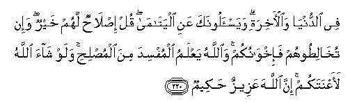

  
[Intangible Textual Heritage](../../index)  [Islam](../index) 
[Index](index)   
[Hypertext Qur'an](../htq/index)  [Unicode](../uq/002.htm#002_217) 
[Palmer](../sbe06/002)  [Pickthall](../pick/002.htm#002_217)  [Yusuf Ali
English](../yaq/yaq002)  [Rodwell](../qr/002)   
  
[Sūra II.: Baqara, or the Heifer. Index](002)  
  [Previous](00226)  [Next](00228) 

------------------------------------------------------------------------

  
*The Holy Quran*, tr. by Yusuf Ali, \[1934\], at Intangible Textual
Heritage

------------------------------------------------------------------------

# Sūra II.: Baqara, or the Heifer.

### Section 27

------------------------------------------------------------------------

217. Yas-aloonaka AAani a**l**shshahri al<u>h</u>ar<u>a</u>mi
qit<u>a</u>lin feehi qul qit<u>a</u>lun feehi kabeerun wa<u>s</u>addun
AAan sabeeli All<u>a</u>hi wakufrun bihi wa**a**lmasjidi
al<u>h</u>ar<u>a</u>mi wa-ikhr<u>a</u>ju ahlihi minhu akbaru AAinda
All<u>a</u>hi wa**a**lfitnatu akbaru mina alqatli wal<u>a</u>
yaz<u>a</u>loona yuq<u>a</u>tiloonakum <u>h</u>att<u>a</u> yaruddookum
AAan deenikum ini ista<u>ta</u>AAoo waman yartadid minkum AAan deenihi
fayamut wahuwa k<u>a</u>firun faol<u>a</u>-ika <u>h</u>abi<u>t</u>at
aAAm<u>a</u>luhum fee a**l**dduny<u>a</u> wa**a**l-<u>a</u>khirati
waol<u>a</u>-ika a<u>s</u>-<u>ha</u>bu a**l**nn<u>a</u>ri hum
feeh<u>a</u> kh<u>a</u>lidoon**a**

217\. They ask thee  
Concerning fighting  
In the Prohibited Month.  
Say: "Fighting therein  
Is a grave (offence);  
But graver is it  
In the sight of God  
To prevent access  
To the path of God,  
To deny Him,  
To prevent access  
To the Sacred Mosque,  
And drive out its members.  
Tumult and oppression  
Are worse than slaughter.  
Nor will they cease  
Fighting you until  
They turn you back  
From your faith  
If they can.  
And if any of you  
Turn back from their faith  
And die in unbelief,  
Their works will bear no fruit  
In this life  
And in the Hereafter;  
They will be  
Companions of the Fire  
And will abide therein.

------------------------------------------------------------------------

218. Inna alla<u>th</u>eena <u>a</u>manoo wa**a**lla<u>th</u>eena
h<u>a</u>jaroo waj<u>a</u>hadoo fee sabeeli All<u>a</u>hi ol<u>a</u>-ika
yarjoona ra<u>h</u>mata All<u>a</u>hi wa**A**ll<u>a</u>hu ghafoorun
ra<u>h</u>eem**un**

218\. Those who believed  
And those who suffered exile  
And fought (and strove and struggled)  
In the path of God,—  
They have the hope  
Of the Mercy of God;  
And God is Oft-forgiving,  
Most Merciful.

------------------------------------------------------------------------

219. Yas-aloonaka AAani alkhamri wa**a**lmaysiri qul feehim<u>a</u>
ithmun kabeerun waman<u>a</u>fiAAu li**l**nn<u>a</u>si
wa-ithmuhum<u>a</u> akbaru min nafAAihim<u>a</u> wayas-aloonaka
m<u>atha</u> yunfiqoona quli alAAafwa ka<u>tha</u>lika yubayyinu
All<u>a</u>hu lakumu al-<u>a</u>y<u>a</u>ti laAAallakum
tatafakkaroon**a**

219\. They ask thee  
Concerning wine and gambling.  
Say: "In them is great sin,  
And some profit, for men;  
But the sin is greater  
Than the profit."  
Whey ask thee how much  
They are to spend;  
Say: "What is beyond  
Your needs."  
Thus doth God  
Make clear to you  
His Signs: in order that  
Ye may consider—

------------------------------------------------------------------------

220. Fee a**l**dduny<u>a</u> wa**a**l-<u>a</u>khirati wayas-aloonaka
AAani alyat<u>a</u>m<u>a</u> qul i<u>s</u>l<u>ah</u>un lahum khayrun
wa-in tukh<u>a</u>li<u>t</u>oohum fa-ikhw<u>a</u>nukum
wa**A**ll<u>a</u>hu yaAAlamu almufsida mina almu<u>s</u>li<u>h</u>i
walaw sh<u>a</u>a All<u>a</u>hu laaAAnatakum inna All<u>a</u>ha
AAazeezun <u>h</u>akeem**un**

220\. (Their bearings) on  
This life and the Hereafter.  
They ask thee  
Concerning orphans.  
Say: "The best thing to do  
Is what is for their good;  
If ye mix  
Their affairs with yours,  
They are your brethren;  
But God knows  
The man who means mischief  
From the man who means good.  
And if God had wished,  
He could have put you  
Into difficulties: He is indeed  
Exalted in Power, Wise.

------------------------------------------------------------------------

221. Wal<u>a</u> tanki<u>h</u>oo almushrik<u>a</u>ti <u>h</u>att<u>a</u>
yu/minna walaamatun mu/minatun khayrun min mushrikatin walaw aAAjabatkum
wal<u>a</u> tunki<u>h</u>oo almushrikeena <u>h</u>att<u>a</u> yu/minoo
walaAAabdun mu/minun khayrun min mushrikin walaw aAAjabakum
ol<u>a</u>-ika yadAAoona il<u>a</u> a**l**nn<u>a</u>ri
wa**A**ll<u>a</u>hu yadAAoo il<u>a</u> aljannati wa**a**lmaghfirati
bi-i<u>th</u>nihi wayubayyinu <u>a</u>y<u>a</u>tihi li**l**nn<u>a</u>si
laAAallahum yata<u>th</u>akkaroon**a**

221\. Do not marry  
Unbelieving women (idolaters),  
Until they believe:  
A slave woman who believes  
Is better than an unbelieving woman,  
Even though she allure you.  
Nor marry (your girls)  
To unbelievers until  
They believe:  
A man slave who believes  
Is better than an unbeliever,  
Even though he allure you.  
Unbelievers do (but)  
Beckon you to the Fire.  
But God beckons by His Grace  
To the Garden (of Bliss)  
And forgiveness,  
And makes His Signs  
Clear to mankind:  
That they may  
Celebrate His praise.

------------------------------------------------------------------------

[Next: Section 28 (222-228)](00228)

