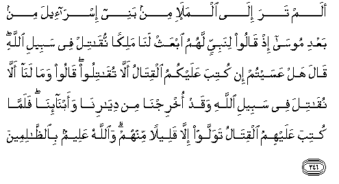
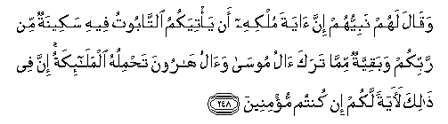

  
[Intangible Textual Heritage](../../index)  [Islam](../index.md) 
[Index](index.md)   
[Hypertext Qur'an](../htq/index)  [Unicode](../uq/002.htm#002_243.md) 
[Palmer](../sbe06/002)  [Pickthall](../pick/002.htm#002_243.md)  [Yusuf Ali
English](../yaq/yaq002)  [Rodwell](../qr/002.md)   
  
[Sūra II.: Baqara, or the Heifer. Index](002.md)  
  [Previous](00231)  [Next](00233.md) 

------------------------------------------------------------------------

  
*The Holy Quran*, tr. by Yusuf Ali, \[1934\], at Intangible Textual
Heritage

------------------------------------------------------------------------

# Sūra II.: Baqara, or the Heifer.

### Section 32

------------------------------------------------------------------------

243. Alam tara il<u>a</u> alla<u>th</u>eena kharajoo min
diy<u>a</u>rihim wahum oloofun <u>h</u>a<u>th</u>ara almawti
faq<u>a</u>la lahumu All<u>a</u>hu mootoo thumma a<u>h</u>y<u>a</u>hum
inna All<u>a</u>ha la<u>th</u>oo fa<u>d</u>lin AAal<u>a</u>
a**l**nn<u>a</u>si wal<u>a</u>kinna akthara a**l**nn<u>a</u>si l<u>a</u>
yashkuroon**a**

243\. Didst thou not  
Turn by vision to those  
Who abandoned their homes,  
Though they were thousands  
(In number), for fear of death?  
God said to them: "Die":  
Then He restored them to life.  
For God is full of bounty  
To mankind, but  
Most of them are ungrateful.

------------------------------------------------------------------------

244. Waq<u>a</u>tiloo fee sabeeli All<u>a</u>hi wa**i**AAlamoo anna
All<u>a</u>ha sameeAAun AAaleem**un**

244\. Then fight in the cause  
Of God, and know that God  
Heareth and knoweth all things.

------------------------------------------------------------------------

245. Man <u>tha</u> alla<u>th</u>ee yuqri<u>d</u>u All<u>a</u>ha
qar<u>d</u>an <u>h</u>asanan fayu<u>da</u>AAifahu lahu
a<u>d</u>AA<u>a</u>fan katheeratan wa**A**ll<u>a</u>hu yaqbi<u>d</u>u
wayabsu<u>t</u>u wa-ilayhi turjaAAoon**a**

245\. Who is he  
That will loan to God  
A beautiful loan, which God  
Will double unto his credit  
And multiply many times?  
It is God that giveth (you)  
Want or Plenty,  
And to Him shall be  
Your return.

------------------------------------------------------------------------

246. Alam tara il<u>a</u> almala-i min banee isr<u>a</u>-eela min baAAdi
moos<u>a</u> i<u>th</u> q<u>a</u>loo linabiyyin lahumu ibAAath
lan<u>a</u> malikan nuq<u>a</u>til fee sabeeli All<u>a</u>hi q<u>a</u>la
hal AAasaytum in kutiba AAalaykumu alqit<u>a</u>lu all<u>a</u>
tuq<u>a</u>tiloo q<u>a</u>loo wam<u>a</u> lan<u>a</u> all<u>a</u>
nuq<u>a</u>tila fee sabeeli All<u>a</u>hi waqad okhrijn<u>a</u> min
diy<u>a</u>rin<u>a</u> waabn<u>a</u>-in<u>a</u> falamm<u>a</u> kutiba
AAalayhimu alqit<u>a</u>lu tawallaw ill<u>a</u> qaleelan minhum
wa**A**ll<u>a</u>hu AAaleemun bi**al***<u>thth</u>*<u>a</u>limeen**a**

246\. Hast thou not  
Turned thy vision to the Chiefs  
Of the Children of Israel  
After (the time of) Moses?  
They said to a Prophet  
(That was) among them:  
"Appoint for us a King, that we  
May fight in the cause of God."  
He said: "Is it not possible,  
If ye were commanded  
To fight, that that ye  
Will not fight?" They said:  
"How could we refuse  
To fight in the cause of God,  
Seeing that we were turned out  
Of our homes and our families?"  
But when they were commanded  
To fight, they turned back,  
Except a small band  
Among them. But God  
Has full knowledge of those  
Who do wrong.

------------------------------------------------------------------------

247. Waq<u>a</u>la lahum nabiyyuhum inna All<u>a</u>ha qad baAAatha
lakum <u>ta</u>loota malikan q<u>a</u>loo ann<u>a</u> yakoonu lahu
almulku AAalayn<u>a</u> wana<u>h</u>nu a<u>h</u>aqqu bi**a**lmulki minhu
walam yu/ta saAAatan mina alm<u>a</u>li q<u>a</u>la inna All<u>a</u>ha
i<u>st</u>af<u>a</u>hu AAalaykum waz<u>a</u>dahu bas<u>t</u>atan fee
alAAilmi wa**a**ljismi wa**A**ll<u>a</u>hu yu/tee mulkahu man
yash<u>a</u>o wa**A**ll<u>a</u>hu w<u>a</u>siAAun AAaleem**un**

247\. Their Prophet said to them:  
"God hath appointed  
Talut as king over you."  
They said: "How can he  
Exercise authority over us  
When we are better fitted  
Than he to exercise authority,  
And he is not even gifted,  
With wealth in abundance?"  
He said: "God hath  
Chosen him above you,  
And hath gifted him  
Abundantly with knowledge  
And bodily prowess: God  
Granteth His authority to whom  
He pleaseth. God careth  
For all, and He knoweth  
All things."

------------------------------------------------------------------------

248. Waq<u>a</u>la lahum nabiyyuhum inna <u>a</u>yata mulkihi an
ya/tiyakumu a**l**tt<u>a</u>bootu feehi sakeenatun min rabbikum
wabaqiyyatun mimm<u>a</u> taraka <u>a</u>lu moos<u>a</u> wa<u>a</u>lu
h<u>a</u>roona ta<u>h</u>miluhu almal<u>a</u>-ikatu inna fee
<u>tha</u>lika la<u>a</u>yatan lakum in kuntum mu/mineen**a**

248\. And (further) their Prophet  
Said to them: "A Sign  
Of his authority  
Is that there shall come  
To you the Ark of the Covenant,  
With (an assurance) therein  
Of security from your Lord,  
And the relics left  
By the family of Moses  
And the family of Aaron,  
Carried by angels.  
In this is a Symbol  
For you if ye indeed  
Have faith."

------------------------------------------------------------------------

[Next: Section 33 (249-253)](00233.md)

