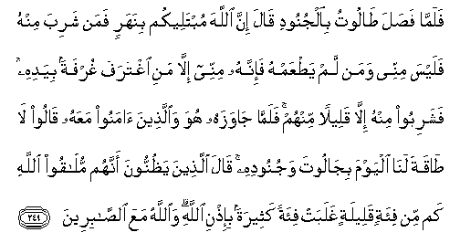
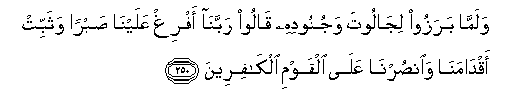
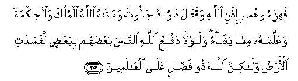
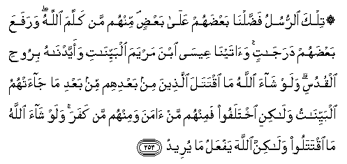

  
[Intangible Textual Heritage](../../index)  [Islam](../index) 
[Index](index)   
[Hypertext Qur'an](../htq/index)  [Unicode](../uq/002.htm#002_249) 
[Palmer](../sbe06/002)  [Pickthall](../pick/002.htm#002_249)  [Yusuf Ali
English](../yaq/yaq002)  [Rodwell](../qr/002)   
  
[Sūra II.: Baqara, or the Heifer. Index](002)  
  [Previous](00232)  [Next](00234) 

------------------------------------------------------------------------

  
*The Holy Quran*, tr. by Yusuf Ali, \[1934\], at Intangible Textual
Heritage

------------------------------------------------------------------------

# Sūra II.: Baqara, or the Heifer.

### Section 33

------------------------------------------------------------------------

249. Falamm<u>a</u> fa<u>s</u>ala <u>ta</u>lootu bi**a**ljunoodi
q<u>a</u>la inna All<u>a</u>ha mubtaleekum binaharin faman shariba minhu
falaysa minnee waman lam ya<u>t</u>AAamhu fa-innahu minnee ill<u>a</u>
mani ightarafa ghurfatan biyadihi fashariboo minhu ill<u>a</u> qaleelan
minhum falamm<u>a</u> j<u>a</u>wazahu huwa wa**a**lla<u>th</u>eena
<u>a</u>manoo maAAahu q<u>a</u>loo l<u>a</u> <u>ta</u>qata lan<u>a</u>
alyawma bij<u>a</u>loota wajunoodihi q<u>a</u>la alla<u>th</u>eena
ya*<u>th</u>*unnoona annahum mul<u>a</u>qoo All<u>a</u>hi kam min
fi-atin qaleelatin ghalabat fi-atan katheeratan bi-i<u>th</u>ni
All<u>a</u>hi wa**A**ll<u>a</u>hu maAAa a**l**<u>ssa</u>bireen**a**

249\. When Talūt set forth  
With the armies, he said:  
"God will test you  
At the stream: if any  
Drinks of its water,  
He goes not with my army:  
Only those who taste not  
Of it go with me:  
A mere sip out of the hand  
Is excused." But they all  
Drank of it, except a few.  
When they crossed the river,—  
He and the faithful ones with him,  
They said: "This day  
We cannot cope  
With Goliath and his forces."  
But those who were convinced  
That they must meet God,  
Said: "How oft, by God's will,  
Hath a small force  
Vanquished a big one?  
God is with those  
Who steadfastly persevere."

------------------------------------------------------------------------

250. Walamm<u>a</u> barazoo lij<u>a</u>loota wajunoodihi q<u>a</u>loo
rabban<u>a</u> afrigh AAalayn<u>a</u> <u>s</u>abran wathabbit
aqd<u>a</u>man<u>a</u> wa**o**n<u>s</u>urn<u>a</u> AAal<u>a</u> alqawmi
alk<u>a</u>fireen**a**

250\. When they advanced  
To meet Goliath and his forces,  
They prayed: "Our Lord  
Pour out constancy on us  
And make our steps firm:  
Help us against those  
That reject faith."

------------------------------------------------------------------------

251. Fahazamoohum bi-i<u>th</u>ni All<u>a</u>hi waqatala d<u>a</u>woodu
j<u>a</u>loota wa<u>a</u>t<u>a</u>hu All<u>a</u>hu almulka
wa**a**l<u>h</u>ikmata waAAallamahu mimm<u>a</u> yash<u>a</u>o
walawl<u>a</u> dafAAu All<u>a</u>hi a**l**nn<u>a</u>sa baAA<u>d</u>ahum
bibaAA<u>d</u>in lafasadati al-ar<u>d</u>u wal<u>a</u>kinna
All<u>a</u>ha <u>th</u>oo fa<u>d</u>lin AAal<u>a</u>
alAA<u>a</u>lameen**a**

251\. By God's will,  
They routed them;  
And David slew Goliath;  
And God gave him  
Power and wisdom  
And taught him  
Whatever (else) He willed,  
And did not God  
Check one set of people  
By means of another,  
The earth would indeed  
Be full of mischief:  
But God is full of bounty  
To all the worlds.

------------------------------------------------------------------------

252. Tilka <u>a</u>y<u>a</u>tu All<u>a</u>hi natlooh<u>a</u> AAalayka
bi**a**l<u>h</u>aqqi wa-innaka lamina almursaleen**a**

252\. These are the Signs  
Of God: we rehearse them  
To thee in truth: verily  
Thou art one of the Apostles.

------------------------------------------------------------------------

253. Tilka a**l**rrusulu fa<u>dd</u>aln<u>a</u> baAA<u>d</u>ahum
AAal<u>a</u> baAA<u>d</u>in minhum man kallama All<u>a</u>hu warafaAAa
baAA<u>d</u>ahum daraj<u>a</u>tin wa<u>a</u>tayn<u>a</u> AAees<u>a</u>
ibna maryama albayyin<u>a</u>ti waayyadn<u>a</u>hu biroo<u>h</u>i
alqudusi walaw sh<u>a</u>a All<u>a</u>hu m<u>a</u> iqtatala
alla<u>th</u>eena min baAAdihim min baAAdi m<u>a</u> j<u>a</u>at-humu
albayyin<u>a</u>tu wal<u>a</u>kini ikhtalafoo faminhum man <u>a</u>mana
waminhum man kafara walaw sh<u>a</u>a All<u>a</u>hu m<u>a</u> iqtataloo
wal<u>a</u>kinna All<u>a</u>ha yafAAalu m<u>a</u> yureed**u**

253\. Those apostles  
Were endowed with gifts,  
Some above others  
To one of them God spoke;  
Others He raised  
To degrees (of honour);  
To Jesus the son of Mary  
We gave Clear (Signs),  
And strengthened him  
With the holy spirit.  
If God had so willed,  
Succeeding generations  
Would not have fought  
Among each other, after  
Clear (Signs) had come to them,  
But they (chose) to wrangle,  
Some believing and Others  
Rejecting. If God had so willed,  
They would not have fought  
Each other; but God  
Fulfilleth His plan.

------------------------------------------------------------------------

[Next: Section 34 (254-257)](00234)

