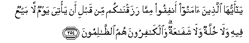
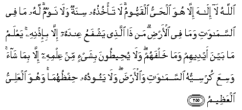
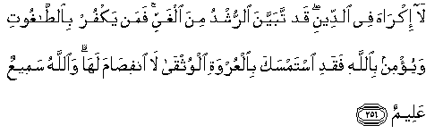
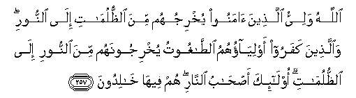

  
[Intangible Textual Heritage](../../index)  [Islam](../index.md) 
[Index](index.md)   
[Hypertext Qur'an](../htq/index)  [Unicode](../uq/002.htm#002_254.md) 
[Palmer](../sbe06/002)  [Pickthall](../pick/002.htm#002_254.md)  [Yusuf Ali
English](../yaq/yaq002)  [Rodwell](../qr/002.md)   
  
[Sūra II.: Baqara, or the Heifer. Index](002.md)  
  [Previous](00233)  [Next](00235.md) 

------------------------------------------------------------------------

  
*The Holy Quran*, tr. by Yusuf Ali, \[1934\], at Intangible Textual
Heritage

------------------------------------------------------------------------

# Sūra II.: Baqara, or the Heifer.

### Section 34

------------------------------------------------------------------------

254. Y<u>a</u> ayyuh<u>a</u> alla<u>th</u>eena <u>a</u>manoo anfiqoo
mimm<u>a</u> razaqn<u>a</u>kum min qabli an ya/tiya yawmun l<u>a</u>
bayAAun feehi wal<u>a</u> khullatun wal<u>a</u> shaf<u>a</u>AAatun
wa**a**lk<u>a</u>firoona humu a**l***<u>thth</u>*<u>a</u>limoon**a**

254\. O ye who believe!  
Spend out of (the bounties)  
We have provided for you,  
Before the Day comes  
When no bargaining  
(Will avail), nor friendship  
Nor intercession.  
Those who reject Faith—they  
Are the wrong-doers.

------------------------------------------------------------------------

255. All<u>a</u>hu l<u>a</u> il<u>a</u>ha ill<u>a</u> huwa
al<u>h</u>ayyu alqayyoomu l<u>a</u> ta/khu<u>th</u>uhu sinatun
wal<u>a</u> nawmun lahu m<u>a</u> fee a**l**ssam<u>a</u>w<u>a</u>ti
wam<u>a</u> fee al-ar<u>d</u>i man <u>tha</u> alla<u>th</u>ee yashfaAAu
AAindahu ill<u>a</u> bi-i<u>th</u>nihi yaAAlamu m<u>a</u> bayna aydeehim
wam<u>a</u> khalfahum wal<u>a</u> yu<u>h</u>ee<u>t</u>oona bishay-in min
AAilmihi ill<u>a</u> bim<u>a</u> sh<u>a</u>a wasiAAa kursiyyuhu
a**l**ssam<u>a</u>w<u>a</u>ti wa**a**l-ar<u>d</u>a wal<u>a</u> yaooduhu
<u>h</u>if*<u>th</u>*uhum<u>a</u> wahuwa alAAaliyyu
alAAa*<u>th</u>*eem**u**

255\. God! There is no god  
But He,—the Living,  
The Self-subsisting, Eternal.  
No slumber can seize Him  
Nor sleep. His are all things  
In the heavens and on earth.  
Who is there can intercede  
In His presence except  
As He permitteth? He knoweth  
What (appeareth to His creatures  
As) Before or After  
Or Behind them.  
Nor shall they compass  
Aught of His knowledge  
Except as He willeth.  
His Throne doth extend  
Over the heavens  
And the earth, and He feeleth  
No fatigue in guarding,  
And preserving them  
For He is the Most High,  
The Supreme (in glory).

------------------------------------------------------------------------

256. L<u>a</u> ikr<u>a</u>ha fee a**l**ddeeni qad tabayyana
a**l**rrushdu mina alghayyi faman yakfur bi**al**<u>tta</u>ghooti
wayu/min bi**A**ll<u>a</u>hi faqadi istamsaka bi**a**lAAurwati
alwuthq<u>a</u> l<u>a</u> infi<u>sa</u>ma lah<u>a</u>
wa**A**ll<u>a</u>hu sameeAAun AAaleem**un**

256\. Let there be no compulsion  
In religion: Truth stands out  
Clear from Error: whoever  
Rejects Evil and believes  
In God hath grasped  
The most trustworthy  
Hand-hold, that never breaks.  
And God heareth  
And knoweth all things.

------------------------------------------------------------------------

257. All<u>a</u>hu waliyyu alla<u>th</u>eena <u>a</u>manoo yukhrijuhum
mina a**l***<u>thth</u>*ulum<u>a</u>ti il<u>a</u> a**l**nnoori
wa**a**lla<u>th</u>eena kafaroo awliy<u>a</u>ohumu
a**l**<u>tta</u>ghootu yukhrijoonahum mina a**l**nnoori il<u>a</u>
a**l***<u>thth</u>*ulum<u>a</u>ti ol<u>a</u>-ika a<u>s</u>-<u>ha</u>bu
a**l**nn<u>a</u>ri hum feeh<u>a</u> kh<u>a</u>lidoon**a**

257\. God is the Protector  
Of those who have faith:  
From the depths of darkness  
He will lead them forth  
Into light. Of those  
Who reject faith the patrons  
Are the Evil Ones: from light  
They will lead them forth  
Into the depths of darkness.  
They will be Companions  
Of the fire, to dwell therein  
(For ever).

------------------------------------------------------------------------

[Next: Section 35 (258-260)](00235.md)

