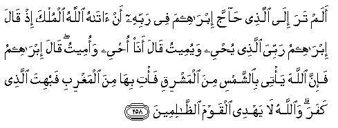
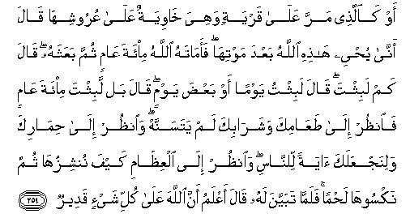
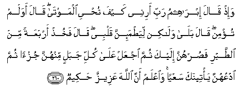

  
[Intangible Textual Heritage](../../index)  [Islam](../index) 
[Index](index)   
[Hypertext Qur'an](../htq/index)  [Unicode](../uq/002.htm#002_258) 
[Palmer](../sbe06/002)  [Pickthall](../pick/002.htm#002_258)  [Yusuf Ali
English](../yaq/yaq002)  [Rodwell](../qr/002)   
  
[Sūra II.: Baqara, or the Heifer. Index](002)  
  [Previous](00234)  [Next](00236) 

------------------------------------------------------------------------

  
*The Holy Quran*, tr. by Yusuf Ali, \[1934\], at Intangible Textual
Heritage

------------------------------------------------------------------------

# Sūra II.: Baqara, or the Heifer.

### Section 35

------------------------------------------------------------------------

258. Alam tara il<u>a</u> alla<u>th</u>ee <u>ha</u>jja ibr<u>a</u>heema
fee rabbihi an <u>a</u>t<u>a</u>hu All<u>a</u>hu almulka i<u>th</u>
q<u>a</u>la ibr<u>a</u>heemu rabbiya alla<u>th</u>ee yu<u>h</u>yee
wayumeetu q<u>a</u>la an<u>a</u> o<u>h</u>yee waomeetu q<u>a</u>la
ibr<u>a</u>heemu fa-inna All<u>a</u>ha ya/tee bi**al**shshamsi mina
almashriqi fa/ti bih<u>a</u> mina almaghribi fabuhita alla<u>th</u>ee
kafara wa**A**ll<u>a</u>hu l<u>a</u> yahdee alqawma
a**l***<u>thth</u>*<u>a</u>limeen**a**

258\. Hast thou not  
Turned thy vision to one  
Who disputed with Abraham  
About his Lord, because  
God had granted him  
Power? Abraham said:  
"My Lord is He Who  
Giveth life and death."  
He said: "I give life and death."  
Said Abraham: "But it is God  
That causeth the sun  
To rise from the East:  
Do thou then cause him  
To rise from the West."  
Thus was he confounded  
Who (in arrogance) rejected  
Faith. Nor doth God  
Give guidance  
To a people unjust.

------------------------------------------------------------------------

259. Aw ka**a**lla<u>th</u>ee marra AAal<u>a</u> qaryatin wahiya
kh<u>a</u>wiyatun AAal<u>a</u> AAurooshih<u>a</u> q<u>a</u>la
ann<u>a</u> yu<u>h</u>yee h<u>ath</u>ihi All<u>a</u>hu baAAda
mawtih<u>a</u> faam<u>a</u>tahu All<u>a</u>hu mi-ata AA<u>a</u>min
thumma baAAathahu q<u>a</u>la kam labithta q<u>a</u>la labithtu yawman
aw baAA<u>d</u>a yawmin q<u>a</u>la bal labithta mi-ata AA<u>a</u>min
fa**o**n*<u>th</u>*ur il<u>a</u> <u>t</u>aAA<u>a</u>mika
washar<u>a</u>bika lam yatasannah wa**o**n*<u>th</u>*ur il<u>a</u>
<u>h</u>im<u>a</u>rika walinajAAalaka <u>a</u>yatan li**l**nn<u>a</u>si
wa**o**n*<u>th</u>*ur il<u>a</u> alAAi*<u>th</u>*<u>a</u>mi kayfa
nunshizuh<u>a</u> thumma naksooh<u>a</u> la<u>h</u>man falamm<u>a</u>
tabayyana lahu q<u>a</u>la aAAlamu anna All<u>a</u>ha AAal<u>a</u> kulli
shay-in qadeer**un**

259\. Or (take) the similitude  
Of one who passed  
By a hamlet, all in ruins  
To its roofs. He said:  
"Oh! how shall God  
Bring it (ever) to life,  
After (this) its death?"  
But God caused him  
To die for a hundred years,  
Then raised him up (again).  
He said: "How long  
Didst thou tarry (thus)?"  
He said: "(Perhaps) a day  
Or part of a day." He said:  
"Nay, thou hast tarried  
Thus a hundred years;  
But look at thy food  
And thy drink; they show  
No signs of age; and look  
At thy donkey: and that  
We may make of thee  
A Sign unto the people,  
Look further at the bones,  
How We bring them together  
And clothe them with flesh."  
When this was shown clearly  
To him, he said: "I know  
That God hath power  
Over all things."

------------------------------------------------------------------------

260. Wa-i<u>th</u> q<u>a</u>la ibr<u>a</u>heemu rabbi arinee kayfa
tu<u>h</u>yee almawt<u>a</u> q<u>a</u>la awa lam tu/min q<u>a</u>la
bal<u>a</u> wal<u>a</u>kin liya<u>t</u>ma-inna qalbee q<u>a</u>la
fakhu<u>th</u> arbaAAatan mina a**l**<u>tt</u>ayri fa<u>s</u>urhunna
ilayka thumma ijAAal AAal<u>a</u> kulli jabalin minhunna juz-an thumma
odAAuhunna ya/teenaka saAAyan wa**i**AAlam anna All<u>a</u>ha AAazeezun
<u>h</u>akeem**un**

260\. Behold! Abraham said:  
"My Lord! Show me how  
Thou givest life to the dead."  
He said: "Dost thou not  
Then believe?" He said:  
"Yea! but to satisfy  
My own understanding."  
He said: "Take four birds;  
Tame them to turn to thee;  
Put a portion of them  
On every hill, and call to them:  
They will come to thee  
(Flying) with speed.  
Then know that God  
Is Exalted in Power, Wise."

------------------------------------------------------------------------

[Next: Section 36 (261-266)](00236)

