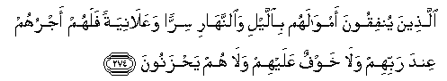
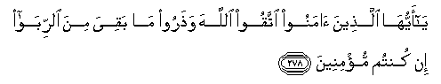
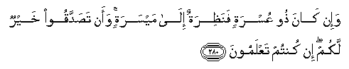
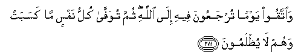

  
[Intangible Textual Heritage](../../index)  [Islam](../index.md) 
[Index](index.md)   
[Hypertext Qur'an](../htq/index)  [Unicode](../uq/002.htm#002_274.md) 
[Palmer](../sbe06/002)  [Pickthall](../pick/002.htm#002_274.md)  [Yusuf Ali
English](../yaq/yaq002)  [Rodwell](../qr/002.md)   
  
[Sūra II.: Baqara, or the Heifer. Index](002.md)  
  [Previous](00237)  [Next](00239.md) 

------------------------------------------------------------------------

  
*The Holy Quran*, tr. by Yusuf Ali, \[1934\], at Intangible Textual
Heritage

------------------------------------------------------------------------

# Sūra II.: Baqara, or the Heifer.

### Section 38

------------------------------------------------------------------------

274. Alla<u>th</u>eena yunfiqoona amw<u>a</u>lahum bi**a**llayli
wa**al**nnah<u>a</u>ri sirran waAAal<u>a</u>niyatan falahum ajruhum
AAinda rabbihim wal<u>a</u> khawfun AAalayhim wal<u>a</u> hum
ya<u>h</u>zanoon**a**

274\. Whose who (in charity)  
Spend of their goods  
By night and by day,  
In secret and in public,  
Have their reward  
With their Lord:  
On them shall be no fear,  
Nor shall they grieve.

------------------------------------------------------------------------

275. Alla<u>th</u>eena ya/kuloona a**l**rrib<u>a</u> l<u>a</u>
yaqoomoona ill<u>a</u> kam<u>a</u> yaqoomu alla<u>th</u>ee
yatakhabba<u>t</u>uhu a**l**shshay<u>ta</u>nu mina almassi
<u>tha</u>lika bi-annahum q<u>a</u>loo innam<u>a</u> albayAAu mithlu
a**l**rrib<u>a</u> waa<u>h</u>alla All<u>a</u>hu albayAAa
wa<u>h</u>arrama a**l**rrib<u>a</u> faman j<u>a</u>ahu
mawAAi*<u>th</u>*atun min rabbihi fa**i**ntah<u>a</u> falahu m<u>a</u>
salafa waamruhu il<u>a</u> All<u>a</u>hi waman AA<u>a</u>da
faol<u>a</u>-ika a<u>s</u>-<u>ha</u>bu a**l**nn<u>a</u>ri hum
feeh<u>a</u> kh<u>a</u>lidoon**a**

275\. Those who devour usury  
Will not stand except  
As stands one whom  
The Evil One by his touch  
Hath driven to madness.  
That is because they say:  
"Trade is like usury,"  
But God hath permitted trade  
And forbidden usury.  
Those who after receiving  
Direction from their Lord,  
Desist, shall be pardoned  
For the past; their case  
Is for God (to judge);  
But those who repeat  
(The offence) are Companions  
Of the Fire: they will  
Abide therein (for ever).

------------------------------------------------------------------------

276. Yam<u>h</u>aqu All<u>a</u>hu a**l**rrib<u>a</u> wayurbee
a**l**<u>ss</u>adaq<u>a</u>ti wa**A**ll<u>a</u>hu l<u>a</u>
yu<u>h</u>ibbu kulla kaff<u>a</u>rin atheem**in**

276\. God will deprive  
Usury of all blessing,  
But will give increase  
For deeds of charity:  
For He loveth not  
Creatures ungrateful  
And wicked.

------------------------------------------------------------------------

277. Inna alla<u>th</u>eena <u>a</u>manoo waAAamiloo
a**l**<u>ssa</u>li<u>ha</u>ti waaq<u>a</u>moo
a**l**<u>ss</u>al<u>a</u>ta wa<u>a</u>tawoo a**l**zzak<u>a</u>ta lahum
ajruhum AAinda rabbihim wal<u>a</u> khawfun AAalayhim wal<u>a</u> hum
ya<u>h</u>zanoon**a**

277\. Those who believe,  
And do deeds of righteousness,  
And establish regular prayers  
And regular charity,  
Will have their reward  
With their Lord:  
On them shall be no fear,  
Nor shall they grieve.

------------------------------------------------------------------------

278. Y<u>a</u> ayyuh<u>a</u> alla<u>th</u>eena <u>a</u>manoo ittaqoo
All<u>a</u>ha wa<u>th</u>aroo m<u>a</u> baqiya mina a**l**rrib<u>a</u>
in kuntum mu/mineen**a**

278\. O ye who believe!  
Fear God, and give up  
What remains of your demand  
For usury, if ye are  
Indeed believers.

------------------------------------------------------------------------

279. Fa-in lam tafAAaloo fa/<u>th</u>anoo bi<u>h</u>arbin mina
All<u>a</u>hi warasoolihi wa-in tubtum falakum ruoosu amw<u>a</u>likum
l<u>a</u> ta*<u>th</u>*limoona wal<u>a</u> tu*<u>th</u>*lamoon**a**

279\. If ye do it not,  
Take notice of war  
From God and His Apostle:  
But if ye turn back,  
Ye shall have  
Your capital sums:  
Deal not unjustly,  
And ye shall not  
Be dealt with unjustly.

------------------------------------------------------------------------

280. Wa-in k<u>a</u>na <u>th</u>oo AAusratin fana*<u>th</u>*iratun
il<u>a</u> maysaratin waan ta<u>s</u>addaqoo khayrun lakum in kuntum
taAAlamoon**a**

280\. If the debtor is  
In a difficulty,  
Grant him time  
Till it is easy  
For him to repay.  
But if ye remit it  
By way of charity,  
That is best for you  
If ye only knew.

------------------------------------------------------------------------

281. Wa**i**ttaqoo yawman turjaAAoona feehi il<u>a</u> All<u>a</u>hi
thumma tuwaff<u>a</u> kullu nafsin m<u>a</u> kasabat wahum l<u>a</u>
yu*<u>th</u>*lamoon**a**

281\. And fear the Day  
When ye shall be  
Brought back to God.  
Then shall every soul  
Be paid what it earned,  
And none shall be  
Dealt with unjustly.

------------------------------------------------------------------------

[Next: Section 39 (282-283)](00239.md)

