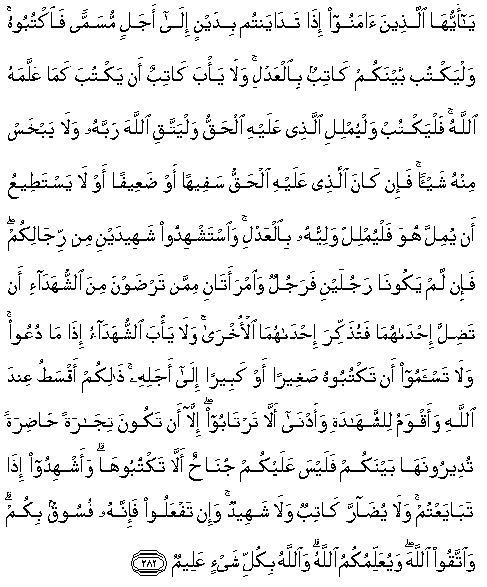

  
[Intangible Textual Heritage](../../index)  [Islam](../index) 
[Index](index)   
[Hypertext Qur'an](../htq/index)  [Unicode](../uq/002.htm#002_282) 
[Palmer](../sbe06/002)  [Pickthall](../pick/002.htm#002_282)  [Yusuf Ali
English](../yaq/yaq002)  [Rodwell](../qr/002)   
  
[Sūra II.: Baqara, or the Heifer. Index](002)  
  [Previous](00238)  [Next](00240) 

------------------------------------------------------------------------

  
*The Holy Quran*, tr. by Yusuf Ali, \[1934\], at Intangible Textual
Heritage

------------------------------------------------------------------------

# Sūra II.: Baqara, or the Heifer.

### Section 39

------------------------------------------------------------------------

282. Y<u>a</u> ayyuh<u>a</u> alla<u>th</u>eena <u>a</u>manoo i<u>tha</u>
tad<u>a</u>yantum bidaynin il<u>a</u> ajalin musamman fa**o**ktuboohu
walyaktub baynakum k<u>a</u>tibun bi**a**lAAadli wal<u>a</u> ya/ba
k<u>a</u>tibun an yaktuba kam<u>a</u> AAallamahu All<u>a</u>hu falyaktub
walyumlili alla<u>th</u>ee AAalayhi al<u>h</u>aqqu walyattaqi
All<u>a</u>ha rabbahu wal<u>a</u> yabkhas minhu shay-an fa-in
k<u>a</u>na alla<u>th</u>ee AAalayhi al<u>h</u>aqqu safeehan aw
<u>d</u>aAAeefan aw l<u>a</u> yasta<u>t</u>eeAAu an yumilla huwa
falyumlil waliyyuhu bi**a**lAAadli wa**i**stashhidoo shaheedayni min
rij<u>a</u>likum fa-in lam yakoon<u>a</u> rajulayni farajulun
wa**i**mraat<u>a</u>ni mimman tar<u>d</u>awna mina
a**l**shshuhad<u>a</u>-i an ta<u>d</u>illa i<u>h</u>d<u>a</u>hum<u>a</u>
fatu<u>th</u>akkira i<u>h</u>d<u>a</u>hum<u>a</u> al-okhr<u>a</u>
wal<u>a</u> ya/ba a**l**shshuhad<u>a</u>o i<u>tha</u> m<u>a</u> duAAoo
wal<u>a</u> tas-amoo an taktuboohu <u>s</u>agheeran aw kabeeran
il<u>a</u> ajalihi <u>tha</u>likum aqsa<u>t</u>u AAinda All<u>a</u>hi
waaqwamu li**l**shshah<u>a</u>dati waadn<u>a</u> all<u>a</u>
tart<u>a</u>boo ill<u>a</u> an takoona tij<u>a</u>ratan <u>had</u>iratan
tudeeroonah<u>a</u> baynakum falaysa AAalaykum jun<u>ah</u>un
all<u>a</u> taktubooh<u>a</u> waashhidoo i<u>tha</u> tab<u>a</u>yaAAtum
wal<u>a</u> yu<u>da</u>rra k<u>a</u>tibun wal<u>a</u> shaheedun wa-in
tafAAaloo fa-innahu fusooqun bikum wa**i**ttaqoo All<u>a</u>ha
wayuAAallimukumu All<u>a</u>hu wa**A**ll<u>a</u>hu bikulli shay-in
AAaleem**un**

282\. O ye who believe!  
When ye deal with each other,  
In transactions involving  
Future obligations  
In a fixed period of time,  
Reduce them to writing  
Let a scribe write down  
Faithfully as between  
The parties: let not the scribe  
Refuse to write: as God  
Has taught him,  
So let him write.  
Let him who incurs  
The liability dictate,  
But let him fear  
His Lord God,  
And not diminish  
Aught of what he owes.  
If the party liable  
Is mentally deficient,  
Or weak, or unable  
Himself to dictate,  
Let his guardian  
Dictate faithfully.  
And get two witnesses,  
Out of your own men,  
And if there are not two men,  
Then a man and two women,  
Such as ye choose,  
For witnesses,  
So that if one of them errs,  
The other can remind her.  
The witnesses  
Should not refuse  
When they are called on  
(For evidence).  
Disdain not to reduce  
To writing (your contract)  
For a future period,  
Whether it be small  
Or big: it is juster  
In the sight of God,  
More suitable as evidence,  
And more convenient  
To prevent doubts  
Among yourselves  
But if it be a transaction  
Which ye carry out  
On the spot among yourselves,  
There is no blame on you  
If ye reduce it not  
To writing.  
But take witnesses  
Whenever ye make  
A commercial contract;  
And let neither scribe  
Nor witness suffer harm.  
If ye do (such harm),  
It would be wickedness  
In you. So fear God;  
For it is God  
That teaches you.  
And God is well acquainted  
With all things.

------------------------------------------------------------------------

283. Wa-in kuntum AAal<u>a</u> safarin walam tajidoo k<u>a</u>tiban
farih<u>a</u>nun maqboo<u>d</u>atun fa-in amina baAA<u>d</u>ukum
baAA<u>d</u>an falyu-addi alla<u>th</u>ee i/tumina am<u>a</u>natahu
walyattaqi All<u>a</u>ha rabbahu wal<u>a</u> taktumoo
a**l**shshah<u>a</u>data waman yaktumh<u>a</u> fa-innahu <u>a</u>thimun
qalbuhu wa**A**ll<u>a</u>hu bim<u>a</u> taAAmaloona AAaleem**un**

283\. If ye are on a journey,  
And cannot find  
A scribe, a pledge  
With possession (may serve  
The purpose).  
And if one of you  
Deposits a thing  
On trust with another,  
Let the trustee  
(Faithfully) discharge  
His trust, and let him  
Fear his Lord.  
Conceal not evidence;  
For whoever conceals it,—  
His heart is tainted  
With sin. And God  
Knoweth all that ye do.

------------------------------------------------------------------------

[Next: Section 40 (284-286)](00240)

