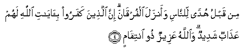

  
[Intangible Textual Heritage](../../index)  [Islam](../index) 
[Index](index)   
[Hypertext Qur'an](../htq/index)  [Unicode](../uq/003.htm#003_001) 
[Palmer](../sbe06/003)  [Pickthall](../pick/003.htm#003_001)  [Yusuf Ali
English](../yaq/yaq003)  [Rodwell](../qr/003)   
  
[Sūra III.: Āl-i-’Imrān, or The Family of ’Imrān. Index](003)  
  [Previous](00240)  [Next](00302) 

------------------------------------------------------------------------

  
*The Holy Quran*, tr. by Yusuf Ali, \[1934\], at Intangible Textual
Heritage

------------------------------------------------------------------------

# Sūra III.: Āl-i-’Imrān, or The Family of ’Imrān.

### Section 1

1. Alif-l<u>a</u>m-meem

1\. A. L. M.

------------------------------------------------------------------------

2. All<u>a</u>hu l<u>a</u> il<u>a</u>ha ill<u>a</u> huwa al<u>h</u>ayyu
alqayyoom**u**

2\. God! There is no god  
But He,—the Living,  
The Self-Subsisting, Eternal.

------------------------------------------------------------------------

3. Nazzala AAalayka alkit<u>a</u>ba bi**a**l<u>h</u>aqqi
mu<u>s</u>addiqan lim<u>a</u> bayna yadayhi waanzala
a**l**ttawr<u>a</u>ta wa**a**l-injeel**a**

3\. It is He Who sent down  
To thee (step by step),  
In truth, the Book,  
Confirming what went before it;  
And He sent down the Law  
(Of Moses) and the Gospel  
(Of Jesus) before this,  
As a guide to mankind,  
And He sent down the Criterion  
(Of judgment between right and wrong).

------------------------------------------------------------------------

4. Min qablu hudan li**l**nn<u>a</u>si waanzala alfurq<u>a</u>na inna
alla<u>th</u>eena kafaroo bi-<u>a</u>y<u>a</u>ti All<u>a</u>hi lahum
AAa<u>tha</u>bun shadeedun wa**A**ll<u>a</u>hu AAazeezun <u>th</u>oo
intiq<u>a</u>m**in**

4\. Then those who reject  
Faith in the Signs of God  
Will suffer the severest  
Penalty, and God  
Is Exalted in Might,  
Lord of Retribution.

------------------------------------------------------------------------

5. Inna All<u>a</u>ha l<u>a</u> yakhf<u>a</u> AAalayhi shay-on fee
al-ar<u>d</u>i wal<u>a</u> fee a**l**ssam<u>a</u>/-**i**

5\. From God, verily  
Nothing is hidden  
On earth or in the heavens.

------------------------------------------------------------------------

6. Huwa alla<u>th</u>ee yu<u>s</u>awwirukum fee al-ar<u>ha</u>mi kayfa
yash<u>a</u>o l<u>a</u> il<u>a</u>ha ill<u>a</u> huwa alAAazeezu
al<u>h</u>akeem**u**

6\. He it is Who shapes you  
In the wombs as He pleases.  
There is no god but He,  
The Exalted in Might,  
The Wise.

------------------------------------------------------------------------

7. Huwa alla<u>th</u>ee anzala AAalayka alkit<u>a</u>ba minhu
<u>a</u>y<u>a</u>tun mu<u>h</u>kam<u>a</u>tun hunna ommu alkit<u>a</u>bi
waokharu mutash<u>a</u>bih<u>a</u>tun faamm<u>a</u> alla<u>th</u>eena
fee quloobihim zayghun fayattabiAAoona m<u>a</u> tash<u>a</u>baha minhu
ibtigh<u>a</u>a alfitnati wa**i**btigh<u>a</u>a ta/weelihi wam<u>a</u>
yaAAlamu ta/weelahu ill<u>a</u> All<u>a</u>hu wa**al**rr<u>a</u>sikhoona
fee alAAilmi yaqooloona <u>a</u>mann<u>a</u> bihi kullun min AAindi
rabbin<u>a</u> wam<u>a</u> ya<u>thth</u>akkaru ill<u>a</u> oloo
al-alb<u>a</u>b**i**

7\. He it is Who has sent down  
To thee the Book:  
In it are verses  
Basic or fundamental  
(Of established meaning);  
They are the foundation  
Of the Book: others  
Are allegorical. But those  
In whose hearts is perversity follow  
The part thereof that is allegorical,  
Seeking discord, and searching  
For its hidden meanings,  
But ṭo one knows  
Its hidden meanings except God.  
And those who are firmly grounded  
In knowledge say: "We believe  
In the Book; the whole of it  
Is from our Lord:" and none  
Will grasp the Message  
Except men of understanding.

------------------------------------------------------------------------

8. Rabban<u>a</u> l<u>a</u> tuzigh qulooban<u>a</u> baAAda i<u>th</u>
hadaytan<u>a</u> wahab lan<u>a</u> min ladunka ra<u>h</u>matan innaka
anta alwahh<u>a</u>b**u**

8\. "Our Lord!" (they say),  
"Let not our hearts deviate  
Now after Thou hast guided us,  
But grant us mercy  
From Thine own Presence;  
For Thou art the Grantor  
Of bounties without measure.

------------------------------------------------------------------------

9. Rabban<u>a</u> innaka j<u>a</u>miAAu a**l**nn<u>a</u>si liyawmin
l<u>a</u> rayba feehi inna All<u>a</u>ha l<u>a</u> yukhlifu
almeeAA<u>a</u>d**a**

9\. "Our Lord! Thou art He  
That will gather mankind  
Together against a Day about which  
There is no doubt; for God  
Never fails in His promise."

------------------------------------------------------------------------

[Next: Section 2 (10-20)](00302)

