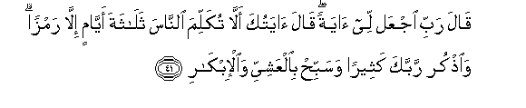

  
[Intangible Textual Heritage](../../index)  [Islam](../index) 
[Index](index)   
[Hypertext Qur'an](../htq/index)  [Unicode](../uq/003.htm#003_031) 
[Palmer](../sbe06/003)  [Pickthall](../pick/003.htm#003_031)  [Yusuf Ali
English](../yaq/yaq003)  [Rodwell](../qr/003)   
  
[Sūra III.: Āl-i-’Imrān, or The Family of ’Imrān. Index](003)  
  [Previous](00303)  [Next](00305) 

------------------------------------------------------------------------

  
*The Holy Quran*, tr. by Yusuf Ali, \[1934\], at Intangible Textual
Heritage

------------------------------------------------------------------------

# Sūra III.: Āl-i-’Imrān, or The Family of ’Imrān.

### Section 4

------------------------------------------------------------------------

31. Qul in kuntum tu<u>h</u>ibboona All<u>a</u>ha fa**i**ttabiAAoonee
yu<u>h</u>bibkumu All<u>a</u>hu wayaghfir lakum <u>th</u>unoobakum
wa**A**ll<u>a</u>hu ghafoorun ra<u>h</u>eem**un**

31\. Say: "If ye do love God,  
Follow me: God will love you  
And forgive you your sins:  
For God is Oft-Forgiving,  
Most Merciful."

------------------------------------------------------------------------

32. Qul a<u>t</u>eeAAoo All<u>a</u>ha wa**al**rrasoola fa-in tawallaw
fa-inna All<u>a</u>ha l<u>a</u> yu<u>h</u>ibbu alk<u>a</u>fireen**a**

32\. Say: "Obey God  
And His Apostle":  
But if they turn back,  
God loveth not those  
Who reject Faith.

------------------------------------------------------------------------

33. Inna All<u>a</u>ha i<u>st</u>af<u>a</u> <u>a</u>dama wanoo<u>h</u>an
wa<u>a</u>la ibr<u>a</u>heema wa<u>a</u>la AAimr<u>a</u>na AAal<u>a</u>
alAA<u>a</u>lameen**a**

33\. God did choose  
Adam and Noah, the family  
Of Abraham, and the family  
Of ’Imrān above all people,—

------------------------------------------------------------------------

34. <u>Th</u>urriyyatan baAA<u>d</u>uh<u>a</u> min baAA<u>d</u>in
wa**A**ll<u>a</u>hu sameeAAun AAaleem**un**

34\. Offspring, one of the other:  
And God heareth  
And knoweth all things.

------------------------------------------------------------------------

35. I<u>th</u> q<u>a</u>lati imraatu AAimr<u>a</u>na rabbi innee
na<u>th</u>artu laka m<u>a</u> fee ba<u>t</u>nee mu<u>h</u>arraran
fataqabbal minnee innaka anta a**l**ssameeAAu alAAaleem**u**

35\. Behold! a woman of ’Imrān  
Said: "O my Lord! I do  
Dedicate unto Thee  
What is in my womb  
For Thy special service:  
So accept this of me:  
For Thou hearest  
And knowest all things."

------------------------------------------------------------------------

36. Falamm<u>a</u> wa<u>d</u>aAAat-h<u>a</u> q<u>a</u>lat rabbi innee
wa<u>d</u>aAAtuh<u>a</u> onth<u>a</u> wa**A**ll<u>a</u>hu aAAlamu
bim<u>a</u> wa<u>d</u>aAAat walaysa a**l**<u>thth</u>akaru
ka**a**lonth<u>a</u> wa-innee sammaytuh<u>a</u> maryama wa-innee
oAAee<u>th</u>uh<u>a</u> bika wa<u>th</u>urriyyatah<u>a</u> mina
a**l**shshay<u>ta</u>ni a**l**rrajeem**i**

36\. When she was delivered,  
She said: "O my Lord!  
Behold! I am delivered  
Of a female child!"—  
And God knew best  
What she brought forth—  
"And nowise is the male  
Like the female.  
I have named her Mary,  
And I commend her  
And her offspring  
To Thy protection  
From the Evil One,  
The Rejected."

------------------------------------------------------------------------

37. Fataqabbalah<u>a</u> rabbuh<u>a</u> biqaboolin <u>h</u>asanin
waanbatah<u>a</u> nab<u>a</u>tan <u>h</u>asanan wakaffalah<u>a</u>
zakariyy<u>a</u> kullam<u>a</u> dakhala AAalayh<u>a</u> zakariyy<u>a</u>
almi<u>h</u>r<u>a</u>ba wajada AAindah<u>a</u> rizqan q<u>a</u>la
y<u>a</u> maryamu ann<u>a</u> laki h<u>atha</u> q<u>a</u>lat huwa min
AAindi All<u>a</u>hi inna All<u>a</u>ha yarzuqu man yash<u>a</u>o
bighayri <u>h</u>is<u>a</u>b**in**

37\. Right graciously  
Did her Lord accept her:  
He made her grow  
In purity and beauty:  
To the care of Zakarīya  
Was she assigned.  
Every time that he entered  
(Her) chamber to see her,  
He found her supplied  
With sustenance. He said:  
"O Mary! Whence (comes) this  
To you?" She said:  
"From God: for God  
Provides sustenance  
To whom He pleases,  
Without measure."

------------------------------------------------------------------------

38. Hun<u>a</u>lika daAA<u>a</u> zakariyy<u>a</u> rabbahu q<u>a</u>la
rabbi hab lee min ladunka <u>th</u>urriyyatan <u>t</u>ayyibatan innaka
sameeAAu a**l**dduAA<u>a</u>/-**i**

38\. There here did Zakarīya  
Pray to his Lord, saying:  
"O my Lord! Grant unto me  
From Thee a progeny  
That is pure: for Thou  
Art He that heareth prayer!

------------------------------------------------------------------------

39. Fan<u>a</u>dat-hu almal<u>a</u>-ikatu wahuwa q<u>a</u>-imun
yu<u>s</u>allee fee almi<u>h</u>r<u>a</u>bi anna All<u>a</u>ha
yubashshiruka biya<u>h</u>y<u>a</u> mu<u>s</u>addiqan bikalimatin mina
All<u>a</u>hi wasayyidan wa<u>h</u>a<u>s</u>ooran wanabiyyan mina
a**l**<u>ssa</u>li<u>h</u>een**a**

39\. While he was standing  
In prayer in the chamber,  
The angels called unto him:  
"God doth give thee  
Glad tidings of Yaḥyā,  
Witnessing the truth  
Of a Word from God, and (be  
Besides) noble, chaste,  
And a Prophet,  
Of the (goodly) company  
Of the righteous."

------------------------------------------------------------------------

40. Q<u>a</u>la rabbi ann<u>a</u> yakoonu lee ghul<u>a</u>mun waqad
balaghaniya alkibaru wa**i**mraatee AA<u>a</u>qirun q<u>a</u>la
ka<u>tha</u>lika All<u>a</u>hu yafAAalu m<u>a</u> yash<u>a</u>/**o**

40\. He said: "O my Lord!  
How shall I have a son,  
Seeing I am very old,  
And my wife is barren?"  
"Thus, "was the answer,  
"Doth God accomplish  
What He willeth,"

------------------------------------------------------------------------

41. Q<u>a</u>la rabbi ijAAal lee <u>a</u>yatan q<u>a</u>la
<u>a</u>yatuka all<u>a</u> tukallima a**l**nn<u>a</u>sa
thal<u>a</u>thata ayy<u>a</u>min ill<u>a</u> ramzan wa**o**<u>th</u>kur
rabbaka katheeran wasabbi<u>h</u> bi**a**lAAashiyyi
wa**a**l-ibk<u>a</u>r**i**

41\. He said: "O my Lord!  
Give me a Sign!"  
"Thy Sign, "was the answer,  
"Shall be that thou  
Shalt speak to no man  
For three days  
But with signals.  
Then celebrate  
The praises of thy Lord  
Again and again,  
And glorify Him  
In the evening  
And in the morning."

------------------------------------------------------------------------

[Next: Section 5 (42-54)](00305)

