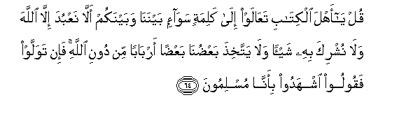
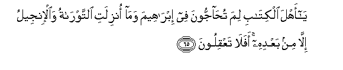
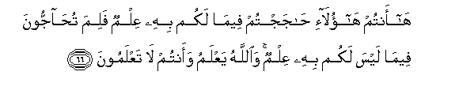
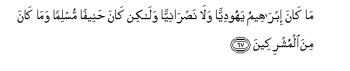
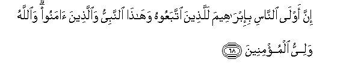
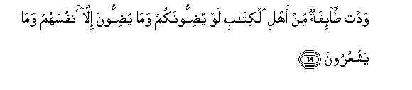
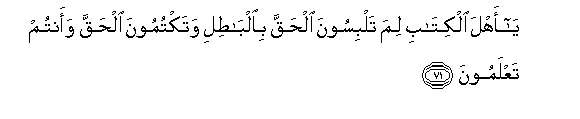

  
[Intangible Textual Heritage](../../index)  [Islam](../index.md) 
[Index](index.md)   
[Hypertext Qur'an](../htq/index)  [Unicode](../uq/003.htm#003_064.md) 
[Palmer](../sbe06/003)  [Pickthall](../pick/003.htm#003_064.md)  [Yusuf Ali
English](../yaq/yaq003)  [Rodwell](../qr/003.md)   
  
[Sūra III.: Āl-i-’Imrān, or The Family of ’Imrān. Index](003.md)  
  [Previous](00306)  [Next](00308.md) 

------------------------------------------------------------------------

  
*The Holy Quran*, tr. by Yusuf Ali, \[1934\], at Intangible Textual
Heritage

------------------------------------------------------------------------

# Sūra III.: Āl-i-’Imrān, or The Family of ’Imrān.

### Section 7

------------------------------------------------------------------------

64. Qul y<u>a</u> ahla alkit<u>a</u>bi taAA<u>a</u>law il<u>a</u>
kalimatin saw<u>a</u>-in baynan<u>a</u> wabaynakum all<u>a</u> naAAbuda
ill<u>a</u> All<u>a</u>ha wal<u>a</u> nushrika bihi shay-an wal<u>a</u>
yattakhi<u>th</u>a baAA<u>d</u>un<u>a</u> baAA<u>d</u>an arb<u>a</u>ban
min dooni All<u>a</u>hi fa-in tawallaw faqooloo ishhadoo bi-ann<u>a</u>
muslimoon**a**

64\. Say: "O People  
Of the Book! come  
To common terms  
As between us and you:  
That we worship  
None but God;  
That we associate  
No partners with Him;  
That we erect not,  
From among ourselves,  
Lords and patrons  
Other than God."  
If then they turn back,  
Say ye: "Bear witness  
That we (at least)  
Are Muslims (bowing  
To God's Will)."

------------------------------------------------------------------------

65. Y<u>a</u> ahla alkit<u>a</u>bi lima tu<u>ha</u>jjoona fee
ibr<u>a</u>heema wam<u>a</u> onzilati a**l**ttawr<u>a</u>tu
wa**a**l-injeelu ill<u>a</u> min baAAdihi afal<u>a</u> taAAqiloon**a**

65\. Ye People of the Book!  
Why dispute ye  
About Abraham,  
When the Law and the Gospel  
Were not revealed  
Till after him?  
Have ye no understanding?

------------------------------------------------------------------------

66. H<u>a</u> antum h<u>a</u>ol<u>a</u>-i <u>ha</u>jajtum feem<u>a</u>
lakum bihi AAilmun falima tu<u>ha</u>jjoona feem<u>a</u> laysa lakum
bihi AAilmun wa**A**ll<u>a</u>hu yaAAlamu waantum l<u>a</u>
taAAlamoon**a**

66\. Ah! Ye are those  
Who fell to disputing  
(Even) in matters of which  
Ye had some knowledge!  
But why dispute ye  
In matters of which  
Ye have no knowledge?  
It is God Who knows,  
And ye who know not!

------------------------------------------------------------------------

67. M<u>a</u> k<u>a</u>na ibr<u>a</u>heemu yahoodiyyan wal<u>a</u>
na<u>s</u>r<u>a</u>niyyan wal<u>a</u>kin k<u>a</u>na <u>h</u>aneefan
musliman wam<u>a</u> k<u>a</u>na mina almushrikeen**a**

67\. Abraham was not a Jew  
Nor yet a Christian;  
But he was true in Faith,  
And bowed his will to God's,  
(Which is Islam),  
And he joined not gods with God.

------------------------------------------------------------------------

68. Inna awl<u>a</u> a**l**nn<u>a</u>si bi-ibr<u>a</u>heema
lalla<u>th</u>eena ittabaAAoohu wah<u>atha</u> a**l**nnabiyyu
wa**a**lla<u>th</u>eena <u>a</u>manoo wa**A**ll<u>a</u>hu waliyyu
almu/mineen**a**

68\. Without doubt, among men,  
The nearest of kin to Abraham,  
Are those who follow him,  
As are also this Apostle  
And those who believe:  
And God is the Protector  
Of those who have faith.

------------------------------------------------------------------------

69. Waddat <u>ta</u>-ifatun min ahli alkit<u>a</u>bi law
yu<u>d</u>illoonakum wam<u>a</u> yu<u>d</u>illoona ill<u>a</u> anfusahum
wam<u>a</u> yashAAuroon**a**

69\. It is the wish of a section  
Of the People of the Book  
To lead you astray.  
But they shall lead astray  
(Not you), but themselves,  
And they do not perceive!

------------------------------------------------------------------------

70. Y<u>a</u> ahla alkit<u>a</u>bi lima takfuroona
bi-<u>a</u>y<u>a</u>ti All<u>a</u>hi waantum tashhadoon**a**

70\. Ye People of the Book!  
Why reject ye  
The Signs of God,  
Of which ye are  
(Yourselves) witnesses?

------------------------------------------------------------------------

71. Y<u>a</u> ahla alkit<u>a</u>bi lima talbisoona al<u>h</u>aqqa
bi**a**lb<u>at</u>ili wataktumoona al<u>h</u>aqqa waantum
taAAlamoon**a**

71\. Ye People of the Book!  
Why do ye clothe  
Truth with falsehood,  
And conceal the Truth,  
While ye have knowledge?

------------------------------------------------------------------------

[Next: Section 8 (72-80)](00308.md)

