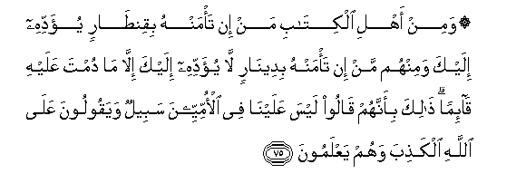

  
[Intangible Textual Heritage](../../index)  [Islam](../index.md) 
[Index](index.md)   
[Hypertext Qur'an](../htq/index)  [Unicode](../uq/003.htm#003_072.md) 
[Palmer](../sbe06/003)  [Pickthall](../pick/003.htm#003_072.md)  [Yusuf Ali
English](../yaq/yaq003)  [Rodwell](../qr/003.md)   
  
[Sūra III.: Āl-i-’Imrān, or The Family of ’Imrān. Index](003.md)  
  [Previous](00307)  [Next](00309.md) 

------------------------------------------------------------------------

  
*The Holy Quran*, tr. by Yusuf Ali, \[1934\], at Intangible Textual
Heritage

------------------------------------------------------------------------

# Sūra III.: Āl-i-’Imrān, or The Family of ’Imrān.

### Section 8

------------------------------------------------------------------------

72. Waq<u>a</u>lat <u>ta</u>-ifatun min ahli alkit<u>a</u>bi
<u>a</u>minoo bi**a**lla<u>th</u>ee onzila AAal<u>a</u>
alla<u>th</u>eena <u>a</u>manoo wajha a**l**nnah<u>a</u>ri wa**o**kfuroo
<u>a</u>khirahu laAAallahum yarjiAAoon**a**

72\. A section of the People  
Of the Book say:  
"Believe in the morning  
What is revealed  
To the Believers,  
But reject it at the end  
Of the day; perchance  
They may (themselves)  
Turn back;

------------------------------------------------------------------------

73. Wal<u>a</u> tu/minoo ill<u>a</u> liman tabiAAa deenakum qul inna
alhud<u>a</u> hud<u>a</u> All<u>a</u>hi an yu/t<u>a</u> a<u>h</u>adun
mithla m<u>a</u> ooteetum aw yu<u>ha</u>jjookum AAinda rabbikum qul inna
alfa<u>d</u>la biyadi All<u>a</u>hi yu/teehi man yash<u>a</u>o
wa**A**ll<u>a</u>hu w<u>a</u>siAAun AAaleem**un**

73\. "And believe no one  
Unless he follows  
Your religion."  
Say: "True guidance  
Is the guidance of God:  
(Fear ye) lest a revelation  
Be sent to someone (else)  
Like unto that which was sent  
Unto you? Or that those  
(Receiving such revelation)  
Should engage you in argument  
Before your Lord?"  
Say: "All bounties  
Are in the hand of God:  
He granteth them  
To whom He pleaseth:  
And God careth for all,  
And He knoweth all things."

------------------------------------------------------------------------

74. Yakhta<u>ss</u>u bira<u>h</u>matihi man yash<u>a</u>o
wa**A**ll<u>a</u>hu <u>th</u>oo alfa<u>d</u>li alAAa*<u>th</u>*eem**i**

74\. For His Mercy He specially chooseth  
Whom He pleaseth;  
For God is the Lord  
Of bounties unbounded.

------------------------------------------------------------------------

75. Wamin ahli alkit<u>a</u>bi man in ta/manhu biqin<u>ta</u>rin
yu-addihi ilayka waminhum man in ta/manhu bideen<u>a</u>rin l<u>a</u>
yu-addihi ilayka ill<u>a</u> m<u>a</u> dumta AAalayhi q<u>a</u>-iman
<u>tha</u>lika bi-annahum q<u>a</u>loo laysa AAalayn<u>a</u> fee
al-ommiyyeena sabeelun wayaqooloona AAal<u>a</u> All<u>a</u>hi
alka<u>th</u>iba wahum yaAAlamoon**a**

75\. Among the People of the Book  
Are some who, if entrusted  
With a hoard of gold,  
Will (readily) pay it back;  
Others, who, if entrusted  
With a single silver coin,  
Will not repay it unless  
Thou constantly stoodest  
Demanding, because,  
They say, "there is no call  
On us (to keep faith)  
With these ignorant (Pagans)."  
But they tell a lie against God,  
And (well) they know it.

------------------------------------------------------------------------

76. Bal<u>a</u> man awf<u>a</u> biAAahdihi wa**i**ttaq<u>a</u> fa-inna
All<u>a</u>ha yu<u>h</u>ibbu almuttaqeen**a**

76\. Nay.—Those that keep  
Their plighted faith  
And act aright,—verily  
God loves those  
Who act aright.

------------------------------------------------------------------------

77. Inna alla<u>th</u>eena yashtaroona biAAahdi All<u>a</u>hi
waaym<u>a</u>nihim thamanan qaleelan ol<u>a</u>-ika l<u>a</u>
khal<u>a</u>qa lahum fee al-<u>a</u>khirati wal<u>a</u> yukallimuhumu
All<u>a</u>hu wal<u>a</u> yan*<u>th</u>*uru ilayhim yawma
alqiy<u>a</u>mati wal<u>a</u> yuzakkeehim walahum AAa<u>tha</u>bun
aleem**un**

77\. As for those who sell  
The faith they owe to God  
And their own plighted word  
For a small price,  
They shall have no portion  
In the Hereafter:  
Nor will God  
(Deign to) speak to them  
Or look at them  
On the Day of Judgment,  
Nor will He cleanse them  
(Of sin): they shall have  
A grievous Penalty.

------------------------------------------------------------------------

78. Wa-inna minhum lafareeqan yalwoona alsinatahum bi**a**lkit<u>a</u>bi
lita<u>h</u>saboohu mina alkit<u>a</u>bi wam<u>a</u> huwa mina
alkit<u>a</u>bi wayaqooloona huwa min AAindi All<u>a</u>hi wam<u>a</u>
huwa min AAindi All<u>a</u>hi wayaqooloona AAal<u>a</u> All<u>a</u>hi
alka<u>th</u>iba wahum yaAAlamoon**a**

78\. There is among them  
A section who distort  
The Book with their tongues  
(As they read) you would think  
It is a part of the Book,  
But it is no part  
Of the Book; and they say,  
That is from God,"  
But it is not from God:  
It is they who tell  
A lie against God,  
And (well) they know it!

------------------------------------------------------------------------

79. M<u>a</u> k<u>a</u>na libasharin an yu/tiyahu All<u>a</u>hu
alkit<u>a</u>ba wa**a**l<u>h</u>ukma wa**al**nnubuwwata thumma yaqoola
li**l**nn<u>a</u>si koonoo AAib<u>a</u>dan lee min dooni All<u>a</u>hi
wal<u>a</u>kin koonoo rabb<u>a</u>niyyeena bim<u>a</u> kuntum
tuAAallimoona alkit<u>a</u>ba wabim<u>a</u> kuntum tadrusoon**a**

79\. It is not (possible)  
That a man, to whom  
Is given the Book,  
And Wisdom,  
And the Prophetic Office,  
Should say to people:  
"Be ye my worshippers  
Rather than God's":  
On the contrary  
(He would say):  
"Be ye worshippers  
Of Him Who is truly  
The Cherisher of all:  
For ye have taught  
The Book and ye  
Have studied it earnestly."

------------------------------------------------------------------------

80. Wal<u>a</u> ya/murakum an tattakhi<u>th</u>oo almal<u>a</u>-ikata
wa**al**nnabiyyeena arb<u>a</u>ban aya/murukum bi**a**lkufri baAAda
i<u>th</u> antum muslimoon**a**

80\. Nor would he instruct you  
To take angels and prophets  
For Lords and Patrons.  
What! would he bid you  
To unbelief after ye have  
Bowed your will  
(To God in Islam)?

------------------------------------------------------------------------

[Next: Section 9 (81-91)](00309.md)

