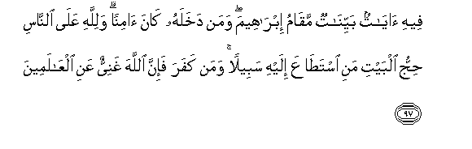
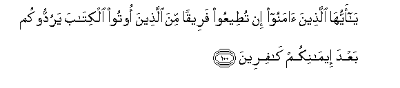
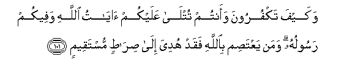

  
[Intangible Textual Heritage](../../index)  [Islam](../index) 
[Index](index)   
[Hypertext Qur'an](../htq/index)  [Unicode](../uq/003.htm#003_092) 
[Palmer](../sbe06/003)  [Pickthall](../pick/003.htm#003_092)  [Yusuf Ali
English](../yaq/yaq003)  [Rodwell](../qr/003)   
  
[Sūra III.: Āl-i-’Imrān, or The Family of ’Imrān. Index](003)  
  [Previous](00309)  [Next](00311) 

------------------------------------------------------------------------

  
*The Holy Quran*, tr. by Yusuf Ali, \[1934\], at Intangible Textual
Heritage

------------------------------------------------------------------------

# Sūra III.: Āl-i-’Imrān, or The Family of ’Imrān.

### Section 10

------------------------------------------------------------------------

92. Lan tan<u>a</u>loo albirra <u>h</u>att<u>a</u> tunfiqoo mimm<u>a</u>
tu<u>h</u>ibboona wam<u>a</u> tunfiqoo min shay-in fa-inna All<u>a</u>ha
bihi AAaleem**un**

92\. By no means shall ye  
Attain righteousness unless  
Ye give (freely) of that  
Which ye love; and whatever  
Ye give, of a truth  
God knoweth it well.

------------------------------------------------------------------------

93. Kullu a**l**<u>tt</u>aAA<u>a</u>mi k<u>a</u>na <u>h</u>illan libanee
isr<u>a</u>-eela ill<u>a</u> m<u>a</u> <u>h</u>arrama isr<u>a</u>-eelu
AAal<u>a</u> nafsihi min qabli an tunazzala a**l**ttawr<u>a</u>tu qul
fa/too bi**al**ttawr<u>a</u>ti fa**o**tlooh<u>a</u> in kuntum
<u>sa</u>diqeen**a**

93\. All food was lawful  
To the Children of Israel,  
Except what Israel  
Made unlawful for itself,  
Before the Law (of Moses)  
Was revealed. Say:  
"Bring ye the Law  
And study it,  
If ye be men of truth."

------------------------------------------------------------------------

94. Famani iftar<u>a</u> AAal<u>a</u> All<u>a</u>hi alka<u>th</u>iba min
baAAdi <u>tha</u>lika faol<u>a</u>-ika humu
a**l***<u>th</u>*<u>a</u>limoon**a**

94\. If any, after this, invent  
A lie and attribute it  
To God, they are indeed  
Unjust wrong-doers.

------------------------------------------------------------------------

95. Qul <u>s</u>adaqa All<u>a</u>hu fa**i**ttabiAAoo millata
ibr<u>a</u>heema <u>h</u>aneefan wam<u>a</u> k<u>a</u>na mina
almushrikeen**a**

95\. Say: "God speaketh  
The Truth: follow  
The religion of Abraham,  
The sane in faith; he  
Was not of the Pagans."

------------------------------------------------------------------------

96. Inna awwala baytin wu<u>d</u>iAAa li**l**nn<u>a</u>si
lalla<u>th</u>ee bibakkata mub<u>a</u>rakan wahudan
lilAA<u>a</u>lameen**a**

96\. The first House (of worship)  
Appointed for men  
Was that at Bakka:  
Full of blessing  
And of guidance  
For all kinds of beings:

------------------------------------------------------------------------

97. Feehi <u>a</u>y<u>a</u>tun bayyin<u>a</u>tun maq<u>a</u>mu
ibr<u>a</u>heema waman dakhalahu k<u>a</u>na <u>a</u>minan
walill<u>a</u>hi AAal<u>a</u> a**l**nn<u>a</u>si <u>h</u>ijju albayti
mani ista<u>ta</u>AAa ilayhi sabeelan waman kafara fa-inna All<u>a</u>ha
ghaniyyun AAani alAA<u>a</u>lameen**a**

97\. In it are Signs  
Manifest; (for example),  
The Station of Abraham;  
Whoever enters it  
Attains security;  
Pilgrimage thereto is a duty  
Men owe to God,  
Those who can afford  
The journey; but if any  
Deny faith, God stands not  
In need of any of His creatures.

------------------------------------------------------------------------

98. Qul y<u>a</u> ahla alkit<u>a</u>bi lima takfuroona
bi-<u>a</u>y<u>a</u>ti All<u>a</u>hi wa**A**ll<u>a</u>hu shaheedun
AAal<u>a</u> m<u>a</u> taAAmaloon**a**

98\. Say: "O People of the Book!  
Why reject ye the Signs  
Of God, when God  
Is Himself witness  
To all ye do?"

------------------------------------------------------------------------

99. Qul y<u>a</u> ahla alkit<u>a</u>bi lima ta<u>s</u>uddoona AAan
sabeeli All<u>a</u>hi man <u>a</u>mana tabghoonah<u>a</u> AAiwajan
waantum shuhad<u>a</u>o wam<u>a</u> All<u>a</u>hu bigh<u>a</u>filin
AAamm<u>a</u> taAAmaloon**a**

99\. Say: "O ye People of the Book!  
Why obstruct ye  
Those who believe,  
From the Path of God,  
Seeking to make it crooked,  
While ye were yourselves  
Witnesses (to God's Covenant)?'  
But God is not unmindful  
Of all that ye do."

------------------------------------------------------------------------

100. Y<u>a</u> ayyuh<u>a</u> alla<u>th</u>eena <u>a</u>manoo in
tu<u>t</u>eeAAoo fareeqan mina alla<u>th</u>eena ootoo alkit<u>a</u>ba
yaruddookum baAAda eem<u>a</u>nikum k<u>a</u>fireen**a**

100\. O ye who believe!  
If ye listen  
To a faction  
Among the People of the Book,  
They would (indeed)  
Render you apostates  
After ye have believed!

------------------------------------------------------------------------

101. Wakayfa takfuroona waantum tutl<u>a</u> AAalaykum
<u>a</u>y<u>a</u>tu All<u>a</u>hi wafeekum rasooluhu waman
yaAAta<u>s</u>im bi**A**ll<u>a</u>hi faqad hudiya il<u>a</u>
<u>s</u>ir<u>at</u>in mustaqeem**in**

101\. And how would ye  
Deny Faith while unto you  
Are rehearsed the Signs  
Of God, and among you  
Lives the Apostle?  
Whoever holds  
Firmly to God  
Will be shown  
A Way that is straight.

------------------------------------------------------------------------

[Next: Section 11 (102-109)](00311)

