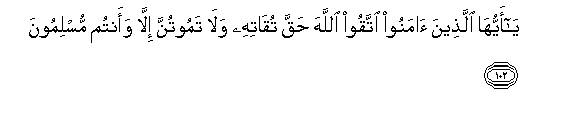
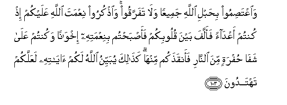
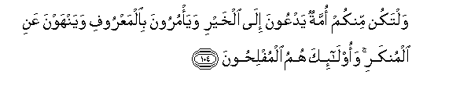
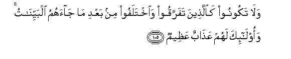
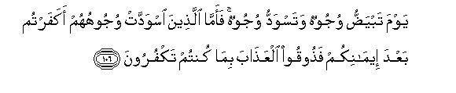
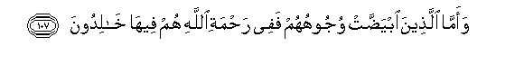
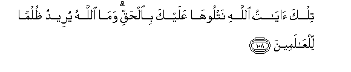

  
[Intangible Textual Heritage](../../index)  [Islam](../index.md) 
[Index](index.md)   
[Hypertext Qur'an](../htq/index)  [Unicode](../uq/003.htm#003_102.md) 
[Palmer](../sbe06/003)  [Pickthall](../pick/003.htm#003_102.md)  [Yusuf Ali
English](../yaq/yaq003)  [Rodwell](../qr/003.md)   
  
[Sūra III.: Āl-i-’Imrān, or The Family of ’Imrān. Index](003.md)  
  [Previous](00310)  [Next](00312.md) 

------------------------------------------------------------------------

  
*The Holy Quran*, tr. by Yusuf Ali, \[1934\], at Intangible Textual
Heritage

------------------------------------------------------------------------

# Sūra III.: Āl-i-’Imrān, or The Family of ’Imrān.

### Section 11

------------------------------------------------------------------------

102. Y<u>a</u> ayyuh<u>a</u> alla<u>th</u>eena <u>a</u>manoo ittaqoo
All<u>a</u>ha <u>h</u>aqqa tuq<u>a</u>tihi wal<u>a</u> tamootunna
ill<u>a</u> waantum muslimoon**a**

102\. O ye who believe!  
Fear God as He should be  
Feared, and die not  
Except in a state  
Of Islam.

------------------------------------------------------------------------

103. Wa**i**AAta<u>s</u>imoo bi<u>h</u>abli All<u>a</u>hi jameeAAan
wal<u>a</u> tafarraqoo wa**o**<u>th</u>kuroo niAAmata All<u>a</u>hi
AAalaykum i<u>th</u> kuntum aAAd<u>a</u>an faallafa bayna quloobikum
faa<u>s</u>ba<u>h</u>tum biniAAmatihi ikhw<u>a</u>nan wakuntum
AAal<u>a</u> shaf<u>a</u> <u>h</u>ufratin mina a**l**nn<u>a</u>ri
faanqa<u>th</u>akum minh<u>a</u> ka<u>tha</u>lika yubayyinu
All<u>a</u>hu lakum <u>a</u>y<u>a</u>tihi laAAallakum tahtadoon**a**

103\. And hold fast,  
All together, by the Rope  
Which God (stretches out  
For you), and be not divided  
Among yourselves;  
And remember with gratitude  
God's favour on you;  
For ye were enemies  
And He joined your hearts  
In love, so that by His Grace,  
Ye became brethren;  
And ye were on the brink  
Of the Pit of Fire,  
And He saved you from it.  
Thus doth God make  
His Signs clear to you:  
That ye may be guided.

------------------------------------------------------------------------

104. Waltakun minkum ommatun yadAAoona il<u>a</u> alkhayri waya/muroona
bi**a**lmaAAroofi wayanhawna AAani almunkari waol<u>a</u>-ika humu
almufli<u>h</u>oon**a**

104\. Let there arise out of you  
A band of people  
Inviting to all that is good,  
Enjoining what is right,  
And forbidding what is wrong:  
They are the ones  
To attain felicity.

------------------------------------------------------------------------

105. Wal<u>a</u> takoonoo ka**a**lla<u>th</u>eena tafarraqoo
wa**i**khtalafoo min baAAdi m<u>a</u> j<u>a</u>ahumu albayyin<u>a</u>tu
waol<u>a</u>-ika lahum AAa<u>tha</u>bun AAa*<u>th</u>*eem**un**

105\. Be not like those  
Who are divided  
Amongst themselves  
And fall into disputations  
After receiving  
Clear Signs:  
For them  
Is a dreadful Penalty,—

------------------------------------------------------------------------

106. Yawma tabya<u>dd</u>u wujoohun wataswaddu wujoohun faamm<u>a</u>
alla<u>th</u>eena iswaddat wujoohuhum akafartum baAAda eem<u>a</u>nikum
fa<u>th</u>ooqoo alAAa<u>tha</u>ba bim<u>a</u> kuntum takfuroon**a**

106\. On the Day when  
Some faces will be (lit up  
With) white, and some faces  
Will be (in the gloom of) black:  
To those whose faces  
Will be black, (will be said):  
"Did ye reject Faith  
After accepting it?  
Taste then the Penalty  
For rejecting Faith."

------------------------------------------------------------------------

107. Waamm<u>a</u> alla<u>th</u>eena ibya<u>dd</u>at wujoohuhum fafee
ra<u>h</u>mati All<u>a</u>hi hum feeh<u>a</u> kh<u>a</u>lidoon**a**

107\. But those whose faces  
Will be (lit with) white,—  
They will be in (the light  
Of) God's mercy: therein  
To dwell (for ever).

------------------------------------------------------------------------

108. Tilka <u>a</u>y<u>a</u>tu All<u>a</u>hi natlooh<u>a</u> AAalayka
bi**a**l<u>h</u>aqqi wam<u>a</u> All<u>a</u>hu yureedu *<u>th</u>*ulman
lilAA<u>a</u>lameen**a**

108\. These are the Signs  
Of God: We rehearse them  
To thee in Truth:  
And God means  
No injustice to any  
Of His creatures.

------------------------------------------------------------------------

109. Walill<u>a</u>hi m<u>a</u> fee a**l**ssam<u>a</u>w<u>a</u>ti
wam<u>a</u> fee al-ar<u>d</u>i wa-il<u>a</u> All<u>a</u>hi turjaAAu
al-omoor**u**

109\. To God belongs all  
That is in the heavens  
And on earth: to Him  
Do all questions  
Go back (for decision).

------------------------------------------------------------------------

[Next: Section 12 (110-120)](00312.md)

