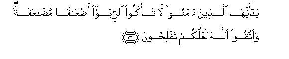
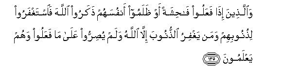
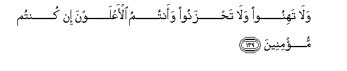
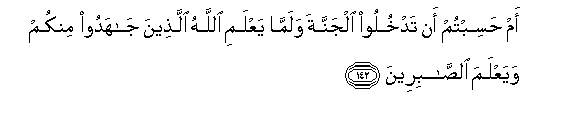
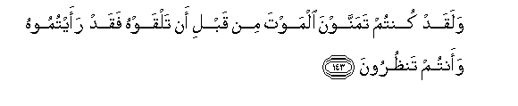

  
[Intangible Textual Heritage](../../index)  [Islam](../index) 
[Index](index)   
[Hypertext Qur'an](../htq/index)  [Unicode](../uq/003.htm#003_130) 
[Palmer](../sbe06/003)  [Pickthall](../pick/003.htm#003_130)  [Yusuf Ali
English](../yaq/yaq003)  [Rodwell](../qr/003)   
  
[Sūra III.: Āl-i-’Imrān, or The Family of ’Imrān. Index](003)  
  [Previous](00313)  [Next](00315) 

------------------------------------------------------------------------

  
*The Holy Quran*, tr. by Yusuf Ali, \[1934\], at Intangible Textual
Heritage

------------------------------------------------------------------------

# Sūra III.: Āl-i-’Imrān, or The Family of ’Imrān.

### Section 14

------------------------------------------------------------------------

130. Y<u>a</u> ayyuh<u>a</u> alla<u>th</u>eena <u>a</u>manoo l<u>a</u>
ta/kuloo a**l**rrib<u>a</u> a<u>d</u>AA<u>a</u>fan mu<u>da</u>AAafatan
wa**i**ttaqoo All<u>a</u>ha laAAallakum tufli<u>h</u>oon**a**

130\. ye who believe!  
Devour not Usury,  
Doubled and multiplied;  
But fear God; that  
Ye may (really) prosper.

------------------------------------------------------------------------

131. Wa**i**ttaqoo a**l**nn<u>a</u>ra allatee oAAiddat
lilk<u>a</u>fireen**a**

131\. Fear the Fire, which is prepared  
For those who reject Faith:

------------------------------------------------------------------------

132. Waa<u>t</u>eeAAoo All<u>a</u>ha wa**al**rrasoola laAAallakum
tur<u>h</u>amoon**a**

132\. And obey God  
And the Apostle;  
That ye may obtain mercy.

------------------------------------------------------------------------

133. Was<u>a</u>riAAoo il<u>a</u> maghfiratin min rabbikum wajannatin
AAar<u>d</u>uh<u>a</u> a**l**ssam<u>a</u>w<u>a</u>tu
wa**a**l-ar<u>d</u>u oAAiddat lilmuttaqeen**a**

133\. Be quick in the race  
For forgiveness from your Lord,  
And for a Garden whose width  
Is that (of the whole)  
Of the heavens  
And of the earth,  
Prepared for the righteous,—

------------------------------------------------------------------------

134. Alla<u>th</u>eena yunfiqoona fee a**l**ssarr<u>a</u>-i
wa**al**<u>dd</u>arr<u>a</u>-i wa**a**lk<u>a</u>*<u>th</u>*imeena
alghay*<u>th</u>*a wa**a**lAA<u>a</u>feena AAani a**l**nn<u>a</u>si
wa**A**ll<u>a</u>hu yu<u>h</u>ibbu almu<u>h</u>sineen**a**

134\. Those who spend (freely),  
Whether in prosperity,  
Or in adversity;  
Who restrain anger,  
And pardon (all) men;—  
For God loves those  
Who do good;—

------------------------------------------------------------------------

135. Wa**a**lla<u>th</u>eena i<u>tha</u> faAAaloo f<u>ah</u>ishatan aw
*<u>th</u>*alamoo anfusahum <u>th</u>akaroo All<u>a</u>ha
fa**i**staghfaroo li<u>th</u>unoobihim waman yaghfiru
a**l**<u>thth</u>unooba ill<u>a</u> All<u>a</u>hu walam yu<u>s</u>irroo
AAal<u>a</u> m<u>a</u> faAAaloo wahum yaAAlamoon**a**

135\. And those who,  
Having done something  
To be ashamed of,  
Or wronged their own souls,  
Earnestly bring God to mind,  
And ask for forgiveness  
For their sins,  
And who can forgive  
Sins except God?—  
And are never obstinate  
In persisting knowingly  
In (the wrong) they have done

------------------------------------------------------------------------

136. Ol<u>a</u>-ika jaz<u>a</u>ohum maghfiratun min rabbihim
wajann<u>a</u>tun tajree min ta<u>h</u>tih<u>a</u> al-anh<u>a</u>ru
kh<u>a</u>lideena feeh<u>a</u> waniAAma ajru alAA<u>a</u>mileen**a**

136\. For such the reward  
Is forgiveness from their Lord,  
And Gardens with rivers  
Flowing underneath,—  
An eternal dwelling:  
How excellent a recompense  
For those who work (and strive)!

------------------------------------------------------------------------

137. Qad khalat min qablikum sunanun faseeroo fee al-ar<u>d</u>i
fa**o**n*<u>th</u>*uroo kayfa k<u>a</u>na AA<u>a</u>qibatu
almuka<u>thth</u>ibeen**a**

137\. Many were the Ways of Life  
That have passed away  
Before you: travel through  
The earth, and see what was  
The end of those  
Who rejected Truth.

------------------------------------------------------------------------

138. H<u>atha</u> bay<u>a</u>nun li**l**nn<u>a</u>si wahudan
wamawAAi*<u>th</u>*atun lilmuttaqeen**a**

138\. Here is a plain statement  
To men, a guidance  
And instruction to those  
Who fear God!

------------------------------------------------------------------------

139. Wal<u>a</u> tahinoo wal<u>a</u> ta<u>h</u>zanoo waantumu
al-aAAlawna in kuntum mu/mineen**a**

139\. So lose not heart,  
Nor fall into despair:  
For ye must gain mastery  
If ye are true in Faith.

------------------------------------------------------------------------

140. In yamsaskum qar<u>h</u>un faqad massa alqawma qar<u>h</u>un
mithluhu watilka al-ayy<u>a</u>mu nud<u>a</u>wiluh<u>a</u> bayna
a**l**nn<u>a</u>si waliyaAAlama All<u>a</u>hu alla<u>th</u>eena
<u>a</u>manoo wayattakhi<u>th</u>a minkum shuhad<u>a</u>a
wa**A**ll<u>a</u>hu l<u>a</u> yu<u>h</u>ibbu
a**l***<u>thth</u>*<u>a</u>limeen**a**

140\. If a wound hath touched you,  
Be sure a similar wound  
Hath touched the others.  
Such days (of varying fortunes)  
We give to men and men  
By turns: that God may know  
Those that believe,  
And that He may take  
To Himself from your ranks  
Martyr-witnesses (to Truth).  
And God loveth not  
Those that do wrong.

------------------------------------------------------------------------

141. Waliyuma<u>hh</u>i<u>s</u>a All<u>a</u>hu alla<u>th</u>eena
<u>a</u>manoo wayam<u>h</u>aqa alk<u>a</u>fireen**a**

141\. God's object also is to purge  
Those that are true in Faith  
And to deprive of blessing  
Those that resist Faith.

------------------------------------------------------------------------

142. Am <u>h</u>asibtum an tadkhuloo aljannata walamm<u>a</u> yaAAlami
All<u>a</u>hu alla<u>th</u>eena j<u>a</u>hadoo minkum wayaAAlama
a**l**<u>ssa</u>bireen**a**

142\. Did ye think that ye  
Would enter Heaven  
Without God testing  
Those of you who fought hard  
(In His Cause) and  
Remained steadfast?

------------------------------------------------------------------------

143. Walaqad kuntum tamannawna almawta min qabli an talqawhu faqad
raaytumoohu waantum tan*<u>th</u>*uroon**a**

143\. Ye did indeed  
Wish for Death  
Before ye met him:  
Now ye have seen him  
With your own eyes,  
(And ye flinch!)

------------------------------------------------------------------------

[Next: Section 15 (144-148)](00315)

